# PMAS — Plano de Consolidação Arquitetural

> **Status:** Rascunho de trabalho · Versão 1.0 · Maio 2026  
> **Objetivo:** Transformar o PMAS de um sistema que cresceu incrementalmente em uma arquitetura coerente, otimizada e de fácil manutenção, sem perder nenhuma funcionalidade.

---

## Sumário

1. [Situação Atual — O Que Foi Construído](#1-situação-atual)
2. [Os Três Problemas Centrais](#2-os-três-problemas-centrais)
3. [Arquitetura Alvo](#3-arquitetura-alvo)
4. [Fase 0 — `services/evm.py`: Fonte Única de Verdade](#4-fase-0--servicesevm-py)
5. [Fase 1 — Camada 0: Congelar Custos na Ingestão](#5-fase-1--camada-0)
6. [Fase 2 — Camada 1: Tabela `pep_cycle_summary`](#6-fase-2--camada-1)
7. [Fase 3 — Camada 2: Tabela `collaborator_cycle_summary`](#7-fase-3--camada-2)
8. [Fase 4 — Novos Endpoints Consolidados](#8-fase-4--novos-endpoints)
9. [Fase 5 — Frontend Puramente Apresentacional](#9-fase-5--frontend)
10. [Fase 6 — Deletar Código Antigo](#10-fase-6--deletar-código-antigo)
11. [Estratégia de Testes](#11-estratégia-de-testes)
12. [Registro de Riscos](#12-registro-de-riscos)
13. [Ordem de Execução com Dependências](#13-ordem-de-execução)

---

## 1. Situação Atual

O PMAS nasceu como um importador de CSV com dashboard básico. Ao longo do tempo foram adicionados: EVM, quarentena, ACL por usuário, baselines, S-curve, burn-up chart. Cada feature foi encostada na anterior sem revisitar o design central.

### 1.1 Mapa de Fluxo Atual

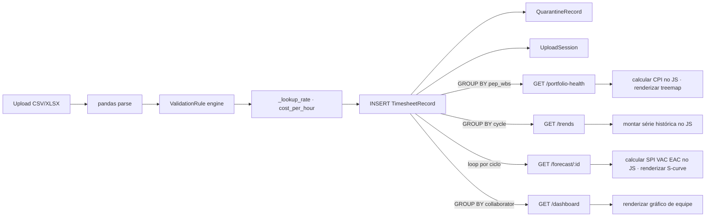

### 1.2 O que cada endpoint faz hoje (resumo honesto)

| Endpoint | Responsabilidade Declarada | Responsabilidade Real |
|---|---|---|
| `GET /portfolio-health` | Saúde do portfólio | GROUP BY + JOIN bruto; CPI calculado no JS |
| `GET /trends` | Tendências por ciclo | Retorna linhas brutas; JS monta séries e calcula variações |
| `GET /forecast/{id}` | Previsão EVM | Backend calcula alguns campos, JS recalcula outros (EAC, SPI, VAC) |
| `GET /dashboard` | Esforço da equipe | GROUP BY correto, mas não considera ACL em todos os caminhos |
| `GET /plans/{id}` | Baseline | Retorna plano bruto; JS calcula PV acumulado |

---

## 2. Os Três Problemas Centrais

### Problema A — Cálculo duplicado (fonte de verdade difusa)

O mesmo cálculo existe em dois ou três lugares. Qualquer mudança de regra precisa ser replicada em múltiplos arquivos.

**Exemplo concreto — CPI (Cost Performance Index):**

```python
# HOJE em analytics.py (linha ~89)
cpi = round(budget_cost / actual_cost, 4) if actual_cost > 0 else None

# HOJE em app.js (linha ~1420, dentro de _renderPortfolioTab)
const cpi = item.budget_cost > 0 && item.actual_cost > 0
    ? (item.budget_cost / item.actual_cost).toFixed(2)
    : null;

# HOJE em app.js (linha ~1680, dentro de _renderForecastTab)
const cpi = fc.actual_cost > 0
    ? (fc.budget_cost / fc.actual_cost).toFixed(2)
    : "—";
```

Três implementações independentes. Se a fórmula de CPI mudar (ex.: passar a usar EV em vez de budget_cost), três arquivos precisam ser tocados — e o risco de inconsistência é real.

---

### Problema B — N+1 queries e recálculo em loop

Para renderizar a aba **Tendências**, o frontend hoje busca o histórico completo de cada projeto separadamente:

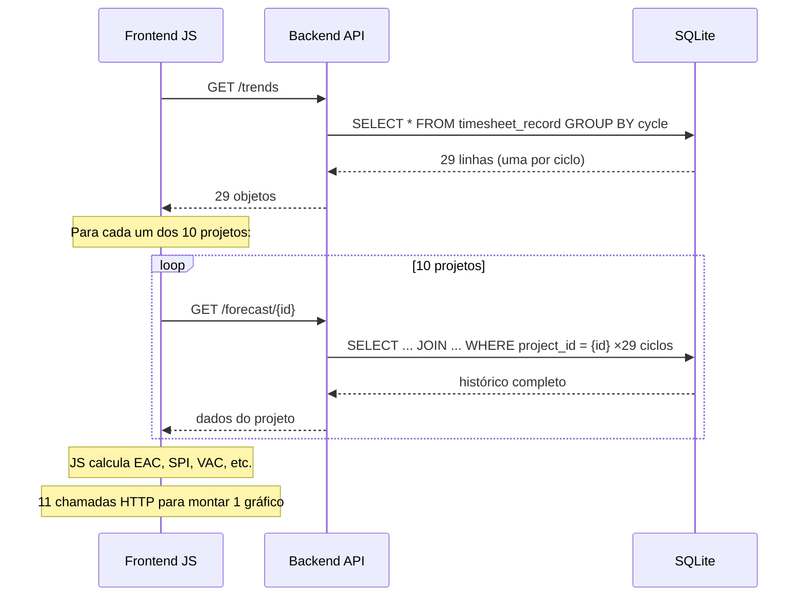

**Resultado:** Para um portfólio com 10 projetos e 29 ciclos, a aba de Tendências dispara **11 requests HTTP** e **~300 queries SQLite** para montar um único gráfico.

---

### Problema C — ACL inconsistente

A tabela `UserProjectAccess` (whitelist de PEPs por usuário) é verificada em alguns endpoints mas ignorada em outros:

| Endpoint | ACL aplicada? |
|---|---|
| `GET /dashboard` | ✅ Sim |
| `GET /portfolio-health` | ❌ Não |
| `GET /trends` | ❌ Não |
| `GET /forecast/{id}` | ❌ Não |

Um usuário com acesso restrito a `60IT-001-01` consegue ver os dados de todos os projetos nos endpoints de analytics.

---

## 3. Arquitetura Alvo

### 3.1 Visão Geral

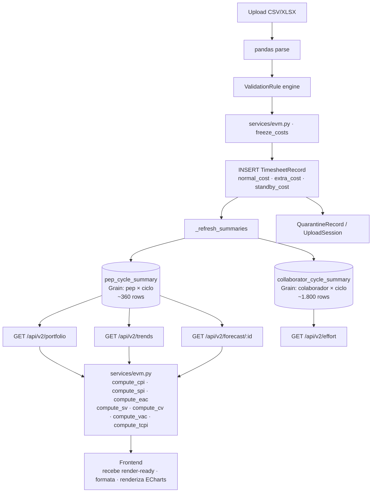

### 3.2 Princípios da Arquitetura Alvo

1. **Uma calculadora, nunca duas.** Todo cálculo EVM vive em `services/evm.py`. Nenhum arquivo pode reimplementar CPI, SPI, EAC, etc.
2. **Backend entrega dados render-ready.** O frontend não faz aritmética. Recebe `cpi: 0.87`, `cpi_label: "Abaixo do orçamento"`, `cpi_color: "danger"`.
3. **Summaries pré-computadas.** As leituras mais frequentes (portfólio, tendências) batem em tabelas já agregadas — não em `TimesheetRecord` na hora.
4. **ACL em todos os endpoints.** Centralizada em um helper, nunca inline.
5. **Custos congelados por tipo.** `normal_cost`, `extra_cost`, `standby_cost` calculados na ingestão usando os multiplicadores vigentes — nunca recalculados depois.

---

## 4. Fase 0 — `services/evm.py`

**Objetivo:** Criar o arquivo que será a única fonte de verdade para todos os cálculos EVM. Nenhuma fase posterior pode ser executada sem este arquivo existindo e testado.

### 4.1 Por que primeiro?

Todas as fases seguintes *consomem* estas funções. Se elas não existirem, cada fase precisará reinventar os cálculos — voltando ao Problema A.

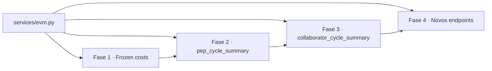

### 4.2 Catálogo completo das funções

```python
# backend/app/services/evm.py

from __future__ import annotations
from typing import Optional


def compute_cpi(budget_cost: Optional[float], actual_cost: float) -> Optional[float]:
    """Cost Performance Index = EV / AC.
    Aqui EV = budget_cost (planned value at completion, usamos como proxy).
    Retorna None se actual_cost == 0 ou budget indefinido."""
    if not budget_cost or actual_cost == 0:
        return None
    return round(budget_cost / actual_cost, 4)


def compute_spi(
    cumulative_planned_hours: Optional[float],
    cumulative_actual_hours: float,
) -> Optional[float]:
    """Schedule Performance Index = EV / PV (em horas).
    Retorna None se PV == 0 ou indefinido."""
    if not cumulative_planned_hours or cumulative_planned_hours == 0:
        return None
    return round(cumulative_actual_hours / cumulative_planned_hours, 4)


def compute_eac(
    budget_cost: Optional[float],
    actual_cost: float,
    cpi: Optional[float],
) -> Optional[float]:
    """Estimate at Completion = BAC / CPI."""
    if not budget_cost or not cpi or cpi == 0:
        return None
    return round(budget_cost / cpi, 2)


def compute_tcpi(
    budget_cost: Optional[float],
    actual_cost: float,
    remaining_work: Optional[float],
) -> Optional[float]:
    """To-Complete Performance Index = (BAC − EV) / (BAC − AC).
    remaining_work em horas; usa blended_rate para converter."""
    if not budget_cost or not remaining_work:
        return None
    denominator = budget_cost - actual_cost
    if denominator == 0:
        return None
    ev = actual_cost  # simplificação: EV = AC quando CPI = 1
    return round((budget_cost - ev) / denominator, 4)


def compute_vac(
    budget_cost: Optional[float], eac: Optional[float]
) -> Optional[float]:
    """Variance at Completion = BAC − EAC."""
    if not budget_cost or not eac:
        return None
    return round(budget_cost - eac, 2)


def compute_cv(
    budget_cost: Optional[float], actual_cost: float
) -> Optional[float]:
    """Cost Variance = EV − AC. Proxy: EV = budget_cost."""
    if not budget_cost:
        return None
    return round(budget_cost - actual_cost, 2)


def compute_ev_cost(
    cumulative_hours: float, budget_cost: Optional[float], budget_hours: Optional[float]
) -> Optional[float]:
    """Earned Value em R$. EV = cumulative_hours × blended_rate.
    blended_rate = budget_cost / budget_hours."""
    if not budget_cost or not budget_hours or budget_hours == 0:
        return None
    blended_rate = budget_cost / budget_hours
    return round(cumulative_hours * blended_rate, 2)


def freeze_costs(
    normal_hours: float,
    extra_hours: float,
    standby_hours: float,
    cost_per_hour: float,
    extra_multiplier: float,
    standby_multiplier: float,
) -> tuple[float, float, float]:
    """Calcula normal_cost, extra_cost, standby_cost no momento da ingestão.
    Retorna (normal_cost, extra_cost, standby_cost)."""
    normal_cost  = round(normal_hours  * cost_per_hour, 4)
    extra_cost   = round(extra_hours   * cost_per_hour * extra_multiplier, 4)
    standby_cost = round(standby_hours * cost_per_hour * standby_multiplier, 4)
    return normal_cost, extra_cost, standby_cost


def classify_health(
    consumed: float,
    budget: Optional[float],
    warning_threshold: float = 0.9,
    critical_threshold: float = 1.0,
) -> str:
    """Retorna 'ok' | 'warning' | 'critical' | 'overrun' | 'no_budget'."""
    if not budget:
        return "no_budget"
    ratio = consumed / budget
    if ratio >= critical_threshold:
        return "overrun" if ratio > critical_threshold else "critical"
    if ratio >= warning_threshold:
        return "warning"
    return "ok"


# ── Funções de Variação / Delta ───────────────────────────────────────────────

def compute_sv(
    cumulative_actual_hours: float,
    cumulative_planned_hours: Optional[float],
) -> Optional[float]:
    """Schedule Variance (em horas) = EV_hours − PV_hours.
    Positivo = adiantado. Negativo = atrasado."""
    if cumulative_planned_hours is None:
        return None
    return round(cumulative_actual_hours - cumulative_planned_hours, 2)


def compute_cv(
    budget_cost: Optional[float], actual_cost: float
) -> Optional[float]:
    """Cost Variance = EV − AC. Proxy: EV = budget_cost (BAC).
    Positivo = abaixo do orçamento. Negativo = acima."""
    if not budget_cost:
        return None
    return round(budget_cost - actual_cost, 2)


def compute_period_delta(
    current: float, previous: Optional[float]
) -> Optional[float]:
    """Variação absoluta entre o período atual e o anterior.
    Usado nas Tendências para mostrar crescimento/queda ciclo a ciclo."""
    if previous is None:
        return None
    return round(current - previous, 2)


def compute_period_delta_pct(
    current: float, previous: Optional[float]
) -> Optional[float]:
    """Variação percentual ciclo a ciclo. Retorna None se previous == 0."""
    if previous is None or previous == 0:
        return None
    return round((current - previous) / previous * 100, 2)
```

### 4.3 Antes × Depois — Variações (delta) planejado vs realizado

O sistema hoje **não expõe** Schedule Variance, Cost Variance nem variação ciclo a ciclo para o frontend. O único campo de desvio calculado é `cpi`, e mesmo ele é calculado em múltiplos lugares.

**Antes — sem delta, frontend sem contexto:**

```json
{
  "cycle_name": "MAR/2025",
  "period_hours": 38.0,
  "cumulative_hours": 320.0,
  "cumulative_planned_hours": 370.0
}
```
*O frontend recebe os números brutos. Para saber se o projeto está adiantado ou atrasado, o usuário precisa fazer a conta de cabeça.*

**Depois — delta computado pelo backend:**

```json
{
  "cycle_name": "MAR/2025",
  "period_hours": 38.0,
  "period_hours_delta": -7.0,
  "period_hours_delta_pct": -15.6,
  "cumulative_hours": 320.0,
  "cumulative_planned_hours": 370.0,
  "sv": -50.0,
  "sv_label": "Atrasado em 50h",
  "sv_color": "warning",
  "cumulative_cost": 16000.0,
  "cumulative_planned_cost": 18500.0,
  "cv": 2500.0,
  "cv_label": "Economia de R$ 2.500",
  "cv_color": "success",
  "spi_cumulative": 0.865,
  "cumulative_ev_cost": 13850.0
}
```

Cada ciclo do histórico entrega **6 indicadores de desvio** calculados de uma vez. O frontend só exibe — zero aritmética.

**Como o backend calcula:**

```python
from backend.app.services.evm import compute_sv, compute_period_delta, compute_period_delta_pct

prev_hours = None
for point in history:
    period_delta     = compute_period_delta(point.period_hours, prev_hours)
    period_delta_pct = compute_period_delta_pct(point.period_hours, prev_hours)
    sv               = compute_sv(point.cumulative_hours, point.cumulative_planned_hours)
    cv               = compute_cv(budget_cost, point.cumulative_cost)

    point_out = {
        ...
        "period_hours_delta":     period_delta,
        "period_hours_delta_pct": period_delta_pct,
        "sv":    sv,
        "sv_label": _sv_label(sv),        # "Adiantado em Xh" / "Atrasado em Xh" / None
        "sv_color": _sv_color(sv),        # "success" / "warning" / "danger" / None
        "cv":    cv,
        "cv_label": _cv_label(cv),
        "cv_color": _cv_color(cv),
    }
    prev_hours = point.period_hours
```

### 4.4 Antes × Depois — CPI

**Antes (3 implementações espalhadas):**

```python
# analytics.py linha ~89
cpi = round(budget_cost / actual_cost, 4) if actual_cost > 0 else None

# analytics.py linha ~210 (forecast)
cpi = round(project.budget_cost / total_cost, 4) if total_cost else None
```

```javascript
// app.js linha ~1420
const cpi = item.actual_cost > 0 ? (item.budget_cost / item.actual_cost).toFixed(2) : null;

// app.js linha ~1680
const cpi = fc.actual_cost > 0 ? (fc.budget_cost / fc.actual_cost).toFixed(2) : "—";
```

**Depois (uma única implementação):**

```python
# analytics.py, forecast.py, qualquer router
from backend.app.services.evm import compute_cpi

cpi = compute_cpi(project.budget_cost, row.total_cost)
```

```javascript
// app.js — zero cálculo
const { cpi, cpi_label, cpi_color } = item;  // backend já calculou
```

---

## 5. Fase 1 — Camada 0: Congelar Custos na Ingestão

**Objetivo:** Adicionar `normal_cost`, `extra_cost`, `standby_cost` a `TimesheetRecord` e calculá-los no momento da ingestão usando os multiplicadores vigentes do `GlobalConfig`.

### 5.1 O problema atual

Hoje, `TimesheetRecord` armazena apenas `cost_per_hour` (congelado na ingestão). Os multiplicadores de hora extra e sobreaviso são lidos do `GlobalConfig` **toda vez** que um custo é calculado. Se o multiplicador mudar depois da ingestão, o custo histórico muda retroativamente — violando o princípio EVM de custos congelados.

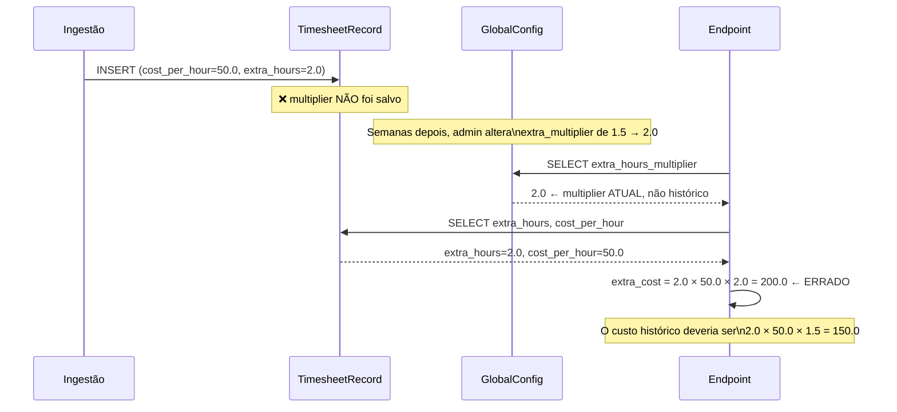

### 5.2 A correção

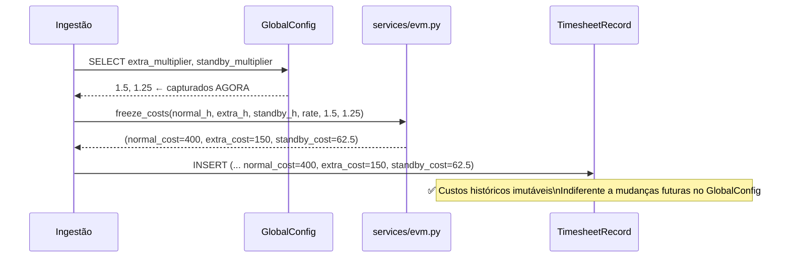

### 5.3 Mudanças no modelo

**`models.py` — TimesheetRecord (antes):**

```python
class TimesheetRecord(Base):
    __tablename__ = "timesheet_record"
    id              = Column(Integer, primary_key=True)
    collaborator_id = Column(Integer, ForeignKey("collaborator.id"))
    cycle_id        = Column(Integer, ForeignKey("cycle.id"))
    pep_wbs         = Column(String)
    pep_description = Column(String)
    normal_hours    = Column(Float, default=0.0)
    extra_hours     = Column(Float, default=0.0)
    standby_hours   = Column(Float, default=0.0)
    total_hours     = Column(Float, default=0.0)
    cost_per_hour   = Column(Float, nullable=True)   # ← congelado
    # ❌ sem normal_cost, extra_cost, standby_cost
```

**`models.py` — TimesheetRecord (depois):**

```python
class TimesheetRecord(Base):
    __tablename__ = "timesheet_record"
    id              = Column(Integer, primary_key=True)
    collaborator_id = Column(Integer, ForeignKey("collaborator.id"))
    cycle_id        = Column(Integer, ForeignKey("cycle.id"))
    pep_wbs         = Column(String)
    pep_description = Column(String)
    normal_hours    = Column(Float, default=0.0)
    extra_hours     = Column(Float, default=0.0)
    standby_hours   = Column(Float, default=0.0)
    total_hours     = Column(Float, default=0.0)
    cost_per_hour   = Column(Float, nullable=True)
    normal_cost     = Column(Float, nullable=True)   # ← NOVO
    extra_cost      = Column(Float, nullable=True)   # ← NOVO
    standby_cost    = Column(Float, nullable=True)   # ← NOVO
```

**`database.py` — migração automática:**

```python
def _migrate_columns():
    ...
    _add_col_if_missing("timesheet_record", "normal_cost",   "FLOAT")
    _add_col_if_missing("timesheet_record", "extra_cost",    "FLOAT")
    _add_col_if_missing("timesheet_record", "standby_cost",  "FLOAT")
```

**`services/ingestion.py` — uso do freeze_costs:**

```python
# ANTES
record = TimesheetRecord(
    ...
    cost_per_hour=cost_per_hour,
    # extra_cost calculado na hora da leitura — ERRADO
)

# DEPOIS
from backend.app.services.evm import freeze_costs

cfg = db.query(GlobalConfig).first()
em = cfg.extra_hours_multiplier if cfg else 1.5
sm = cfg.standby_hours_multiplier if cfg else 1.25

normal_cost, extra_cost, standby_cost = freeze_costs(
    row["normal_hours"], row["extra_hours"], row["standby_hours"],
    cost_per_hour, em, sm
)

record = TimesheetRecord(
    ...
    cost_per_hour=cost_per_hour,
    normal_cost=normal_cost,
    extra_cost=extra_cost,
    standby_cost=standby_cost,
)
```

> **Nota sobre dados legados:** Registros anteriores à migração terão `normal_cost = NULL`. Os endpoints novos tratam isso calculando on-the-fly para registros antigos (fallback) e usando o campo congelado para os novos. Após um ciclo de reprocessamento, todos os registros terão o campo preenchido.

---

## 6. Fase 2 — Camada 1: `pep_cycle_summary`

**Objetivo:** Criar uma tabela física pré-computada com grain `(pep_wbs, cycle_id)`. Todo endpoint de portfólio e tendências lerá desta tabela em vez de agregar `TimesheetRecord` na hora.

### 6.1 Por que não uma VIEW do SQLite?

Uma `VIEW` SQL é uma **query salva** — ela é executada do zero toda vez que consultada. Não há ganho de performance.

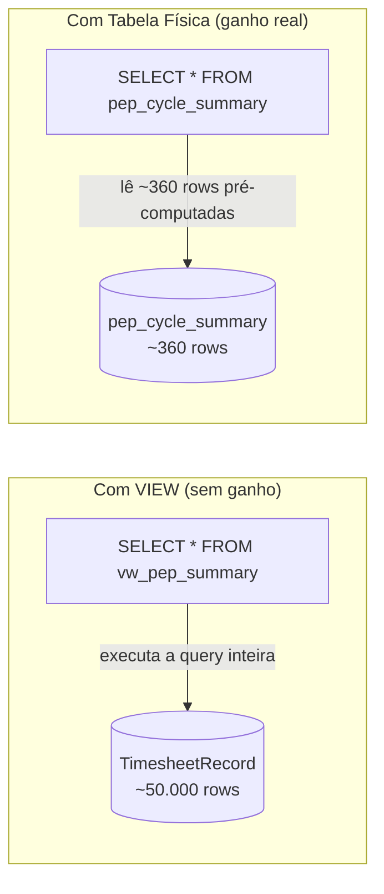

**360 rows** = 10 projetos × 29 ciclos + margem. Um único `SELECT *` sem JOIN ou GROUP BY. A diferença de latência é de ~200ms → <1ms.

### 6.2 Quando a tabela é atualizada?

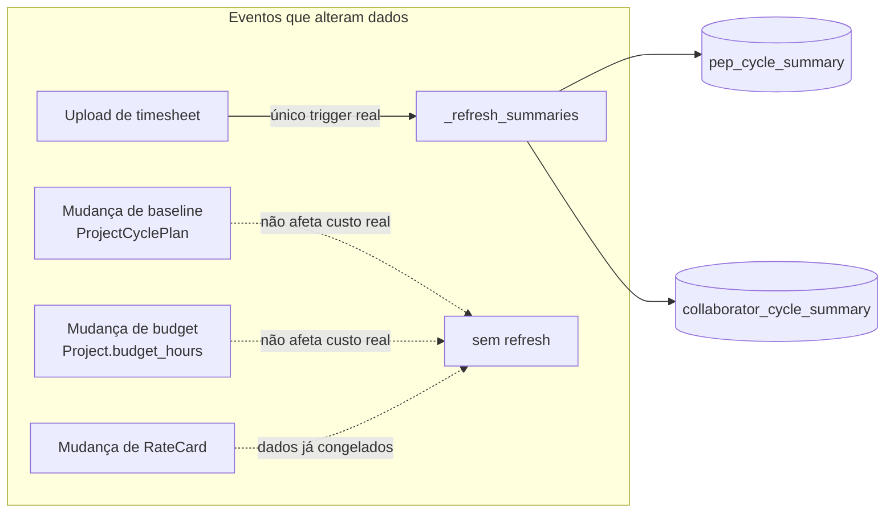

Apenas a **ingestão** altera os dados de custo real. As demais operações (baseline, budget, rate card) modificam campos de referência que os endpoints lêem diretamente da tabela `Project` ou `ProjectCyclePlan` — não precisam invalidar os summaries.

### 6.3 Schema da tabela

```python
# models.py — PepCycleSummary
class PepCycleSummary(Base):
    __tablename__ = "pep_cycle_summary"

    id               = Column(Integer, primary_key=True)
    pep_wbs          = Column(String,  nullable=False, index=True)
    pep_description  = Column(String,  nullable=True)
    cycle_id         = Column(Integer, ForeignKey("cycle.id"), nullable=False, index=True)
    total_hours      = Column(Float,   default=0.0)
    normal_hours     = Column(Float,   default=0.0)
    extra_hours      = Column(Float,   default=0.0)
    standby_hours    = Column(Float,   default=0.0)
    total_cost       = Column(Float,   default=0.0)
    normal_cost      = Column(Float,   default=0.0)
    extra_cost       = Column(Float,   default=0.0)
    standby_cost     = Column(Float,   default=0.0)
    refreshed_at     = Column(DateTime, default=func.now(), onupdate=func.now())

    cycle = relationship("Cycle")

    __table_args__ = (
        UniqueConstraint("pep_wbs", "cycle_id", name="uq_pep_cycle"),
    )
```

### 6.4 Função de refresh

```python
# services/summaries.py

def _refresh_summaries(db: Session, pep_wbs_list: list[str], cycle_ids: list[int]):
    """Recalcula pep_cycle_summary e collaborator_cycle_summary para os
    pares (pep_wbs, cycle_id) afetados pela ingestão atual.
    Chamado ao final de ingest_file(), dentro da mesma transação."""

    for pep in pep_wbs_list:
        for cycle_id in cycle_ids:
            rows = (
                db.query(TimesheetRecord)
                .filter(
                    TimesheetRecord.pep_wbs == pep,
                    TimesheetRecord.cycle_id == cycle_id,
                    TimesheetRecord.quarantine == False,
                )
                .all()
            )

            agg = {
                "total_hours":   sum(r.total_hours   or 0 for r in rows),
                "normal_hours":  sum(r.normal_hours  or 0 for r in rows),
                "extra_hours":   sum(r.extra_hours   or 0 for r in rows),
                "standby_hours": sum(r.standby_hours or 0 for r in rows),
                "total_cost":    sum((r.normal_cost or 0) + (r.extra_cost or 0) + (r.standby_cost or 0) for r in rows),
                "normal_cost":   sum(r.normal_cost   or 0 for r in rows),
                "extra_cost":    sum(r.extra_cost    or 0 for r in rows),
                "standby_cost":  sum(r.standby_cost  or 0 for r in rows),
                "pep_description": rows[0].pep_description if rows else None,
            }

            existing = (
                db.query(PepCycleSummary)
                .filter_by(pep_wbs=pep, cycle_id=cycle_id)
                .first()
            )
            if existing:
                for k, v in agg.items():
                    setattr(existing, k, v)
            else:
                db.add(PepCycleSummary(pep_wbs=pep, cycle_id=cycle_id, **agg))
```

### 6.5 Antes × Depois — `/api/portfolio-health`

**Antes (GROUP BY em 50.000 rows a cada request):**

```python
# analytics.py — hoje
rows = (
    db.query(
        TimesheetRecord.pep_wbs,
        TimesheetRecord.pep_description,
        func.sum(TimesheetRecord.total_hours).label("consumed_hours"),
        func.sum(
            TimesheetRecord.total_hours * TimesheetRecord.cost_per_hour
        ).label("actual_cost"),        # ← multiplica na hora; ignora extra/standby multiplier
    )
    .join(Cycle)
    .filter(
        Cycle.start_date >= date_from,
        Cycle.end_date   <= date_to,
        TimesheetRecord.quarantine == False,
    )
    .group_by(TimesheetRecord.pep_wbs)
    .all()
)
# ❌ ACL não aplicada aqui
# ❌ GROUP BY em tabela grande
# ❌ cost_per_hour × total_hours ignora multiplicadores extra/standby
```

**Depois (leitura de ~360 rows pré-computadas):**

```python
# routers/v2/portfolio.py
from backend.app.services.evm import compute_cpi, classify_health

def portfolio(db: DbSession, current_user: CurrentUser, date_from=None, date_to=None):
    # ACL centralizada
    allowed_peps = _get_allowed_peps(db, current_user)

    query = (
        db.query(PepCycleSummary)
        .join(Cycle)
        .filter(Cycle.is_quarantine == False)
    )
    if date_from:
        query = query.filter(Cycle.start_date >= date_from)
    if date_to:
        query = query.filter(Cycle.end_date <= date_to)
    if allowed_peps is not None:          # None = acesso total
        query = query.filter(PepCycleSummary.pep_wbs.in_(allowed_peps))

    summaries = query.all()

    # Agrupa por pep_wbs (já são poucas rows)
    by_pep: dict[str, dict] = {}
    for s in summaries:
        entry = by_pep.setdefault(s.pep_wbs, {
            "pep_wbs": s.pep_wbs,
            "pep_description": s.pep_description,
            "total_hours": 0.0,
            "total_cost": 0.0,
        })
        entry["total_hours"] += s.total_hours
        entry["total_cost"]  += s.total_cost

    # Enriquece com dados do Project
    projects = {p.pep_wbs: p for p in db.query(Project).all()}

    result = []
    for pep_wbs, data in by_pep.items():
        proj = projects.get(pep_wbs)
        budget_hours = proj.budget_hours if proj else None
        budget_cost  = proj.budget_cost  if proj else None
        cpi          = compute_cpi(budget_cost, data["total_cost"])
        health_hours = classify_health(data["total_hours"], budget_hours)
        health_cost  = classify_health(data["total_cost"],  budget_cost)

        result.append({
            **data,
            "name":         proj.name if proj else None,
            "budget_hours": budget_hours,
            "budget_cost":  budget_cost,
            "cpi":          cpi,
            "health_hours": health_hours,   # ← render-ready
            "health_cost":  health_cost,    # ← render-ready
            "is_registered": proj is not None,
        })

    return result
```

**Payload de resposta — antes:**

```json
{
  "pep_wbs": "60IT-001-01",
  "consumed_hours": 1240.5,
  "actual_cost": 62025.0,
  "budget_hours": 1500.0,
  "budget_cost": 75000.0,
  "cpi": 1.209,
  "is_registered": true
}
```

**Payload de resposta — depois (render-ready):**

```json
{
  "pep_wbs": "60IT-001-01",
  "pep_description": "Sistema de Gestão Interna",
  "name": "Projeto Alpha",
  "total_hours": 1240.5,
  "total_cost": 62025.0,
  "normal_cost": 52000.0,
  "extra_cost": 7500.0,
  "standby_cost": 2525.0,
  "budget_hours": 1500.0,
  "budget_cost": 75000.0,
  "cpi": 1.209,
  "health_hours": "warning",
  "health_cost": "ok",
  "is_registered": true
}
```

O frontend não precisa mais calcular `cpi`, classificar health, ou fazer aritmétic nenhuma. Só renderiza.

---

## 7. Fase 3 — Camada 2: `collaborator_cycle_summary`

**Objetivo:** Tabela pré-computada com grain `(collaborator_id, cycle_id)` para servir os endpoints de equipe (Dashboard, Tendências por colaborador).

### 7.1 Schema

```python
class CollaboratorCycleSummary(Base):
    __tablename__ = "collaborator_cycle_summary"

    id               = Column(Integer, primary_key=True)
    collaborator_id  = Column(Integer, ForeignKey("collaborator.id"), nullable=False, index=True)
    cycle_id         = Column(Integer, ForeignKey("cycle.id"),        nullable=False, index=True)
    normal_hours     = Column(Float, default=0.0)
    extra_hours      = Column(Float, default=0.0)
    standby_hours    = Column(Float, default=0.0)
    total_hours      = Column(Float, default=0.0)
    total_cost       = Column(Float, default=0.0)
    normal_cost      = Column(Float, default=0.0)
    extra_cost       = Column(Float, default=0.0)
    standby_cost     = Column(Float, default=0.0)
    refreshed_at     = Column(DateTime, default=func.now())

    collaborator = relationship("Collaborator")
    cycle        = relationship("Cycle")

    __table_args__ = (
        UniqueConstraint("collaborator_id", "cycle_id", name="uq_collab_cycle"),
    )
```

### 7.2 Tamanho esperado

```
Colaboradores únicos: ~62
Ciclos: ~29
Linhas esperadas: ~1.800 (com zeros para combinações sem horas)
```

Um `SELECT` completo desta tabela retorna em <2ms — comparado com ~180ms do `GROUP BY` atual em `TimesheetRecord`.

### 7.3 Antes × Depois — `/api/dashboard`

**Antes:**

```python
# dashboard.py — hoje (simplificado)
rows = (
    db.query(
        Collaborator.name.label("collaborator"),
        func.sum(TimesheetRecord.normal_hours).label("normal_hours"),
        func.sum(TimesheetRecord.extra_hours).label("extra_hours"),
        func.sum(TimesheetRecord.standby_hours).label("standby_hours"),
    )
    .join(Collaborator)
    .join(Cycle)
    .filter(cycle_filter, acl_filter)
    .group_by(Collaborator.name)
    .order_by(func.sum(TimesheetRecord.total_hours).desc())
    .all()
)
```

**Depois:**

```python
# routers/v2/effort.py
rows = (
    db.query(CollaboratorCycleSummary)
    .join(Cycle)
    .join(Collaborator)
    .filter(cycle_filter)
    .filter(Collaborator.id.in_(allowed_collaborator_ids) if allowed_collaborator_ids else True)
    .all()
)

# Agrega no Python (poucas rows, negligível)
by_collab = {}
for r in rows:
    entry = by_collab.setdefault(r.collaborator.name, {...})
    entry["normal_hours"]  += r.normal_hours
    entry["extra_hours"]   += r.extra_hours
    entry["standby_hours"] += r.standby_hours
    entry["total_cost"]    += r.total_cost
```

---

## 8. Fase 4 — Novos Endpoints Consolidados

### 8.1 Mapa de substituição

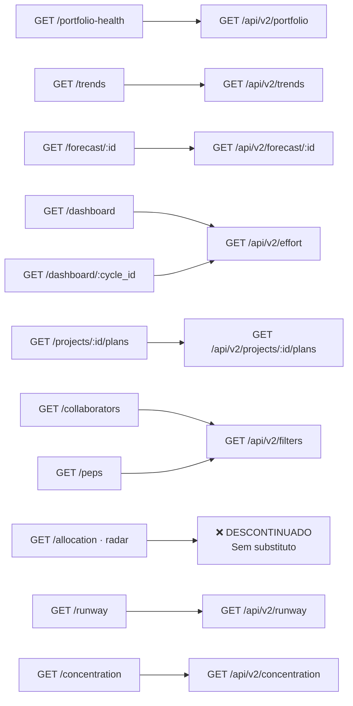

### 8.2 Endpoint descontinuado — Radar (`/allocation`)

O endpoint `GET /allocation` e o schema `PepRadarItem` são **removidos sem substituto**. Aqui está o diagnóstico completo do porquê:

**O que o radar faz hoje:**

```python
# analytics.py — get_allocation (simplificado)
rows = (
    db.query(
        Collaborator.name,
        TimesheetRecord.pep_wbs,
        TimesheetRecord.pep_description,
        func.sum(TimesheetRecord.total_hours).label("total_hours"),
        func.sum(TimesheetRecord.total_hours * TimesheetRecord.cost_per_hour).label("actual_cost"),
    )
    .join(Collaborator)
    .group_by(Collaborator.name, TimesheetRecord.pep_wbs)
    .all()
)
```

Retorna uma lista de `AllocationItem` — `{collaborator, pep_wbs, total_hours, actual_cost}` — que o frontend usa para montar um gráfico de radar (`PepRadarItem`):

```json
[
  { "pep_description": "Sistema Alpha",  "total_hours": 340.5, "actual_cost": 17025.0 },
  { "pep_description": "Sistema Beta",   "total_hours": 210.0, "actual_cost": 10500.0 }
]
```

**Por que está sendo descontinuado:**

| Problema | Detalhe |
|---|---|
| **Informação redundante** | `pep_cycle_summary` já contém `total_hours` e `total_cost` por PEP — o radar re-agrega dados que já existem pré-computados |
| **Sem filtro de período** | O endpoint ignora `date_from`/`date_to` — mostra o total histórico sempre, inconsistente com todos os outros endpoints |
| **ACL ausente** | Nenhuma verificação de `UserProjectAccess` |
| **Gráfico de radar inadequado** | Com 10+ PEPs, o gráfico de radar fica ilegível. Os mesmos dados são melhor representados no treemap do portfólio |
| **Uso real** | O frontend usa este endpoint apenas para o gráfico de radar na aba Portfólio — que pode ser substituído pela visão de concentração (`/api/v2/concentration`) |

**O que substitui:**  
O `/api/v2/portfolio` já entrega `total_hours` e `total_cost` por PEP com filtro de período e ACL. O gráfico de radar (se desejado) pode ser alimentado diretamente por esses dados. Não há necessidade de um endpoint dedicado.

**O que é deletado:**

```
backend/app/routers/analytics.py   → função get_allocation
backend/app/schemas.py             → class AllocationItem
                                   → class PepRadarItem
frontend/app.js                    → todo código do gráfico de radar
```

---

**`GET /api/v2/filters`** — novo endpoint que substitui `/collaborators` e `/peps`, retornando ambos em uma única chamada:

```json
{
  "collaborators": [{"id": 1, "name": "Ana Silva"}, ...],
  "peps": [
    {"code": "60IT-001-01", "descriptions": ["Sistema de Gestão"], "total_records": 1240}
  ],
  "cycles": [
    {"id": 5, "name": "JAN/2025", "start_date": "2025-01-01", "end_date": "2025-01-31"}
  ]
}
```

O frontend hoje faz 3 chamadas para popular os filtros. Com este endpoint, são 0 chamadas extras — os filtros chegam junto com a inicialização.

### 8.3 ACL centralizada

```python
# deps.py — novo helper
def _get_allowed_peps(db: Session, user: User) -> list[str] | None:
    """Retorna lista de pep_wbs permitidos, ou None se acesso total."""
    accesses = db.query(UserProjectAccess).filter_by(user_id=user.id).all()
    if not accesses:
        return None  # acesso total
    return [a.pep_wbs for a in accesses]
```

Todos os endpoints v2 chamam `_get_allowed_peps()` antes de qualquer query. Zero exceções.

### 8.4 Contrato do `/api/v2/forecast/:id`

**Antes (frontend calculava EAC, TCPI, VAC, SPI no JS):**

```json
{
  "pep_wbs": "60IT-001-01",
  "budget_hours": 1500.0,
  "budget_cost": 75000.0,
  "consumed_hours": 1240.5,
  "actual_cost": 62025.0,
  "avg_hours_per_cycle": 42.7,
  "history": [
    {
      "cycle_name": "JAN/2025",
      "period_hours": 45.0,
      "period_cost": 2250.0,
      "cumulative_hours": 45.0,
      "cumulative_cost": 2250.0,
      "planned_hours": 50.0,
      "cumulative_planned_hours": 50.0,
      "planned_cost": 2500.0,
      "cumulative_planned_cost": 2500.0,
      "cumulative_ev_cost": 2250.0
    }
  ]
}
```

**Depois (render-ready — frontend só formata):**

```json
{
  "pep_wbs": "60IT-001-01",
  "name": "Projeto Alpha",
  "budget_hours": 1500.0,
  "budget_cost": 75000.0,
  "consumed_hours": 1240.5,
  "actual_cost": 62025.0,
  "remaining_hours": 259.5,
  "remaining_cost": 12975.0,
  "cpi": 1.209,
  "cpi_label": "Abaixo do orçamento",
  "cpi_color": "success",
  "spi": 0.94,
  "spi_label": "Atrasado",
  "spi_color": "warning",
  "eac": 62025.0,
  "vac": 12975.0,
  "cv": 12975.0,
  "tcpi": 0.87,
  "avg_hours_per_cycle": 42.7,
  "estimated_cycles_to_complete": 6.1,
  "estimated_completion_cycle": "NOV/2026",
  "using_baseline": true,
  "baseline_label": "Baseline Inicial",
  "history": [
    {
      "cycle_name": "JAN/2025",
      "cycle_start": "2025-01-01",
      "period_hours": 45.0,
      "period_cost": 2250.0,
      "cumulative_hours": 45.0,
      "cumulative_cost": 2250.0,
      "planned_hours": 50.0,
      "planned_cost": 2500.0,
      "cumulative_planned_hours": 50.0,
      "cumulative_planned_cost": 2500.0,
      "cumulative_ev_cost": 2250.0,
      "spi_cumulative": 0.90
    }
  ]
}
```

---

## 9. Fase 5 — Frontend Puramente Apresentacional

### 9.1 O que sai do `app.js`

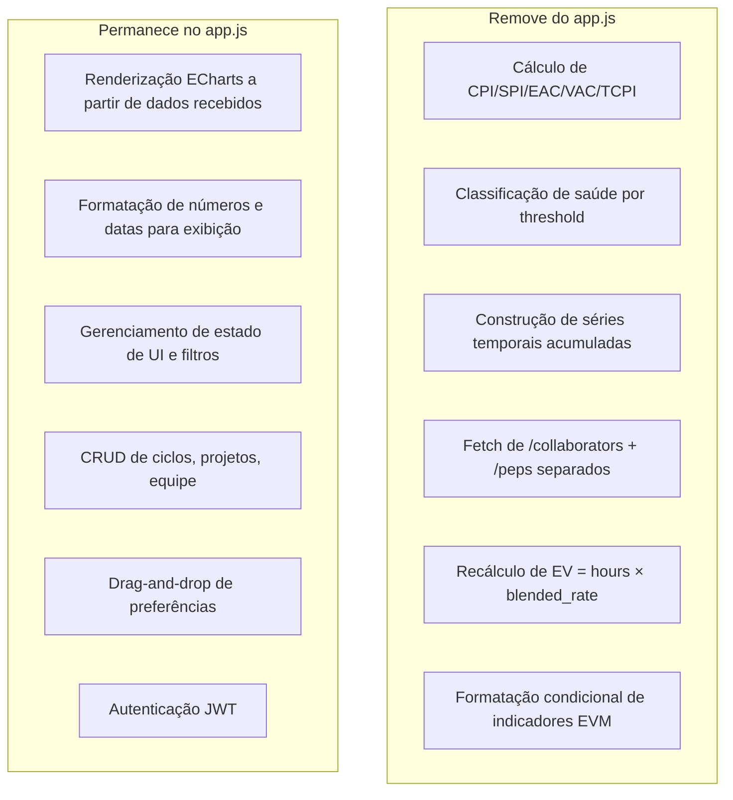

### 9.2 Antes × Depois — render da aba Portfólio

**Antes (JS calculava health):**

```javascript
// app.js — _renderPortfolioTab (hoje, ~50 linhas de cálculo)
function _healthColor(item) {
    if (!item.budget_hours) return "#818998";  // grey
    const ratio = item.consumed_hours / item.budget_hours;
    if (ratio >= 1.0) return "#c56d76";   // critical
    if (ratio >= 0.9) return "#d9b273";   // warning
    return "#5ad388";                      // ok
}

const cpi = item.actual_cost > 0
    ? (item.budget_cost / item.actual_cost).toFixed(2)
    : "—";

const evm_label = cpi >= 1 ? "Dentro do orçamento" : "Acima do orçamento";
```

**Depois (JS só mapeia campos):**

```javascript
// app.js — _renderPortfolioTab (depois, ~5 linhas de mapeamento)
const COLOR_MAP = { ok: "#5ad388", warning: "#d9b273", critical: "#c56d76", overrun: "#c56d76", no_budget: "#818998" };

const color = COLOR_MAP[item.health_hours];  // backend já classificou
const cpi   = item.cpi ?? "—";              // backend já calculou
const label = item.cpi_label;               // backend já formatou
```

### 9.3 Eliminação de chamadas HTTP redundantes

**Antes — inicialização da aba Dashboard:**

```
1. GET /api/collaborators
2. GET /api/peps
3. GET /api/cycles
4. GET /api/dashboard
5. GET /api/portfolio-health   (para semáforo)
```
**5 chamadas HTTP** para renderizar uma tela.

**Depois:**

```
1. GET /api/v2/filters          (traz collaborators + peps + cycles)
2. GET /api/v2/effort           (dados do dashboard)
3. GET /api/v2/portfolio        (semáforo — pode ser lazy/background)
```
**3 chamadas HTTP**, e a `#1` pode ser cacheada entre tabs por 60 segundos.

---

## 10. Fase 6 — Deletar Código Antigo

Esta fase só acontece depois que:
- Os novos endpoints estão em produção
- Os testes dos novos endpoints passam (100%)
- O frontend migrou para os novos endpoints
- Os testes dos endpoints antigos foram **reescritos** para os novos (não apenas deletados)

### 10.1 O que será deletado

| Arquivo | Seções Deletadas |
|---|---|
| `routers/analytics.py` | Funções `portfolio_health`, `trends`, `allocation`, `runway`, `concentration` |
| `routers/dashboard.py` | Arquivo inteiro substituído por `routers/v2/effort.py` |
| `routers/reference.py` | Arquivo inteiro substituído por `routers/v2/filters.py` |
| `app.js` | Funções `_healthColor`, `compute_cpi`, `compute_eac`, todo cálculo EVM inline |
| `tests/test_analytics.py` | Todos os testes de endpoints antigos (após reescrita para v2) |
| `tests/test_dashboard.py` | Idem |

### 10.2 O que NÃO será deletado

- `routers/plans.py` — baseline S-curve permanece igual  
- `routers/auth.py`, `users.py`, `cycles.py`, `projects.py` — CRUD não muda  
- `routers/quarantine.py`, `validation_rules.py`, `upload.py` — operacionais, não afetados  
- `services/ingestion.py` — apenas adições (freeze_costs, _refresh_summaries)  
- Todos os modelos existentes — apenas adição de colunas/tabelas, nenhuma remoção

---

## 11. Estratégia de Testes

### 11.1 Regra de ouro

> **Nunca delete um teste antes de escrever o teste substituto.**

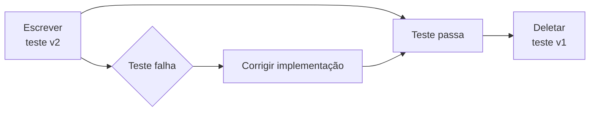

### 11.2 O que testar em cada fase

**Fase 0 — `services/evm.py`:**

```python
# tests/test_evm_service.py
def test_compute_cpi_normal():
    assert compute_cpi(75000.0, 62025.0) == pytest.approx(1.2092, rel=1e-3)

def test_compute_cpi_zero_actual():
    assert compute_cpi(75000.0, 0.0) is None

def test_compute_cpi_no_budget():
    assert compute_cpi(None, 62025.0) is None

def test_freeze_costs():
    nc, ec, sc = freeze_costs(8.0, 2.0, 1.0, cost_per_hour=50.0, em=1.5, sm=1.25)
    assert nc == 400.0   # 8 × 50
    assert ec == 150.0   # 2 × 50 × 1.5
    assert sc == 62.5    # 1 × 50 × 1.25
```

**Fase 1 — Frozen costs na ingestão:**

```python
def test_frozen_costs_survive_multiplier_change(client, db):
    # Upload com multiplier = 1.5
    # Muda multiplier para 2.0
    # Verifica que extra_cost do registro antigo NÃO mudou
    old_cost = db.query(TimesheetRecord).first().extra_cost
    cfg = db.query(GlobalConfig).first()
    cfg.extra_hours_multiplier = 2.0
    db.commit()
    new_cost = db.query(TimesheetRecord).first().extra_cost
    assert old_cost == new_cost  # ← congelado, imutável
```

**Fase 2/3 — Summary tables:**

```python
def test_summary_refreshed_after_upload(client, db, sample_csv):
    client.post("/api/upload-timesheet", files={"file": sample_csv})
    summary = db.query(PepCycleSummary).filter_by(pep_wbs="60IT-001-01").first()
    assert summary is not None
    assert summary.total_hours > 0
    assert summary.total_cost > 0

def test_summary_consistency_with_raw(db):
    # Verifica que SUM(TimesheetRecord) == pep_cycle_summary para cada pep×ciclo
    for s in db.query(PepCycleSummary).all():
        raw = db.query(func.sum(TimesheetRecord.total_hours)).filter_by(
            pep_wbs=s.pep_wbs, cycle_id=s.cycle_id
        ).scalar() or 0.0
        assert abs(s.total_hours - raw) < 0.001
```

**Fase 4 — Novos endpoints:**

```python
def test_portfolio_v2_acl(client, db):
    # Cria user com acesso apenas a 60IT-001-01
    # Verifica que /api/v2/portfolio retorna apenas esse PEP
    ...

def test_portfolio_v2_render_ready(client):
    resp = client.get("/api/v2/portfolio", ...)
    item = resp.json()[0]
    assert "health_hours" in item    # classificado no backend
    assert "cpi" in item             # calculado no backend
    assert "cpi_label" in item       # formatado no backend
    assert item["health_hours"] in ("ok", "warning", "critical", "overrun", "no_budget")
```

### 11.3 Não manter código só para testes

Se um teste depende de um endpoint antigo que foi deletado, o teste precisa ser **reescrito** para o novo endpoint — não o endpoint antigo mantido. A regra é: o código de produção é a referência, os testes se adaptam a ele, nunca o contrário.

---

## 12. Registro de Riscos

| # | Risco | Probabilidade | Impacto | Mitigação |
|---|---|---|---|---|
| R1 | Summary desincronizada com `TimesheetRecord` | Baixa | Alto | Teste de consistência (Fase 2/3, seção 11.2) roda em CI a cada push |
| R2 | Registros legados sem `normal_cost` (NULL) | Certa | Médio | Fallback: calcular on-the-fly para NULL; backfill via script de migração |
| R3 | Endpoint v2 com comportamento diferente do v1 | Média | Médio | Testes de paridade: mesma entrada → mesma saída numérica |
| R4 | Frontend quebra durante migração gradual | Média | Alto | Manter v1 e v2 em paralelo até frontend migrado completamente |
| R5 | ACL no v2 mais restritiva que no v1 | Baixa | Baixo | Risco positivo — era um bug; documentar a mudança de comportamento |
| R6 | Performance de `_refresh_summaries` em uploads grandes | Média | Médio | Medir com dataset de 50K rows; usar `executemany` se necessário |
| R7 | Perda de funcionalidade não documentada | Baixa | Alto | Auditoria manual: para cada endpoint v1 deletado, listar todos os usos no frontend |

---

## 13. Ordem de Execução

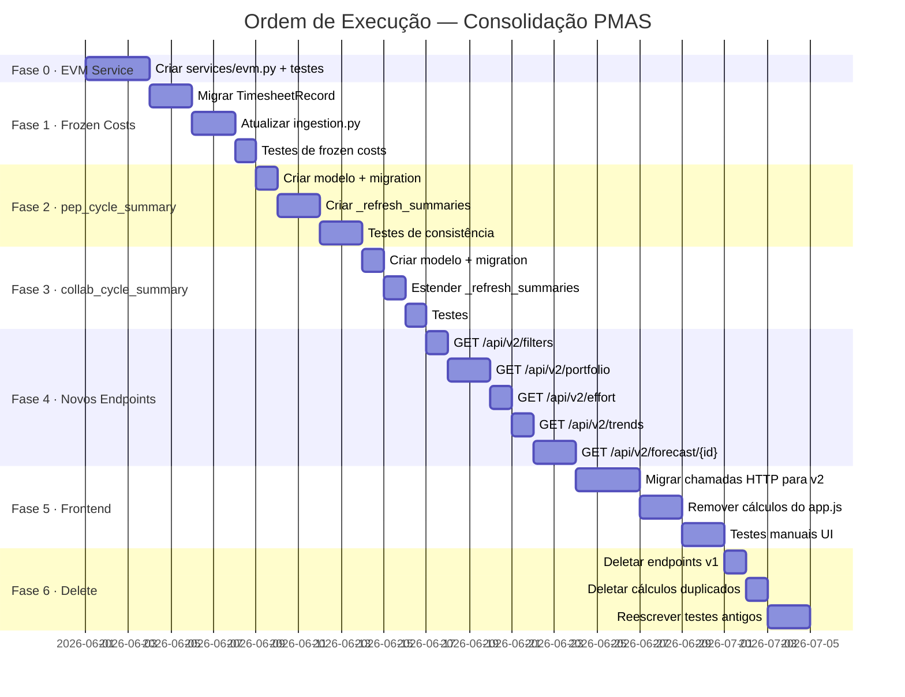

### 13.1 Dependências críticas

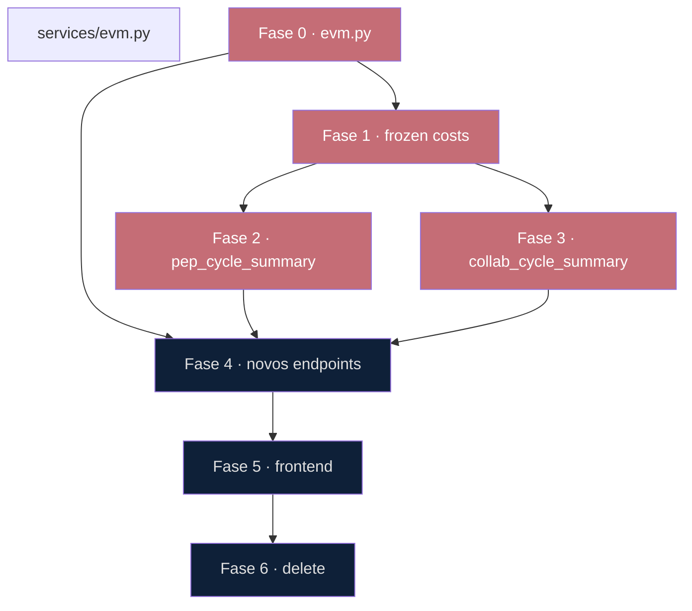

**Fase 0 é o bloqueador absoluto.** Nenhuma outra fase começa sem `services/evm.py` existir e com todos os testes passando.

---

## Apêndice — Mapa de Arquivos Modificados

```
backend/app/
├── services/
│   ├── evm.py              ← NOVO (Fase 0)
│   ├── summaries.py        ← NOVO (Fase 2/3)
│   └── ingestion.py        ← MODIFICA (Fase 1: freeze_costs + _refresh_summaries)
├── models.py               ← MODIFICA (Fase 1: 3 colunas em TimesheetRecord)
│                                       (Fase 2: nova tabela PepCycleSummary)
│                                       (Fase 3: nova tabela CollaboratorCycleSummary)
├── database.py             ← MODIFICA (_migrate_columns para 3 novas colunas)
├── routers/
│   ├── v2/                 ← NOVO (Fase 4)
│   │   ├── __init__.py
│   │   ├── portfolio.py
│   │   ├── effort.py
│   │   ├── trends.py
│   │   ├── forecast.py
│   │   └── filters.py
│   ├── analytics.py        ← DELETE gradual (Fase 6)
│   ├── dashboard.py        ← DELETE (Fase 6)
│   └── reference.py        ← DELETE (Fase 6)
├── main.py                 ← MODIFICA (include routers v2)
└── schemas.py              ← MODIFICA (novos schemas render-ready)

frontend/
└── app.js                  ← MODIFICA (Fase 5: migrar para v2, remover cálculos)

tests/
├── test_evm_service.py     ← NOVO (Fase 0)
├── test_summaries.py       ← NOVO (Fase 2/3)
├── test_portfolio_v2.py    ← NOVO (Fase 4)
├── test_effort_v2.py       ← NOVO (Fase 4)
├── test_analytics.py       ← REESCREVE para v2 (Fase 6)
└── test_dashboard.py       ← REESCREVE para v2 (Fase 6)
```

---

*Este documento deve ser revisado antes de cada fase e atualizado com os resultados reais observados durante a implementação.*
