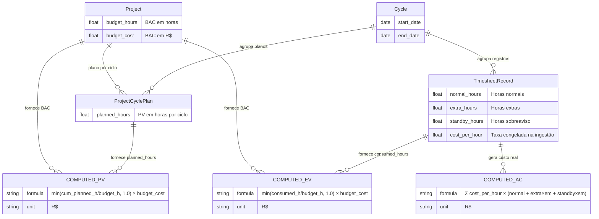
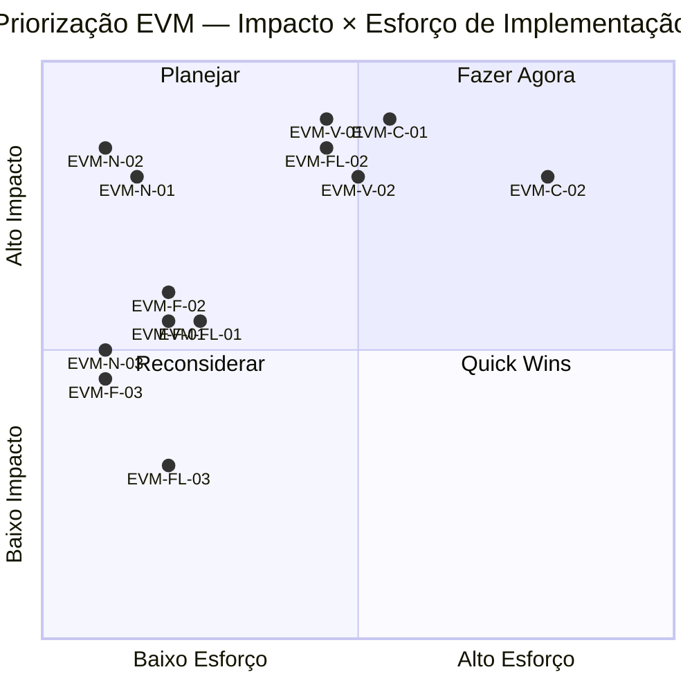
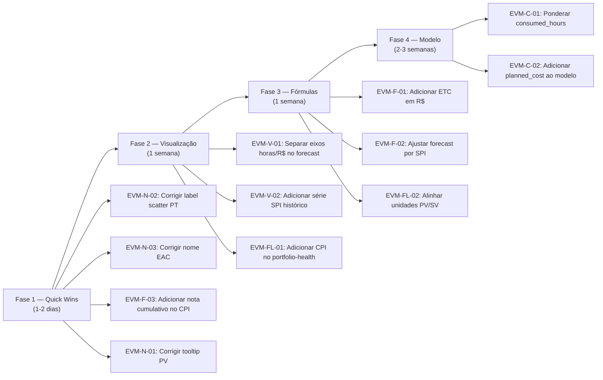

# EVM-AUDIT — PMAS

> **Escopo:** Implementação de EVM Ágil no sistema de timesheet
> **Referências normativas:** ANSI/PMI 19-006-2019 · AgileEVM (Sulaiman et al., 2006) · PMBOK 7ª ed.
> **Unidade de valor detectada:** Dupla — horas físicas (consumed_hours) para EV/PV; R$ monetário (budget_cost) como escala de conversão. Sistema operacionalmente misto.
> **Data:** 2026-05-22

---

## 1. Resumo Executivo

O PMAS implementa um subconjunto de EVM Ágil com suporte a CPI, SPI, EAC, SV e PV para projetos com `budget_hours` e `budget_cost` cadastrados. As métricas centrais — CPI e EAC — estão matematicamente corretas e são validadas por 16 testes unitários em `tests/test_evm_integrity.py`. O padrão EV = min(consumed_hours / budget_hours, 1.0) × budget_cost é aplicado de forma consistente nos três endpoints que expõem CPI (`/api/forecast`, `/api/portfolio-runway`, `/api/trends`).

Foram identificados **14 problemas distribuídos em 5 categorias**: 2 erros conceituais (severidade Alta), 4 divergências de nomenclatura (severidade Média–Alta), 3 erros de fórmula (severidade Média), 3 problemas de fluxo (severidade Média) e 2 problemas críticos de visualização (severidade Alta).

Os principais impactos ao usuário incluem: (1) a curva de PV no gráfico de Previsão é plotada em **horas físicas** enquanto EV/AC e todos os KPIs de custo estão em R$, tornando a sobreposição visual sem sentido dimensional; (2) o campo `consumed_hours` inclui horas extra e sobreaviso com peso 1:1, diferente do custo ponderado (multiplicadores 1,5× e 0,33×), criando inconsistência entre o numerador de EV e o número exibido ao usuário como "consumido"; (3) métricas como TCPI, VAC e CV — exigidas para decisão de re-baseline — estão completamente ausentes.

Veredicto de confiabilidade: **Parcialmente confiável**. CPI, EAC e SPI são matematicamente corretos para projetos com orçamento completo (budget_hours + budget_cost). Para projetos sem orçamento, nenhuma métrica EVM é calculada e o usuário não recebe aviso explícito. A mistura de unidades na visualização da curva S degrada a interpretabilidade sem invalidar os cálculos numéricos.

---

## 2. Modelo EVM Implementado vs. Padrão

### 2.1 Mapeamento de Variáveis

| Padrão | Definição correta | Campo no código | Campo na UI | Status |
|--------|-------------------|----------------|-------------|--------|
| BAC | Budget at Completion (total budget) | `Project.budget_cost` | Orçamento (R$) | ✅ Correto |
| BAC_h | Budget at Completion em horas | `Project.budget_hours` | Planejado (h) | ✅ Correto (sem sigla EVM) |
| AC | Actual Cost — custo real acumulado | `actual_cost` = Σ(cost_per_hour × (normal + extra×em + standby×sm)) | Custo Real | ✅ Correto |
| EV | Earned Value — valor agregado | `ev_val` = min(consumed_hours / budget_hours, 1.0) × budget_cost | Não exibido diretamente | ⚠️ Parcialmente correto (veja EVM-C-01) |
| PV | Planned Value — valor planejado | `cumulative_planned_hours` (em horas) → convertido via budget_cost | VP (Valor Planejado) | ⚠️ Parcialmente correto (veja EVM-C-02) |
| CPI | Cost Performance Index | `cpi` = EV / AC | CPI / IDC | ✅ Correto |
| SPI | Schedule Performance Index | `spi` = last_plan_ev / last_plan_pv | SPI / IDP | ✅ Correto |
| EAC | Estimate at Completion | `eac` = budget_cost / cpi | EAC | ✅ Correto |
| SV | Schedule Variance | `sv` = last_plan_ev − last_plan_pv | Variação de Prazo (SV) | ✅ Correto |
| CV | Cost Variance | Não calculado | Não exibido | 🔴 Ausente |
| TCPI | To-Complete Performance Index | Não calculado | Não exibido | 🔴 Ausente |
| VAC | Variance at Completion | Não calculado | Não exibido | 🔴 Ausente |
| ETC | Estimate to Complete | `remaining_hours` (somente em horas) | Horas Restantes | ⚠️ Parcialmente correto (apenas horas, não custo) |

Legenda: ✅ Correto · ⚠️ Parcialmente correto · ❌ Incorreto · 🔴 Ausente

### 2.2 Unidade de Medida

| Variável | Unidade real no código | Unidade esperada (PMI) | Consistente? |
|----------|----------------------|----------------------|--------------|
| BAC | R$ (`budget_cost`) | R$ (ou mesma unidade de AC) | ✅ |
| BAC_h | horas (`budget_hours`) | horas | ✅ |
| AC | R$ (ponderado por multiplicadores) | R$ | ✅ |
| EV | R$ (derivado de budget_cost × %) | R$ | ✅ |
| PV (SPI) | R$ (derivado de budget_cost × %) | R$ | ✅ (interno) |
| PV (gráfico) | horas (`cumulative_planned_hours`) | R$ ou horas (mas consistente com EV) | ❌ Inconsistente com EV |
| CPI | adimensional | adimensional | ✅ |
| SPI | adimensional | adimensional | ✅ |
| EAC | R$ | R$ | ✅ |
| SV | R$ | R$ | ✅ |
| consumed_hours (usado como base do EV) | horas brutas (normal+extra+standby, sem pesos) | horas efetivas de trabalho ponderado | ⚠️ Ver EVM-C-01 |
| remaining_hours (ETC) | horas brutas | horas | ⚠️ Sem equivalente em R$ |

**Regra inquebrável de EVM:** PV, EV e AC devem estar na mesma unidade. Os cálculos de CPI, SPI, EAC e SV usam EV e PV em R$ — internamente correto. Mas a visualização da curva S plota `cumulative_planned_hours` (horas) junto com `cumulative_hours` (horas) — essa parte é visualmente consistente em horas, porém o tooltip do KPI "Horas Restantes" refere-se a horas brutas enquanto EAC está em R$, criando uma experiência de usuário mista.

### 2.3 Diagrama do Modelo Atual



---

## 3. Erros Conceituais

### EVM-C-01 — consumed_hours inclui horas extras e sobreaviso sem ponderação

**Severidade:** Alta
**Categoria:** Definição de EV
**Arquivo + linha:** `backend/app/routers/analytics.py` linhas 47–50, 192–195, 357–362
**Referência normativa:** ANSI/PMI 19-006-2019 §4.2.1 — "Earned Value represents the budgeted cost of work performed"

**Descrição:** `consumed_hours` é calculado como `normal_hours + extra_hours + standby_hours` (sem ponderação). Esse total é então usado como numerador no cálculo de EV: `EV = min(consumed_hours / budget_hours, 1.0) × budget_cost`. O custo real (AC), porém, é calculado com `normal_hours + extra_hours × em + standby_hours × sm` onde em=1,5 e sm=0,33. Isso significa que um colaborador que trabalhou 10h de sobreaviso (custo = 10 × 100 × 0,33 = R$330) contribui com 10h para `consumed_hours`, inflando o EV por um fator de ~3× em relação ao custo real dessas horas. O projeto aparece com mais progresso do que o custo incorrido sugere.

**Evidência:**
```python
# analytics.py linhas 47-50
func.sum(
    TimesheetRecord.normal_hours
    + TimesheetRecord.extra_hours      # sem multiplicador
    + TimesheetRecord.standby_hours    # sem multiplicador
).label("consumed_hours"),

# mas AC usa ponderação:
# TimesheetRecord.extra_hours * em    (em = 1.5)
# TimesheetRecord.standby_hours * sm  (sm = 0.33)
```

**Correção proposta:**
```python
# Opção A: usar horas ponderadas como consumed_hours (alinha EV com AC)
func.sum(
    TimesheetRecord.normal_hours
    + TimesheetRecord.extra_hours * em
    + TimesheetRecord.standby_hours * sm
).label("consumed_hours"),

# Opção B (mais correta): manter consumed_hours como horas físicas para
# exibição, mas calcular EV a partir de AC diretamente
# EV = min(actual_cost / budget_cost_rate, 1.0) × budget_cost
# onde budget_cost_rate = budget_cost / budget_hours
```

**Impacto na métrica:** CPI pode ser inflado para projetos com alta proporção de horas extras/sobreaviso. Em um projeto com 50% de horas de sobreaviso, o `consumed_hours` pode ser ~2× o que o orçamento esperava, distorcendo EV upward.

---

### EVM-C-02 — PV é armazenado em horas mas convertido implicitamente para R$ sem plano de custo

**Severidade:** Alta
**Categoria:** Definição de PV
**Arquivo + linha:** `backend/app/models.py` linha 120; `backend/app/routers/analytics.py` linhas 418–420
**Referência normativa:** AgileEVM (Sulaiman et al., 2006) §3.2 — "PV = (Planned % Complete) × BAC"

**Descrição:** `ProjectCyclePlan` armazena apenas `planned_hours` (sem campo de custo planejado). O cálculo de PV monetário é feito por: `PV = min(cum_planned_hours / budget_hours, 1.0) × budget_cost`. Essa conversão assume implicitamente que a taxa de consumo de custo é linear em relação às horas planejadas — ou seja, que `budget_cost / budget_hours` é constante ao longo do tempo. Em projetos reais com perfis de seniority variáveis por fase (junior early, senior late), o custo real por hora muda, e o PV monetário calculado desta forma pode estar sistematicamente errado.

**Evidência:**
```python
# analytics.py linhas 418-420 (get_forecast)
if has_plan and cum_ph > prev_cum_ph and budget_hours and budget_cost:
    last_plan_ev = min(cum_h / budget_hours, 1.0) * budget_cost
    last_plan_pv = min(cum_ph / budget_hours, 1.0) * budget_cost
    # Assume taxa uniforme: budget_cost/budget_hours por hora planejada
```

**Correção proposta:** Adicionar `planned_cost` ao modelo `ProjectCyclePlan` para permitir baseline de custo independente do baseline de horas. Alternativamente, documentar explicitamente a assunção de taxa linear e restringir o uso de SPI a projetos com esse perfil.

```python
# models.py — adicionar campo opcional
class ProjectCyclePlan(Base):
    planned_hours = Column(Float, nullable=False)
    planned_cost  = Column(Float, nullable=True)  # NOVO: baseline de custo
```

**Impacto na métrica:** SPI e SV podem divergir do valor real em projetos com variação de seniority ao longo do ciclo de vida.

---

## 4. Erros de Nomenclatura

### 4.1 Tabela de Divergências

| Local | Termo usado | Termo correto (PMI) | Termo correto (PT) | Impacto |
|-------|-------------|--------------------|--------------------|---------|
| `frontend/app.js` linha 677 | "IDC — Índice de Desempenho de Custo" | CPI — Cost Performance Index | IDC — Índice de Desempenho de Custo | Nenhum (tradução correta) |
| `frontend/app.js` linha 688 | "IDP — Índice de Desempenho de Prazo" | SPI — Schedule Performance Index | IDP — Índice de Desempenho de Prazo | Nenhum (tradução correta) |
| `frontend/app.js` linha 700–701 | "EAC — Estimativa para Conclusão" | EAC — Estimate at Completion | EPT — Estimativa no Término | Médio: PMI-PT usa "EPT" mas "EAC" é amplamente aceito |
| `frontend/app.js` linha 714 | "VS — Variação de Prazo" | SV — Schedule Variance | VP ou VS | Médio: sigla VS não padronizada em PT |
| `frontend/app.js` linha 727–728 | PV descrito como "Σ (horas planejadas por ciclo)" | PV = Σ (BCWP por ciclo) em $ | VP = Custo Orçado do Trabalho Planejado | Alto: fórmula exibida ao usuário está em horas, mas cálculo interno usa R$ |
| `schemas.py` linha 277 | `cpi` no `ForecastOut` | CPI | IDC | Baixo: campo de API (uso programático) |
| `schemas.py` linha 278 | `spi` no `ForecastOut` | SPI | IDP | Baixo: campo de API (uso programático) |
| `models.py` linha 120 | `planned_hours` em `ProjectCyclePlan` | Planned Value (horas) | Horas Planejadas | Nenhum (campo claro) |
| `analytics.py` linhas 84–89 | `consumed_hours` | AC_hours / ACWP_hours | Horas Consumidas | Médio: "consumido" implica EV, não AC |
| `frontend/app.js` linhas 38–39 | Scatter: "Dispersão Custo × Horas" (PT) | EVM Quadrant (CPI × SPI) | Quadrante EVM (CPI × SPI) | Alto: nome PT contradiz o que o gráfico plota |

### 4.2 Análise de Casos Críticos

#### EVM-N-01 — Fórmula de PV exibida como "horas" mas cálculo interno usa R$

**Severidade:** Alta (confusão interpretativa)
**Arquivo:** `frontend/app.js` linhas 723–733

O tooltip EVM para a sigla PV exibe: `"VP = Σ (horas planejadas por ciclo) até o ciclo de referência"`. Isso induz o usuário a acreditar que PV é expresso em horas. Na realidade, o PV usado nos cálculos de SPI e SV (`last_plan_pv`) é calculado em R$ via `min(cum_planned_hours / budget_hours, 1.0) × budget_cost`. O usuário que lê "SV = VA − VP" e vê SV = −R$2.000 não consegue reconciliar com o PV descrito em horas.

#### EVM-N-02 — Label do scatter em PT diz "Dispersão Custo × Horas"

**Severidade:** Alta (confusão de eixos)
**Arquivo:** `frontend/app.js` linha 211

A chave i18n `'chart.scatterChart'` está mapeada para `'Dispersão Custo × Horas'` em PT-BR, mas o gráfico plota CPI no eixo Y e SPI no eixo X. O label correto seria "Quadrante EVM (CPI × SPI)". Um usuário PT que lê o título esperaria ver custo vs horas — um scatter de correlação — em vez de um quadrante de performance.

#### EVM-N-03 — EAC nomeado "Estimativa para Conclusão" em vez de "Estimativa no Término"

**Severidade:** Média
**Arquivo:** `frontend/app.js` linha 700–701

"Estimativa para Conclusão" é a tradução de ETC (Estimate to Complete) no PMBOK PT. A tradução correta de EAC é "Estimativa no Término" (EPT). O PMAS chama EAC de "Estimativa para Conclusão", o que pode levar gerentes a confundir com o custo restante (ETC) em vez do custo total final projetado.

#### EVM-N-04 — consumed_hours inclui todo tipo de hora sem nota de ponderação

**Severidade:** Média
**Arquivo:** `frontend/app.js` linha 2089 (label "Horas Consumidas"); `backend/app/routers/analytics.py` linhas 47–50

O KPI "Horas Consumidas" some da soma bruta de horas (normal + extra + sobreaviso). O usuário interpreta isso como "horas de esforço total", mas o orçamento (`budget_hours`) refere-se a horas do projeto sem necessariamente incluir sobreaviso. Não há nota explicativa na UI sobre o que está incluso.

---

## 5. Erros de Fórmula

### EVM-F-01 — Fórmula ETC implementada apenas em horas, sem equivalente em R$

**Severidade:** Média
**Arquivo:** `backend/app/routers/analytics.py` linhas 457–458

**Fórmula implementada:**
```python
remaining_hours = round(max(budget_hours - consumed_hours, 0.0), 2)
```

**Fórmula canônica (PMI):** `ETC = EAC − AC` (em R$), ou alternativas: `ETC = (BAC − EV) / CPI` (custo restante com performance atual)

**Divergência:** O campo `remaining_hours` retornado pelo `/api/forecast` é exibido ao usuário como "Horas Restantes" — isso é válido como ETC em horas. Porém não existe `remaining_cost` (ETC em R$). A ausência do ETC monetário impede o PM de saber quanto dinheiro ainda será gasto. A fórmula `ETC_cost = EAC − AC = budget_cost/CPI − actual_cost` não é calculada nem exibida.

**Impacto:** PM vê que faltam 30h, mas não sabe se isso representa R$3.000 ou R$9.000 dependendo da seniority da equipe restante.

---

### EVM-F-02 — Forecast de horas usa velocidade dos últimos 3 ciclos, ignorando CPI

**Severidade:** Média
**Arquivo:** `backend/app/routers/analytics.py` linhas 438–439, 462–463

**Fórmula implementada:**
```python
recent = rows[-3:]
avg_hours = sum(r.period_hours or 0.0 for r in recent) / len(recent)
# ...
est_cycles = round(remaining_hours / avg_hours, 1)
```

**Fórmula canônica (AgileEVM §4.3):** Previsão deve usar performance efetiva. Para EVM Ágil: `ETC_cycles = (BAC_h − EV_h) / velocity` onde `velocity` é a velocidade de entrega de valor (story points ou horas de trabalho planejado) ajustada pelo SPI.

**Divergência:** A previsão usa velocidade bruta de consumo de horas dos últimos 3 ciclos, sem ajustar pelo SPI ou CPI. Se o projeto está com SPI = 0,7 (30% atrasado), a previsão de horas restantes deveria ser inflada correspondentemente. A fórmula atual subprevisão a duração restante em projetos atrasados.

**Impacto:** Para um projeto com SPI=0,7 e remaining_hours=60h e avg_hours=20h/ciclo, a previsão diz "3 ciclos" quando o correto seria ~4,3 ciclos: `60 / (20 × SPI) = 60/14 ≈ 4,3`.

---

### EVM-F-03 — CPI no trends usa cumulative EV/AC, não instantâneo do ciclo

**Severidade:** Média (comportamento não documentado)
**Arquivo:** `backend/app/routers/analytics.py` linhas 232–252

**Fórmula implementada:** CPI por ciclo no `/api/trends` é calculado com valores **cumulativos** (acumulados desde o início do projeto), não com valores do período:
```python
cumulative_per_pep[pep_code] += cycle_pep_consumed.get((r.cycle_id, pep_code), 0.0)
cumulative_ac_per_pep[pep_code] += cycle_pep_ac.get((r.cycle_id, pep_code), 0.0)
# ...
cpi = round(total_ev / total_ac, 3)  # total = cumulativo até aquele ciclo
```

**Fórmula canônica (PMI §7.4):** CPI no gráfico de tendências pode ser tanto cumulativo (para ver tendência de todo o projeto) quanto periódico (para ver performance daquele ciclo específico). O padrão PMI usa CPI cumulativo — portanto, a implementação está alinhada. **No entanto, isso não é explicitado ao usuário**. O rótulo do gráfico é apenas "CPI por Ciclo", sugerindo valor do ciclo, não cumulativo.

**Impacto:** Usuário interpreta um CPI crescente como "este ciclo foi melhor" quando na verdade reflete melhora cumulativa que pode mascarar deterioração naquele ciclo específico.

---

## 6. Análise de Fluxos

### 6.1 Fluxo de Cálculo Atual

```mermaid
flowchart TD
    A[Upload CSV/XLSX] --> B[ingestion.py: _lookup_rate]
    B -->|cost_per_hour congelado| C[TimesheetRecord]
    C --> D1[/api/portfolio-health]
    C --> D2[/api/trends]
    C --> D3[/api/forecast]
    C --> D4[/api/portfolio-runway]
    D1 --> E1[consumed_hours = Σ normal+extra+standby]
    D1 --> E2[actual_cost = Σ cph×normal + cph×extra×em + cph×standby×sm]
    E1 --> F1[PortfolioHealthItem: sem CPI]
    E2 --> F1
    D2 --> G1[CPI por ciclo CUMULATIVO]
    G1 --> G2[TrendItem.cpi]
    D3 --> H1[EV = min consumed/budget_h, 1.0 × budget_cost]
    H1 --> H2[CPI = EV / AC]
    H2 --> H3[EAC = budget_cost / CPI]
    D3 --> H4[PV = min cum_planned_h/budget_h, 1.0 × budget_cost]
    H4 --> H5[SPI = EV_frozen / PV_frozen]
    H5 --> H6[SV = EV_frozen - PV_frozen]
    D4 --> I1[Mesmo EV/CPI/SPI que forecast]
    I1 --> I2[RunwayItem: risk, schedule_status]
    H1 --> J1[remaining_hours = budget_h - consumed_h]
    J1 --> J2[est_cycles = remaining_h / avg_h 3 ciclos]
```

### 6.2 Problemas de Fluxo

#### EVM-FL-01 — /api/portfolio-health não expõe CPI diretamente

**Tipo:** Gap de fluxo
**Arquivos:** `backend/app/routers/analytics.py` linhas 28–115; `backend/app/schemas.py` linhas 225–234

**Descrição:** O endpoint `/api/portfolio-health` retorna `consumed_hours`, `actual_cost`, `budget_hours` e `budget_cost`, mas não calcula nem retorna CPI. O frontend rende o Treemap e o Bullet Chart usando esses dados brutos. Para obter CPI, é necessário chamar `/api/portfolio-runway` separadamente. Resultado: o `_buildForecastKpis` no frontend usa `/api/forecast` (por PEP), enquanto o Treemap e Bullet Chart não mostram CPI inline — exigindo que o usuário navegue para outra tab para correlacionar.

**Fluxo atual:** `portfolio-health` → Treemap (sem CPI) ← → `portfolio-runway` → RunwayTable (com CPI)
**Fluxo proposto:** `portfolio-health` → inclui CPI calculado in-loco → Treemap com indicador colorido de CPI

#### EVM-FL-02 — PV plotado em horas no gráfico, mas SV retornado em R$

**Tipo:** Inconsistência de fluxo dimensional
**Arquivos:** `backend/app/routers/analytics.py` linhas 424–433; `frontend/app.js` linhas 2143–2148

**Descrição:**
- O campo `history[i].cumulative_planned_hours` (horas) é plotado como curva "VP" no gráfico de previsão
- O campo `history[i].cumulative_hours` (horas) é plotado como "Realizado"
- O KPI `sv` exibido é calculado em R$: `sv = last_plan_ev (R$) − last_plan_pv (R$)`
- O eixo Y do gráfico é "Horas" (`_t('ch.hours')`)

**Resultado:** A curva "VP" no gráfico mostra horas planejadas acumuladas. O KPI "SV" abaixo mostra variação em R$. O usuário não consegue correlacionar visualmente a posição da curva VP com o valor do SV em R$ — são grandezas diferentes.

**Fluxo atual:** `cumulative_planned_hours` (h) → curva VP em gráfico de horas + `SV (R$)` como KPI separado
**Fluxo proposto:** Gráfico unificado em R$ com curvas EV(R$), PV(R$), AC(R$) plotadas no mesmo eixo, OU gráfico dual-axis declarado explicitamente.

#### EVM-FL-03 — Trends CPI usa filtros de pep_wbs mas não de cycle_id

**Tipo:** Inconsistência de filtro
**Arquivos:** `backend/app/routers/analytics.py` linhas 175–182; endpoint `/api/trends`

**Descrição:** O endpoint `/api/trends` aceita filtros `pep_wbs`, `pep_description`, `collaborator_id`, `date_from`, `date_to`, mas **não aceita `cycle_id`** como parâmetro. O `/api/portfolio-health` aceita `cycle_id`. Quando o usuário filtra por ciclos no frontend, o filtro é convertido para `date_from`/`date_to` via `_computeTrendsWindow`, mas isso pode incluir períodos parciais e não reflete exatamente os ciclos selecionados.

### 6.3 Fluxo Completo Proposto

```mermaid
flowchart TD
    A[Upload CSV/XLSX] --> B[ingestion.py: _lookup_rate]
    B -->|cost_per_hour congelado| C[(TimesheetRecord\n normal_h, extra_h, standby_h, cph)]

    C --> D[Aggregation Layer]
    D -->|Σ normal+extra×em+standby×sm|E1[AC = Custo Real R$]
    D -->|Σ normal+extra×em+standby×sm horas ponderadas|E2[consumed_h_weighted]

    E3[(ProjectCyclePlan\n planned_hours\n planned_cost NOVO)] --> F1[PV_h = Σ planned_h cumulativo]
    E3 --> F2[PV_cost = Σ planned_cost cumulativo OU linear approx]

    G[(Project\n budget_hours\n budget_cost = BAC)]
    G --> H1[EV_h = min consumed_h_weighted/budget_h 1.0 × budget_h]
    G --> H2[EV = min consumed_h_weighted/budget_h 1.0 × BAC]

    H2 --> I1[CPI = EV / AC]
    H2 --> I2[EAC = BAC / CPI]
    H2 --> I3[SV = EV - PV_cost]
    I1 --> I4[TCPI = BAC - EV / BAC - AC]
    I2 --> I5[VAC = BAC - EAC]
    I2 --> I6[ETC = EAC - AC]

    F1 --> J1[SPI = EV / PV_cost]
    F1 --> J2[Curva S em horas: EV_h e PV_h no mesmo eixo]
    F2 --> J3[Curva S em R$: EV e PV no mesmo eixo]

    I1 --> K1[/api/forecast: CPI SPI EAC SV TCPI VAC ETC_cost]
    I1 --> K2[/api/portfolio-runway: CPI SPI por PEP]
    I1 --> K3[/api/trends: CPI cumulativo por ciclo DOCUMENTADO]
    I1 --> K4[/api/portfolio-health: CPI inline]
```

---

## 7. Análise de Visualizações

### 7.1 Inventário de Gráficos

| Gráfico | Tipo | O que plota | O que deveria plotar (EVM) | Status |
|---------|------|-------------|---------------------------|--------|
| `effortChart` | Barras horizontais empilhadas | Horas por colaborador (normal/extra/standby) | Esforço por colaborador — correto para contexto | ✅ Correto para propósito |
| `treemapChart` | Treemap | Tamanho = consumed_hours ou actual_cost por PEP | Adequado como visão de portfólio | ✅ Correto |
| `bulletChart` | Barras sobrepostas | consumed vs budget (h ou R$) | Budget vs AC — correto | ✅ Correto |
| `trendsChart` | Barras verticais empilhadas | Horas por tipo por ciclo | Tendência de esforço — correto | ✅ Correto |
| `costCompositionChart` | Barras empilhadas | Custo por tipo por ciclo | Composição de custo — correto | ✅ Correto |
| `pepCpiChart` | Linhas | CPI cumulativo por PEP ao longo dos ciclos | CPI cumulativo — correto, mas não documentado | ⚠️ Falta nota "cumulativo" |
| `scatterChart` | Dispersão | CPI (Y) × SPI (X) por PEP | Quadrante EVM — correto em conteúdo, errado em nome PT | ⚠️ Nome errado em PT |
| `forecastChart` | Linhas | cumulative_hours (realizado), projeção linear, cumulative_planned_hours (VP), budget_hours (BAC) | S-curve: EV, PV, AC em mesma unidade | ❌ Mistura horas físicas (PV/realizado) com KPIs em R$ (SV) |
| `cpiChart` (trends) | Linha overlay | CPI cumulativo por ciclo | CPI — correto, mas falta indicar cumulativo | ⚠️ Label impreciso |

### 7.2 Visualizações Obrigatórias para EVM Ágil

| Visualização | Presente | Correta | Observação |
|-------------|---------|---------|------------|
| Curva S (EV + PV + AC ao longo do tempo) | ✅ Parcialmente | ❌ | Plota horas, não R$; PV e EV em unidades diferentes do SV exibido |
| CPI ao longo do tempo | ✅ Sim | ⚠️ | Cumulativo mas não rotulado como tal |
| SPI ao longo do tempo | ❌ Não | — | Ausente: nenhum gráfico plota SPI histórico por ciclo |
| Quadrante EVM (CPI × SPI) | ✅ Sim | ✅ | Matematicamente correto |
| Gráfico de EAC vs BAC | ❌ Não | — | EAC aparece apenas como KPI numérico, sem tendência histórica |
| Burndown de escopo | ❌ Não | — | Ausente: remaining_hours vs tempo não é visualizado |
| Índice de velocidade (velocity) | ❌ Não | — | avg_hours_per_cycle existe nos dados mas não é gráfico dedicado |
| TCPI trend | ❌ Não | — | TCPI não implementado |

### 7.3 Problemas Críticos de Visualização

#### EVM-V-01 — Gráfico de Previsão mistura horas e R$ na mesma visualização

**Arquivo + linha:** `frontend/app.js` linhas 2107–2244 (`_buildForecastOption`)
**Problema:** O gráfico plota no eixo Y "Horas" (label: `_t('ch.hours')`). As séries são:
- "Realizado": `cumulative_hours` (horas brutas)
- "VP (Valor Planejado)": `cumulative_planned_hours` (horas planejadas)
- "Orçamento": `budget_hours` (horas)
- Projeção: `lastCum + avg × i` (horas)

Abaixo do gráfico, o KPI "SV" é exibido em R$ (ex: SV = −R$2.000) calculado como `last_plan_ev (R$) − last_plan_pv (R$)`. O usuário vê a curva VP em horas e o SV em R$ — são unidades incompatíveis e não se pode ler o SV diretamente do gráfico.

**Risco:** Gerente de projeto toma decisão de re-baseline baseada na posição visual da curva VP (em horas) mas interpreta o SV (em R$) como reflexo dessa posição — análise incorreta.

**Correção:**
```javascript
// Opção A: Adicionar segundo eixo Y em R$ para EV/PV monetários
// Opção B: Converter PV para a mesma unidade do eixo (horas ponderadas)
// Opção C: Adicionar nota explícita "VP em horas · SV em R$"
```

#### EVM-V-02 — Gráfico de SPI histórico por ciclo está ausente

**Arquivo + linha:** N/A (ausência)
**Problema:** O PMAS mostra CPI histórico como linha sobreposta ao gráfico de tendências (e no `pepCpiChart`), mas não existe gráfico de SPI histórico. SPI é calculado apenas como valor pontual atual no `/api/forecast` e `/api/portfolio-runway`. Sem o histórico de SPI por ciclo, o PM não consegue ver a tendência de atraso ou recuperação de prazo ao longo do tempo.

**Risco:** Projetos com SPI deteriorando gradualmente passam despercebidos até atingir o limiar crítico (SPI < 0,9).

**Correção:** Calcular e retornar série histórica de SPI por ciclo no endpoint `/api/forecast` history, e adicionar linha de SPI ao `pepCpiChart` como série adicional.

---

## 8. Análise da Granularidade Temporal

| Questão | Estado atual | Estado correto |
|---------|-------------|----------------|
| PV calculado por ciclo (sprint)? | ✅ Sim — `ProjectCyclePlan.planned_hours` por ciclo | Correto |
| EV atualizado quando? | Na ingestão do timesheet (upload) | Correto — EV é calculado em tempo real a partir dos registros |
| AC ligado ao ciclo ou à data? | Ligado ao ciclo via `TimesheetRecord.cycle_id`, mas também tem `record_date` | ✅ Dual: pode filtrar por data ou ciclo |
| Métricas históricas preservadas? | CPI retornado como série cumulativa no `/api/trends` | ⚠️ Parcial: CPI sim, SPI não. Histórico de EAC não preservado |
| SPI por ciclo específico? | ❌ Não — SPI só calculado como valor atual (frozen at last plan cycle) | Deveria ser calculado por ciclo e retornado como série histórica |
| Ciclos de quarentena excluídos? | ✅ Sim — `Cycle.is_active == True` exclui ciclos de quarentena | Correto |
| Forecast baseado em velocidade recente? | ✅ Sim — últimos 3 ciclos | ⚠️ Sem ajuste por SPI (ver EVM-F-02) |
| Ciclo de baseline (último planejado) congelado para SPI? | ✅ Sim — BUG-A fix implementado | Correto (previne SPI convergir para 1,0 em overrun) |

---

## 9. Gaps de Implementação

| Métrica / Conceito | Relevância EVM | Complexidade Impl. | Prioridade |
|--------------------|---------------|-------------------|------------|
| CV (Cost Variance = EV − AC) | Alta — diagnóstico de eficiência de custo | Baixa (já tem EV e AC) | Alta |
| TCPI (To-Complete Performance Index = (BAC−EV)/(BAC−AC)) | Alta — índice de esforço necessário para terminar no orçamento | Baixa | Alta |
| VAC (Variance at Completion = BAC − EAC) | Alta — projeta overrun/underrun total | Baixa (já tem EAC e BAC) | Alta |
| ETC monetário (Estimate to Complete em R$ = EAC − AC) | Média — custo restante projetado | Baixa | Média |
| Série histórica de SPI por ciclo | Alta — diagnóstico de tendência de prazo | Média | Alta |
| Série histórica de EAC por ciclo | Média — acompanhamento de projeção | Média | Média |
| Planned cost por ciclo (`ProjectCyclePlan.planned_cost`) | Média — corrige distorção em projetos com seniority variável | Alta (mudança de modelo) | Média |
| Velocidade ajustada por SPI no forecast | Média — previsão mais precisa para projetos atrasados | Baixa | Média |
| Burndown de escopo (remaining_hours vs tempo) | Média — visão de progresso residual | Baixa | Média |
| Índice de backlog stability | Baixa — específico de Scrum/Kanban | Alta | Baixa |
| %Complete vs %Spent (ES Analysis) | Média — diagnóstico de eficiência híbrido | Média | Média |

---

## 10. De-Para Consolidado

| ID | Categoria | Descrição | Severidade | Esforço | Dependência |
|----|-----------|-----------|------------|---------|-------------|
| EVM-C-01 | Conceitual | consumed_hours inclui extra/standby sem ponderação, distorcendo EV | Alta | Médio | — |
| EVM-C-02 | Conceitual | PV assumido linear (sem planned_cost) distorce SPI em projetos não-uniformes | Alta | Alto | — |
| EVM-N-01 | Nomenclatura | Tooltip de PV descreve fórmula em horas mas cálculo interno é em R$ | Alta | Baixo | EVM-C-02 |
| EVM-N-02 | Nomenclatura | Label PT do scatter diz "Dispersão Custo × Horas" em vez de "Quadrante EVM (CPI × SPI)" | Alta | Baixo | — |
| EVM-N-03 | Nomenclatura | EAC chamado "Estimativa para Conclusão" (correto seria "Estimativa no Término") | Média | Baixo | — |
| EVM-N-04 | Nomenclatura | consumed_hours sem nota sobre inclusão de horas extras/sobreaviso | Média | Baixo | EVM-C-01 |
| EVM-F-01 | Fórmula | ETC implementado apenas em horas, sem equivalente em R$ | Média | Baixo | — |
| EVM-F-02 | Fórmula | Forecast de ciclos restantes não ajusta por SPI | Média | Baixo | — |
| EVM-F-03 | Fórmula | CPI no trends é cumulativo mas rotulado como se fosse periódico | Média | Baixo | — |
| EVM-FL-01 | Fluxo | /api/portfolio-health não retorna CPI inline | Média | Baixo | EVM-C-01 |
| EVM-FL-02 | Fluxo | PV plotado em horas no gráfico mas SV exibido em R$ | Alta | Médio | EVM-N-01 |
| EVM-FL-03 | Fluxo | /api/trends não aceita cycle_id como filtro direto | Baixa | Baixo | — |
| EVM-V-01 | Visualização | Gráfico de Previsão mistura horas e R$ na mesma visualização | Alta | Médio | EVM-FL-02 |
| EVM-V-02 | Visualização | Histórico de SPI por ciclo ausente | Alta | Médio | — |

---

## 11. Matriz de Priorização



**Sequência de implementação recomendada:**



---

## 12. Glossário Canônico

| Sigla | Nome EN | Nome PT | Fórmula (adaptada ao PMAS) | Unidade | Interpretação |
|-------|---------|---------|---------------------------|---------|---------------|
| BAC | Budget at Completion | Orçamento ao Término | `Project.budget_cost` | R$ | Custo total orçado do projeto |
| BAC_h | Budget Hours | Horas Orçadas | `Project.budget_hours` | horas | Total de horas orçadas |
| AC | Actual Cost | Custo Real | `Σ cph × (normal + extra×em + standby×sm)` | R$ | Custo real acumulado |
| EV | Earned Value | Valor Agregado | `min(consumed_h / BAC_h, 1.0) × BAC` | R$ | Valor orçado do trabalho realizado |
| PV | Planned Value | Valor Planejado | `min(Σ planned_h_cum / BAC_h, 1.0) × BAC` | R$ | Valor orçado do trabalho que deveria estar feito |
| CPI | Cost Performance Index | IDC — Índice de Desempenho de Custo | `EV / AC` | adimensional | >1,0 abaixo do orçamento; <1,0 acima |
| SPI | Schedule Performance Index | IDP — Índice de Desempenho de Prazo | `EV_frozen / PV_frozen` | adimensional | >1,0 adiantado; <1,0 atrasado |
| EAC | Estimate at Completion | EPT — Estimativa no Término | `BAC / CPI` | R$ | Custo total projetado ao término |
| ETC | Estimate to Complete | EPC — Estimativa para Conclusão | `EAC − AC` | R$ | Custo restante projetado |
| SV | Schedule Variance | VS — Variação de Prazo | `EV − PV` | R$ | Positivo = adiantado; negativo = atrasado |
| CV | Cost Variance | VC — Variação de Custo | `EV − AC` | R$ | Positivo = abaixo do orçamento; negativo = acima |
| TCPI | To-Complete Performance Index | IDC-PC — Índice de Desempenho para Conclusão | `(BAC − EV) / (BAC − AC)` | adimensional | Eficiência necessária para terminar no orçamento |
| VAC | Variance at Completion | Variação no Término | `BAC − EAC` | R$ | Sobra ou falta orçamentária projetada |
| remaining_h | — | Horas Restantes | `max(BAC_h − consumed_h, 0)` | horas | Horas de esforço restantes (ETC em horas) |
| consumed_h | — | Horas Consumidas | `Σ normal_h + extra_h + standby_h` (atual, sem peso) | horas | Atenção: inclui sobreaviso sem ponderação |
| velocity | — | Velocidade por Ciclo | `avg(period_hours, últimos 3 ciclos)` | horas/ciclo | Ritmo recente de consumo de horas |

---

## Apêndice A — Referências Normativas

- **ANSI/PMI 19-006-2019** (Practice Standard for Earned Value Management, 2nd ed.) — definições canônicas de EV, PV, AC, CPI, SPI, EAC, ETC, TCPI, VAC, CV, SV.
- **AgileEVM — Earned Value Management in Scrum Projects** (Sulaiman, Barton, Blackburn, 2006) — adaptação de EVM para sprints; uso de Story Points como medida de EV; PV baseado em velocity planejada.
- **PMBOK Guide 7ª edição** (PMI, 2021) — Performance Domains; medição de desempenho e valor entregue.
- **EVM in IT Projects** (Fleming & Koppelman, 2010) — padrão de relatório mensal de CPI/SPI cumulativo vs periódico.

---

## Apêndice B — Arquivos Analisados

| Arquivo | Linhas relevantes | Papel no EVM |
|---------|------------------|--------------|
| `backend/app/models.py` | 33–127 | Definição de `TimesheetRecord`, `Project`, `ProjectCyclePlan`, `RateCard` |
| `backend/app/schemas.py` | 267–283, 461–482 | `ForecastOut`, `RunwayItem`, `PortfolioHealthItem`, `TrendItem` |
| `backend/app/routers/analytics.py` | 1–943 | Todos os cálculos de EVM: CPI, SPI, EAC, SV, PV, EV |
| `backend/app/services/ingestion.py` | 597–610 | `_lookup_rate`: congelamento de `cost_per_hour` na ingestão |
| `frontend/app.js` | 674–746, 2068–2244, 2768–2869, 2900–3077 | Glossário EVM, `_buildForecastKpis`, `_buildForecastOption`, `_buildEvmQuadrantOption`, `_buildTreemapOption`, `_buildBulletOption` |
| `tests/test_evm_integrity.py` | 1–516 | Testes de integridade: CPI, SPI, SV, EAC, fallback de multiplicador |
| `tests/test_analytics.py` | 1–400+ | Testes de `/api/portfolio-health`, `/api/trends` |
| `tests/test_ratecard.py` | — | Testes de rate card e EVM freeze pattern |
