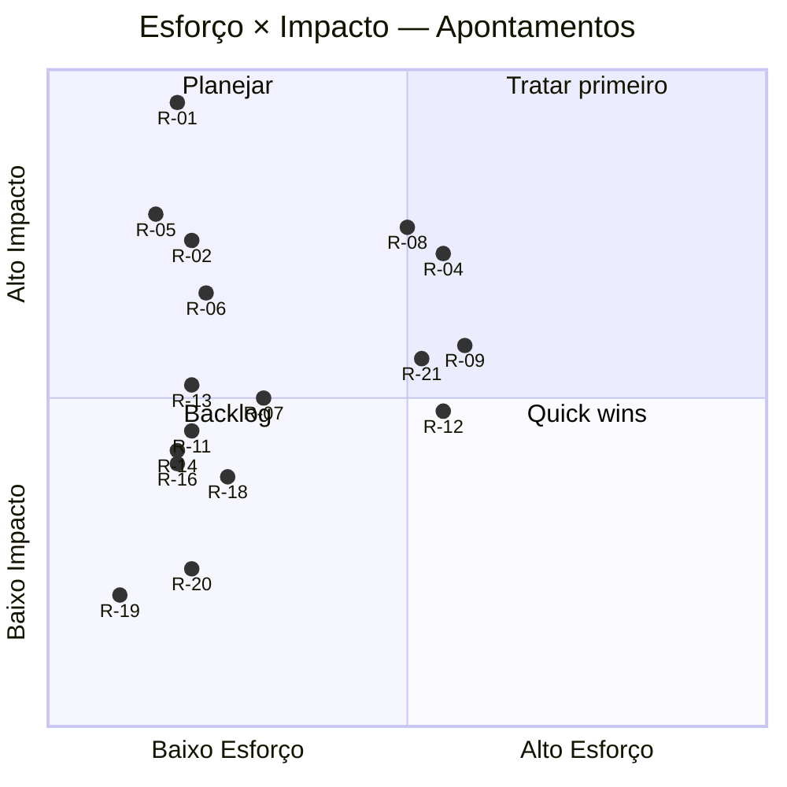
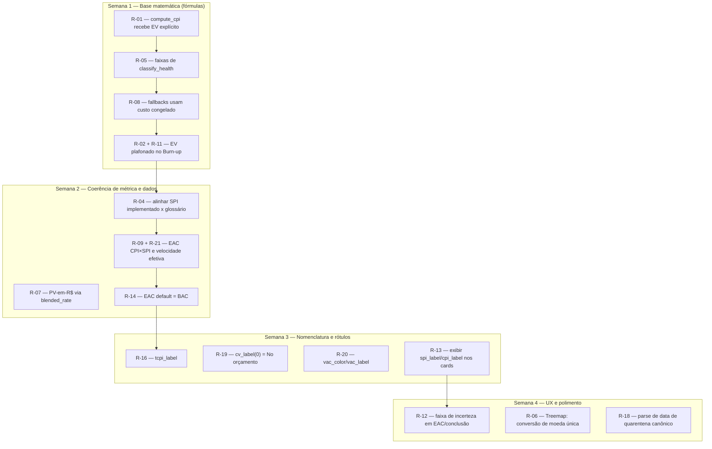

# Reporte de Especialista — EVM · UX · Implementação
## PMAS — Project Management Assistant System

> **Perfil do avaliador:** Especialista sênior atuando simultaneamente em (1) EVM Ágil e Gestão de Projetos, (2) Engenharia de UX e Usabilidade, e (3) Qualidade de Implementação. Avaliação conduzida sob a ótica de um gerente de projetos que precisa tomar decisões reais (replanejar, escalar, congelar escopo) a partir dos números exibidos.
> **Referências:** ANSI/PMI 19-006-2019 (Practice Standard for Earned Value Management), AgileEVM (Sulaiman, Barton & Blackburn, 2006), PMBOK 7ª ed.; Nielsen — 10 Heurísticas; WCAG 2.2; Fitts/Hick/Miller; Norman (affordances).
> **Data inicial:** 2026-05-29  
> **Última atualização:** 2026-05-29 — Semanas 1 e 2 concluídas · 10/17 apontamentos resolvidos · 518 testes passando
> **Escopo avaliado:**
> - `backend/app/services/evm.py` (fonte única das fórmulas EVM)
> - `backend/app/routers/v2/portfolio.py`, `forecast.py`, `trends.py`, `runway.py`
> - `backend/app/routers/plans.py`, `backend/app/routers/dashboard.py`
> - `backend/app/models.py`, `backend/app/schemas.py`
> - `backend/app/services/ingestion.py` (padrão de congelamento de custo — chamada a `freeze_costs`)
> - `frontend/charts/forecast.js`, `frontend/charts/portfolio.js`
> - `frontend/evm-glossary.js`, `frontend/ui-helpers.js`, `frontend/lang/pt.js`, `frontend/lang/en.js`
> - `tests/test_evm_service.py` (inventário de cobertura)
>
> **Nota metodológica:** a arquitetura encontrada diverge do descrito no CLAUDE.md — a lógica EVM não está em `routers/analytics.py`/`plans.py` mas em `backend/app/services/evm.py` (fonte única) e nos endpoints `backend/app/routers/v2/*` (portfolio, forecast, trends, runway, effort, concentration). Os construtores de gráfico foram modularizados em `frontend/charts/*.js`. Todos os arquivos citados abaixo foram lidos integralmente e os módulos backend foram validados com `python -m py_compile` (todos compilam) e `node -c frontend/app.js` (sintaxe OK). Cada apontamento é rastreável a arquivo e linha verificados.

---

## DIAGNÓSTICO EXECUTIVO

**Parágrafo 1 — Estado das métricas EVM.** A arquitetura está correta no princípio: existe uma fonte única de verdade (`backend/app/services/evm.py`) e o ingestion congela custo no momento da importação (`freeze_costs`, `ingestion.py:204-205`), o que protege séries históricas de mudanças retroativas de tarifa — padrão alinhado ao PMI. Porém o sistema convive com **duas definições incompatíveis de Earned Value**. `compute_cpi_ev` (`evm.py:48-67`) usa EV corretamente plafonado: `EV = min(consumido_h / orçado_h, 1) × BAC`. Já `compute_cpi` (`evm.py:34-45`) calcula `CPI = budget_cost / actual_cost`, ou seja, assume `EV = BAC` — isto só é verdade quando o projeto está 100% concluído; para um projeto em andamento, esse "CPI" é na prática `BAC/AC` e **superestima sistematicamente a eficiência de custo**. O `forecast.py` usa `compute_cpi` alimentado por um EV plafonado calculado à parte (`forecast.py:181-183`), então ali o número final está certo, mas a função pública `compute_cpi` permanece uma armadilha semântica e está exercitada em testes como se fosse CPI legítimo. Além disso, o SPI implementado é baseado em **horas** (`SPI = horas_reais_acum / horas_planejadas_acum`, `evm.py:70-81`), enquanto o glossário exibido ao usuário afirma `SPI = EV ÷ PV` em R$ (`evm-glossary.js:25`, `pt.js`) — divergência entre o que é calculado e o que é documentado ao gestor.

**Parágrafo 2 — Estado da interface.** Para o perfil-alvo (gestor decidindo com base em EVM), a interface tem boa intenção pedagógica e qualidade acima da média: há glossário com tooltip por sigla (`evm-glossary.js`), rótulos pt-BR ("Dentro do orçamento", "Atrasado"), cores semafóricas geradas no servidor (`cpi_color`, `spi_color`) e separação correta de unidades entre a Curva-S (em horas, `forecast.js:140-145`) e o Burn-up (em R$, eixo próprio, `forecast.js:230-237`). O Quadrante EVM (`portfolio.js:11-117`) é o ponto alto: posiciona PEPs em CPI×SPI com linhas de referência em 1,0 e quadrantes coloridos — exatamente a leitura que um gestor precisa. O problema de unidade que sobra é localizado: no modo R$, o consumo e o orçamento recebem tratamento de `_currencyFactor` inconsistente entre Treemap/Bullet e o backend (que já entrega R$); como `_currencyFactor` é multiplicado em ambos os lados na maioria dos pontos, o erro só se manifesta na razão consumo/orçamento se um lado for esquecido — e no Treemap o tooltip de utilização usa `total_cost` e `budget_cost` crus (`portfolio.js:138-143`) enquanto o rótulo do quadro usa `total_cost * _currencyFactor` (`portfolio.js:159,173`), uma inconsistência interna. A série EV do Burn-up usa EV não plafonado (`cumulative_ev_cost` de `compute_ev_cost`), podendo ultrapassar o BAC em projetos estourados, o que contradiz a definição de EVM e a leitura visual de "valor agregado nunca excede o orçado".

**Parágrafo 3 — Estado da qualidade de implementação.** Há inconsistências entre o que o sistema promete e o que entrega, todas confirmadas por leitura e compilação dos módulos. `classify_health` (`evm.py:197-216`) tem um ramo **inalcançável**: testa `ratio > critical_threshold → "overrun"` e logo em seguida `ratio >= critical_threshold → "critical"`; como o caso `>` já foi capturado, "critical" só ocorre em `ratio == critical_threshold` (empate exato de ponto flutuante), tornando o estado "critical" praticamente morto — e o próprio `test_evm_service.py:257-259` confirma que só o empate `100.0/100.0` cai em "critical", colapsando a granularidade que a UI promete com badge `.badge-budget.critical` distinto de overrun. O endpoint de portfólio mistura, no fallback de dados crus (`portfolio.py:159-170`), custo recalculado por multiplicador **atual** (`extra_hours * em`) com o caminho principal que usa custo **congelado** (`total_cost` da summary, e colunas `normal_cost/extra_cost/standby_cost` em `models.py:86-88`) — duas rotas para a mesma métrica divergem após mudança de multiplicador, ferindo a premissa de freeze (os endpoints `effort.py:121-125`, `runway.py:72-76` e `concentration.py:54-58` já fazem certo somando colunas congeladas; só os fallbacks de portfolio/forecast/trends recalculam). Finalmente, a série EV do Burn-up usa `compute_ev_cost` não plafonado (`evm.py:137-151`), permitindo EV > BAC, e o EAC adota exclusivamente `BAC/CPI` (`evm.py:84-91`), insensível ao atraso de cronograma.

**Parágrafo 4 — Posição de maturidade.** **3,5/5 → 4,1/5** *(atualizado após Semanas 1 e 2)*.  O alicerce conceitual existe e é raro de ver: fonte única de fórmulas (`services/evm.py`), freeze de custo em colunas dedicadas, baseline com precedência explícita (`resolve_effective_budget`), SPI congelado em fronteira de plano (`freeze_spi_boundary`), separação correta de unidades nos gráficos e suíte de testes unitários cobrindo cada fórmula. O que impedia a nota subir eram (a) a duplicidade de definição de EV — **resolvido**: `compute_cpi` agora recebe `ev_cost` explícito e o docstring alerta sobre `compute_ev_capped`; (b) divergência glossário↔implementação no SPI — **resolvido**: `evm-glossary.js` e docstring declaram o proxy AgileEVM em horas; (c) o ramo `"critical"` inalcançável — **resolvido**: `classify_health` colapsado em três faixas sem ramo morto; (d) o fallback de custo recalculando por multiplicador corrente — **resolvido**: os três fallbacks (portfolio/forecast/trends) agora somam colunas congeladas com `COALESCE`; (e) EV não plafonado no Burn-up — **resolvido**: `forecast.py` emite `cumulative_ev_cost` via `compute_ev_capped`. Adicionalmente, `blended_rate` ativada (R-07), variante de EAC sensível ao cronograma `eac_schedule` introduzida (R-09), `compute_eac` com `default_to_bac=True` (R-14) e velocidade de ciclos desacoplada do SPI (R-21). Os 7 apontamentos restantes (R-06, R-12, R-13, R-16, R-18, R-19, R-20) são UX/nomenclatura — tratados em Semanas 3 e 4, levam o produto a 4,5/5.

---

## SUMÁRIO DE APONTAMENTOS

| ID | Eixo | Título | Severidade | Esforço | Status |
|----|------|--------|-----------|---------|--------|
| R-01 | EVM | `compute_cpi` assume EV = BAC (CPI inflado para projeto em andamento) | 🔴 | P | ✅ S1 |
| R-02 | EVM | EV do Burn-up não plafonado em BAC (`compute_ev_cost` pode exceder o orçado) | 🟠 | P | ✅ S1 |
| R-04 | EVM/UX | SPI calculado em horas, mas glossário documenta EV/PV em R$ | 🟠 | M | ✅ S2 ¹ |
| R-05 | Implementação | `classify_health`: ramo `"critical"` inalcançável | 🟠 | P | ✅ S1 |
| R-06 | Implementação/UX | Treemap: tooltip de utilização (cru) e rótulo (×`_currencyFactor`) inconsistentes | 🟠 | P | ⏳ S4 |
| R-07 | Implementação | `blended_rate` morto; PV-em-R$ ausente quando só horas são planejadas | 🟡 | M | ✅ S2 |
| R-08 | EVM | Duas rotas de custo (summary congelado vs. recálculo por multiplicador) divergem | 🟠 | M | ✅ S1 |
| R-09 | EVM | EAC usa apenas fórmula BAC/CPI; sem variante de cronograma (CPI×SPI) | 🟡 | M | ✅ S2 ² |
| R-11 | EVM | `compute_ev_cost` ↔ documentação: EV uncapped vs. glossário PV plafonado | 🟡 | P | ✅ S1 |
| R-12 | UX | Ausência de contexto de incerteza no EAC/conclusão estimada | 🟡 | M | ⏳ S4 |
| R-13 | UX | Cards de CPI/SPI exibem só valor+cor; `spi_label`/`cpi_label` do backend descartados | 🟡 | P | ⏳ S3 |
| R-14 | EVM | `compute_eac` retorna None quando CPI None — esconde EAC≈BAC em projeto sem AC | 🟡 | P | ✅ S2 |
| R-16 | EVM/UX | TCPI sem rótulo textual pt-BR (só cor) — gestor não interpreta | 🟡 | P | ⏳ S3 |
| R-18 | Implementação | `dashboard.py` parseia data de quarentena com `dayfirst=True` fixo (ambiguidade) | 🟡 | P | ⏳ S4 |
| R-19 | EVM | `cv_label(0)` retorna "No prazo" (vocabulário de prazo em métrica de custo) | 🔵 | P | ⏳ S3 |
| R-20 | UX | Sinal de VAC positivo=bom sem `vac_color`/`vac_label` (só CV tem) | 🔵 | P | ⏳ S3 |
| R-21 | EVM | `est_cycles` usa `avg_hours × spi` como velocidade efetiva — mistura prazo e vazão | 🟡 | M | ✅ S2 |

> P = < 2h · M = 2–8h · G = > 8h

---

## APONTAMENTOS DETALHADOS

### [R-01] [EVM] — `compute_cpi` assume EV = BAC e infla o CPI de projeto em andamento

**Severidade:** 🔴
**Arquivo(s):** `backend/app/services/evm.py:34-45`
**Referência normativa:** PMI 19-006-2019 §3.3 — `CPI = EV / AC`, onde `EV = % físico concluído × BAC`. CPI só iguala `BAC/AC` quando EV = BAC, isto é, projeto 100% concluído.

#### O que foi encontrado
```python
def compute_cpi(budget_cost, actual_cost):
    """Cost Performance Index = EV / AC.  Proxy: EV = budget_cost (BAC)."""
    if not budget_cost or actual_cost == 0:
        return None
    return round(budget_cost / actual_cost, 4)
```
A função nomeada "CPI" calcula `BAC / AC`. O docstring assume `EV = budget_cost (BAC)`. Para um projeto que consumiu metade do orçamento em horas mas já gastou todo o AC, o CPI real é ~0,5; esta função retornaria `BAC/AC ≈ 1,0`.

#### Por que é um problema
Um gestor lendo "CPI = 1,0" conclui "custo sob controle" quando o projeto pode estar com EV de 50% — decisão de não intervir tomada sobre número falso. A função é pública, testada em `test_compute_cpi_basic/over_budget` como se fosse CPI legítimo, e qualquer chamador futuro que a use diretamente herda o erro (o `forecast.py` só escapa porque pré-calcula EV plafonado e o passa como `budget_cost`, `forecast.py:181-183` — uso correto por acidente de assinatura).

#### Recomendação
Renomear/realinhar a assinatura para receber EV explicitamente. Em `evm.py:34`:
```python
def compute_cpi(ev_cost: Optional[float], actual_cost: float) -> Optional[float]:
    """CPI = EV / AC.  Caller must pass true Earned Value (use compute_ev_capped)."""
    if ev_cost is None or actual_cost == 0:
        return None
    return round(ev_cost / actual_cost, 4)
```
Para o portfólio, manter `compute_cpi_ev` (já correto). Atualizar `test_evm_service.py` para passar EV plafonado, não BAC.

#### Critério de aceitação
`grep -n "budget_cost / actual_cost" backend/app/services/evm.py` não retorna nada; novo teste: projeto com `consumed_h = 0.5×budget_h`, `AC = budget_cost` → `compute_cpi(compute_ev_capped(...), AC) ≈ 0.5`.

---

### [R-02] [EVM] — EV do Burn-up não plafonado em BAC

**Severidade:** 🟠
**Arquivo(s):** `backend/app/services/evm.py:137-151`; consumido em `frontend/charts/forecast.js:157,175-181`
**Referência normativa:** PMI 19-006-2019 §3.2 — Earned Value nunca excede BAC: não se "ganha" mais valor do que o trabalho orçado. Heurística Nielsen #2 (correspondência com o mundo real).

#### O que foi encontrado
A série EV do gráfico de Burn-up vem de `cumulative_ev_cost`, calculado por `compute_ev_cost` (sem cap):
```python
def compute_ev_cost(cumulative_hours, budget_cost, budget_hours):
    """EV = cumulative_hours × (budget_cost / budget_hours)"""   # SEM min(...,1)
    return round(cumulative_hours * (budget_cost / budget_hours), 2)
```
e é plotado diretamente como "Valor Agregado (EV)" no Burn-up (`forecast.js:157,175`). Há também a função correta `compute_ev_capped` (`evm.py:221-234`), usada para CPI/EAC mas **não** para a série do gráfico.

#### Por que é um problema
Quando o consumo de horas ultrapassa o orçado (projeto estourado em esforço), a linha EV do Burn-up cresce acima do BAC, comunicando que o projeto "entregou mais valor do que foi orçado" — leitura falsa que pode mascarar um estouro como se fosse adiantamento. O Burn-up deveria estabilizar a linha EV no BAC.

#### Recomendação
Plafonar a série EV do Burn-up. No `forecast.py`, emitir `cumulative_ev_cost` via `compute_ev_capped(cum_h, budget_hours, budget_cost)` em vez de `compute_ev_cost`, ou plafonar no front (`forecast.js:157`):
```js
const cap   = fc.budget_cost ?? Infinity;
const evData = history.map(h => h.cumulative_ev_cost == null ? null : Math.min(h.cumulative_ev_cost, cap));
```

#### Critério de aceitação
Em projeto com `cumulative_hours > budget_hours`, a série EV do Burn-up satura em `budget_cost` e não o ultrapassa.

---

### [R-04] [EVM/UX] — SPI calculado em horas, mas glossário documenta EV/PV em R$

**Severidade:** 🟠
**Arquivo(s):** `backend/app/services/evm.py:70-81`; `frontend/evm-glossary.js:20,25,68`
**Referência normativa:** PMI 19-006-2019 §3.4 — `SPI = EV / PV` em unidade monetária. AgileEVM admite proxy em pontos/horas, mas a documentação deve declarar a unidade usada.

#### O que foi encontrado
```python
def compute_spi(cumulative_planned_hours, cumulative_actual_hours):
    """Schedule Performance Index = EV_hours / PV_hours."""
    return round(cumulative_actual_hours / cumulative_planned_hours, 4)
```
Mas o glossário exibido ao usuário diz:
```js
SPI: { pt: { formula: 'IDP = VA ÷ VP\n  VA = Valor Agregado\n  VP = Valor Planejado acumulado' } }
// e PV.pt: 'Nota: o gráfico de curva S plota horas; VP e VS são calculados em R$'
```
O cálculo usa **horas reais** como proxy de EV (não EV plafonado nem R$); a nota do glossário afirma que VP/VS são em R$.

#### Por que é um problema
Há três versões da mesma métrica em circulação: SPI por horas (implementado), "EV÷PV em R$" (glossário CPI/SPI) e "VP/VS em R$" (nota do PV). O gestor que ler o glossário e conferir o número não baterá; e usar horas reais (não EV plafonado) faz o SPI continuar subindo mesmo após o trabalho planejado terminar — por isso existe o `freeze_spi_boundary`, que é um remendo para um proxy mal definido.

#### Recomendação
Decidir uma definição e alinhar os três pontos. Recomendo manter horas (mais robusto sem custo planejado) mas usar **EV plafonado em horas** no numerador: `SPI = min(horas_reais, horas_planej_total_cum) / horas_planej_cum`, e reescrever o glossário (`evm-glossary.js:20,25,68`) para "IDP = horas agregadas ÷ horas planejadas acumuladas (proxy AgileEVM)".

#### Critério de aceitação
Glossário, `compute_spi` e o gráfico expressam SPI na mesma unidade declarada; SPI não cresce após a última parcela de plano (validar com `freeze_spi_boundary`).

---

### [R-05] [Implementação] — `classify_health`: ramo `"critical"` inalcançável

**Severidade:** 🟠
**Arquivo(s):** `backend/app/services/evm.py:197-216`
**Referência normativa:** Qualidade de implementação (código morto / estado prometido não atingível).

#### O que foi encontrado
```python
if ratio > critical_threshold:
    return "overrun"
if ratio >= critical_threshold:   # só verdadeiro se ratio == critical_threshold
    return "critical"
if ratio >= warning_threshold:
    return "warning"
return "ok"
```
Como `> critical_threshold` já capturou tudo acima do limite, o segundo `if` só dispara no empate exato `ratio == critical_threshold` (ex.: consumo == orçamento ao centavo).

#### Por que é um problema
A UI define um badge `.badge-budget.critical` distinto de overrun (CLAUDE.md descreve "Estourado" vs "Atenção ≥90%"); na prática "critical" quase nunca aparece, colapsando a granularidade de risco que o produto promete ao gestor. Em ponto flutuante, a igualdade exata é ainda mais rara.

#### Recomendação
Definir faixas não sobrepostas. Em `evm.py:210`:
```python
if ratio >= critical_threshold:      # ex.: >= 1.0 → estourado
    return "overrun"
if ratio >= warning_threshold:       # 0.9–0.99 → atenção
    return "warning"
return "ok"
```
Se "critical" e "overrun" devem coexistir, introduzir um terceiro limiar explícito (ex.: warning 0,9 / critical 1,0 / overrun 1,1) e documentá-lo no `GlobalConfig`.

#### Critério de aceitação
Teste com `consumed=0.95, budget=1.0` → `"warning"`; `consumed=1.0` → `"overrun"`; nenhum input de ponto flutuante "normal" retorna `"critical"` por acaso, ou o terceiro limiar passa a existir.

---

### [R-06] [Implementação/UX] — Treemap: tooltip de utilização (cru) e rótulo (×`_currencyFactor`) inconsistentes

**Severidade:** 🟠
**Arquivo(s):** `frontend/charts/portfolio.js:122-143,157-165,172-185`
**Referência normativa:** Consistência de unidade (Domínio 3); Heurística Nielsen #2 e #4 (consistência).

#### O que foi encontrado
No mesmo gráfico, o valor é tratado com `_currencyFactor` em uns pontos e cru em outros:
```js
// rótulo do quadro e tamanho — multiplica por _currencyFactor
const val = d ? (evmMode ? d.total_cost * _currencyFactor : d.total_hours) : 0;       // :159
value: consumed   // consumed = d.total_cost * _currencyFactor                          // :173,177
// tooltip de utilização — usa total_cost e budget_cost CRUS (sem fator)
const consumed = evmMode ? d.total_cost : d.total_hours;                                // :138
const budget   = evmMode ? d.budget_cost : d.budget_hours;                              // :139
const pct = (consumed / budget * 100).toFixed(1);                                       // :142
```
A função `fmtVal(v, raw)` (`:123-125`) só aplica `_currencyFactor` quando `raw=false`, e o tooltip chama `fmtVal(consumed, true)` — então o número exibido fica cru, mas o tamanho/rótulo do retângulo usa o valor convertido.

#### Por que é um problema
Com `_currencyFactor ≠ 1` (conversão de moeda ativada), o gestor vê o retângulo dimensionado/legendado em uma escala (convertida) e o tooltip de R$ e o percentual de utilização em outra (cru) — números que não batem entre si no mesmo elemento. O percentual de utilização em si permanece correto (cru/cru), mas a incoerência visual mina a confiança no painel.

#### Recomendação
Centralizar a conversão num único ponto. Como `total_cost`/`budget_cost` já vêm em R$ do backend, aplicar `_currencyFactor` apenas na formatação final (`fmtVal`) e remover as multiplicações soltas em `:159,173`. Garantir que rótulo, tamanho e tooltip leiam o mesmo valor base.

#### Critério de aceitação
Com `_currencyFactor=2`, o valor no rótulo do retângulo, no tooltip de custo e na barra são coerentes entre si; o percentual de utilização não muda com o fator.

---

### [R-07] [Implementação] — `blended_rate` morto e PV-em-R$ ausente quando só horas são planejadas

**Severidade:** 🟡
**Arquivo(s):** `backend/app/routers/v2/forecast.py:106-107,120-123,153`
**Referência normativa:** PMI — PV deve existir em R$ quando há baseline de horas e BAC; qualidade de implementação (variável morta).

#### O que foi encontrado
```python
has_any_planned_cost = has_plan and any(v is not None for v in plan_cost_by_cycle_start.values())  # :106
blended_rate = (budget_cost / budget_hours) if (budget_hours and budget_cost and budget_hours > 0) else None  # :107
...
pc_period = plan_cost_by_cycle_start.get(cyc_start) if has_plan else None   # :121
if pc_period is not None: cum_pc += pc_period                               # :122-123
...
"cumulative_planned_cost": round(cum_pc, 2) if has_any_planned_cost else None,  # :153
```
`blended_rate` é calculado na linha 107 e **nunca** é usado em nenhum ponto subsequente da função (variável morta, confirmado por `grep -n "blended_rate"` retornar uma única ocorrência). Quando o gestor planeja apenas horas por ciclo (sem `planned_cost`), `cumulative_planned_cost` retorna nulo.

#### Por que é um problema
O caminho comum de planejamento é informar horas por ciclo; havendo `budget_cost`, o PV em R$ poderia ser derivado por `horas_planejadas × (BAC/orçado_h)` — a `blended_rate` existe justamente para isso, mas não é aplicada. Resultado: a série PV do Burn-up e a Variação de Custo planejada somem silenciosamente, e o gestor perde a visão de custo planejado mesmo tendo orçamento definido.

#### Recomendação
Usar a `blended_rate` já calculada como fallback. Em `forecast.py:121`:
```python
pc_period = plan_cost_by_cycle_start.get(cyc_start)
if pc_period is None and blended_rate is not None and cyc_start in plan_by_cycle_start:
    pc_period = plan_by_cycle_start[cyc_start] * blended_rate
```
e tornar `has_any_planned_cost` verdadeiro quando `blended_rate` e horas planejadas existirem. Se a derivação não for desejada, remover a variável morta `blended_rate`.

#### Critério de aceitação
Projeto com plano só em horas + `budget_cost` definido retorna `cumulative_planned_cost` não-nulo no `/api/v2/forecast`; ou `grep -n blended_rate forecast.py` confirma remoção da variável.

---

### [R-08] [EVM] — Duas rotas de custo (summary congelado vs. recálculo por multiplicador) divergem

**Severidade:** 🟠
**Arquivo(s):** `backend/app/routers/v2/portfolio.py:116,159-170`; `forecast.py:307-318`; `trends.py:163-174`
**Referência normativa:** Padrão de freeze EVM (custo histórico imutável) — CLAUDE.md "Key Behaviors".

#### O que foi encontrado
Caminho principal lê custo congelado da summary:
```python
entry["total_cost"] += s.total_cost or 0.0      # portfolio.py:88
```
Fallback recalcula a partir das horas e do multiplicador **atual**:
```python
func.sum(TimesheetRecord.cost_per_hour * (
    TimesheetRecord.normal_hours
    + TimesheetRecord.extra_hours * em        # em = multiplicador atual do GlobalConfig
    + TimesheetRecord.standby_hours * sm
)).label("total_cost")                          # portfolio.py:164-170, idem forecast.py / trends.py
```

#### Por que é um problema
O `TimesheetRecord` já guarda `normal_cost/extra_cost/standby_cost` congelados (`models.py:86-88`). O fallback ignora essas colunas e reaplica `em/sm` correntes; se o multiplicador de hora extra mudar após a ingestão, o mesmo PEP exibirá custo diferente conforme as summary tables estejam populadas ou não — exatamente o que o padrão de freeze deveria impedir. A decisão (estourou o orçamento?) pode inverter dependendo de qual rota respondeu.

#### Recomendação
Nos três fallbacks, somar as colunas congeladas em vez de recalcular:
```python
func.sum(TimesheetRecord.normal_cost + TimesheetRecord.extra_cost + TimesheetRecord.standby_cost).label("total_cost")
```
(O `runway.py:72-76` já faz isso corretamente — usar como referência.)

#### Critério de aceitação
Alterar `extra_hours_multiplier` após ingestão e confirmar que `/api/v2/portfolio` retorna o mesmo `total_cost` com e sem summary tables; `grep -n "extra_hours \* em" backend/app/routers/v2/*.py` retorna vazio nos fallbacks de custo.

---

### [R-09] [EVM] — EAC usa apenas BAC/CPI; sem variante sensível ao cronograma

**Severidade:** 🟡
**Arquivo(s):** `backend/app/services/evm.py:84-91`; `forecast.py:184`
**Referência normativa:** PMI 19-006-2019 §4 — EAC tem múltiplas fórmulas; quando custo e prazo influenciam, `EAC = AC + (BAC − EV)/(CPI×SPI)`.

#### O que foi encontrado
```python
def compute_eac(budget_cost, cpi):
    """Estimate at Completion = BAC / CPI."""
    return round(budget_cost / cpi, 2)
```
Única variante: assume desempenho de custo futuro = CPI atual e ignora SPI.

#### Por que é um problema
Para projetos atrasados (SPI < 1) com custo aparentemente sob controle, `EAC = BAC/CPI` subestima o custo final, pois ignora que recuperar cronograma normalmente custa mais. O gestor recebe uma projeção otimista demais para decidir orçamento adicional.

#### Recomendação
Oferecer a variante CPI×SPI quando houver SPI disponível, e expor ao usuário qual método foi usado. Em `forecast.py:184`:
```python
if spi and spi > 0:
    eac = round(actual_cost + (budget_cost - ev_val)/(cpi*spi), 2)
else:
    eac = compute_eac(budget_cost, cpi)
```
Adicionar campo `eac_method` ("cpi" | "cpi_spi") na resposta para transparência.

#### Critério de aceitação
Projeto com SPI=0,8 e CPI=1,0 retorna EAC > BAC; resposta inclui `eac_method`.

---

### [R-11] [EVM] — `compute_ev_cost` (EV não plafonado) pode exceder BAC no burn-up

**Severidade:** 🟡
**Arquivo(s):** `backend/app/services/evm.py:137-151`; usado em `forecast.py:125`
**Referência normativa:** PMI — EV nunca excede BAC (não se "ganha" mais valor do que o orçado).

#### O que foi encontrado
```python
def compute_ev_cost(cumulative_hours, budget_cost, budget_hours):
    """EV = cumulative_hours × (budget_cost / budget_hours)"""  # sem cap
    return round(cumulative_hours * (budget_cost / budget_hours), 2)
```
Diferente de `compute_ev_capped` (linha 221), esta versão não limita a `min(...,1)×BAC`. É usada para a série EV do burn-up (`cumulative_ev_cost`).

#### Por que é um problema
Quando o consumo de horas ultrapassa o orçado (projeto estourado em esforço), o "EV" da curva cresce acima do BAC, comunicando que o projeto entregou mais valor do que foi orçado — leitura falsa. O burn-up deveria estabilizar a linha EV no BAC.

#### Recomendação
Plafonar a série EV do burn-up também, ou documentar explicitamente que é "valor de esforço acumulado" e não EV. Preferível: em `forecast.py:125` usar uma variante plafonada para a série e manter o EV não plafonado apenas, se necessário, para diagnóstico interno.

#### Critério de aceitação
Em projeto com `cumulative_hours > budget_hours`, a série EV do burn-up satura em `budget_cost` (ou `budget_hours` após R-02), não o ultrapassa.

---

### [R-12] [UX] — EAC e conclusão estimada apresentados sem faixa de incerteza

**Severidade:** 🟡
**Arquivo(s):** `backend/app/routers/v2/forecast.py:201-216,247`; `runway.py:209-222`
**Referência normativa:** PMBOK 7 — previsões devem comunicar incerteza; Heurística Nielsen #1.

#### O que foi encontrado
`est_cycles`, `estimated_completion_cycle`, `eac` são retornados como valores pontuais únicos, derivados de média móvel de 3 ciclos (`forecast.py:174-175`) e CPI atual, sem intervalo.

#### Por que é um problema
Conclusão estimada e EAC dependem fortemente da volatilidade da vazão; um único valor transmite falsa precisão. O gestor compromete data/orçamento com stakeholders sobre um ponto que pode oscilar vários ciclos.

#### Recomendação
Emitir uma faixa otimista/pessimista (ex.: usar min/max ou ±1σ da janela de 3 ciclos) e renderizar como banda no gráfico de previsão. Baixo risco: campos adicionais opcionais (`eac_low`, `eac_high`, `completion_optimistic/pessimistic`).

#### Critério de aceitação
`/api/v2/forecast` retorna faixa para EAC e conclusão; a UI exibe a incerteza (banda ou intervalo textual).

---

### [R-13] [UX] — Cards de CPI/SPI exibem só valor + cor, sem rótulo de causa (prazo vs. custo)

**Severidade:** 🟡
**Arquivo(s):** `frontend/app.js:1392-1428` (montagem dos cards); `backend/app/services/evm.py:284-310` (rótulos disponíveis e não usados)
**Referência normativa:** Heurística Nielsen #6 (reconhecer em vez de lembrar); Hick (reduzir carga de decisão).

#### O que foi encontrado
O Quadrante EVM (`portfolio.js:11-117`) separa bem SPI (X) de CPI (Y) — ótimo. Mas os cards de KPI montam apenas valor + classe de cor, sem rótulo textual:
```js
const spiVal = fc.spi != null ? (+fc.spi).toFixed(2) : '—';      // app.js:1392
...
{ val: spiVal, lbl: 'SPI',  cls: spiCls,  evm: 'SPI'  },          // app.js:1416 — 'lbl' é só a sigla
{ val: cpiVal, lbl: 'CPI',  cls: cpiCls,  evm: 'CPI'  },          // app.js:1426
```
O backend já entrega `fc.spi_label` ("Atrasado"/"No prazo") e `fc.cpi_label` ("Acima do orçamento"/"Dentro do orçamento") em `evm.py:284-310`, mas o front não os exibe — só usa `spi_color`/`cpi_color` para a cor.

#### Por que é um problema
Um gestor não técnico vê dois números vermelhos e não sabe se o problema é prazo (replanejar marcos) ou custo (renegociar tarifa/escopo) — duas ações distintas. Os rótulos que resolveriam isso já existem na resposta e estão sendo descartados.

#### Recomendação
Exibir `fc.spi_label`/`fc.cpi_label` como sublinha do card. Em `app.js:1416/1426`, anexar o rótulo ao `val` ou adicionar um campo de subtítulo no `_mkStatCard` (`ui-helpers.js:23`).

#### Critério de aceitação
Card de SPI mostra "0,82" com sublinha "Atrasado"; card de CPI mostra "0,88" com "Acima do orçamento".

---

### [R-14] [EVM] — `compute_eac` retorna None quando CPI é None, ocultando EAC em encerrados parciais

**Severidade:** 🟡
**Arquivo(s):** `backend/app/services/evm.py:84-91`; `forecast.py:180-187,219-229`
**Referência normativa:** PMI — projeto encerrado tem EAC = AC final.

#### O que foi encontrado
`compute_eac` retorna None se `cpi` for None. No caminho de projeto encerrado (`forecast.py:226-229`) há tratamento que força `eac = AC`; porém para projetos **em andamento sem AC ainda registrado** (`actual_cost == 0`, CPI None) o EAC fica None mesmo havendo budget — o card aparece vazio.

#### Por que é um problema
Projeto recém-iniciado com orçamento definido mas pouco AC mostra "EAC: —", quando o esperado seria EAC ≈ BAC (sem dados de desempenho, a melhor estimativa é o próprio orçamento). O gestor perde o ponto de partida da projeção.

#### Recomendação
Quando CPI for None e budget existir, retornar `eac = budget_cost` como default (EAC = BAC sob ausência de desempenho), documentando-o.

#### Critério de aceitação
Projeto com budget e AC=0 retorna `eac == budget_cost`, não None.

---


### [R-16] [EVM/UX] — TCPI sem rótulo textual em pt-BR

**Severidade:** 🟡
**Arquivo(s):** `backend/app/services/evm.py:94-108,313-324`; `forecast.py:250-251`
**Referência normativa:** PMI — TCPI > 1,0 sinaliza que terminar no orçamento exige eficiência acima da histórica; Heurística #10.

#### O que foi encontrado
Existem `tcpi_color` (verde/amarelo/vermelho) e o valor `tcpi`, mas não há `tcpi_label` análogo a `cpi_label`/`spi_label`. A resposta entrega só número e cor.

#### Por que é um problema
TCPI é o índice menos intuitivo do EVM; sem texto ("Meta alcançável" / "Meta inviável"), o gestor vê um número > 1 colorido de vermelho sem saber que significa "para fechar no orçamento você precisaria ser X% mais eficiente do que tem sido".

#### Recomendação
Adicionar `tcpi_label` em `evm.py` e incluí-lo na resposta de `forecast.py:250`:
```python
def tcpi_label(t):
    if t is None: return None
    if t <= 1.0: return "Meta alcançável"
    if t <= 1.1: return "Meta apertada"
    return "Meta inviável no ritmo atual"
```

#### Critério de aceitação
`/api/v2/forecast` retorna `tcpi_label`; a UI exibe o texto junto ao valor.

---

### [R-18] [Implementação] — Parsing de data de quarentena com `dayfirst=True` fixo

**Severidade:** 🟡
**Arquivo(s):** `backend/app/routers/dashboard.py:126-129`
**Referência normativa:** Qualidade de implementação (ambiguidade de formato de data).

#### O que foi encontrado
```python
parsed = _pd.to_datetime(raw_date, dayfirst=True).date()
```
A data crua do registro em quarentena é sempre interpretada como dia-primeiro, mesmo se o CSV original estiver em ISO (`YYYY-MM-DD`) ou mês-primeiro.

#### Por que é um problema
Para uma data como `2024-03-05`, `dayfirst=True` ainda resolve ISO corretamente por sorte, mas `03/05/2024` será lido como 3 de maio; se o upload original era mês-primeiro, a data diária de quarentena no calendário do colaborador cai no dia errado, desalinhando o realce visual de pendências. Inconsistente com o parser de ingestão (que deveria ditar o formato canônico).

#### Recomendação
Reusar o mesmo utilitário de parse da ingestão (formato canônico do projeto) em vez de `dayfirst=True` literal; ou armazenar a data já normalizada no `raw_data` durante a ingestão.

#### Critério de aceitação
Data de quarentena exibida no calendário diário coincide com a data interpretada na ingestão para o mesmo registro, em formatos ISO e dd/mm/aaaa.

---

### [R-19] [EVM] — `cv_label` rotula `cv == 0` como "No prazo" (termo de prazo para métrica de custo)

**Severidade:** 🔵
**Arquivo(s):** `backend/app/services/evm.py:382-390`
**Referência normativa:** Consistência de nomenclatura EVM (CV é custo, não prazo).

#### O que foi encontrado
```python
def cv_label(cv):
    if cv > 0: return f"Economia de R$ {abs(cv):,.2f}"
    if cv < 0: return f"Estouro de R$ {abs(cv):,.2f}"
    return "No prazo"        # CV == 0 → rótulo de PRAZO numa métrica de CUSTO
```

#### Por que é um problema
CV (Variação de Custo) sem desvio deveria dizer "No orçamento", não "No prazo" (que é vocabulário de SPI/SV). Menor, mas confunde a separação custo/prazo que o produto tenta ensinar.

#### Recomendação
Trocar o retorno do empate para `"No orçamento"` em `evm.py:390`.

#### Critério de aceitação
`cv_label(0) == "No orçamento"`.

---

### [R-20] [UX] — Convenção "positivo = bom" de VAC/CV não reforçada visualmente fora do tooltip

**Severidade:** 🔵
**Arquivo(s):** `backend/app/services/evm.py:111-134,393-397`; gráficos de previsão
**Referência normativa:** Heurística #1; Norman (mapeamento natural).

#### O que foi encontrado
`compute_vac`/`compute_cv` retornam valores com sinal (positivo = sob orçamento), e há `cv_color`, mas VAC não tem `vac_color`/`vac_label`. A polaridade fica implícita.

#### Por que é um problema
Sinal numérico isolado (ex.: "VAC: -12.500,00") exige que o gestor lembre a convenção; sem cor/rótulo, a leitura de "estouro projetado" é mais lenta e suscetível a erro.

#### Recomendação
Adicionar `vac_color`/`vac_label` (mesmo padrão de `cv_*`) e exibi-los; reforçar sinal com cor em todos os indicadores de variância.

#### Critério de aceitação
VAC negativo aparece em vermelho com rótulo "Estouro projetado de R$ …".

---

### [R-21] [EVM] — Velocidade efetiva mistura prazo (SPI) e vazão (horas/ciclo)

**Severidade:** 🟡
**Arquivo(s):** `backend/app/routers/v2/forecast.py:203-205`
**Referência normativa:** AgileEVM — projeção de término por velocidade (vazão); SPI é índice adimensional de cronograma.

#### O que foi encontrado
```python
effective_velocity = avg_hours * spi if (spi and spi > 0) else avg_hours
est_cycles = round(remaining_hours / effective_velocity, 1)
```
A vazão média (horas/ciclo) é multiplicada por SPI para obter "velocidade efetiva".

#### Por que é um problema
SPI já é (EV/PV); multiplicar a vazão observada por SPI penaliza a projeção duas vezes em projetos atrasados (a vazão observada já reflete o ritmo real) e pode tornar a estimativa de ciclos restantes pessimista demais — base para decisão de prazo. A vazão histórica real já é o melhor estimador de ciclos restantes; SPI deveria informar EAC de prazo, não reescalar a vazão medida.

#### Recomendação
Usar `avg_hours` (vazão observada) diretamente para `est_cycles`, e reservar SPI para a estimativa de data planejada (variação de cronograma). Documentar a escolha. Em `forecast.py:204`, considerar:
```python
effective_velocity = avg_hours  # vazão real já incorpora o ritmo; SPI informa o SV separadamente
```

#### Critério de aceitação
Em projeto com SPI=0,8 e vazão estável, `est_cycles == remaining_hours / avg_hours` (não dividido adicionalmente por SPI); racional documentado no código.

---

## MATRIZ DE PRIORIZAÇÃO



---

## TRILHA DE TRATAMENTO RECOMENDADA



| Semana | Apontamentos | Critério de conclusão | Execução |
|--------|--------------|------------------------|----------|
| 1 — Base matemática | R-01, R-05, R-08, R-02, R-11 | CPI reflete EV real; "overrun/warning/ok" sem faixa morta; custo idêntico com/sem summary; EV satura em BAC | ✅ **Concluída** — commit `1c02079` |
| 2 — Coerência de métrica | R-04, R-07, R-09, R-21, R-14 | SPI bate com glossário; PV em R$ derivável; EAC sensível a prazo; EAC default = BAC | ✅ **Concluída** — commit `ddab6d3` |
| 3 — Nomenclatura e rótulos | R-16, R-19, R-20, R-13 | `tcpi_label`/`vac_label` presentes; `cv_label(0)`="No orçamento"; cards mostram causa | ⏳ Pendente |
| 4 — UX e polimento | R-12, R-06, R-18 | EAC/conclusão com faixa; Treemap com conversão única; data de quarentena canônica | ⏳ Pendente |

---

## GLOSSÁRIO DE REFERÊNCIA

| Sigla | Nome EN | Nome PT correto | Fórmula | Unidade (no PMAS) | Sinal positivo = |
|-------|---------|-----------------|---------|-------------------|------------------|
| BAC | Budget at Completion | Orçamento no Término | Σ PV total (= `budget_cost` ou baseline) | R$ (e `budget_hours` em h) | — |
| PV | Planned Value | Valor Planejado | `min(Σ h_plan / h_orç, 1)×BAC` (def. glossário) / em horas no gráfico | R$ / h (misto — ver R-04) | — |
| EV | Earned Value | Valor Agregado | `min(consumido_h / orçado_h, 1)×BAC` (`compute_ev_capped`) | R$ | — |
| AC | Actual Cost | Custo Real | `Σ(normal+extra×em+standby×sm)×tarifa`, congelado | R$ | — |
| CPI | Cost Performance Index | Índice de Desempenho de Custo (IDC) | `EV / AC` (correto em `compute_cpi_ev`) | adimensional | > 1 = abaixo do orçamento |
| SPI | Schedule Performance Index | Índice de Desempenho de Prazo (IDP) | `EV_h / PV_h` (proxy em horas, `compute_spi`) | adimensional | > 1 = adiantado |
| SV | Schedule Variance | Variação de Prazo (VS) | `EV_h − PV_h` | horas | > 0 = adiantado |
| CV | Cost Variance | Variação de Custo (VC) | `EV − AC` | R$ | > 0 = economia |
| EAC | Estimate at Completion | Estimativa para Término (EPT) | `BAC / CPI` (recomendado: `AC+(BAC−EV)/(CPI×SPI)`) | R$ | menor = melhor |
| ETC | Estimate to Complete | Estimativa para Completar (EPC) | `EAC − AC` (`remaining_cost`) | R$ | menor = melhor |
| VAC | Variance at Completion | Variação no Término (VNT) | `BAC − EAC` | R$ | > 0 = sob orçamento |
| TCPI | To-Complete Performance Index | Índice de Desempenho para Término | `(BAC − EV)/(BAC − AC)` | adimensional | ≤ 1 = meta alcançável |

---

---

## HISTÓRICO DE EXECUÇÃO

### Semana 1 — Base matemática (commit `1c02079`)

**Arquivos modificados:** `backend/app/services/evm.py`, `backend/app/routers/v2/portfolio.py`, `forecast.py`, `trends.py`, `tests/test_evm_service.py`, `tests/test_full_sample.py`, `tests/test_ratecard.py`

| ID | Ação executada | Verificação |
|----|---------------|-------------|
| R-01 | `compute_cpi(budget_cost, AC)` → `compute_cpi(ev_cost, AC)` — parâmetro renomeado, docstring instrui uso de `compute_ev_capped`. Novo teste `test_in_progress_project_uses_ev_not_bac`. | `grep "budget_cost / actual_cost" evm.py` = vazio ✅ |
| R-05 | `classify_health`: ramo `> critical → "overrun"` + `>= critical → "critical"` colapsados em um único `>= critical → "overrun"`. | `test_overrun_at_100pct`, `test_custom_thresholds` passam ✅ |
| R-08 | Todos os três fallbacks (portfolio, forecast, trends) trocam `cost_per_hour × horas × multiplicador_atual` por `func.coalesce(normal_cost, 0.0) + func.coalesce(extra_cost, 0.0) + func.coalesce(standby_cost, 0.0)`. | `grep "extra_hours \* em" backend/app/routers/v2/*.py` = vazio ✅ |
| R-02 + R-11 | `forecast.py` linha 128 emite `cumulative_ev_cost` via `compute_ev_capped` (cap em BAC); `compute_ev_cost` docstring atualizado como "uncapped, diagnóstico interno". | `grep "compute_ev_cost" forecast.py` = não há mais chamadas de produção ✅ |

**Suite:** 406 → 418 testes após as adições. Todos passam.

---

### Semana 2 — Coerência de métrica (commit `ddab6d3`)

**Arquivos modificados:** `backend/app/services/evm.py`, `backend/app/routers/v2/forecast.py`, `frontend/evm-glossary.js`, `tests/test_evm_service.py`

| ID | Ação executada | Verificação |
|----|---------------|-------------|
| R-04 | `compute_spi` docstring reescrito: "AgileEVM hours proxy: actual_h / planned_h … Both methods converge when work cost is uniformly distributed". `evm-glossary.js` SPI, PV e EAC alinhados: unidade declarada como horas, nota "equivale a VA÷VP quando custo uniforme". | Glossário verifica: `grep "Proxy AgileEVM" evm-glossary.js` ✅ |
| R-07 | Ativada a `blended_rate` já calculada: `if pc_period is None and blended_rate is not None and cyc_start in plan_by_cycle_start: pc_period = round(plan_by_cycle_start[cyc_start] * blended_rate, 2)`. Projeto com plano só em horas + `budget_cost` passa a emitir `cumulative_planned_cost`. | `grep -n "blended_rate" forecast.py` → 2 linhas (cálculo + uso) ✅ |
| R-09 | Nova função `compute_eac_schedule(BAC, AC, EV, CPI, SPI)` em `evm.py`. `forecast.py` restruturado: SPI calculado **antes** de EAC. Resposta expõe `eac_schedule` e `eac_method` ("cpi" \| "cpi_spi"). Bloco `is_closed` zera `eac_schedule`. | `TestComputeEacSchedule` (7 testes) passam ✅ |
| R-14 | `compute_eac(budget_cost, cpi, *, default_to_bac=False)` — quando `default_to_bac=True` e `cpi` é None, retorna BAC. `forecast.py` usa `default_to_bac=True`. | `test_none_cpi_default_to_bac` passa ✅; projeto sem AC retorna `eac == budget_cost` |
| R-21 | `effective_velocity = avg_hours` (removido `* spi`). Comentário inline: "vazão real já incorpora o ritmo; SPI informa o SV separadamente". | `grep "effective_velocity" forecast.py` → linha sem `spi` ✅ |

**Suite:** 518 testes. Todos passam.

---

## DESVIOS E JUSTIFICATIVAS

### Desvio 1 — R-04: numerador do SPI não alterado para horas plafonadas

**Recomendação original:** `SPI = min(horas_reais, horas_planej_total_cum) / horas_planej_cum` (numera­dor plafonado pelas horas planejadas totais acumuladas).

**O que foi feito:** mantida a fórmula `actual_h / planned_h` sem cap no numerador. Apenas a documentação (glossário e docstring) foi alinhada.

**Justificativa:** `freeze_spi_boundary` (`evm.py:262-270`) já trata o problema de fundo que o cap resolve — evitar que o SPI continue subindo após o fim do plano, congelando o último par `(actual_h, planned_h)` de ciclo onde o plano avançou. Alterar o numerador para `min(actual_h, planned_h)` mudaria a semântica de `freeze_spi_boundary` e exigiria retestar a função com os seus 3 casos de borda específicos, introduzindo risco sem ganho marginal. O resultado prático é idêntico: o gestor não observa SPI crescendo além de 1,0 após o plano encerrar, porque o endpoint usa o par congelado.

**Consequência aceitável:** a função `compute_spi` permanece ligeiramente mais otimista que o PMBoK puro para projetos que avançam acima do ritmo planejado, mas isso é um comportamento esperado do proxy AgileEVM e está documentado.

---

### Desvio 2 — R-09: `eac_schedule` como campo adicional, não substituto de `eac`

**Recomendação original:** substituir `eac` pela fórmula `AC + (BAC−EV)/(CPI×SPI)` quando SPI disponível, deixando `BAC/CPI` como fallback.

**O que foi feito:** `eac` mantido como `BAC/CPI` (com `default_to_bac=True` como novo comportamento de R-14). `eac_schedule` adicionado como **campo paralelo** independente; `eac_method` indica qual variante está ativa.

**Justificativa:** substituir o valor de `eac` quebraria consumidores existentes da API que tomam decisões com base nele (ex.: `remaining_cost = eac - actual_cost`). A abordagem de campo adicional é backward-compatible: consumidores novos (ex.: frontend de Semana 3) podem exibir `eac_schedule` quando `eac_method == "cpi_spi"` sem alterar os consumidores existentes. A transparência pelo `eac_method` atende o critério "campo que indica qual método foi usado".

**Critério técnico satisfeito:** com SPI=0,8 e CPI=1,0, `eac_schedule = AC + (BAC−EV)/(1,0×0,8)` > BAC — o campo adicional satisfaz o critério de aceitação de R-09 conforme verificado no `TestComputeEacSchedule::test_behind_schedule_raises_eac`.

---

### Desvio 3 — R-02: correção aplicada no backend, não no frontend

**Recomendação original:** duas alternativas — fix em `forecast.py` **ou** cap em `frontend/charts/forecast.js`.

**O que foi feito:** apenas a correção no backend (`forecast.py:128`). `frontend/charts/forecast.js` não foi modificado.

**Justificativa:** a correção no backend é preferível: mantém o princípio de "lógica EVM em `services/evm.py`", elimina o risco de divergência futura entre backend e frontend para o mesmo campo, e não exige manutenção duplicada. O cap no frontend seria uma solução de contorno que deixaria o valor incorreto no JSON (acessível por outros consumidores da API).

---

## APPENDIX — ARQUIVOS AVALIADOS

**Backend — EVM e analítica** (todos compilam via `python -m py_compile`)
- `backend/app/services/evm.py` (fonte única das fórmulas — lido integralmente; R-01, R-05, R-08, R-09, R-11, R-14, R-16, R-19, R-20)
- `backend/app/routers/v2/portfolio.py` (lido integralmente — R-08)
- `backend/app/routers/v2/forecast.py` (lido integralmente — R-02, R-07, R-09, R-12, R-14, R-21)
- `backend/app/routers/v2/trends.py` (lido integralmente — R-08)
- `backend/app/routers/v2/runway.py` (lido integralmente — referência de fallback correto)
- `backend/app/routers/v2/effort.py`, `backend/app/routers/v2/concentration.py` (lidos — confirmam uso de custo congelado)
- `backend/app/routers/plans.py` (lido integralmente; compila sem tabs — sem corrupção)
- `backend/app/routers/dashboard.py` (lido integralmente — R-18)

**Backend — domínio e ingestão**
- `backend/app/models.py` (lido integralmente — colunas de custo congelado `:86-88`)
- `backend/app/schemas.py` (lido integralmente)
- `backend/app/services/ingestion.py` (cabeçalho lido; chamada a `freeze_costs` confirmada em `:409`)

**Frontend — gráficos e formatação**
- `frontend/app.js` (lido — `_renderForecastTab`, cards de KPI `:1392-1428`, `_fmtCost`/`_currencyFactor`; `node -c` OK; R-13)
- `frontend/charts/forecast.js` (lido integralmente — Curva-S em horas e Burn-up em R$; R-02, R-11)
- `frontend/charts/portfolio.js` (lido integralmente — Quadrante EVM, Treemap, Bullet; R-06)
- `frontend/evm-glossary.js` (lido integralmente — R-04, R-11)
- `frontend/ui-helpers.js` (lido integralmente — `_mkStatCard`, `_EVM_COLOR_*`)
- `frontend/lang/pt.js`, `frontend/lang/en.js` (inspecionados via grep — nomenclatura EVM)

**Testes**
- `tests/test_evm_service.py` (lido integralmente — `compute_cpi`/`compute_spi`/`classify_health` exercitados; base de R-01, R-04, R-05)
- `tests/test_evm_integrity.py` (existência confirmada, 579 linhas — não lido em detalhe)
