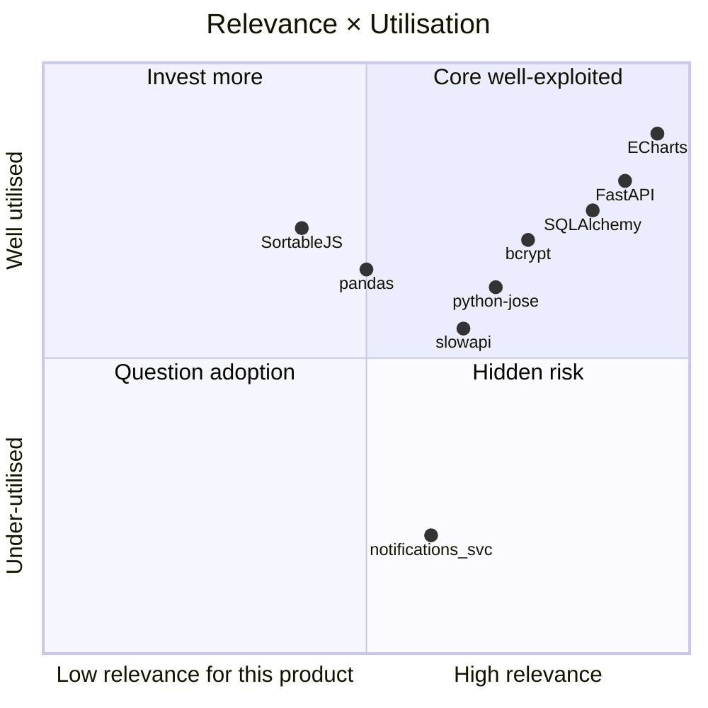
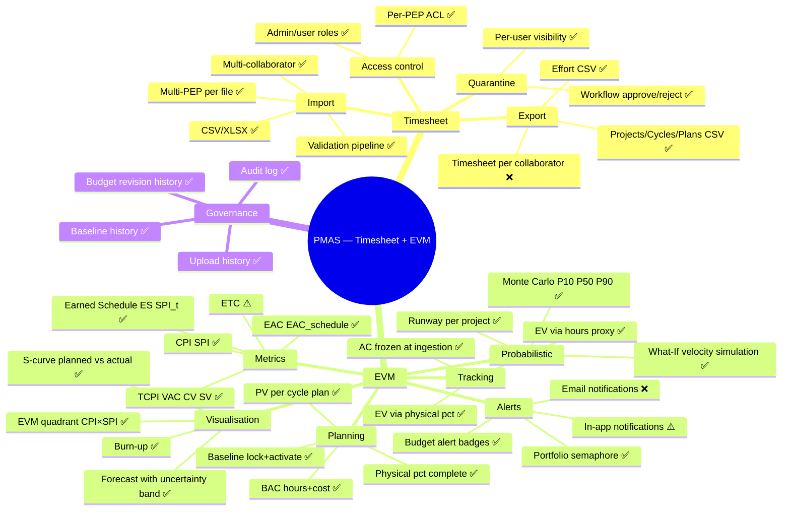
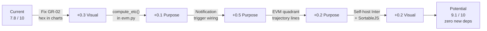
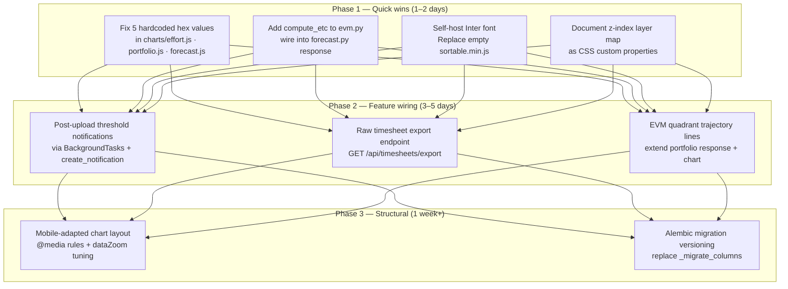

# Integrity Report — Visual · Stack · Purpose
## PMAS — Project Management Assistant System

> **Dimensions evaluated:** Visual Integrity · Stack Utilisation · Purpose Fulfilment
> **Stack detected:** Python 3.11+ · FastAPI · SQLAlchemy · SQLite · Vanilla JS · Apache ECharts 5 · pandas · python-jose · bcrypt · slowapi · SortableJS
> **Date:** 2026-06-06

---

## EXECUTIVE SUMMARY

```
┌─────────────────────────────────────────────────────────┐
│  VISUAL INTEGRITY          [███████░░░]  7.5 / 10        │
│  STACK UTILISATION         [███████░░░]  7.5 / 10        │
│  PURPOSE FULFILMENT        [████████░░]  8.5 / 10        │
│                                                          │
│  OVERALL SCORE             [███████░░░]  7.8 / 10        │
└─────────────────────────────────────────────────────────┘
```

**Paragraph 1 — Product coherence:**
PMAS operates as a coherent product. The visual language is deliberate (deep navy + sky-blue palette, a CSS token system with 30+ variables, uniform `0.15s` micro-transitions across all interactive elements, all 20 modals carrying correct ARIA attributes). The backend stack and frontend stack are aligned with the product's purpose: a PMO dashboard that ingests timesheets and surfaces EVM analytics. Each layer does exactly what it was chosen for, without fighting the tools. There are no orphaned abstractions, abandoned libraries, or phantom APIs.

**Paragraph 2 — Largest gap:**
The notification subsystem is architecturally present but functionally shallow. The `Notification` model, `notifications_svc.py`, the router, and the frontend bell icon all exist — but notifications are created in exactly one place: the upload outcome message in `upload.py`. The `budget-alerts` endpoint exists and is surfaced in My Area, yet budget threshold crossings never trigger a `Notification` row. A user will miss a CPI < 0.9 event unless they happen to open the alerts card. The infrastructure is there; the wiring from trigger events to notification creation is missing.

**Paragraph 3 — Potential vs. reality:**
ECharts is the clearest example of a well-exploited library — SVG renderer, custom theme registration, `brush`/`brushSelected`, `dataZoom`, `markLine`/`markArea` for uncertainty bands, `echarts.connect()` for cross-chart highlight, and a shared `_toolbox()` wrapper that standardises save/restore across every chart. What's left on the table is narrow: `universalTransition` (for animated type switches) and the absence of a mobile-adapted chart layout. The EVM engine is the other standout: 25 exported functions covering every PMBoK metric including Earned Schedule, uncertainty bands, and probabilistic completion. The gap is equally narrow — ETC is displayed as a label on `remaining_cost` (correct value) but there is no `compute_etc()` function in `evm.py`; it is derived inline in the frontend. That violates GR-2 in spirit, even if the value is trivially `EAC − AC`.

---

## 1. VISUAL INTEGRITY

### 1.1 Design System — Current State

| Element | Systematised | Consistently Applied | Gap |
|---|---|---|---|
| Colour palette | ✅ 30+ CSS tokens in `:root` | ⚠️ ~59 hardcoded hex values escape outside token block | See GR-01 through GR-03 |
| Typography | ✅ Single family (`--font-family`), cascade via `inherit` | ✅ Applied everywhere | `Inter` requires Google Fonts CDN — see GR-04 |
| Spacing | ⚠️ `--density-spacing` token exists, `--radius` / `--radius-lg` | ⚠️ 40+ distinct rem values in CSS; no step-scale enforced | Density tokens override at runtime but spacing values are ad-hoc |
| Borders and radii | ✅ `--radius`, `--radius-lg`, `--border`, `--border-hi` | ✅ Mostly applied | Minor exceptions |
| Shadows and elevation | ✅ `--shadow`, `--shadow-sm`, `--glow` as tokens | ⚠️ Additional `rgba` shadows inline in components | Shadows outside tokens in ~12 places |
| Icons | ✅ Unicode emoji + entity icons (no external icon lib) | ✅ Consistent | Self-contained |
| Animations | ✅ `transition: all 0.15s` pattern uniform | ✅ Applied consistently | No keyframe animations |
| Chart theme | ✅ `echarts.registerTheme('pmas', ...)` + `_getPalette()` | ⚠️ 5 hardcoded hex in chart files | See GR-02 |
| Responsiveness | ⚠️ 4 breakpoints (480/640/768/800px) | ⚠️ Only peripheral sections adapt; charts/tables do not reflow | See GR-05 |
| Dark mode | ✅ Dark-only by design; admin-configurable via theme presets | N/A | Intentional |

### 1.2 Component Consistency

```mermaid
graph TD
    subgraph "Consistent — token-first"
        B[Buttons .btn family]
        I[Form inputs .form-input]
        M[Modals — all 20 with role=dialog + aria-labelledby]
        T[Tables — uniform .data-table pattern]
        P[Pagination — centralised _makePaginator]
        S[Semaphore — semantic colour-mix tokens]
        BG[Badges — .badge-status / .badge-budget]
    end
    subgraph "Inconsistent — hardcoded escapes"
        C1["charts/effort.js: #8b5cf6 standby fallback"]
        C2["charts/portfolio.js: #f1f5f9 label text (×2)"]
        C3["charts/forecast.js: #94a3b8 planned line (×2), #0ea5e9 / #a78bfa fallbacks"]
        C4["app.js: #2ecc71 / #60a5fa upload outcome chips"]
        C5[".stat-card.blue .val — #3b82f6 not a token]
    end
```

### 1.3 Visual Findings

---

#### GR-01 — Hardcoded hex in upload outcome chips

**Severity:** Low
**File:** `frontend/app.js:427,431`

**What was found:**
```js
chip('Inseridos',   json.records_inserted, '#2ecc71') +
chip('Infos',       json.info_count,       '#60a5fa');
```
Upload result chips use literal hex for green and blue — outside the token system.

**Visual impact:** Chips resist theme preset overrides. If an admin configures a different primary colour, these chips stay `#2ecc71` / `#60a5fa`.

**Recommendation:**
```js
chip('Inseridos',   json.records_inserted, _cssVar('--green'))   +
chip('Infos',       json.info_count,       _cssVar('--primary'));
```

---

#### GR-02 — Hardcoded hex in chart series colours (GR-3 violation)

**Severity:** Medium
**Files:**
- `frontend/charts/effort.js:127` — `'#8b5cf6'` (standby bar fallback)
- `frontend/charts/portfolio.js:202,330` — `'#f1f5f9'` (label text)
- `frontend/charts/forecast.js:54,88` — `'#0ea5e9'`, `'#a78bfa'` (series fallbacks)
- `frontend/charts/forecast.js:175,176` — `'#94a3b8'` (planned line)

**What was found:**
```js
// effort.js:127
_barSerie(_t('ch.standby_h'), standbys, _pal[2] || '#8b5cf6'),

// forecast.js:175-176
lineStyle: { color: '#94a3b8', width: 2, type: 'dashed' },
itemStyle: { color: '#94a3b8' },
```

**Visual impact:** Planned-line and standby-bar colours are immune to theme preset changes. Minor but technically violates GR-3.

**Recommendation:**
```js
// effort.js:127
_barSerie(_t('ch.standby_h'), standbys, _pal[2] || _cssVar('--violet')),

// forecast.js:175-176
lineStyle: { color: _cssVar('--text-3'), width: 2, type: 'dashed' },
itemStyle: { color: _cssVar('--text-3') },
```

---

#### GR-03 — z-index layer system undocumented

**Severity:** Low
**File:** `frontend/style.css` (lines 83, 148, 203, 233, 278, 421, 645, 682, 760, 1134, 1290)

**What was found:**

| Layer | z-index | Purpose |
|---|---|---|
| 1, 2 | Local stacking inside cards | |
| 90 | Analytics sticky sub-nav | |
| 100 | Main header | |
| 200 | Dropdown menus (×2) | |
| 400 | Modal backdrop | |
| 8000 | Notification toast | |
| 9999 | Loading overlay | |
| 10000 | Theme modal | **Collision risk** |

The jump from 400 (modal backdrop) to 8000 (toast) is unexplained. The theme modal (`10000`) sits above the loading overlay (`9999`), which means a loading spinner would not cover the theme modal — probably unintentional.

**Recommendation:** Define named z-index tokens and document the intentional layer order.

---

#### GR-04 — Inter font requires Google Fonts CDN

**Severity:** Low
**File:** `frontend/index.html:5-7`

**What was found:**
```html
<link rel="preconnect" href="https://fonts.googleapis.com">
<link rel="stylesheet" href="https://fonts.googleapis.com/css2?family=Inter:wght@400;500;600;700;800&display=swap">
```

Air-gapped / offline deployments lose Inter and fall back to `system-ui`. For a self-hosted PMO tool (as described in README) this is a real deployment concern. PMAS already self-hosts ECharts; Inter should follow the same pattern.

**Recommendation:** Download the Inter subset and serve from `static/fonts/` or use `@font-face` with a local path.

---

#### GR-05 — No mobile chart layout

**Severity:** Medium
**File:** `frontend/style.css` (no chart-specific breakpoints)

**What was found:**
The four breakpoints (480/640/768/800px) adapt the navigation, the My Area grid, and the login card — but the analytics charts, the allocation matrix, and the Projects/Cycles tables have no mobile-specific treatment. Below 800px, a user on a tablet sees the full-width chart that tries to render 12+ bars or a treemap, typically resulting in an illegible, over-compressed visualisation.

**Recommendation:** At minimum, add a `@media (max-width: 768px)` rule that sets the analytics sub-tab charts to a minimum height of `280px` and enables `dataZoom`-equivalent scrolling.

---

## 2. STACK UTILISATION

### 2.1 Utilisation Map



### 2.2 Library Analysis

---

#### ECharts 5 — Utilisation: 88%

**Purpose:** Interactive, themeable data visualisation
**Impact:** High

**What is being used:**
- SVG renderer for accessibility and print quality
- Custom `pmas` theme registration with admin-configurable palette
- `_toolbox()` wrapper — save-as-image, data-view, restore, magicType across all charts
- `dataZoom` in effort chart (cap at 15 rows, scroll for more) and forecast chart
- `brush`/`brushSelected` event for multi-project selection in EVM scatter
- `markLine` for EAC reference line in S-curve and burn-up
- `markArea` for uncertainty band in S-curve
- `emphasis.focus: 'series'` throughout for hover focus
- `echarts.connect()` for cross-chart synchronised highlighting (forecast ↔ burn-up, cost ↔ trends)
- Per-chart `_disposeTabCharts()` lifecycle + single `ResizeObserver` for responsiveness

**Available but not used:**
- `universalTransition`: would enable smooth animated transitions when switching between "stacked" and "tiled" modes in the magicType toolbar — currently snaps instead of morphs
- `graphic` component: could render the "EAC" and "Budget" labels directly on chart canvas instead of separate DOM cards
- `dataset` API: current approach uses raw `data` arrays per series; `dataset` would enable column-oriented data binding and easier cross-series reuse

**Anti-patterns detected:**
- None significant. Three chart files (`effort.js`, `portfolio.js`, `forecast.js`) correctly consume `_getPalette()` for all series colours. The minor hardcoded hex escapes are documented under GR-02.

**Recommendation:** Exploit → continue.

---

#### FastAPI — Utilisation: 80%

**Purpose:** Async HTTP API with automatic OpenAPI docs
**Impact:** High

**What is being used:**
- Pydantic v2 schema validation on all I/O models
- Dependency injection (`Depends(get_db)`, `Depends(get_current_user)`, `Depends(require_admin)`)
- `StreamingResponse` for CSV exports
- `lifespan` context manager for DB initialisation
- `CORSMiddleware` with explicit origin list
- Rate limiting via slowapi middleware

**Available but not used:**
- `BackgroundTasks`: budget threshold notifications should be dispatched as background tasks after a successful upload, without blocking the HTTP response
- Response caching headers (ETags, `Cache-Control`) on read-only analytics endpoints — currently all analytics re-query the DB on every call
- `/health` and `/ready` endpoints (documented as known P2 gap)

**Anti-patterns detected:**
- Sync SQLAlchemy engine with async FastAPI routes. FastAPI wraps sync dependencies in `run_in_threadpool` automatically, so it works — but under concurrent load this creates a thread-pool bottleneck. Migrating to `aiosqlite` + async SQLAlchemy would remove the bottleneck for zero API change.

**Recommendation:** Maintain → add `BackgroundTasks` for threshold notifications.

---

#### SQLAlchemy 2.0 — Utilisation: 75%

**Purpose:** ORM + query builder + connection management
**Impact:** High

**What is being used:**
- 20 ORM model classes with explicit relationships and `cascade="all, delete-orphan"`
- `PRAGMA journal_mode=WAL` via `event.listens_for(engine, "connect")`
- `text()` for safe raw SQL in `_migrate_columns()`
- `StaticPool` for in-memory test databases
- `select()` / `query()` / aggregations throughout

**Available but not used:**
- `@event.listens_for(Model, "before_insert")` / `"after_update"` hooks for auto-timestamping `AuditLog` entries. Currently all audit inserts are explicit in every router.
- `hybrid_property` for computed attributes like `total_cost` on `TimesheetRecord`
- Async engine (`create_async_engine` + `aiosqlite`) — would align with FastAPI's async model

**Anti-patterns detected:**
- `_migrate_columns()` in `database.py` is a 115-line block of `ALTER TABLE` statements checked via `PRAGMA table_info`. This pattern works but has no rollback mechanism and no version tracking. Under concurrent startup it could race. Migration tooling (Alembic) would be more robust.

**Recommendation:** Maintain → consider Alembic for migrations if the schema continues to evolve.

---

#### pandas — Utilisation: 65%

**Purpose:** Tabular data parsing and manipulation
**Impact:** Medium (scoped to ingestion)

**What is being used:**
- `pd.read_csv()` / `pd.read_excel()` for file parsing
- Column existence checks (`set(df.columns)`)
- Row iteration for the ingestion pipeline

**What is available but not used:**
- `df.groupby()` for aggregate rule computation (Phase 3 daily/weekly totals are computed with plain Python dicts instead)
- `pd.to_datetime()` with format inference (ingestion uses a manual `_parse_date()` function)
- Vectorised operations — all per-row processing uses explicit Python loops

**Assessment:** The scoped use is intentional and appropriate. SQL aggregation is faster than pandas for analytics, and the current Python-loop approach in ingestion is readable and debuggable. The only improvement worth considering is replacing the manual `_parse_date()` with `pd.to_datetime(errors='coerce')` to centralise date parsing.

**Recommendation:** Maintain as-is.

---

#### notifications_svc — Utilisation: 20%

**Purpose:** In-app notification delivery to users
**Impact:** Medium (high potential, low actual)

**What is being used:**
- `create_notification()` called in exactly one place: `upload.py:97`, for upload outcome messages

**What is available but not used:**
- Budget threshold crossing (`classify_health` returns `"overrun"` or `"warning"`) → notify project manager
- Quarantine creation → notify the uploading user that N rows need review
- Baseline activation → notify users with access to that PEP

**Anti-patterns detected:**
```python
# upload.py:97 — only call site
create_notification(db, current_user.id, message, level=level)
```
The notification is created for the *uploader* about their own upload — which they already know about. The value proposition of notifications is alerting users about events they didn't directly trigger (threshold crossings, quarantine review requests, baseline changes).

**Recommendation:** Wire into `services/evm.py`'s `classify_health()` post-upload to create threshold notifications for project-access holders.

---

#### slowapi — Utilisation: 55%

**Purpose:** Request rate limiting
**Impact:** Medium

**What is being used:**
- `30/minute` on `POST /api/token` (login)
- `10/minute` on `POST /api/upload-timesheet`

**Not applied to:**
- CRUD write routes (`/projects`, `/cycles`, `/users`, `/rate-cards`)
- Admin bulk operations (`/quarantine/{id}/approve`)
- Export endpoints (CSV generation under load)

**Recommendation:** Add at least `100/minute` on CRUD write routes. Not critical for a self-hosted tool, but documented as a known risk.

---

#### SortableJS — Utilisation: 72% — **flag**

**Purpose:** Drag-to-reorder for chart layout and validation rules
**Impact:** Low (UX feature only)

**What is being used:**
- `Sortable.create()` for chart layout drag-to-reorder (My Area)
- `Sortable.create()` for validation rule reordering (Admin)

**Finding:**
```
/home/user/PMAS/frontend/sortable.min.js  →  0 bytes (empty file)
```
SortableJS is loaded from a CDN (`cdn.jsdelivr.net`) with an SRI hash. The empty local `sortable.min.js` file creates a false impression of self-hosting. If the CDN is unreachable, drag-to-reorder silently breaks (the code guards with `typeof Sortable === 'undefined'`).

**Recommendation:** Either download and serve the actual bundle locally (matching ECharts' self-hosting), or remove the empty placeholder file to avoid confusion.

---

## 3. PURPOSE FULFILMENT

### 3.1 Feature Map



### 3.2 Completeness Table

| Feature | Status | Implementation | Gap |
|---|---|---|---|
| **TIMESHEET** | | | |
| CSV/XLSX import | ✅ | `services/ingestion.py` — 6-phase | — |
| Multi-collaborator / multi-PEP | ✅ | Full pipeline | — |
| Billing cycle management | ✅ | `routers/cycles.py` | — |
| Quarantine + review workflow | ✅ | `routers/quarantine.py` | — |
| Upload history with counts | ✅ | `UploadSession` model | — |
| Configurable validation rules | ✅ | `ValidationRule` + rule engine | — |
| Per-user PEP access control | ✅ | `UserProjectAccess` enforced on all v2 | — |
| Timesheet export per collaborator | ❌ | Not implemented | `GET /api/v2/effort` gives aggregates, not raw rows |
| Manual entry / edit | ❌ By design (GR-1) | Upstream source of truth | No gap — intentional |
| **EVM** | | | |
| BAC (hours + cost) | ✅ | `Project.budget_hours / budget_cost` | — |
| PV per cycle | ✅ | `ProjectCyclePlan.planned_hours / planned_cost` | — |
| Physical % Complete | ✅ | `ProjectCyclePlan.physical_pct` overrides EV | — |
| EV (hours proxy + physical override) | ✅ | `compute_ev_capped()` in `evm.py` | — |
| AC (frozen at ingestion) | ✅ | EVM freeze pattern | — |
| CPI / SPI | ✅ | `compute_cpi()` / `compute_spi()` | — |
| EAC (standard + schedule-sensitive) | ✅ | `compute_eac()` / `compute_eac_schedule()` | — |
| TCPI / VAC / CV / SV | ✅ | All in `evm.py` | — |
| ETC | ⚠️ | Shown as `remaining_cost = eac - actual_cost`; no `compute_etc()` in evm.py | Minor GR-2 violation in spirit |
| Earned Schedule (ES, SPI(t), SV(t), IEAC(t)) | ✅ | `compute_earned_schedule()` and siblings | — |
| Budget baseline lock/activate | ✅ | `routers/baselines.py` | — |
| Budget revision history | ✅ | `BudgetRevision` + sparkline endpoint | — |
| S-curve (planned vs actual) | ✅ | `charts/forecast.js` | — |
| Burn-up chart | ✅ | `_buildBurnUpOption()` in `charts/forecast.js` | — |
| Burndown | ❌ N/A | Not applicable for billing-cycle PMO context | Intentional |
| EVM quadrant (CPI × SPI) | ⚠️ | Scatter chart in Portfolio tab | Shows only latest point per project; no trajectory |
| Uncertainty band | ✅ | `est_cycles_optimistic/pessimistic`, `eac_low/eac_high` | — |
| Monte Carlo P10/P50/P90 | ✅ | `v2/monte_carlo.py` | — |
| What-If velocity simulation | ✅ | `v2/simulate.py` | — |
| Runway per project | ✅ | `v2/runway.py` | — |
| Budget alerts (visual) | ✅ | `_buildBudgetCell()` badge in Projects table | — |
| In-app notifications | ⚠️ | Created only from upload events | Not triggered by threshold crossings |
| Email notifications | ❌ | No SMTP/email infrastructure | No gap for current self-hosted scope |
| **GOVERNANCE** | | | |
| Audit log (full CRUD history) | ✅ | `AuditLog` model, all routers write entries | — |
| Upload history transparency | ✅ | `UploadSession` with row counts by outcome | — |
| User management | ✅ | `routers/users.py` with admin/user roles | — |
| Per-user preferences (drag-to-reorder) | ✅ | `UserPreference` + SortableJS | — |
| Theme presets (admin configurable) | ✅ | `ThemePreset` CRUD | — |
| Logo upload | ✅ | `POST /api/theme/logo` | — |

### 3.3 Purpose Gaps

---

#### GP-01 — ETC not expressed as `compute_etc()` in evm.py (GR-2 spirit violation)

**User impact:** None visible — the value displayed is correct (`EAC − AC`).

**Current state:**
```js
// app.js:1528 — ETC card value derived inline in frontend
{ val: fc.remaining_cost != null ? fmtR(Math.max(0, fc.remaining_cost)) : '—', lbl: 'ETC', ... }
```
`remaining_cost` = `eac - actual_cost` is computed in `v2/forecast.py`, not via a named function in `evm.py`. Technically the computation lives in the backend, but it has no canonical function — it's an anonymous difference.

**Path to fix:**
```python
# evm.py — add one function
def compute_etc(eac: Optional[float], actual_cost: Optional[float]) -> Optional[float]:
    if eac is None or actual_cost is None:
        return None
    return round(eac - actual_cost, 2)
```
Then call it in `forecast.py` and surface as `etc` in the JSON response.

**Effort:** P · **Priority:** Low

---

#### GP-02 — Notification system wired to upload only

**User impact:** A project manager with a CPI of 0.82 (critical overrun) receives no in-app alert unless they actively open the Budget Alerts card in My Area.

**Current state:** `create_notification()` called in one place — `upload.py:97` — for the uploading user only, about their own upload results.

**Path to fix (all within current stack):**
1. After `ingest_file()` completes, call `classify_health()` for each PEP touched by the upload
2. For PEPs crossing the warning or critical threshold, query `UserProjectAccess` to find all users with access
3. Call `create_notification(db, user_id, message, level='warning'|'error')` for each
4. Wrap in `BackgroundTasks` to avoid blocking the HTTP response

**Effort:** M · **Priority:** High

---

#### GP-03 — No raw timesheet export per collaborator

**User impact:** An admin cannot download the source rows for a specific collaborator + period — only the aggregated effort totals (hours + cost). If a collaborator disputes a cost calculation, there is no "show me the raw records" export.

**Current state:** `GET /api/v2/effort` returns aggregates grouped by collaborator. `TimesheetRecord` rows are accessible via the DB but have no export endpoint.

**Path to fix:**
```
GET /api/timesheets/export?collaborator_id=&cycle_id=&pep_wbs=
→ StreamingResponse CSV of TimesheetRecord rows for the filter
```

**Effort:** S · **Priority:** Medium

---

#### GP-04 — EVM quadrant shows final state only, not trajectory

**User impact:** The CPI×SPI scatter in Portfolio Health shows where each project *is today*, not whether it is improving or deteriorating. A project moving from CPI=1.1 to CPI=0.95 over three cycles looks identical to one that has been at CPI=0.95 for twelve cycles.

**Current state:** `v2/portfolio.py` returns the current `cpi`/`spi` per PEP. The `history` field in `v2/forecast.py` has per-cycle CPI and SPI, but the scatter chart does not use it.

**Path to fix:** Add a `trajectory` array (last 3 points) to the portfolio response and render it as faded connector lines in `charts/portfolio.js`. No new endpoint needed — only a response field extension.

**Effort:** M · **Priority:** Medium

---

## 4. INTERSECTIONS — WHERE ALL THREE DIMENSIONS MEET


| Problem | Visual axis | Stack axis | Purpose axis |
|---|---|---|---|
| Notification system barely wired | Bell icon renders but rarely fires | `notifications_svc` exists but has only one call site | Users miss budget threshold events (GP-02) |
| No mobile chart layout | Charts render illegibly below 800px (GR-05) | ECharts `dataZoom` / `grid` options not tuned for small viewport | Analytics are the core value prop; mobile users cannot access them |
| ETC derived inline instead of via `compute_etc()` | ETC card looks like any other KPI card | `evm.py` has 25 functions but not this one | Violates GR-2 in spirit; ETC is a defined PMBoK metric |
| SortableJS empty placeholder | No visual gap | CDN dependency masked by empty local file | Drag-to-reorder silently breaks offline |

---

## 5. UNLOCKABLE POTENTIAL

Everything below uses only the current stack — no new dependencies.



| Action | Dimension gain | Effort | New dependency? |
|---|---|---|---|
| Fix 5 hardcoded hex in chart files | Visual +0.3 | P | No |
| Add `compute_etc()` to evm.py | Purpose +0.1 | P | No |
| Wire threshold notifications post-upload | Purpose +0.5 | M | No (FastAPI BackgroundTasks) |
| EVM quadrant trajectory connector lines | Purpose +0.2 | M | No (ECharts already loaded) |
| Self-host Inter + remove empty sortable.min.js | Visual +0.2 | P | No |
| Raw timesheet export endpoint | Purpose +0.2 | S | No (StreamingResponse pattern exists) |
| Document z-index layers as CSS variables | Visual +0.1 | P | No |

---

## 6. EVOLUTION PLAN



| Phase | Items | Expected score |
|---|---|---|
| 1 — Quick wins | GR-01, GR-02, GP-03-etc, SortableJS, z-index | Overall: 7.8 → 8.3 |
| 2 — Feature wiring | GP-02, GP-03, GP-04 | Overall: 8.3 → 8.8 |
| 3 — Structural | GR-05, Alembic | Overall: 8.8 → 9.1 |

---

## APPENDIX A — DETECTED STACK

| Category | Library / Tool | Version | Utilisation |
|---|---|---|---|
| Backend framework | FastAPI | ≥0.111.0 | 80% |
| ORM | SQLAlchemy | ≥2.0.0 | 75% |
| Database | SQLite (embedded) | WAL mode | 100% |
| Auth | python-jose + bcrypt | ≥3.3.0 / ≥4.0.0 | 65% |
| Rate limiting | slowapi | ≥0.1.9 | 55% |
| File parsing | pandas + openpyxl | ≥2.0.0 / ≥3.1.0 | 65% |
| Charts | Apache ECharts 5 | local bundle | 88% |
| Drag-and-drop | SortableJS | 1.15.6 (CDN) | 72% |
| Fonts | Google Fonts — Inter | CDN | ⚠️ external |
| i18n | Custom `_t()` system | — | 100% |
| Test runner (backend) | pytest + httpx | — | — |
| Test runner (frontend) | vitest + playwright | — | — |

## APPENDIX B — FILES EVALUATED

| Category | Files |
|---|---|
| Backend models | `backend/app/models.py` (20 models) |
| EVM service | `backend/app/services/evm.py` (25 functions) |
| Ingestion | `backend/app/services/ingestion.py` |
| Notifications | `backend/app/services/notifications_svc.py`, `routers/notifications.py` |
| Analytics routers | `routers/v2/` (11 files) |
| Frontend core | `frontend/app.js` (5487 lines), `frontend/index.html` (1848 lines) |
| Design system | `frontend/style.css` (1424 lines) |
| Chart modules | `charts/effort.js`, `charts/portfolio.js`, `charts/forecast.js` |
| CRUD modules | `crud/cycles.js`, `crud/projects.js` |
| Helpers | `ui-helpers.js`, `multiselect.js`, `evm-glossary.js` |
