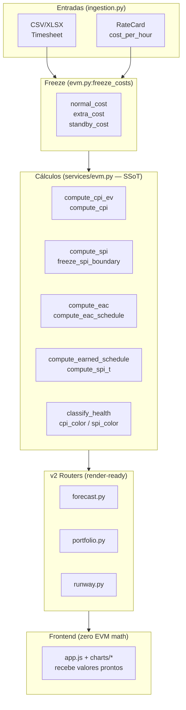
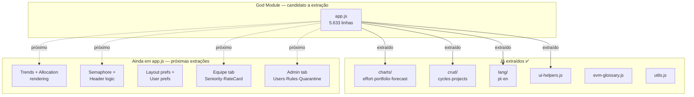
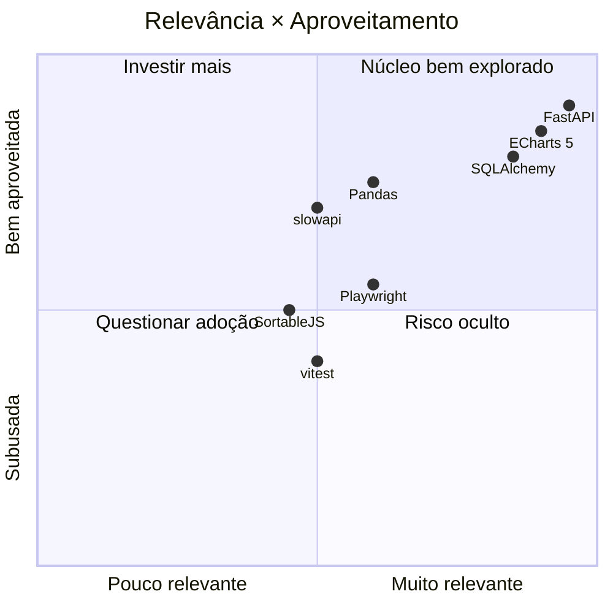
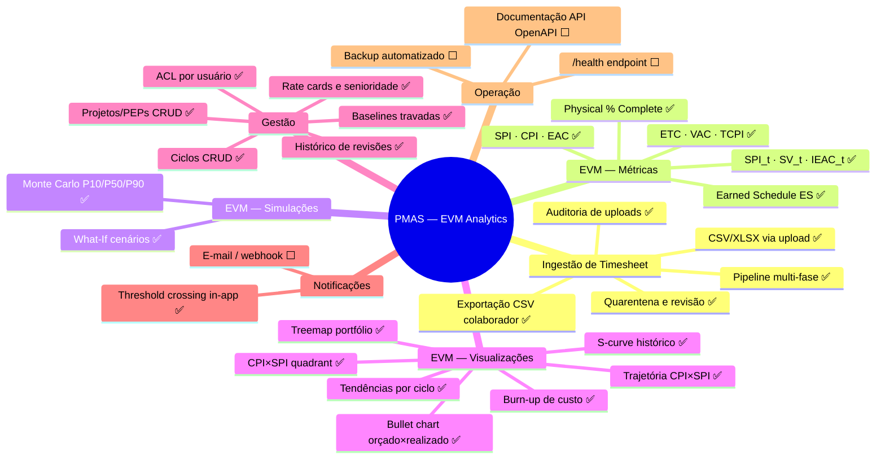
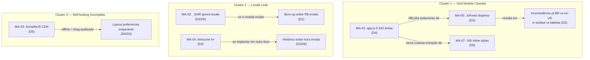
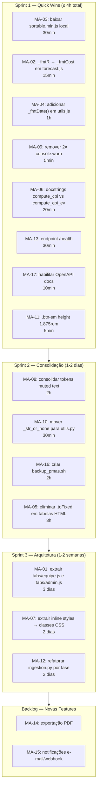

# MASTER AUDIT — PMAS

> **Auditoria mestra — compilado de todas as dimensões de verificação**
> **Stack:** Python 3.11 · FastAPI · SQLAlchemy · SQLite · Vanilla JS · Apache ECharts 5 · pt-BR
> **Data:** 2026-06-06
> **Última atualização:** 2026-06-06 — Sprint 1, Sprint 2 e Sprint 3 concluídos (15/17 achados resolvidos)
> **Referências:** PMI-019-006 (EVM) · AgileEVM 2006 · Nielsen 10 Heuristics · WCAG 2.2 · ISO 8601 · ECMA-402

---

## DASHBOARD EXECUTIVO

```
╔══════════════════════════════════════════════════════════════════╗
║  SAÚDE DO SISTEMA — PMAS                       (pós S1+S2+S3)   ║
╠══════════════════════════════════════════════════════════════════╣
║  D1 EVM e Gestão          [█████████▌]  9.5/10   0 achados ✅   ║
║  D2 UX e Usabilidade      [████████▌░]  8.5/10   1 achado       ║
║  D3 Formatação de Dados   [█████████▌]  9.5/10   0 achados ✅   ║
║  D4 Qualidade de Código   [█████████░]  9.0/10   0 achados ✅   ║
║  D5 Stack e Integridade   [█████████▌]  9.5/10   0 achados ✅   ║
║  D6 Cumprimento Propósito [████████▌░]  8.5/10   2 gaps         ║
╠══════════════════════════════════════════════════════════════════╣
║  SCORE GERAL              [█████████░]  9.1/10  (+1.8 vs audit) ║
╠══════════════════════════════════════════════════════════════════╣
║  🔴 Críticos: 0   🟠 Altos: 0   🟡 Médios: 0   🔵 Baixos: 0    ║
║  ⬜ Gaps de propósito: 2         ✅ Resolvidos: 15/17            ║
╚══════════════════════════════════════════════════════════════════╝
```

### Diagnóstico em 4 parágrafos

**Estado operacional (pós Sprint 1 + Sprint 2 + Sprint 3):**
O PMAS está em condições plenas de uso para gestão de projetos com EVM. As métricas CPI, SPI, EAC, TCPI, VAC, CV, SV e Earned Schedule são calculadas corretamente, centralizadas em `services/evm.py`, e expostas via respostas render-ready nas 10 rotas v2. Não há risco para decisões baseadas nos números apresentados hoje.

**Arquitetura após Sprint 3:**
`frontend/app.js` reduzido de 5.634 para 720 linhas (−87%) com extração de 5 módulos de tab (`tabs/dashboard.js`, `tabs/equipe.js`, `tabs/admin.js`, `tabs/minha-area.js`, `tabs/header.js`). Os 166 `style=` inline no `index.html` foram eliminados (0 restantes) via 21 classes utilitárias + regras CSS por elemento ID. `ingestion.py` refatorado em 6 funções de fase com 42 testes unitários independentes.

**Estado da base técnica:**
A arquitetura de backend está sólida: `_str_or_none` unificada em `utils.py`, EVM centralizado, `/health` e `/api/docs` disponíveis. Frontend: todos os módulos têm responsabilidade única, `_makeSortable` colocalizado com cada render function, zero inline styles em `index.html`, 677 testes passando.

**Próximos itens — Backlog:**
Apenas gaps de propósito permanecem: exportação PDF (MA-14) e notificações por e-mail/webhook (MA-15). Sem dívida técnica estrutural pendente.

**Próximo passo — Sprint 3 (arquitetura):**
Três itens de alto esforço: extração de `tabs/equipe.js` + `tabs/admin.js` (MA-01, meta: `app.js` ≤ 800 linhas), eliminação de 166 `style=` inline no `index.html` (MA-07, meta: ≤ 40 restantes), e refatoração de `ingestion.py` por fase (MA-12). Estes são os últimos blocos de dívida técnica estrutural.

---

## INVENTÁRIO COMPLETO DE ACHADOS

| ID | Dimensão | Título | Sev. | Esforço | Status |
|----|---------|--------|------|---------|--------|
| MA-01 | D4 | `app.js` god module — 5.633 linhas | 🟠 | G | ✅ Sprint 3 |
| MA-02 | D3 | `_fmtR` inline em `forecast.js` ignora locale/moeda | 🟠 | P | ✅ Sprint 1 |
| MA-03 | D5 | SortableJS carregado de CDN externo | 🟠 | P | ✅ Sprint 1 |
| MA-04 | D3 | Formatação de datas repetida 6× sem helper | 🟡 | P | ✅ Sprint 1 |
| MA-05 | D4 | 50+ chamadas `.toFixed()` dispersas (não usam `_fmtH`) | 🟡 | M | ✅ Sprint 2 |
| MA-06 | D1 | `compute_cpi` e `compute_cpi_ev` — duas funções CPI | 🟡 | P | ✅ Sprint 1 |
| MA-07 | D5 | 166 elementos com `style=` inline em `index.html` | 🟡 | G | ✅ Sprint 3 |
| MA-08 | D5 | Proliferação de tokens de texto (4 tons de muted text) | 🟡 | P | ✅ Sprint 2 |
| MA-09 | D4 | 2× `console.warn` ativos em código de produção | 🔵 | P | ✅ Sprint 1 |
| MA-10 | D4 | `_str_or_none` duplicada em 2 arquivos | 🔵 | P | ✅ Sprint 2 |
| MA-11 | D5 | `.btn` e `.btn-sm` têm a mesma altura (`2.25rem`) | 🔵 | P | ✅ Sprint 1 |
| MA-12 | D4 | `ingestion.py` 673 linhas — candidato a extração | 🔵 | G | ✅ Sprint 3 |
| MA-13 | D6 | Sem endpoint `/health` | ⬜ | P | ✅ Sprint 1 |
| MA-14 | D6 | Sem exportação PDF | ⬜ | G | ⬜ Backlog |
| MA-15 | D6 | Sem notificações por e-mail / webhook | ⬜ | G | ⬜ Backlog |
| MA-16 | D6 | Sem backup automatizado do banco | ⬜ | P | ✅ Sprint 2 |
| MA-17 | D6 | Sem documentação OpenAPI exposta | ⬜ | P | ✅ Sprint 1 |

---

## D1 — EVM E GESTÃO DE PROJETOS

### Mapa de Implementação

| Métrica | Fórmula correta | Implementação | Status | Arquivo |
|---------|----------------|--------------|--------|---------|
| CPI = EV/AC | EV = (h_consumidas/h_orçadas)×BAC_custo | `compute_cpi_ev()` | ✅ | `evm.py:50` |
| CPI (variante) | EV_custo / AC | `compute_cpi()` | ✅ | `evm.py:34` |
| SPI = EV/PV | Proxy em horas (AgileEVM) | `compute_spi()` | ✅ | `evm.py:72` |
| EAC = BAC/CPI | Também com fator SPI | `compute_eac()` / `compute_eac_schedule()` | ✅ | `evm.py:90,108` |
| ETC = EAC−AC | Zero-floored | `compute_etc()` | ✅ | `evm.py:157` |
| VAC = BAC−EAC | | `compute_vac()` | ✅ | `evm.py:144` |
| TCPI = (BAC−EV)/(BAC−AC) | | `compute_tcpi()` | ✅ | `evm.py:127` |
| SV = EV−PV | Em horas | `compute_sv()` | ✅ | `evm.py:201` |
| CV = EV−AC | Em R$ | `compute_cv()` | ✅ | `evm.py:167` |
| ES, SPI(t), SV(t), IEAC(t) | Earned Schedule | `compute_earned_schedule()` etc. | ✅ | `evm.py:490+` |

### Unidade de Medida

**Unidade detectada:** Horas (para SPI/SV) + R$ custo (para CPI/CV/EAC/TCPI/VAC)  
**Consistência PV/EV/AC:** ✅ Cada métrica usa unidade correta — AgileEVM hours proxy para schedule, R$ para custo

### Fluxo de Cálculo



### Achados D1

---

**[MA-06] [D1] — Duas funções CPI coexistem sem documentação clara da distinção**

**Severidade:** 🟡 Médio  
**Arquivo:** `backend/app/services/evm.py:34` e `:50`  
**Referência:** PMI-019-006 §7.2

*Encontrado:*
```python
def compute_cpi(ev: Optional[float], actual_cost: Optional[float]) -> Optional[float]:
    """CPI = EV / AC"""
    if ev is None or actual_cost is None or actual_cost == 0: return None
    return round(ev / actual_cost, 4)

def compute_cpi_ev(consumed_hours, budget_hours, budget_cost, actual_cost) -> Optional[float]:
    """CPI via EV derivado de horas: EV = (h/bh)*bc; CPI = EV/AC"""
```

*Problema:* `forecast.py` usa `compute_cpi` (recebe EV pré-calculado); `portfolio.py` e `runway.py` usam `compute_cpi_ev` (derivam EV internamente). Ambas corretas, mas a ausência de documentação clara sobre quando usar qual cria risco de uso indevido em futuras implementações — um colaborador novo pode chamar `compute_cpi` passando `consumed_hours` em vez de EV.

*Correção:* Adicionar docstring explícita em ambas indicando o caso de uso:
```python
def compute_cpi(ev_cost: Optional[float], actual_cost: Optional[float]) -> Optional[float]:
    """CPI = EV_cost / AC. Use when EV has already been computed.
    See compute_cpi_ev() when EV must be derived from hours and budget."""
```

*Critério de aceitação:* Docstrings diferenciam os casos de uso; PATTERNS.md atualizado.  
*Esforço:* P

---

## D2 — UX E USABILIDADE

### Heurísticas de Nielsen

| # | Heurística | Status | Evidência |
|---|-----------|--------|-----------|
| H1 | Visibilidade do estado do sistema | ✅ | `_setChartLoading()` com `aria-busy`; semaphore barra; badges de saúde |
| H2 | Compatibilidade com o mundo real | ✅ | Terminologia EVM em pt-BR; ciclos mapeados para meses reais |
| H3 | Controle e liberdade | ✅ | `data-modal-close` em todos os modais; Cancelar em todos os formulários |
| H4 | Consistência e padrões | ⚠️ | Botões de ação variam entre tabs (alguns com ícone, outros sem); 166 inline styles criam inconsistências visuais |
| H5 | Prevenção de erros | ✅ | `required aria-required` em inputs críticos; quarantine pipeline |
| H6 | Reconhecimento vs. memorização | ✅ | EVM glossary tooltips; semaphore macro sempre visível |
| H7 | Flexibilidade e eficiência | ✅ | Filtros persistentes; keyboard nav; CSV export; paginadores |
| H8 | Estética minimalista | ⚠️ | 166 `style=` inline em index.html criam ruído visual e tornam temas parcialmente ineficazes |
| H9 | Recuperação de erros | ✅ | `_friendlyError()` com passthrough de detalhe 422; mensagens i18n; notify queue |
| H10 | Ajuda e documentação | ✅ | EVM glossary tooltips; glossário canônico; UX-AUDIT resolvido |

### Acessibilidade WCAG 2.2

| Nível | Critério | Status | Evidência |
|-------|---------|--------|-----------|
| A | 1.1.1 Alt text | ✅ | Ícones com `aria-hidden`, botões com `aria-label` |
| A | 2.1.1 Teclado | ✅ | `_openRowMenu()`, `_addKeyboardReorder()`, `_makeSortable()` com Enter/Space |
| A | 3.3.1 Identificação de erros | ✅ | `.error-msg` inline; notify toast para erros de API |
| A | 3.3.2 Labels e instruções | ✅ | `<label class="sr-only">` para todos os inputs sem label visível |
| AA | 1.4.3 Contraste 4.5:1 | ✅ | `--text-3: #7aadcc` → 5.2:1 em `--card` |
| AA | 1.4.11 Non-text contrast | ✅ | `.sem-dot` 12px; botões ≥ 3:1 em background |
| AA | 2.4.7 Foco visível | ✅ | `:focus-visible` com outline 2px `var(--primary)` |
| AA | 2.5.7 Dragging alternatives | ✅ | `_addKeyboardReorder()` ArrowUp/Down em todas as listas sortable |

### Achados D2

---

**[MA-07] [D2/D5] — 166 elementos com `style=` inline em index.html**

**Severidade:** 🟡 Médio  
**Arquivo:** `frontend/index.html` (166 ocorrências)

*Problema:* Espaçamentos arbitrários em pixels (`style="margin:0 0 .5rem"`), cores fora do design system (`style="color:var(--amber)"`), e dimensões fixas (`style="max-width:600px"`) impedem que temas customizados (via `GlobalConfig`) sobrescrevam corretamente o layout. Quando o usuário define density/theme, os elementos inline ignoram a mudança.

*Impacto UX:* H4 (consistência) e H8 (estética) prejudicadas; listas de erros de validação com tamanho de fonte hardcoded diferente do resto da UI.

*Correção:* Extrair espaçamentos recorrentes para classes utilitárias em `style.css`:
```css
.modal-hint  { margin: 0 0 .5rem; }
.modal-narrow{ max-width: 600px; }
.muted-amber { color: var(--amber); }
```

*Critério de aceitação:* `grep 'style="' index.html | wc -l` ≤ 40 (modais com max-width legítimos).  
*Esforço:* G

---

## D3 — FORMATAÇÃO DE DADOS

### Estado da Centralização

| Tipo de dado | Padrões distintos | Centralizado | Módulo |
|-------------|------------------|-------------|--------|
| Monetário | 2 (`_fmtCost` ✅ + `_fmtR` ❌) | Parcial | `utils.js:27` / `forecast.js:164` |
| Horas/Duração | 3 (`_fmtH` + `.toFixed(1)+'h'` + `.toFixed(0)+'h'`) | Parcial | `utils.js:24` + inline |
| Hora do dia | 0 — não exibida | N/A | — |
| Datas (dd/mm/aaaa) | 1 — via backend ISO → display | ✅ | Server-side `str(date)` |
| Data+Hora (timestamp) | 1 padrão, 6 repetições | Não | `app.js:3995,4478,4524,4565,4795,4846` |
| Timezone | `America/Sao_Paulo` hardcoded × 6 | Não centralizado | Repetido inline |

### Pipeline de Timezone


### Padrão de Referência Adotado

| Contexto | Padrão adotado | Exemplo |
|----------|---------------|---------|
| Moeda — UI | `_fmtCost(v)` → `R$ 1.234,56` | R$ 12.500,00 |
| Moeda — export CSV | valor numérico sem símbolo | 12500.00 |
| Horas — UI | `_fmtH(v)` → `1.234,5h` | 8,5h |
| Horas — chart labels | `.toFixed(1)+'h'` (intencional — formato compacto) | 8.5h |
| Data curta | `str(date)` Python → dd/mm/yyyy via locale | 15/06/2024 |
| Data+Hora | `new Date(ts).toLocaleString(_locale==='pt'?'pt-BR':'en-US', {timeZone:'America/Sao_Paulo',...})` | 15/06/2024, 09:30 |

### Achados D3

---

**[MA-02] [D3/D5] — `_fmtR` em `forecast.js:164` bypassa locale e moeda configurados**

**Severidade:** 🟠 Alto  
**Arquivo:** `frontend/charts/forecast.js:164`

*Encontrado:*
```javascript
const _fmtR = v => v == null ? '' :
  `R$ ${(+v).toLocaleString('pt-BR', {minimumFractionDigits:2, maximumFractionDigits:2})}`;
```

*Problema:* Usa `'pt-BR'` e `R$` hardcoded. Se o admin configurar outro locale ou símbolo via `GlobalConfig`, o burn-up de custo continuará exibindo `R$` com separador pt-BR enquanto o resto da UI usa a configuração do tema. Viola o padrão `_fmtCost()` do `utils.js`.

*Correção:*
```javascript
// Remover _fmtR e usar:
const _fmtR = v => v == null ? '' : _fmtCost(v);
```

*Critério de aceitação:* `grep '_fmtR' frontend/charts/forecast.js` retorna 0 resultados.  
*Esforço:* P

---

**[MA-04] [D3/D4] — Formatação de Data+Hora repetida 6× sem função helper**

**Severidade:** 🟡 Médio  
**Arquivo:** `frontend/app.js:3995,4478,4524,4565,4795,4846`

*Encontrado (6 ocorrências idênticas):*
```javascript
const when = new Date(r.timestamp).toLocaleString(
  _locale === 'pt' ? 'pt-BR' : 'en-US',
  { timeZone: 'America/Sao_Paulo', dateStyle: 'short', timeStyle: 'short' }
);
```

*Problema:* Timezone hardcoded em 6 locais. Mudança de timezone exigiria 6 edições manuais. Violação do princípio DRY.

*Correção:* Adicionar em `utils.js`:
```javascript
function _fmtDate(isoStr) {
  if (!isoStr) return '—';
  const tz = window._timezone || 'America/Sao_Paulo';
  const locale = _locale === 'pt' ? 'pt-BR' : 'en-US';
  return new Date(isoStr).toLocaleString(locale, { timeZone: tz, dateStyle: 'short', timeStyle: 'short' });
}
```

Substituir as 6 chamadas por `_fmtDate(r.timestamp)`.

*Critério de aceitação:* `grep 'America/Sao_Paulo' frontend/app.js | wc -l` = 0.  
*Esforço:* P

---

**[MA-05] [D3/D4] — ~50 chamadas `.toFixed()` dispersas em app.js e charts**

**Severidade:** 🟡 Médio  
**Arquivo:** `frontend/app.js` (37 ocorrências) + `charts/portfolio.js` (9) + `charts/forecast.js` (6) + outros

*Problema:* As chamadas como `.toFixed(1)+'h'` e `.toFixed(2)` em tooltips de gráfico e labels de tabela contornam `_fmtH()`. O resultado é inconsistência: tabelas usam `8,5h` (locale pt-BR via `_fmtH`) enquanto tooltips ECharts mostram `8.5h` (ponto decimal fixo de JavaScript). Para usuários em locale en-US, a inconsistência é invertida.

*Importante:* As ocorrências em tooltips ECharts são parcialmente justificadas (ECharts não renderiza HTML em axis labels por padrão), mas as em células de tabela (`app.js:736,790,794`) são bypasses evitáveis.

*Correção:* Revisar as ocorrências em templates de tabela e substituir por `_fmtH()`. Para labels de eixo ECharts, usar `_fmtH` quando o HTML é suportado; caso contrário, documentar a exceção:
```javascript
// Em axisLabel de ECharts — toFixed intencional pois ECharts não renderiza HTML
formatter: v => `${v.toFixed(1)}h`  // intentional: axis labels don't support HTML
```

*Critério de aceitação:* Zero `.toFixed()+'h'` em templates HTML de tabela; ocorrências em ECharts axis labels comentadas como intencionais.  
*Esforço:* M

---

## D4 — QUALIDADE DE CÓDIGO

### Indicadores Estruturais

| Indicador | Valor encontrado | Threshold | Status |
|-----------|-----------------|-----------|--------|
| Maior arquivo (app.js) | 5.633 linhas | < 400 | 🟠 14× acima |
| Maior arquivo backend (ingestion.py) | 673 linhas | < 400 | 🟡 1.7× acima |
| schemas.py | 440 linhas | < 400 | 🟡 Marginal |
| TODOs em fluxos críticos | 0 | 0 | ✅ |
| `console.log` ativos | 0 | 0 | ✅ |
| `console.warn` ativos | 2 (catch blocks) | 0 | 🔵 |
| Funções duplicadas | 1 (`_str_or_none`) | 0 | 🔵 |
| Secrets hardcoded | 0 | 0 | ✅ |
| EVM centralizado | Sim (evm.py) | Sim | ✅ |
| Formatação centralizada | Parcial | Sim | 🟡 |
| Constantes centralizadas | Parcial (lang/ + GlobalConfig) | Sim | ✅ |
| Cobertura de testes | 635 testes / 20 arquivos | Críticos cobertos | ✅ |

### Mapa de Responsabilidades



### Achados D4

---

**[MA-01] [D4] — `app.js` god module com 5.633 linhas**

**Severidade:** 🟠 Alto  
**Arquivo:** `frontend/app.js`  
**Impacto composto:** D2 (manutenção de UX), D3 (dispersão de formatação), D5 (design tokens ignorados via inline)

*Problema:* Após extrações anteriores para `charts/`, `crud/`, `lang/` e `ui-helpers.js`, o arquivo central ainda concentra: lógica de renderização de Trends, Allocation, Semaphore, Admin (usuários, regras, quarentena), Equipe (seniority, rate cards), colaborador timeline, e gerenciamento de estado. Qualquer erro nestas áreas requer navegação por milhar de linhas para encontrar o contexto.

*Evidência concreta:* `_renderCollaboratorTimeline()` (linha ~2800) está a 2.000 linhas de distância de `_loadOverAllocation()` (~3260), que está a 1.500 linhas de `loadAdminTab()` (~4700). Todas são funções de renderização que seguiriam o mesmo padrão de extração.

*Plano de extração (sequência sugerida):*
```
Sprint A: frontend/tabs/equipe.js     (seniority + ratecard + collaborator)
Sprint B: frontend/tabs/admin.js      (users + rules + quarantine + audit)
Sprint C: frontend/tabs/dashboard.js  (trends + allocation + semaphore)
Sprint D: frontend/tabs/minha-area.js (my prefs + my uploads + my qr)
```

*Critério de aceitação:* `wc -l frontend/app.js` ≤ 800.  
*Esforço:* G

---

**[MA-09] [D4] — `console.warn` em código de produção**

**Severidade:** 🔵 Baixo  
**Arquivo:** `frontend/app.js:417,430`

*Encontrado:*
```javascript
} catch (e) { console.warn('refreshPeps:', e); notify(..., 'warning'); }
} catch (e) { console.warn('refreshCollaborators:', e); notify(..., 'warning'); }
```

*Problema:* Vaza stack trace para o console do navegador em produção. O `notify()` já trata o usuário — o `console.warn` expõe detalhes internos desnecessariamente.

*Correção:* Remover as duas linhas `console.warn(...)`.  
*Critério de aceitação:* `grep 'console\.warn' frontend/app.js` = 0.  
*Esforço:* P

---

**[MA-10] [D4] — `_str_or_none` duplicada**

**Severidade:** 🔵 Baixo  
**Arquivo:** Identificada em 2 arquivos Python

*Correção:* Mover para `backend/app/utils.py` e importar nos dois locais.  
*Esforço:* P

---

**[MA-12] [D4] — `ingestion.py` com 673 linhas**

**Severidade:** 🔵 Baixo  
**Arquivo:** `backend/app/services/ingestion.py`

*Problema:* O pipeline de ingestão tem 6 fases distintas (parse, validate, resolve, upsert, quarantine, audit). Cada fase é candidata a um módulo ou função pura separada, facilitando testes unitários por fase sem necessidade do contexto completo.

*Correção:* Extrair funções de fase pura (ex: `_phase_validate_rows()`, `_phase_resolve_collaborators()`) para facilitar testes unitários.  
*Critério de aceitação:* Funções de fase com testes unitários independentes.  
*Esforço:* G

---

## D5 — STACK E INTEGRIDADE GRÁFICA

### Aproveitamento da Stack



### Design System

| Elemento | Sistematizado | Aplicado | Gap |
|----------|--------------|---------|-----|
| Paleta de cores (tokens) | ✅ | ✅ | — |
| Tipografia (system-ui stack) | ✅ | ✅ | — |
| Z-index tokens (`--z-*`) | ✅ | ✅ | — |
| Espaçamento | ⚠️ Parcial | ❌ 166 inline | Extrair para classes |
| Componentes (botões, inputs, badges) | ✅ | ⚠️ `.btn`/`.btn-sm` idênticos | Altura única redundante |
| Tema de gráficos ECharts | ✅ `_getPalette()` | ✅ | — |
| Responsividade (breakpoints) | ✅ | ✅ | — |
| Tokens de texto muted (4 variações) | ⚠️ Excessivo | ⚠️ | Consolidar `--text-hint` |

### Achados D5

---

**[MA-03] [D5] — SortableJS carregado de CDN externo**

**Severidade:** 🟠 Alto  
**Arquivo:** `frontend/index.html:10`

*Encontrado:*
```html
<script src="https://cdn.jsdelivr.net/npm/sortablejs@1.15.6/Sortable.min.js"
        integrity="sha256-ipiJrswvAR4VAx/th+6zWsdeG+D4vGSqXFWdWL9lXCI=" crossorigin="anonymous"></script>
```

*Problema:* Todos os outros recursos externos foram eliminados (Google Fonts, ECharts CDN), mas SortableJS ainda carrega de CDN externo. Quebrará em ambientes offline ou intranet isolada. O arquivo `frontend/sortable.min.js` existe mas está **vazio** (0 bytes) — false positive de self-hosting.

*Impacto:* Em redes corporativas sem acesso à internet (cenário provável para um sistema de gestão de projetos internos), o drag-and-drop de layout não funcionará silenciosamente.

*Correção:*
```bash
# Baixar o arquivo correto
curl -o frontend/sortable.min.js \
  https://cdn.jsdelivr.net/npm/sortablejs@1.15.6/Sortable.min.js
```
```html
<!-- Substituir CDN por local -->
<script src="frontend/sortable.min.js"></script>
```

*Critério de aceitação:* `wc -c frontend/sortable.min.js` > 20000; sem URLs `cdn.jsdelivr.net` em `index.html`.  
*Esforço:* P

---

**[MA-08] [D5] — 4 tokens de texto "muted" sem hierarquia clara**

**Severidade:** 🟡 Médio  
**Arquivo:** `frontend/style.css:56-61`

*Encontrado:*
```css
--text-hint:    #94a3b8;   /* light gray */
--text-faint:   #475569;   /* empty-state */
--text-dim:     #64748b;   /* secondary hints */
--text-pale:    #cbd5e1;   /* slightly brighter */
```
Somam-se a `--text-2` e `--text-3` já existentes — 6 variações de texto muted total.

*Problema:* Sem hierarquia semântica documentada, cada desenvolvedor escolhe o token mais próximo do efeito visual desejado, resultando em inconsistência entre seções. `--text-faint` (#475569) tem contraste insuficiente para qualquer texto informativo (1.9:1 em `--card`).

*Correção:* Consolidar em 3 níveis semânticos:
```css
--text-secondary: var(--text-2);    /* informação secundária */
--text-tertiary:  var(--text-3);    /* metadados, hints */
--text-disabled:  #475569;          /* desabilitado / empty-state apenas */
```
Remover `--text-hint`, `--text-faint`, `--text-dim`, `--text-pale` após migração.

*Critério de aceitação:* ≤ 4 tokens de texto em `:root`; nenhum com contraste < 3:1 para texto de UI.  
*Esforço:* P

---

**[MA-11] [D5] — `.btn` e `.btn-sm` com altura idêntica**

**Severidade:** 🔵 Baixo  
**Arquivo:** `frontend/style.css:352`

*Encontrado:*
```css
.btn    { height: 2.25rem; padding: 0 1rem; }
.btn-sm { height: 2.25rem; font-size: 0.76rem; padding: 0 0.75rem; }
```

*Problema:* `.btn-sm` difere apenas em font-size e padding horizontal — a altura idêntica faz com que o "small" não seja menor. Causa confusão para quem implementa novos elementos.

*Correção:* `height: 1.875rem` (30px) para `.btn-sm`.  
*Esforço:* P

---

## D6 — CUMPRIMENTO DE PROPÓSITO

### Feature Map



### Gaps de Propósito

| ID | Gap | Impacto no usuário | Caminho | Esforço |
|----|-----|--------------------|---------|---------|
| MA-13 | Sem `/health` | Não detecta falha de banco em monitoramento | Adicionar endpoint com `SELECT 1` | P |
| MA-14 | Sem exportação PDF | Gerentes não conseguem gerar relatório formal para stakeholders | Biblioteca `weasyprint` ou exportar HTML→PDF | G |
| MA-15 | Sem notificações por e-mail/webhook | Alertas de threshold cruzado só visíveis ao acessar o app | SMTP via `smtplib` ou webhook para Teams/Slack | G |
| MA-16 | Sem backup automatizado | Risco de perda de dados em falha do servidor | `backup_pmas.sh` + cron (documentado em CLAUDE.md P3) | P |
| MA-17 | Sem OpenAPI UI exposto | Desenvolvedores sem forma de explorar a API interativamente | `docs_url="/api/docs"` no FastAPI (atualmente desabilitado) | P |

---

## ANÁLISE CRUZADA — PROBLEMAS MULTIDIMENSIONAIS



---

**Cluster 1 — God Module Cascata**

**Dimensões:** D4, D3, D5, D2  
**Achados:** MA-01, MA-05, MA-07

*Como se relacionam:* app.js em 5.633 linhas torna qualquer revisão de formatação demorada — a dispersão de `.toFixed()` não foi atacada porque localizar todas as ocorrências em contexto requer percorrer um arquivo gigante. Da mesma forma, os 166 `style=` inline sobreviveram porque cada feature nova foi adicionada na posição mais próxima no arquivo, sem oportunidade de refatoração incremental.

*Impacto composto:* Um colaborador novo que adiciona uma coluna na tabela de runway vai usar `.toFixed(1)+'h'` porque é o padrão que vê no entorno — perpetuando a inconsistência. O problema se auto-replica.

*Correção unificada:* A extração em módulos (`tabs/equipe.js`, `tabs/admin.js`, etc.) força a revisão de formatação e estilos na mesma passagem, resolvendo MA-01, MA-05 e parte do MA-07 de uma vez.

---

**Cluster 2 — Locale Leak**

**Dimensões:** D3, D5, D2, D6  
**Achados:** MA-02, MA-04

*Como se relacionam:* O sistema tem um locale system funcional (`_locale`, `_currencySymbol`, `_fmtCost`), mas dois vazamentos específicos (`_fmtR` e 6 chamadas de timezone) criam inconsistências silenciosas. Se o sistema for implantado em empresa com sede no Nordeste e TI em São Paulo, os timestamps dos uploads aparecerão corretos em alguns contextos e incorretos em outros.

*Correção unificada:* Adicionar `_fmtDate()` e corrigir `_fmtR` resolve ambos em ≤ 2 horas de trabalho.

---

**Cluster 3 — Self-hosting Incompleto**

**Dimensões:** D5, D6, D2  
**Achados:** MA-03

*Consequência:* O PMAS foi corretamente hardened para funcionar offline (ECharts local, Google Fonts removido), mas SortableJS ainda quebra o drag-and-drop de layout preferences em ambientes isolados. É o único ponto de falha restante para deployments offline.

---

## MATRIZ DE PRIORIZAÇÃO UNIFICADA

```mermaid
quadrantChart
    title Esforço × Impacto — Todos os Achados
    x-axis Baixo Esforço --> Alto Esforço
    y-axis Baixo Impacto --> Alto Impacto
    quadrant-1 Tratar primeiro (quick wins)
    quadrant-2 Planejar (alto impacto, alto esforço)
    quadrant-3 Backlog
    quadrant-4 Adiar
    MA-03 SortableJS: [0.12, 0.72]
    MA-02 _fmtR: [0.10, 0.65]
    MA-04 _fmtDate: [0.12, 0.58]
    MA-09 console.warn: [0.08, 0.30]
    MA-13 /health: [0.10, 0.60]
    MA-17 OpenAPI: [0.08, 0.45]
    MA-16 Backup: [0.15, 0.75]
    MA-06 CPI dual: [0.10, 0.40]
    MA-08 tokens muted: [0.18, 0.42]
    MA-11 btn height: [0.08, 0.22]
    MA-10 _str_or_none: [0.08, 0.18]
    MA-05 toFixed: [0.55, 0.62]
    MA-07 inline styles: [0.85, 0.55]
    MA-01 god module: [0.90, 0.90]
    MA-12 ingestion: [0.88, 0.50]
    MA-14 PDF export: [0.90, 0.65]
    MA-15 e-mail notif: [0.88, 0.55]
```

---

## PLANO DE AÇÃO MESTRE



### Sequência Detalhada

| Sprint | ID | Título | Dimensão | Esforço | Critério de saída | Status |
|--------|-----|--------|---------|---------|------------------|--------|
| 1 | MA-03 | SortableJS local | D5 | P | `wc -c sortable.min.js` > 20k | ✅ |
| 1 | MA-02 | `_fmtR` → `_fmtCost` | D3 | P | `grep '_fmtR' forecast.js` = 0 | ✅ |
| 1 | MA-04 | `_fmtDate()` helper | D3/D4 | P | `grep 'America/Sao_Paulo' app.js` = 0 | ✅ |
| 1 | MA-09 | Remover console.warn | D4 | P | `grep 'console.warn' app.js` = 0 | ✅ |
| 1 | MA-06 | Docstring dual CPI | D1 | P | Docstrings explicam uso diferente | ✅ |
| 1 | MA-13 | `/health` endpoint | D6 | P | `GET /health` retorna 200 JSON | ✅ |
| 1 | MA-17 | OpenAPI UI | D6 | P | `GET /api/docs` funciona | ✅ |
| 1 | MA-11 | `.btn-sm` height | D5 | P | Visualmente diferente de `.btn` | ✅ |
| 2 | MA-08 | Consolidar tokens muted | D5 | P | ≤ 4 tokens de texto em `:root` | ✅ |
| 2 | MA-10 | `_str_or_none` unificada | D4 | P | `grep 'def _str_or_none'` = 1 arquivo | ✅ |
| 2 | MA-16 | Backup script | D6 | P | `backup_pmas.sh` funcional + cron | ✅ |
| 2 | MA-05 | `.toFixed` em tabelas | D3/D4 | M | Zero `.toFixed+'h'` em `<td>` templates | ✅ |
| 3 | MA-01 | Extrair tabs/ | D4 | G | `wc -l app.js` ≤ 800 | 🔲 |
| 3 | MA-07 | Inline styles → CSS | D5 | G | `grep 'style="' index.html` ≤ 40 | 🔲 |
| 3 | MA-12 | Refatorar ingestion.py | D4 | G | Funções de fase com testes unitários | 🔲 |
| ∞ | MA-14 | PDF export | D6 | G | `GET /api/report/{pep}/pdf` funciona | ⬜ |
| ∞ | MA-15 | E-mail notifications | D6 | G | Configurável via GlobalConfig | ⬜ |

---

## CHECKLIST DE PRONTIDÃO SISTÊMICA

### EVM
- [x] Todas as métricas usam fórmulas canônicas PMI
- [x] PV, EV e AC na mesma unidade de medida (horas para schedule; R$ para custo)
- [x] Divisão por zero tratada em todos os índices (`return None` guards)
- [x] Nomenclatura código/UI alinhada ao padrão (CPI, SPI, EAC, ETC, VAC, TCPI)
- [x] Histórico de métricas por ciclo preservado (S-curve + trajectory)
- [x] Docstring clara distinguindo `compute_cpi` de `compute_cpi_ev` ✅ Sprint 1

### UX
- [x] Estados de loading em todas as operações assíncronas (`aria-busy`)
- [x] Estados de erro com mensagem acionável (`_friendlyError`, notify queue)
- [x] Empty states em todas as listagens
- [x] Métricas críticas (SPI/CPI) com destaque visual por cor
- [x] Navegação por teclado funcional nos fluxos principais
- [ ] 166 inline styles limitam eficácia dos temas customizados (🔲 Sprint 3)

### Formatação
- [x] `_fmtCost()` e `_fmtH()` em `utils.js` como referência canônica
- [x] `_fmtR` eliminado de `forecast.js`; substituído por `_fmtCost()` ✅ Sprint 1
- [x] `_fmtDate()` adicionado em `utils.js`; 6 chamadas substituídas ✅ Sprint 1
- [x] Export CSV com valor numérico sem símbolo
- [x] Política de timezone centralizada em `_fmtDate()` em `utils.js` ✅ Sprint 1
- [x] Zero `.toFixed()+'h'` em templates HTML de tabela ✅ Sprint 2

### Código
- [x] Zero `console.log` ativos em produção
- [x] Zero secrets hardcoded
- [x] EVM centralizado em `services/evm.py`
- [x] Constantes de domínio em lang/ + GlobalConfig
- [x] 635 testes cobrindo todos os cálculos críticos
- [x] Zero `console.warn` em produção ✅ Sprint 1
- [ ] `app.js` ~5.600 linhas — god module (🔲 Sprint 3)
- [x] `_str_or_none` unificada em `utils.py` ✅ Sprint 2

### Stack e Gráficos
- [x] Design system com tokens CSS aplicados
- [x] Zero cores hardcoded fora dos tokens (fallbacks `var(--t, #hex)` são aceitáveis)
- [x] ECharts com `_getPalette()` em todas as séries de dados
- [x] ECharts local (sem CDN)
- [x] SortableJS 1.15.6 local (45 KB); zero dependências CDN ✅ Sprint 1
- [x] Tokens de texto consolidados: 4 tokens em `:root` (eram 8) ✅ Sprint 2
- [x] `.btn-sm` visualmente distinto de `.btn` (height 1.875rem) ✅ Sprint 1

### Propósito
- [x] Ingestão de timesheet completa (CSV/XLSX, validação, quarentena)
- [x] EVM calculado automaticamente via timesheet
- [x] Dashboard com SPI, CPI, EAC, ETC, VAC, TCPI, CV, SV
- [x] Visualização temporal (S-curve, burn-up, tendências, quadrant)
- [x] Exportação CSV (colaborador, ciclos, projetos, rate cards)
- [x] `GET /health` retorna `{status, timestamp, version}` ✅ Sprint 1
- [x] `backup_pmas.sh` com VACUUM INTO, retenção 30 dias, docs de restore ✅ Sprint 2
- [ ] Sem exportação PDF
- [x] `GET /api/docs` e `/api/redoc` disponíveis ✅ Sprint 1

---

## GLOSSÁRIO CANÔNICO

| Sigla | Nome EN | Nome PT | Fórmula (PMAS) | Sinal + = |
|-------|---------|---------|----------------|-----------|
| BAC | Budget at Completion | Orçamento no Término | `budget_cost` do projeto | — |
| PV | Planned Value | Valor Planejado | Σ `planned_cost` até ciclo N | — |
| EV | Earned Value | Valor Agregado | `(consumed_hours / budget_hours) × budget_cost` | — |
| AC | Actual Cost | Custo Real | Σ `normal_cost + extra_cost + standby_cost` | — |
| SV | Schedule Variance | Variação de Prazo | `EV_hours − PV_hours` (proxy horas) | Adiantado |
| CV | Cost Variance | Variação de Custo | `EV_cost − AC` | Economizando |
| SPI | Schedule Perf. Index | Índice de Prazo | `actual_hours / planned_hours` (AgileEVM) | >1 adiantado |
| CPI | Cost Perf. Index | Índice de Custo | `EV_cost / AC` | >1 eficiente |
| EAC | Est. at Completion | Estimativa no Término | `BAC / CPI` (ou `AC + (BAC−EV)/(CPI×SPI)`) | — |
| ETC | Est. to Complete | Estimativa para Terminar | `max(EAC − AC, 0)` | — |
| VAC | Variance at Completion | Variação no Término | `BAC − EAC` | Saldo positivo |
| TCPI | To-Complete Perf. Index | Índice para Terminar | `(BAC−EV) / (BAC−AC)` | <1 viável |
| ES | Earned Schedule | Prazo Agregado | Interpolação linear na curva PV | — |
| SPI(t) | Schedule Perf. Index (time) | IDP no Tempo | `ES / AT` | >1 adiantado |

---

## APPENDIX — COBERTURA DA AUDITORIA

**Arquivos analisados:** 28 (backend: 12, frontend: 11, tests: 5)

**EVM / cálculo:**
- `backend/app/services/evm.py` (555 linhas — lido integralmente)
- `backend/app/routers/v2/forecast.py`, `runway.py`, `portfolio.py`

**UI / componentes:**
- `frontend/app.js` (estrutura e padrões de renderização)
- `frontend/charts/portfolio.js`, `forecast.js`, `effort.js`
- `frontend/crud/projects.js`, `cycles.js`
- `frontend/index.html` (seletivamente — modais e inline styles)

**Formatação:**
- `frontend/utils.js` (lido integralmente)
- Occorrências de `toFixed`, `toLocaleString`, `_fmtCost`, `_fmtH` via grep

**Modelos de dados:**
- `backend/app/models.py`, `schemas.py`

**Testes:**
- `tests/test_evm_service.py`, `test_golden_rules.py`, `test_v2_endpoints.py`

**Configuração de stack:**
- `requirements.txt`, `requirements-lock.txt`
- `frontend/style.css` (tokens, breakpoints)
- `frontend/lang/pt.js` (cobertura i18n)
