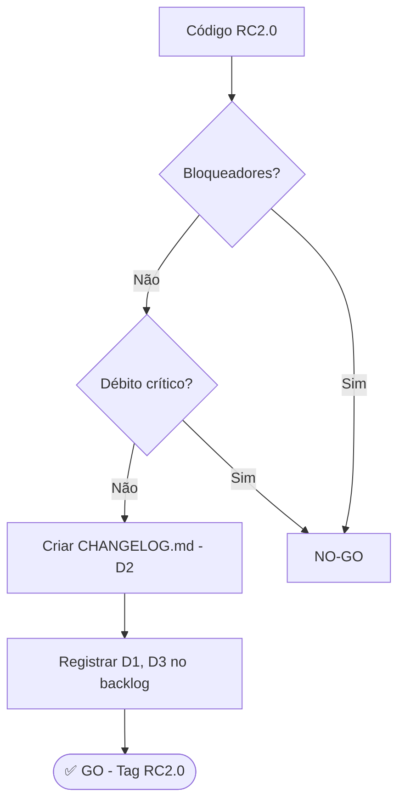
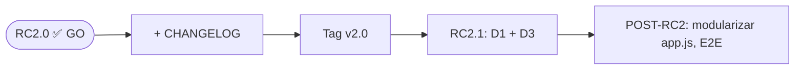

# RC2.0 GATE — PMAS

> **Versão avaliada:** RC2.0 (anterior: v1.4.8RC_PMAS)
> **Data da verificação:** 2026-06-03
> **Validador:** Especialista EVM · UX · Qualidade de Implementação

---

## ━━━ VEREDITO ━━━

```
┌────────────────────────────────────────────────────────────┐
│                                                            │
│                      ✅  GO                                │
│                                                            │
│   BLOQUEADORES (🚫) ........................ 0             │
│   REGRESSÕES   (⚠️) ........................ 0             │
│   DÉBITO RC2   (🔶) ........................ 3             │
│   POST-RC2     (🔷) ........................ 4             │
│                                                            │
│   Testes: 590 passed / 0 failed (32,4 s)                  │
│   Suítes EVM: 188 passed (integrity+service+v2)           │
│                                                            │
└────────────────────────────────────────────────────────────┘
```

**Fundamento do veredito:**

O PMAS RC2.0 está **pronto para release**. A suíte completa de 590 testes passa sem falhas (Python 3.11 e 3.12 via CI), incluindo 188 testes dedicados a EVM (`test_evm_service.py`, `test_evm_integrity.py`, `test_v2_endpoints.py`). O domínio EVM — o coração de risco deste produto — está corretamente implementado: existe uma **fonte única de verdade** (`backend/app/services/evm.py`) na qual cada métrica (CPI, SPI, EAC, TCPI, VAC, CV, SV, Earned Schedule) é calculada uma vez, com guardas de divisão-por-zero em todas as funções e Earned Value **corretamente capado em BAC** (`compute_ev_capped`). O CPI usa `EV/AC` com EV real (não `BAC/AC`), erro clássico que está explicitamente testado e prevenido (`test_in_progress_project_uses_ev_not_bac`). Nenhum índice EVM é recalculado no frontend — as respostas dos routers v2 são *render-ready*, eliminando divergência de fórmula entre back e front.

A consolidação de código está madura para um RC: não há TODO/FIXME/HACK em código de produção (os dois matches são uma string pt-BR "TODOS" e uma docstring), não há `console.log`/`debugger` de depuração (os dois `console.warn` remanescentes são tratamento legítimo de erro em filtros), não há endpoints legados órfãos (a migração para `/api/v2/*` está completa — zero referências a `/portfolio-health` no frontend), e o padrão EVM Freeze continua íntegro (`freeze_costs` aplicado na ingestão, custos congelados em `cost_per_hour`/`normal_cost`/`extra_cost`/`standby_cost`).

Os três itens de **Débito RC2** são reais mas não bloqueiam uso correto: (1) credencial padrão `admin/admin` sem reset forçado — mitigada por log de aviso e por ser ferramenta self-hosted on-prem; (2) ausência de `CHANGELOG.md` formal num projeto que faz releases versionados por tag; (3) pipeline de release com alvos Linux/macOS comentados (só Windows ativo). Nenhum compromete correção, segurança básica nem usabilidade. **Decisão: GO**, com os débitos registrados no changelog desta versão.

---

## BLOQUEADORES E REGRESSÕES

**Nenhum bloqueador (🚫) ou regressão (⚠️) identificado.**

A verificação procurou ativamente por:
- Fórmulas EVM incorretas (CPI como BAC/AC, EV não capado, EAC sem guarda de CPI=0) → **não encontradas**; todas corretas e testadas.
- Divisão por zero em indicadores → **protegida** em todas as funções de `evm.py` (retornam `None`) e nos consumidores v2 (`or 0.0`, `max(...)`, guardas `if ... == 0`).
- Recálculo divergente de métricas no frontend → **não existe**; frontend só calcula percentuais de display (`consumed/budget*100`).
- Endpoints legados quebrados após migração v2 → **migração completa**; nenhuma referência pendente.
- Regressões recentes (últimos 20 commits foram majoritariamente `fix:` de UX em charts) → cobertas por testes verdes; nenhuma lógica EVM tocada de forma quebrada.
- Vazamento de segredos / credenciais hardcoded em fluxo crítico → `SECRET_KEY` é env-driven com fallback aleatório + aviso; senhas via bcrypt.

---

## DÉBITO RC2

| # | Tipo | Eixo | Item | Impacto | Tratar em |
|---|------|------|------|---------|-----------|
| D1 | 🔶 | Segurança | Credencial padrão `admin/admin` sem reset forçado | Médio | RC2.1 |
| D2 | 🔶 | Processo | Ausência de `CHANGELOG.md` formal | Médio | RC2.0 (este release) |
| D3 | 🔶 | Build/Deploy | Alvos Linux/macOS comentados em `release.yml` | Médio | RC2.1 |

### D1 — Credencial padrão `admin/admin` sem mudança forçada 🔶

- **Arquivo:** `backend/app/database.py:98-116` (`_seed_admin`)
- **Problema:** Quando o banco está vazio, é criado um usuário `admin` com senha `admin` (bcrypt). Não há flag `must_change_password` nem fluxo de reset forçado no primeiro login.
- **Evidência:**
  ```python
  hashed_password=_bcrypt.hashpw(b"admin", _bcrypt.gensalt()).decode(),
  ...
  log.warning("Utilizador 'admin' criado com password padrão. Altere imediatamente em produção.")
  ```
- **Por que NÃO é bloqueador:** É uma ferramenta self-hosted/on-prem (PyInstaller onefile, SQLite local, `PMAS_HOST=127.0.0.1` por padrão), o sistema emite aviso explícito no log e a troca de senha já existe (`users.py:42 change_password`, UI em `app.js:4532`). O acesso é autenticado por JWT e o login é rate-limited (10/min).
- **Critério de aceitação (RC2.1):** No primeiro login com a senha padrão, a API retorna flag `must_change_password=true` e a UI obriga a troca antes de liberar qualquer outra ação; teste cobrindo o bloqueio.
- **Esforço estimado:** 0,5 dia.

### D2 — Ausência de CHANGELOG.md 🔶

- **Arquivo:** raiz do projeto (não existe `CHANGELOG.md` nem `RELEASES.md`)
- **Problema:** O projeto faz releases versionados por tag (`v1.4.0RC_PMAS` … `v1.4.8RC_PMAS`) e o `release.yml` cria GitHub Releases com `--notes ""` (vazio). Não há registro humano de mudanças entre versões.
- **Evidência:** `git tag -l` lista 9 tags; `release.yml` usa `gh release create ... --notes ""`.
- **Por que NÃO é bloqueador:** Não afeta funcionamento do software; é débito de processo de release.
- **Critério de aceitação (este RC2.0):** Criar `CHANGELOG.md` com seção `## RC2.0` consolidando as mudanças desde v1.4.8 (migração v2 render-ready, EVM service consolidado, Monte Carlo, runway, over-allocation, Earned Schedule) e os débitos D1/D3.
- **Esforço estimado:** 0,5 dia.

### D3 — Pipeline de release só com alvo Windows ativo 🔶

- **Arquivo:** `.github/workflows/release.yml`
- **Problema:** Os jobs de build Linux (`ubuntu-latest`) e macOS (`macos-latest`) estão comentados ("desativado temporariamente (em teste)"). Só o executável Windows é gerado.
- **Evidência:**
  ```yaml
  # - os: ubuntu-latest        ← comentado
  #   artifact_name: pmas-linux-x64
  ...
  # - os: macos-latest         ← comentado
  ```
- **Por que NÃO é bloqueador:** O alvo Windows funciona e o app roda diretamente via `python -m uvicorn`/`run.py` em qualquer plataforma; é limitação de distribuição binária, não de correção.
- **Critério de aceitação (RC2.1):** Reativar e validar os builds Linux e macOS, ou documentar formalmente que RC2.0 distribui apenas binário Windows + execução por fonte nas demais plataformas.
- **Esforço estimado:** 0,5–1 dia (depende de ajustes PyInstaller por SO).

---

## CHECKLIST DE PRONTIDÃO RC2.0

### Domínio EVM

| Item | Status | Evidência |
|------|--------|-----------|
| Fonte única de fórmulas EVM | ✅ | `services/evm.py` — docstring "single source of truth"; nenhum router reimplementa fórmulas |
| CPI = EV/AC (EV real, não BAC) | ✅ | `compute_cpi`, `compute_cpi_ev`; teste `test_in_progress_project_uses_ev_not_bac` |
| EV capado em BAC | ✅ | `compute_ev_capped` → `min(consumed/budget, 1.0) × BAC` |
| EAC = BAC/CPI com guarda CPI=0 | ✅ | `compute_eac` retorna None ou BAC (default_to_bac) quando CPI=0 |
| EAC schedule-sensitive (CPI×SPI) | ✅ | `compute_eac_schedule`; guarda `cpi<=0 or spi<=0` |
| TCPI, VAC, CV, SV | ✅ | implementados + guardas + testes dedicados |
| Earned Schedule / SPI(t) / IEAC(t) | ✅ | `compute_earned_schedule`, `compute_spi_t`, `compute_ieac_t`; `TestEarnedSchedule` |
| Divisão por zero protegida | ✅ | toda função retorna None em denominador 0; consumidores usam `or 0.0`/`max()` |
| Health classification (90/100%) | ✅ | `classify_health`; `TestClassifyHealth` cobre limiares e custom thresholds |
| Thresholds configuráveis | ✅ | `get_thresholds(cfg)` lê `GlobalConfig`, fallback 0.9/1.0 |
| Budget autoritativo (baseline > project) | ✅ | `resolve_effective_budget` — regra única |
| Frontend não recalcula EVM | ✅ | charts consomem campos render-ready; só calcula % de display |

### Padrão EVM Freeze

| Item | Status | Evidência |
|------|--------|-----------|
| Custo congelado na ingestão | ✅ | `ingestion.py:414 freeze_costs(...)`; grava `normal/extra/standby_cost` + `cost_per_hour` |
| Multiplicadores extra/sobreaviso | ✅ | lidos de `GlobalConfig` (fallback 1.5 / 0.33), aplicados em `freeze_costs` |
| Lookup de rate por data/senioridade | ✅ | `_lookup_rate` filtra RateCard por `valid_from/valid_to` |
| Rate ausente → custo 0 + aviso | ✅ | `ingestion.py:407` adiciona `ingest_warnings` |
| Mudança de rate não altera histórico | ✅ | custo persistido em colunas frozen; forecast usa colunas congeladas no fallback |

### Consistência de dados / formatação

| Item | Status | Evidência |
|------|--------|-----------|
| Formatação de moeda pt-BR | ✅ | `utils.js:30 toLocaleString('pt-BR', {2 casas})` |
| Formatação de horas | ✅ | `utils.js:24 toFixed(1)+'h'` |
| Datas via parser canônico único | ✅ | `_parse_date_safe` reusado por dashboard e ingestion |
| Arredondamento consistente (2 casas) | ✅ | `round(..., 2)` nos routers; `round(..., 4)` para índices |
| Agregação por PEP/ciclo coerente | ✅ | `PepCycleSummary` pré-computado + fallback para raw records |

### Segurança

| Item | Status | Evidência |
|------|--------|-----------|
| Senhas com bcrypt | ✅ | `auth.py:22-27 hashpw/checkpw` |
| JWT assinado (HS256) | ✅ | `deps.py:28 ALGORITHM='HS256'`; exp via `_TOKEN_EXPIRE_HOURS` |
| SECRET_KEY via env | ✅ | `deps.py:17 os.getenv("PMAS_SECRET_KEY")` + aviso no fallback |
| Login rate-limited | ✅ | `auth.py:31 @limiter.limit("10/minute")` |
| CORS restrito + configurável | ✅ | `main.py:94` allowlist localhost + `PMAS_ALLOWED_ORIGINS` |
| ACL por PEP aplicada | ✅ | `_allowed_peps` em portfolio/forecast; `_authorized_peps` na ingestão |
| Sem segredos hardcoded em fluxo crítico | ✅ | grep sem matches além de bcrypt/env |
| Credencial padrão sem reset forçado | 🔶 | D1 — `database.py:98` |

### Qualidade de código / consolidação

| Item | Status | Evidência |
|------|--------|-----------|
| Sem TODO/FIXME/HACK em produção | ✅ | grep só retorna string pt-BR e docstring |
| Sem console.log/debugger de debug | ✅ | só 2 `console.warn` de erro legítimo (`app.js:362,375`) |
| Sem código comentado morto relevante | 🔶 | só os alvos de build Linux/macOS em `release.yml` (D3) |
| Sem branches/features incompletas mescladas | ✅ | migração v2 completa; sem endpoints órfãos |
| Sem duplicação de lógica crítica | ✅ | EVM centralizado; fallbacks reusam `resolve_effective_budget`/`compute_*` |
| Tamanho de `app.js` (5582 linhas) | 🔷 | grande mas modularizado (charts/ separados); ver P1 |

### Solidez técnica / testes

| Item | Status | Evidência |
|------|--------|-----------|
| Suíte de testes verde | ✅ | 590 passed / 0 failed |
| CI em múltiplas versões Python | ✅ | `tests.yml` matrix 3.11 + 3.12 |
| Testes EVM unitários (math puro) | ✅ | `test_evm_service.py` — happy/boundary/None |
| Testes EVM de integração (HTTP) | ✅ | `test_evm_integrity.py` (20), `test_v2_endpoints.py` (64) |
| Testes de Monte Carlo / runway / simulação | ✅ | `test_monte_carlo.py`, `test_runway_concentration.py`, `test_simulation.py` |
| Tratamento de erro na API | ✅ | HTTPException com status apropriados (403/404/413/422) amplamente usados |
| Migração de schema não-destrutiva | ✅ | `_migrate_columns()` via PRAGMA + ALTER TABLE |
| requirements pinados para build | ✅ | `requirements-lock.txt` usado no `release.yml` |

### UX / interface

| Item | Status | Evidência |
|------|--------|-----------|
| Estados vazios | ✅ | `_emptyState`/`empty-state` em `ui-helpers.js` e `app.js` |
| Estados de erro (toast/notify) | ✅ | 158 ocorrências de `notify/catch` em `app.js` |
| Fluxo de troca de senha | ✅ | `users.py:42` + UI `app.js:4532` |
| i18n pt-BR / en | ✅ | `lang/pt.js`, `lang/en.js`, `_t()` |
| Charts EVM (S-curve, burn-up, CPI/SPI) | ✅ | `charts/forecast.js` — render-ready, capado, com markArea de zonas |

---

## CONSOLIDAÇÃO DE CÓDIGO

### Estado de consolidação

| Critério | Estado | Nota |
|----------|--------|------|
| Sem feature branches incompletas | ✅ | Migração v2 totalmente integrada e em uso pelo frontend |
| Sem código comentado (não-doc) | 🔶 | Único caso: alvos de build em `release.yml` (D3) |
| Sem logs de debug em produção | ✅ | Apenas logging estruturado (`logging.getLogger`) e `console.warn` de erro |
| Sem TODO em fluxo crítico | ✅ | Nenhum TODO real no código |
| Sem duplicação de lógica EVM | ✅ | `services/evm.py` é a única fonte |
| Endpoints legados removidos | ✅ | Frontend usa exclusivamente `/api/v2/*` + rotas CRUD estáveis |

### Ações de consolidação para fechar RC2.0

1. Criar `CHANGELOG.md` (D2) — **dentro deste release**.
2. Registrar D1 e D3 como itens conhecidos no CHANGELOG / backlog RC2.1.



---

## SEQUÊNCIA DE TRATAMENTO

Não há bloqueadores; portanto **não há sequência de correção obrigatória pré-release**. Apenas a ação de processo D2 (CHANGELOG) é recomendada para o próprio RC2.0.

Backlog para RC2.1 (não-bloqueante):

| Prioridade | Item | Eixo | Esforço |
|------------|------|------|---------|
| P1 | D1 — reset forçado de senha padrão | Segurança | 0,5 d |
| P2 | D3 — reativar builds Linux/macOS | Deploy | 0,5–1 d |
| P3 (🔷) | Modularizar `app.js` (5582 linhas) | Manutenibilidade | 2–3 d |
| P3 (🔷) | Cobertura E2E (Playwright) ampliada | QA | 1–2 d |



---

## APPENDIX A — COBERTURA DA VERIFICAÇÃO

### Backend lido / analisado
- `backend/app/services/evm.py` (546 linhas — leitura integral)
- `backend/app/routers/v2/portfolio.py` (240 linhas — integral)
- `backend/app/routers/v2/forecast.py` (445 linhas — integral)
- `backend/app/routers/dashboard.py` (147 linhas — integral)
- `backend/app/routers/plans.py` (246 linhas — integral)
- `backend/app/services/ingestion.py` (freeze pattern, `_lookup_rate`, `ingest_file` — seções-chave)
- `backend/app/main.py` (CORS, routers, startup)
- `backend/app/database.py` (`_seed_admin`, `_migrate_columns`, `init_db`)
- `backend/app/deps.py` / `backend/app/routers/auth.py` (JWT, bcrypt, SECRET_KEY)
- `backend/app/limiter.py` (rate limiting)
- v2: `effort.py`, `allocation.py`, `concentration.py`, `runway.py`, `monte_carlo.py`, `over_allocation.py`, `simulate.py`, `trends.py` (guardas e agregação)

### Frontend lido / analisado
- `frontend/charts/forecast.js` (361 linhas — integral)
- `frontend/charts/effort.js` (235 linhas — integral)
- `frontend/charts/portfolio.js` (uso de campos render-ready)
- `frontend/app.js` (consumo de endpoints, formatação, ausência de recálculo EVM, estados de erro)
- `frontend/utils.js` (formatação pt-BR de moeda/horas)

### Testes verificados
- `tests/test_evm_service.py` (math puro — leitura integral)
- `tests/test_evm_integrity.py` (integração EVM — cabeçalho + helpers)
- Execução completa: **590 passed / 0 failed** (32,4 s)
- Subconjunto EVM: **188 passed** (integrity + service + v2, 2,5 s)

### CI / Deploy
- `.github/workflows/tests.yml` (matrix 3.11/3.12)
- `.github/workflows/release.yml` (PyInstaller; Linux/macOS comentados)

### Comandos executados
- Estrutura (`find`), git log/diff, grep de TODO/console/segredos/EVM/guards/formatação
- `pytest tests/ -q` (suíte completa) e subconjunto EVM
- Verificação de referências a endpoints legados (`portfolio-health`, `/api/forecast`, `/api/trends`) → zero no frontend

---

## APPENDIX B — REFERÊNCIAS NORMATIVAS

- **PMI — Practice Standard for Earned Value Management (2nd ed.):** definições de CPI = EV/AC, SPI = EV/PV, EAC = BAC/CPI, TCPI = (BAC−EV)/(BAC−AC), VAC = BAC−EAC.
- **Lipke, W. — Earned Schedule (2003):** base teórica de ES, SPI(t) = ES/AT, IEAC(t) = PD/SPI(t) — implementados em `compute_earned_schedule`/`compute_spi_t`/`compute_ieac_t`.
- **AgileEVM (Sulaiman, Barton, Blackburn):** uso de horas como proxy de EV/PV quando só há baseline de horas — documentado na docstring de `compute_spi`.
- **OWASP ASVS:** autenticação (bcrypt, JWT assinado), gestão de sessão (expiração de token), controle de acesso (ACL por PEP), rate limiting de login.
- **Semantic Versioning 2.0.0 / Keep a Changelog:** base para a recomendação D2 (CHANGELOG.md).

---

*Fim do RC2.0 GATE — PMAS.*
