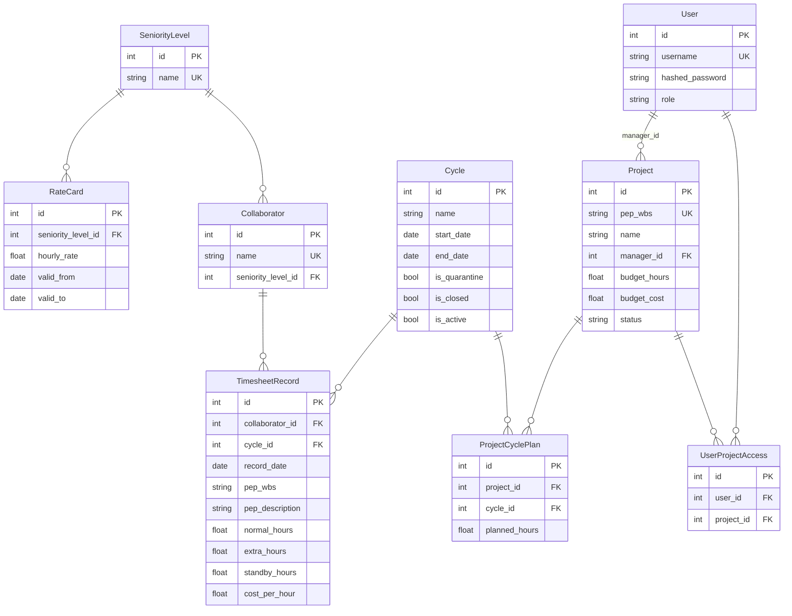
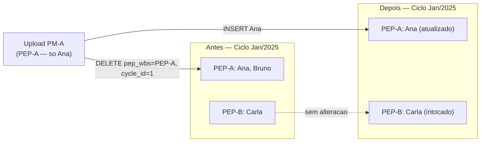

# PMAS — Project Management Assistant System

Sistema downstream de inteligência financeira sobre timesheets. Recebe exportações CSV/XLSX de ponto, aplica EVM (Earned Value Management) e expõe os resultados via dashboard analítico.

---

## Stack

| Camada | Tecnologia |
|---|---|
| Runtime | Python 3.11+ |
| API | FastAPI (ASGI via Uvicorn) |
| ORM | SQLAlchemy 2.x |
| Banco | SQLite — WAL mode (`PRAGMA journal_mode=WAL; synchronous=NORMAL`) |
| Ingestão | pandas (CSV + XLSX) |
| Frontend | Vanilla JS + Apache ECharts 5 (renderer SVG) |
| Autenticação | JWT Bearer (python-jose) |

Sem build step. O frontend é HTML + JS estático servido como `StaticFiles` pelo próprio FastAPI.

---

## Estrutura de Módulos

```
backend/app/
├── main.py              # app FastAPI — 11 routers, lifespan, upload endpoint
├── models.py            # 10 modelos ORM
├── database.py          # engine SQLite, WAL, init_db(), _migrate_columns()
├── schemas.py           # Pydantic I/O
├── deps.py              # get_current_user, CurrentUser
├── services/
│   └── ingestion.py     # pipeline de ingestão (ver seção abaixo)
└── routers/
    ├── auth.py          # POST /api/token
    ├── users.py         # CRUD /api/users
    ├── cycles.py        # CRUD /api/cycles
    ├── projects.py      # CRUD /api/projects
    ├── plans.py         # /api/projects/{id}/plans — baseline EVM
    ├── dashboard.py     # /api/dashboard, /pep-radar, /collaborator-timeline
    ├── analytics.py     # /api/portfolio-health, /trends, /allocation, /forecast
    ├── reference.py     # /api/collaborators, /api/peps (cascading filters)
    ├── ratecard.py      # /api/seniority-levels, /rate-cards, /team
    ├── acl.py           # /api/projects/{id}/access
    └── auditlog.py      # GET /api/audit-log
```

---

## Esquema do Banco de Dados



**`TimesheetRecord.cost_per_hour`** é congelado na ingestão via `_lookup_rate()` — alterações futuras no `RateCard` não retroagem.

**`GlobalConfig`** (singleton `id=1`) armazena `extra_hours_multiplier` e `standby_hours_multiplier`, aplicados em tempo de query para AC e portfolio-health.

---

## Pipeline de Ingestão (Issue #50)

Ponto de entrada: `POST /api/upload-timesheet` → `ingest_file()` em `services/ingestion.py`.

A operação é atômica: qualquer exceção após o início do Pass 1 executa `db.rollback()`.

```mermaid
flowchart TD
    A([CSV / XLSX]) --> B[pandas — parse + validação de colunas]
    B --> C{Colunas obrigatórias OK?}
    C -->|Não| ERR0([422 — colunas ausentes])
    C -->|Sim| L1

    subgraph "Camada 1 — Filtro de Autorização"
        L1[Coleta PEP codes do arquivo] --> L1B{user_id fornecido?}
        L1B -->|Não — sistema/teste| PASS
        L1B -->|Sim| L1C{role = admin\nou manager_id\nou ACL grant?}
        L1C -->|Sim — todos os PEPs| PASS
        L1C -->|Não para algum PEP| DISC[Linhas descartadas\nsilenciosamente]
        DISC --> WARN[warnings[] += msg]
        WARN --> PASS
    end

    PASS --> P1

    subgraph "Pass 1 — Resolução de Entidades"
        P1[Para cada linha] --> COL{Collaborator\nexiste?}
        COL -->|Não| COL2[INSERT Collaborator]
        COL -->|Sim| COL3[reuse]
        COL2 & COL3 --> CYC{Ciclo cobre\na data?}
        CYC -->|Sim| CYC2[reuse]
        CYC -->|Não| CYC3[INSERT Cycle\nis_quarantine=True]
    end

    CYC2 & CYC3 --> L2

    subgraph "Camada 2 — RBAC"
        L2{role = admin?} -->|Não| L2B{Algum ciclo\nresolvido is_closed?}
        L2B -->|Sim| ERR2([403 — ClosedCycleError])
        L2B -->|Não| L3
        L2 -->|Sim| L3
    end

    subgraph "Camada 3 — Projeto Bloqueado"
        L3{PEP com status\nencerrado ou suspenso?} -->|Sim| ERR3([422 — LockedProjectError])
        L3 -->|Não| DEL
    end

    subgraph "DELETE Cirúrgico"
        DEL[Escopo: pep_wbs x cycle_id] --> DEL_A[PEP nomeado:\nDELETE WHERE pep_wbs + cycle_id]
        DEL --> DEL_B[PEP nulo:\nDELETE WHERE collaborator + cycle\n+ pep_wbs IS NULL]
    end

    DEL_A & DEL_B --> INS

    subgraph "INSERT com EVM Freeze"
        INS[Para cada linha] --> RATE[_lookup_rate\ncolaborador + record_date]
        RATE --> FREEZE[cost_per_hour congelado]
        FREEZE --> DEDUP{Chave duplicada\nno lote?}
        DEDUP -->|Sim| SKIP[skipped++]
        DEDUP -->|Não| SAVE[INSERT TimesheetRecord]
    end

    SAVE & SKIP --> COMMIT[COMMIT]
    COMMIT --> ANOM[_detect_anomalies — pos-commit]
    ANOM --> RET([JSON: records_inserted, skipped,\nquarantine_cycles_created, warnings])
```

### Camada 1 — Filtro de Autorização

Executado **fora da transação**, antes de qualquer escrita. Determina quais linhas do arquivo o usuário pode processar:

| Perfil | Acesso |
|---|---|
| `admin` | Todos os PEPs sem restrição |
| `user` com `Project.manager_id == user_id` | PEPs onde é gerente registrado |
| `user` com entrada em `UserProjectAccess` | PEPs com ACL delegada por admin |
| Demais | Linhas descartadas — upload não falha |

Linhas descartadas geram entrada em `warnings[]`. O upload **nunca falha por ausência de permissão** em PEPs individuais.

### Camada 2 — RBAC (Ciclo Fechado)

Usuários não-admin não gravam em `Cycle.is_closed=True`. Se qualquer data do arquivo cair em ciclo fechado, a transação inteira é revertida: `ClosedCycleError` (HTTP 403).

### Camada 3 — Projeto Bloqueado

Projetos com `status` `encerrado` ou `suspenso` recusam lançamentos: `LockedProjectError` (HTTP 422), rollback total.

### DELETE Cirúrgico

Unidade de substituição: `(pep_wbs, cycle_id)`, não `(collaborador, ciclo)`.

- Upload de PEP-A não toca linhas de PEP-B no mesmo ciclo.
- Colaboradores removidos do CSV têm suas linhas antigas excluídas (sem registros órfãos).
- Linhas sem `pep_wbs` usam `(collaborator_id, cycle_id, pep_wbs IS NULL)`.



### EVM Freeze — `_lookup_rate()`

```
Collaborator.seniority_level_id
    → RateCard WHERE valid_from <= record_date <= valid_to
    → cost_per_hour gravado imutável em TimesheetRecord
```

Reajustes futuros na `RateCard` não retroagem sobre registros já importados.

---

## Cálculos EVM

Multiplicadores globais de `GlobalConfig` aplicados em tempo de query:

```
AC = Σ cost_per_hour × (normal_h + extra_h × em + standby_h × sm)
```

| Métrica | Fórmula | Endpoint |
|---|---|---|
| **AC** (Custo Real) | `Σ cost_per_hour × horas ponderadas` | `/api/portfolio-health`, `/api/trends` |
| **EV** (Valor Ganho) | `(consumed_hours / budget_hours) × budget_cost` | `/api/forecast`, `/api/trends` |
| **PV** (Valor Planejado) | `(Σ planned_hours / budget_hours) × budget_cost` via `ProjectCyclePlan` | `/api/forecast` |
| **CPI** ponderado | `Σ EV_pep / Σ AC_pep` sobre todos os PEPs com orçamento no ciclo | `/api/trends` |
| **SPI** | `EV / PV` | `/api/forecast` |
| **EAC** | `budget_cost / CPI` | `/api/forecast` |

`ProjectCyclePlan` armazena `planned_hours` por `(project_id, cycle_id)`, importado via CSV (`pep_wbs, cycle_name, planned_hours`). Constitui a baseline da curva-S para IDP/SPI no gráfico de Previsão.

---

## Frontend

```
frontend/
├── index.html      # 4 tabs: Dashboard (3 sub-tabs), Ciclos, Projetos, Equipe
├── app.js          # toda lógica client
├── style.css       # tema dark slate + @media print
└── multiselect.js  # MultiSelect com cascata de filtros
```

**ECharts:** renderer SVG — exportação e impressão via CSS sem conversão de canvas. `ResizeObserver` no `<main>` propaga redimensionamento para todas as instâncias ativas. `dispose()` é chamado ao trocar de sub-tab, controlado por `CHARTS_PER_TAB`.

**Filtros — matriz de cobertura por sub-tab:**

| Sub-tab | cycle_id | pep_wbs | pep_description | collaborator_id | date_from/to |
|---|:---:|:---:|:---:|:---:|:---:|
| Esforço (barras + stats) | ✅ (1°) | ✅ | ✅ | ✅ | ✅ |
| Queima / IDP por Ciclo | janela ±1 | ✅ | ✅ | ✅ | ✅ |
| Portfolio (treemap/bullet/radar/alocação) | ✅ | ✅ | ✅ | ✅ | ✅ |
| Previsão | — | interno | — | — | ✅ |

**Janela contextual (Queima/IDP):** ciclo selecionado é convertido em `date_from/date_to` cobrindo `[ciclo-1].start … [ciclo+1].end` via `_computeTrendsWindow()`, preservando a visão longitudinal com foco no período.

---

## Setup

```bash
# Instalar dependências
pip install -r requirements.txt

# Iniciar servidor (cria pmas.db automaticamente)
python -m uvicorn backend.app.main:app --reload
# http://127.0.0.1:8000
# Credenciais iniciais: admin / admin123

# Executar testes (in-memory, não toca pmas.db)
pip install pytest httpx
pytest tests/ -v
```

`_migrate_columns()` em `database.py` aplica `ALTER TABLE` não-destrutivo na inicialização — bancos existentes sobrevivem atualizações de schema.

---

## Testes

294 testes em 8 arquivos. Fixture `clean_db` limpa todas as tabelas **antes** de cada teste via `StaticPool`.

| Arquivo | Cobertura |
|---|---|
| `test_cycles.py` | CRUD, lock/unlock, archive |
| `test_projects.py` | CRUD, budget |
| `test_dashboard.py` | Agregação por colaborador |
| `test_ingestion.py` | Pipeline completo, ACL, quarentena, EVM freeze |
| `test_analytics.py` | portfolio-health, trends, pep-radar, allocation — todos os filtros |
| `test_reference.py` | Endpoints de referência com cascata |
| `test_ratecard.py` | SeniorityLevel, RateCard, EVM freeze |
| `test_users.py` | Auth, CRUD, RBAC |
