<h1 align="center">PMAS — Project Management Assistant System</h1>

<p align="center">
  <em>Dashboard analítico de timesheets: horas, custos, EVM e saúde do portfólio em tempo real.</em>
</p>

<p align="center">
  
  
  
  
  
</p>

---

## Sumário

1. [Visão Geral](#visão-geral)
2. [Stack](#stack)
3. [Arquitetura](#arquitetura)
4. [Modelo de Dados](#modelo-de-dados)
5. [Pipeline de Ingestão](#pipeline-de-ingestão)
6. [Motor EVM](#motor-evm)
7. [Motor de Regras de Validação](#motor-de-regras-de-validação)
8. [Ciclo de Vida da Quarentena](#ciclo-de-vida-da-quarentena)
9. [Semáforo de Portfólio](#semáforo-de-portfólio)
10. [Frontend](#frontend)
11. [API REST](#api-rest)
12. [Instalação e Execução](#instalação-e-execução)
13. [Dados de Amostra](#dados-de-amostra)
14. [Configuração](#configuração)
15. [Testes](#testes)
16. [Estrutura do Projeto](#estrutura-do-projeto)
17. [Build Standalone](#build-standalone)

---

## Visão Geral

O PMAS transforma exports de timesheet (CSV ou XLSX) em dashboards interativos de gestão de projetos. Gestores importam planilhas de horas mensais, definem ciclos de apuração e projetos com orçamento, e visualizam em tempo real o consumo de horas por colaborador, por PEP e por ciclo — com custo real calculado via Rate Card congelado no momento da ingestão.

O sistema cobre três necessidades centrais de um PMO:

| Necessidade | Como o PMAS atende |
|---|---|
| **Rastreabilidade** | Cada upload gera um `UploadSession` imutável com contagens por outcome; todo CRUD vai para o `AuditLog` |
| **Confiabilidade de custo** | Padrão EVM freeze: `cost_per_hour` resolvido na ingestão, imune a reajustes futuros de Rate Card |
| **Saúde do portfólio** | CPI, SPI, EAC, TCPI, VAC, CV, SV calculados server-side via `services/evm.py`; semáforo macro visual |

---

## Stack

| Camada | Tecnologia |
|---|---|
| Backend | Python 3.11+ · FastAPI 0.111 · SQLAlchemy 2.0 |
| Banco de dados | SQLite embutido (`pmas.db`) |
| Autenticação | JWT (python-jose) · bcrypt |
| Frontend | HTML5 · CSS3 · JavaScript Vanilla |
| Gráficos | Apache ECharts 5 |
| Parsing | pandas · openpyxl |
| Testes | pytest · httpx · FastAPI TestClient |
| Build | PyInstaller (Linux x64 + Windows x64) |
| CI | GitHub Actions (Python 3.11 / 3.12) |

---

## Arquitetura

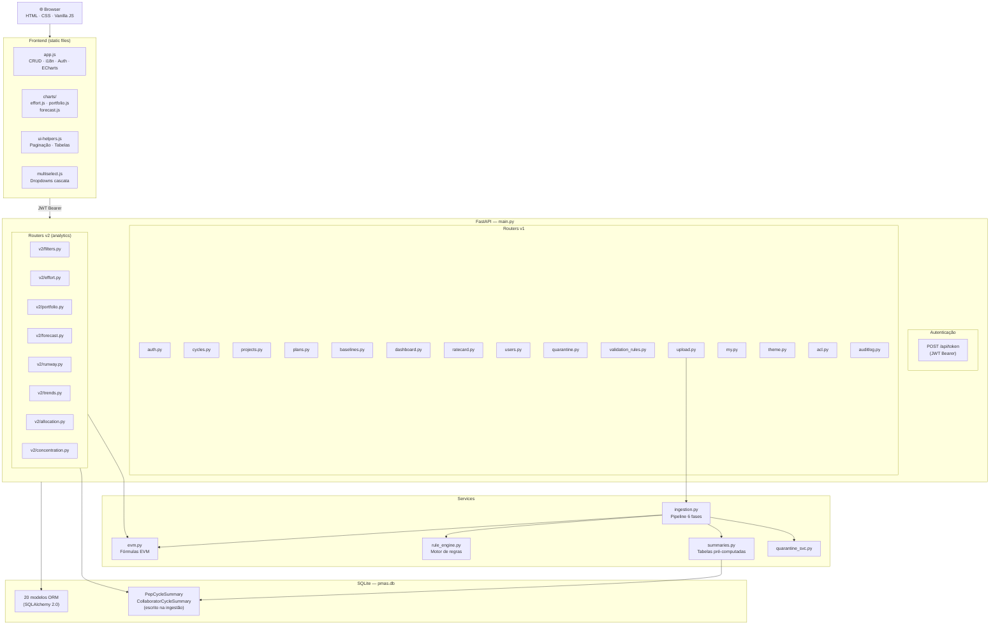
```mermaid
graph TD
    Browser["🌐 Browser\nHTML · CSS · Vanilla JS"]

    subgraph FE["Frontend (static files)"]
        AppJS["app.js\nCRUD · i18n · Auth · ECharts"]
        Charts["charts/\neffort.js · portfolio.js\nforecast.js"]
        UIHelpers["ui-helpers.js\nPaginação · Tabelas"]
        MS["multiselect.js\nDropdowns cascata"]
    end

    subgraph API["FastAPI — main.py"]
        direction TB
        subgraph Auth["Autenticação"]
            JWT["POST /api/token\n(JWT Bearer)"]
        end
        subgraph V1["Routers v1"]
            Auth2["auth.py"]
            Cycles["cycles.py"]
            Projects["projects.py"]
            Plans["plans.py"]
            Baselines["baselines.py"]
            Dashboard["dashboard.py"]
            Ratecard["ratecard.py"]
            Users["users.py"]
            Quarantine["quarantine.py"]
            Rules["validation_rules.py"]
            Upload["upload.py"]
            My["my.py"]
            Theme["theme.py"]
            ACL["acl.py"]
            Audit["auditlog.py"]
        end
        subgraph V2["Routers v2 (analytics)"]
            Filters["v2/filters.py"]
            Effort["v2/effort.py"]
            Portfolio["v2/portfolio.py"]
            Forecast["v2/forecast.py"]
            Runway["v2/runway.py"]
            Trends["v2/trends.py"]
            Alloc["v2/allocation.py"]
            Conc["v2/concentration.py"]
        end
    end

    subgraph SVC["Services"]
        Ingestion["ingestion.py\nPipeline 6 fases"]
        EVM["evm.py\nFórmulas EVM"]
        RuleEng["rule_engine.py\nMotor de regras"]
        Summaries["summaries.py\nTabelas pré-computadas"]
        QSvc["quarantine_svc.py"]
    end

    subgraph DB["SQLite — pmas.db"]
        Models["20 modelos ORM\n(SQLAlchemy 2.0)"]
        Summary["PepCycleSummary\nCollaboratorCycleSummary\n(escrito na ingestão)"]
    end

    Browser --> FE
    FE -->|JWT Bearer| API
    Upload --> Ingestion
    Ingestion --> EVM
    Ingestion --> RuleEng
    Ingestion --> Summaries
    Ingestion --> QSvc
    V2 --> EVM
    V2 --> Summary
    API --> Models
    Summaries --> Summary
```

### Fluxo de dados de alto nível

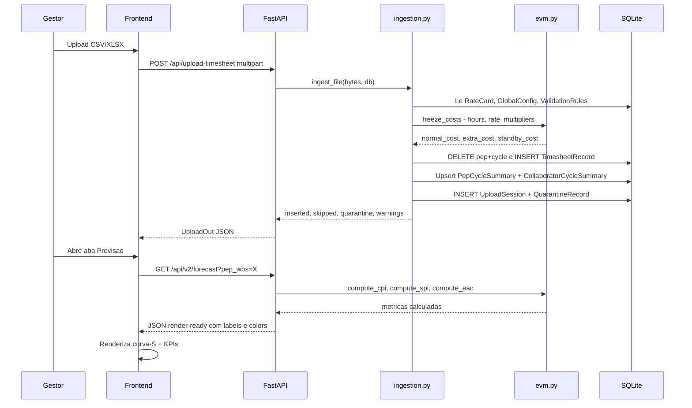
```mermaid
sequenceDiagram
    participant PM as Gestor
    participant UI as Frontend
    participant API as FastAPI
    participant ING as ingestion.py
    participant EVM as evm.py
    participant DB as SQLite

    PM->>UI: Upload CSV/XLSX
    UI->>API: POST /api/upload-timesheet multipart
    API->>ING: ingest_file(bytes, db)
    ING->>DB: Le RateCard, GlobalConfig, ValidationRules
    ING->>EVM: freeze_costs - hours, rate, multipliers
    EVM-->>ING: normal_cost, extra_cost, standby_cost
    ING->>DB: DELETE pep+cycle e INSERT TimesheetRecord
    ING->>DB: Upsert PepCycleSummary + CollaboratorCycleSummary
    ING->>DB: INSERT UploadSession + QuarantineRecord
    ING-->>API: inserted, skipped, quarantine, warnings
    API-->>UI: UploadOut JSON

    PM->>UI: Abre aba Previsao
    UI->>API: GET /api/v2/forecast?pep_wbs=X
    API->>EVM: compute_cpi, compute_spi, compute_eac
    EVM-->>API: metricas calculadas
    API-->>UI: JSON render-ready com labels e colors
    UI->>UI: Renderiza curva-S + KPIs
```

---

## Modelo de Dados

### Diagrama ER completo

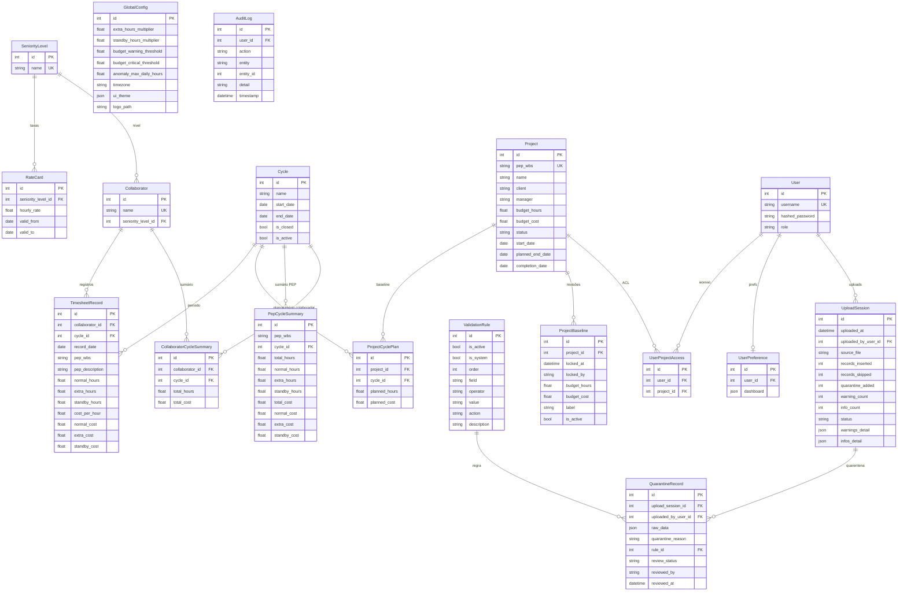
```mermaid
erDiagram
    SeniorityLevel {
        int id PK
        string name UK
    }
    RateCard {
        int id PK
        int seniority_level_id FK
        float hourly_rate
        date valid_from
        date valid_to
    }
    Collaborator {
        int id PK
        string name UK
        int seniority_level_id FK
    }
    Cycle {
        int id PK
        string name
        date start_date
        date end_date
        bool is_closed
        bool is_active
    }
    TimesheetRecord {
        int id PK
        int collaborator_id FK
        int cycle_id FK
        date record_date
        string pep_wbs
        string pep_description
        float normal_hours
        float extra_hours
        float standby_hours
        float cost_per_hour
        float normal_cost
        float extra_cost
        float standby_cost
    }
    Project {
        int id PK
        string pep_wbs UK
        string name
        string client
        string manager
        float budget_hours
        float budget_cost
        string status
        date start_date
        date planned_end_date
        date completion_date
    }
    ProjectBaseline {
        int id PK
        int project_id FK
        datetime locked_at
        string locked_by
        float budget_hours
        float budget_cost
        string label
        bool is_active
    }
    ProjectCyclePlan {
        int id PK
        int project_id FK
        int cycle_id FK
        float planned_hours
        float planned_cost
    }
    User {
        int id PK
        string username UK
        string hashed_password
        string role
    }
    UserProjectAccess {
        int id PK
        int user_id FK
        int project_id FK
    }
    GlobalConfig {
        int id PK
        float extra_hours_multiplier
        float standby_hours_multiplier
        float budget_warning_threshold
        float budget_critical_threshold
        float anomaly_max_daily_hours
        string timezone
        json ui_theme
        string logo_path
    }
    ValidationRule {
        int id PK
        bool is_active
        bool is_system
        int order
        string field
        string operator
        string value
        string action
        string description
    }
    UploadSession {
        int id PK
        datetime uploaded_at
        int uploaded_by_user_id FK
        string source_file
        int records_inserted
        int records_skipped
        int quarantine_added
        int warning_count
        int info_count
        string status
        json warnings_detail
        json infos_detail
    }
    QuarantineRecord {
        int id PK
        int upload_session_id FK
        int uploaded_by_user_id FK
        json raw_data
        string quarantine_reason
        int rule_id FK
        string review_status
        string reviewed_by
        datetime reviewed_at
    }
    PepCycleSummary {
        int id PK
        string pep_wbs
        int cycle_id FK
        float total_hours
        float normal_hours
        float extra_hours
        float standby_hours
        float total_cost
        float normal_cost
        float extra_cost
        float standby_cost
    }
    CollaboratorCycleSummary {
        int id PK
        int collaborator_id FK
        int cycle_id FK
        float total_hours
        float total_cost
    }
    AuditLog {
        int id PK
        int user_id FK
        string action
        string entity
        int entity_id
        string detail
        datetime timestamp
    }
    UserPreference {
        int id PK
        int user_id FK
        json dashboard
    }

    SeniorityLevel ||--o{ RateCard : "taxas"
    SeniorityLevel ||--o{ Collaborator : "nível"
    Collaborator ||--o{ TimesheetRecord : "registros"
    Cycle ||--o{ TimesheetRecord : "período"
    Cycle ||--o{ ProjectCyclePlan : "planos"
    Cycle ||--o{ PepCycleSummary : "sumário PEP"
    Cycle ||--o{ CollaboratorCycleSummary : "sumário colaborador"
    Project ||--o{ ProjectCyclePlan : "baseline"
    Project ||--o{ ProjectBaseline : "revisões"
    Project ||--o{ UserProjectAccess : "ACL"
    User ||--o{ UserProjectAccess : "acesso"
    User ||--o| UserPreference : "prefs"
    User ||--o{ UploadSession : "uploads"
    UploadSession ||--o{ QuarantineRecord : "quarentena"
    ValidationRule ||--o{ QuarantineRecord : "regra"
    Collaborator ||--o{ CollaboratorCycleSummary : "sumário"
```

### Tabelas de sumário pré-computadas

`PepCycleSummary` e `CollaboratorCycleSummary` são atualizadas atomicamente na mesma transação de cada `ingest_file()`. Os endpoints `/api/v2/*` leem dessas tabelas em vez dos `TimesheetRecord` brutos — consultas O(1) por PEP/ciclo em vez de full-scan.

---

## Pipeline de Ingestão

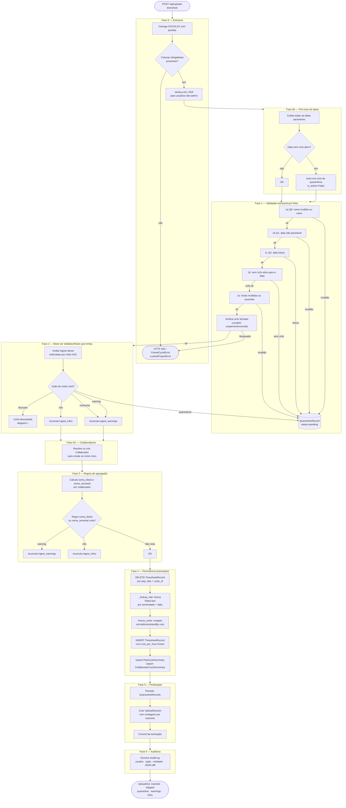
```mermaid
flowchart TD
    A([POST /api/upload-timesheet]) --> P0

    subgraph P0["Fase 0 — Estrutura"]
        B[Carrega CSV/XLSX com pandas]
        C{Colunas obrigatórias\npresentes?}
        B --> C
        C -- não --> ERR([HTTP 422])
        C -- sim --> D[Verifica ACL PEP\npara usuários não-admin]
    end

    D --> P0B

    subgraph P0B["Fase 0b — Pré-scan de datas"]
        E[Coleta todas as datas parseáveis]
        F{Data sem ciclo ativo?}
        E --> F
        F -- sim --> G[Auto-cria ciclo de quarentena\nis_active=False]
        F -- não --> H[OK]
    end

    G & H --> P1

    subgraph P1["Fase 1 — Validação estrutural por linha"]
        I1[1a Q8: nome inválido ou vazio]
        I2[1b Q1: data não parseável]
        I3[1c Q2: data futura]
        I4[1d: sem ciclo ativo para a data]
        I5[1e: horas inválidas ou ausentes]
        I1 -- inválido --> QR
        I1 -- ok --> I2
        I2 -- inválido --> QR
        I2 -- ok --> I3
        I3 -- futura --> QR
        I3 -- ok --> I4
        I4 -- sem ciclo --> QR
        I4 -- ciclo ok --> I5
        I5 -- inválido --> QR
        I5 -- ok --> RBAC
        RBAC[Verifica ciclo fechado\ne projeto suspenso/encerrado]
        RBAC -- bloqueado --> ERR([HTTP 400 / ClosedCycleError\nLockedProjectError])
    end

    QR[(QuarantineRecord\nstatus=pending)]

    RBAC -- ok --> P2

    subgraph P2["Fase 2 — Motor de ValidationRules (por linha)"]
        L[Avalia regras ativas\nordenadas por order ASC]
        M{Ação de maior rank?}
        L --> M
        M -- quarentena --> QR
        M -- descarte --> SKIP[Linha descartada\nskipped++]
        M -- warning --> N[Acumula ingest_warnings]
        M -- info --> NI[Acumula ingest_infos]
        M -- nenhuma --> N
    end

    N & NI --> PN1

    subgraph PN1["Fase N1 — Colaboradores"]
        O[Resolve ou cria Collaborator\nauto-create se nome novo]
    end

    O --> P3

    subgraph P3["Fase 3 — Regras de agregação"]
        P[Calcula soma_diaria e soma_semanal\npor colaborador]
        PA{Regra soma_diaria\nou soma_semanal viola?}
        P --> PA
        PA -- warning --> NW[Acumula ingest_warnings]
        PA -- info --> NI2[Acumula ingest_infos]
        PA -- não viola --> R[OK]
    end

    R --> P4

    subgraph P4["Fase 4 — Persistência (transação)"]
        S[DELETE TimesheetRecord\npor pep_wbs + cycle_id]
        T[_lookup_rate: busca RateCard\npor senioridade + data]
        U[freeze_costs: congela\nnormal/extra/standby cost]
        V[INSERT TimesheetRecord\ncom cost_per_hour frozen]
        W[Upsert PepCycleSummary\nUpsert CollaboratorCycleSummary]
        S --> T --> U --> V --> W
    end

    W --> P5

    subgraph P5["Fase 5 — Finalização"]
        X[Persistir QuarantineRecords]
        Y[Criar UploadSession\ncom contagens por outcome]
        Z[Commit da transação]
        X --> Y --> Z
    end

    Z --> P6

    subgraph P6["Fase 6 — Auditoria"]
        AA[Escreve AuditLog\nusuário · ação · entidade · JSON diff]
    end

    AA --> RES([UploadOut: inserted · skipped\nquarantine · warnings · infos])
```

### Formato de entrada esperado (CSV/XLSX)

| Coluna | Obrigatório | Tipo | Notas |
|---|:---:|---|---|
| `Colaborador` | ✅ | Texto | Nome completo; inválidos vão para quarentena (Q8) |
| `Data` | ✅ | DD/MM/AAAA | Datas futuras → quarentena (Q2) |
| `Horas totais (decimal)` | ✅ | Float | Ex: `8.5` |
| `Hora extra` | — | `Sim`/`Não` | Sem coluna = `Não` |
| `Hora sobreaviso` | — | `Sim`/`Não` | Sem coluna = `Não` |
| `Código PEP` | — | Texto | Ex: `60IT-001-01` |
| `PEP` | — | Texto | Descrição legível do PEP |
| `Hora Inicial [H]` | — | HH:MM | Desambigua múltiplos lançamentos no mesmo dia/PEP |

---

## Motor EVM

O módulo `services/evm.py` é a **única fonte de verdade** para todas as fórmulas EVM do sistema. Nenhum outro arquivo pode reimplementar essas equações.

### O padrão EVM Freeze

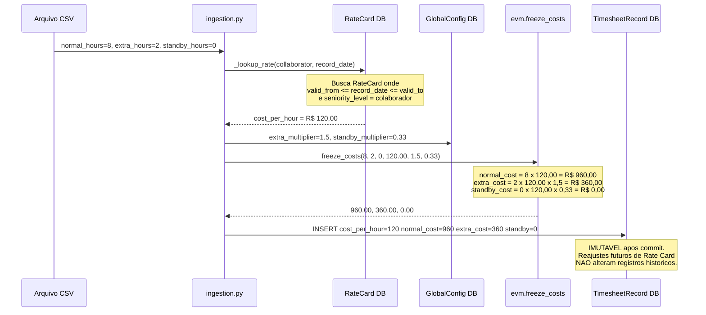
```mermaid
sequenceDiagram
    participant CSV as Arquivo CSV
    participant ING as ingestion.py
    participant DB_RC as RateCard DB
    participant DB_CFG as GlobalConfig DB
    participant EVM as evm.freeze_costs
    participant DB_TR as TimesheetRecord DB

    CSV->>ING: normal_hours=8, extra_hours=2, standby_hours=0
    ING->>DB_RC: _lookup_rate(collaborator, record_date)
    Note over DB_RC: Busca RateCard onde<br/>valid_from <= record_date <= valid_to<br/>e seniority_level = colaborador
    DB_RC-->>ING: cost_per_hour = R$ 120,00
    ING->>DB_CFG: extra_multiplier=1.5, standby_multiplier=0.33
    ING->>EVM: freeze_costs(8, 2, 0, 120.00, 1.5, 0.33)
    Note over EVM: normal_cost  = 8 x 120,00 = R$ 960,00<br/>extra_cost   = 2 x 120,00 x 1,5 = R$ 360,00<br/>standby_cost = 0 x 120,00 x 0,33 = R$ 0,00
    EVM-->>ING: 960.00, 360.00, 0.00
    ING->>DB_TR: INSERT cost_per_hour=120 normal_cost=960 extra_cost=360 standby=0

    Note over DB_TR: IMUTAVEL apos commit.<br/>Reajustes futuros de Rate Card<br/>NAO alteram registros historicos.
```

**Por que congelar?** Se a taxa de um colaborador sênior subir de R$ 120 para R$ 150 em março, os relatórios de janeiro e fevereiro devem continuar mostrando o custo original. O PMAS garante isso armazenando o custo calculado junto com cada `TimesheetRecord`.

### Resolução de orçamento efetivo

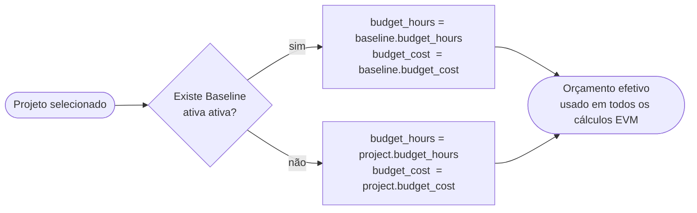
```mermaid
flowchart LR
    A([Projeto selecionado]) --> B{Existe Baseline\nativa ativa?}
    B -- sim --> C[budget_hours = baseline.budget_hours\nbudget_cost  = baseline.budget_cost]
    B -- não --> D[budget_hours = project.budget_hours\nbudget_cost  = project.budget_cost]
    C & D --> E([Orçamento efetivo\nusado em todos os cálculos EVM])
```

`ProjectBaseline` registra revisões de orçamento (re-baseline). Enquanto há uma baseline ativa, ela tem precedência sobre os campos diretos do `Project`. Isso preserva rastreabilidade: o histórico de baselines mostra quando e por quem o orçamento foi revisado.

### Métricas EVM — referência completa

#### Earned Value (EV)

O **Earned Value** mede quanto trabalho foi realizado em termos monetários, limitado ao orçamento (BAC).

```
EV = min(consumed_hours / budget_hours, 1.0) × BAC
```

> O cap em `1.0` impede que um projeto "ganhe" mais valor do que seu orçamento permite — conforme PMBoK.

#### Cost Performance Index (CPI)

```
CPI = EV / AC
```

| Valor | Significado | Cor |
|---|---|---|
| ≥ 1,00 | Dentro do orçamento | 🟢 success |
| 0,90 – 0,99 | Atenção | 🟡 warning |
| < 0,90 | Acima do orçamento | 🔴 danger |

#### Schedule Performance Index (SPI)

O PMAS usa o **proxy AgileEVM de horas** (preferível quando só há baseline de horas, sem custo por ciclo):

```
SPI = cumulative_actual_hours / cumulative_planned_hours
```

O SPI é **congelado na última fronteira de avanço do plano** (`freeze_spi_boundary`): se o plano terminou mas o projeto ainda consome horas, o SPI não regride artificialmente — permanece no valor do último ciclo onde `cumulative_planned_hours` avançou.

| Valor | Significado | Cor |
|---|---|---|
| ≥ 1,00 | No prazo | 🟢 success |
| 0,90 – 0,99 | Atenção | 🟡 warning |
| < 0,90 | Atrasado | 🔴 danger |

#### Estimate at Completion (EAC)

Dois métodos disponíveis:

**EAC padrão (baseado em CPI):**
```
EAC = BAC / CPI
```

**EAC sensível ao prazo (CPI × SPI):**
```
EAC_schedule = AC + (BAC − EV) / (CPI × SPI)
```

Quando `SPI < 1` (atraso), o `EAC_schedule` é maior — reflete o custo adicional projetado pelo atraso. O campo `eac_method` na resposta indica qual variante foi calculada (`"cpi"` ou `"cpi_spi"`).

#### To-Complete Performance Index (TCPI)

Mede a eficiência necessária para terminar dentro do orçamento original:

```
TCPI = (BAC − EV) / (BAC − AC)
```

| Valor | Significado | Cor |
|---|---|---|
| ≤ 1,00 | Meta alcançável | 🟢 success |
| 1,00 – 1,10 | Meta apertada | 🟡 warning |
| > 1,10 | Meta inviável no ritmo atual | 🔴 danger |

#### Variance at Completion (VAC)

```
VAC = BAC − EAC
```

Positivo → economia projetada. Negativo → estouro projetado.

#### Cost Variance (CV)

```
CV = EV − AC
```

Positivo → abaixo do orçamento. Negativo → acima do orçamento.

#### Schedule Variance (SV — horas)

```
SV = cumulative_actual_hours − cumulative_planned_hours
```

Positivo → adiantado. Negativo → atrasado.

### Diagrama de cálculo do Forecast


```mermaid
flowchart TD
    A(["GET /api/v2/forecast?pep_wbs=X"]) --> L1

    subgraph LOAD["1 — Carregamento"]
        L1["Busca Project + pep_description"]
        L2["ProjectCyclePlan por ciclo\nplan_by_cycle_start / plan_cost_by_cycle_start"]
        L3["ProjectBaseline ativa\nresolve_effective_budget\nbaseline tem precedência sobre campos do projeto"]
        L4["blended_rate = budget_cost / budget_hours\nusado quando plan_cost não está explícito"]
        L1 --> L2 --> L3 --> L4
    end

    L4 --> CD["_load_cycle_data\nPepCycleSummary se disponível\nsenão TimesheetRecord bruto agrupado por ciclo"]
    CD -->|"404 se vazio"| ERR(["HTTP 404"])
    CD --> LL1

    subgraph LOOP["2 — Loop cronológico sobre os ciclos"]
        LL1["cum_h += period_h\ncum_c += period_c"]
        LL2["cum_ph = soma planned_hours dos ciclos ate cyc_start\npc_period = plan_cost explícito\n  ou planned_h x blended_rate se ausente\ncum_pc += pc_period"]
        LL3["ev_cost_cum = compute_ev_capped\n  = min(cum_h / budget_h, 1.0) x BAC"]
        LL4["spi_cum = compute_spi(cum_ph, cum_h) se has_plan\nsv_period = compute_sv(cum_h, cum_ph)\ncv_period = compute_cv(ev_cost_cum, cum_c)"]
        LL5["h_delta / h_delta_pct\nc_delta / c_delta_pct"]
        LL6["Append history item\nperiod / cumulative / planned / EV\nspi_cum / sv / cv + labels/colors"]
        LL1 --> LL2 --> LL3 --> LL4 --> LL5 --> LL6
        LL6 -->|"próximo ciclo"| LL1
    end

    LL6 -->|"fim dos ciclos"| P1

    subgraph POST["3 — Pos-loop"]
        P1["consumed_hours = cum_h\nactual_cost = cum_c"]
        P2["freeze_spi_boundary\nWalk ciclos em ordem, rastreia ultimo ciclo\nonde cum_planned_h avancou\nretorna last_actual_h e last_planned_h"]
        P3["avg_hours = media das horas\ndos ultimos 3 ciclos com dados"]
        P1 --> P2 --> P3
    end

    P3 --> E1

    subgraph EVM["4 — Indicadores EVM finais"]
        EV_COND(["somente se budget_hours / budget_cost / consumed_hours > 0"])
        E1["ev_val = compute_ev_capped(consumed_h, budget_h, budget_cost)\nEV capped em BAC"]
        E2["SPI: compute_spi(last_planned_h, last_actual_h) — boundary frozen\nSV: compute_sv(last_actual_h, last_planned_h)"]
        E3["somente se actual_cost > 0\nCPI = compute_cpi(ev_val, actual_cost)\nCV  = compute_cv(ev_val, actual_cost)\nTCPI = compute_tcpi(budget_cost, actual_cost, ev_val)"]
        E4["EAC = compute_eac(budget_cost, cpi)\n  default_to_bac=True: retorna BAC se CPI=null\nEAC_schedule = AC + (BAC-EV) / (CPI x SPI)\nVAC = compute_vac(budget_cost, eac)"]
        EV_COND --> E1 --> E2 --> E3 --> E4
    end

    E4 --> CLOSED_CHECK["is_closed = project.status == encerrado\n  AND project.completion_date IS NOT NULL"]

    CLOSED_CHECK --> REM["remaining_hours = max(budget_h - consumed_h, 0)\nremaining_cost  = eac - actual_cost"]

    REM --> C1

    subgraph EST["5 — Estimativa de conclusao"]
        EST_COND(["somente se NOT is_closed / remaining_h > 0 / avg_hours > 0"])
        C1["est_cycles = remaining_hours / avg_hours"]
        C2["Busca proximos N ciclos cadastrados\napos o ultimo ciclo com dados\n(N = ceil(est_cycles))"]
        C3["est_completion = nome do N-esimo ciclo futuro"]
        EST_COND --> C1 --> C2 --> C3
    end

    C3 --> B1

    subgraph BAND["6 — Banda de incerteza"]
        BAND_COND(["somente se est_cycles calculado / remaining_h > 0"])
        B1["Ultimas 3 ciclos com dados:\nh_vals = horas por ciclo nao-zero\nrates  = custo/hora por ciclo nao-zero"]
        B2["Se len(h_vals) >= 2:\nest_cycles_optimistic  = remaining / max(h_vals)\nest_cycles_pessimistic = remaining / min(h_vals)"]
        B3["Se len(rates) >= 2:\neac_low  = AC + remaining x min(rate)\neac_high = AC + remaining x max(rate)"]
        BAND_COND --> B1 --> B2 --> B3
    end

    B3 --> F1

    subgraph FREEZE["7 — Congelamento para projeto encerrado"]
        F1["remaining_hours = 0 / remaining_cost = 0\ntcpi = null / eac_schedule = null\nest_cycles = null / est_completion = null\nbanda de incerteza = null"]
        F2["Se actual_cost > 0:\neac = actual_cost — custo real final, nao projecao\nvac = compute_vac(budget_cost, eac)\ncv  = compute_cv(ev_val, actual_cost)"]
        F1 --> F2
    end

    F2 --> OUT(["JSON render-ready\nCPI / SPI / EAC / eac_schedule / eac_method\nTCPI / VAC / CV / SV\neac_low / eac_high\nest_cycles / est_cycles_optimistic/pessimistic\nest_completion / avg_hours_per_cycle\nis_closed / using_baseline\nhealth_hours / health_cost\nhistory com EV / SV / CV por ciclo"])
```

### Banda de incerteza (R-12)

Nas últimas 3 ciclos com dados, o sistema calcula:
- `est_cycles_optimistic` — usando a maior velocidade observada
- `est_cycles_pessimistic` — usando a menor velocidade
- `eac_low` / `eac_high` — AC + horas_restantes × (menor/maior taxa de custo por hora)

Isso produz um intervalo de confiança para o término, sem depender de modelos estatísticos.

### Classificação de saúde (`classify_health`)

Usada no Semáforo, Portfolio Health, Runway e alertas de budget:

```
ratio = consumed / budget

ratio ≥ critical_threshold → "overrun"   🔴
ratio ≥ warning_threshold  → "warning"   🟡
caso contrário              → "ok"        🟢
budget ausente              → "no_budget" ⚫
```

Os limiares (`budget_warning_threshold`, `budget_critical_threshold`) são configuráveis via `GlobalConfig` (padrão: 0,9 e 1,0).

---

## Motor de Regras de Validação

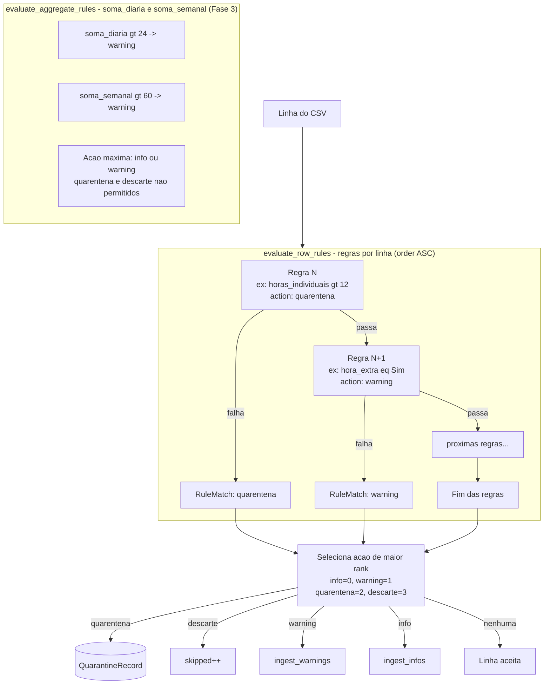
```mermaid
flowchart TD
    Row[Linha do CSV] --> EVAL

    subgraph EVAL["evaluate_row_rules - regras por linha (order ASC)"]
        R1["Regra N\nex: horas_individuais gt 12\naction: quarentena"]
        R2["Regra N+1\nex: hora_extra eq Sim\naction: warning"]
        RN["proximas regras..."]
        R1 -->|falha| M1[RuleMatch: quarentena]
        R1 -->|passa| R2
        R2 -->|falha| M2[RuleMatch: warning]
        R2 -->|passa| RN
        RN --> ENDR[Fim das regras]
    end

    M1 & M2 --> RANK["Seleciona acao de maior rank\ninfo=0, warning=1\nquarentena=2, descarte=3"]
    ENDR --> RANK

    RANK -->|quarentena| QR[(QuarantineRecord)]
    RANK -->|descarte| SKIP[skipped++]
    RANK -->|warning| WARN[ingest_warnings]
    RANK -->|info| INFO[ingest_infos]
    RANK -->|nenhuma| OK[Linha aceita]

    subgraph AGG["evaluate_aggregate_rules - soma_diaria e soma_semanal (Fase 3)"]
        AG1["soma_diaria gt 24 -> warning"]
        AG2["soma_semanal gt 60 -> warning"]
        AG3["Acao maxima: info ou warning\nquarentena e descarte nao permitidos"]
    end
```

**Campos disponíveis por linha (`row_fields`):**

| Campo | Tipo | Descrição |
|---|---|---|
| `horas_individuais` | float | Total de horas do lançamento |
| `hora_extra` | string | `"Sim"` / `"Não"` — indicador da coluna CSV |
| `hora_sobreaviso` | string | `"Sim"` / `"Não"` — indicador da coluna CSV |
| `hora_extra_horas` | float | Horas numéricas se `hora_extra=Sim`, senão `0.0` |
| `hora_sobreaviso_horas` | float | Horas numéricas se `hora_sobreaviso=Sim`, senão `0.0` |
| `pep_wbs` | string | Código PEP do lançamento (pode ser `None`) |
| `dia_semana` | int | 0=Segunda … 6=Domingo |

**Campos de agregação (`soma_diaria`/`soma_semanal` — Fase 3):**

| Campo | Tipo | Descrição |
|---|---|---|
| `soma_diaria` | float | Total de horas do colaborador no dia |
| `soma_semanal` | float | Total de horas do colaborador na semana ISO |

> Regras com `soma_diaria` ou `soma_semanal` só aceitam ações `info` ou `warning`. Tentativas de usar `quarentena` ou `descarte` são rebaixadas para `warning` automaticamente.

**Operadores disponíveis:**

| Operador | Tipo | Comportamento |
|---|---|---|
| `gt` / `gte` / `lt` / `lte` | numérico | Comparação maior/maior-igual/menor/menor-igual |
| `eq` / `neq` | numérico ou string | Igualdade (tenta float primeiro, cai para string) |
| `vazio` | qualquer | Campo é `None` ou string vazia |
| `nao_vazio` | qualquer | Campo tem conteúdo |
| `contem` | string | Subcadeia (case-insensitive) |
| `nao_contem` | string | Ausência de subcadeia (case-insensitive) |
| `in_lista` | string | Valor está na lista separada por vírgulas no `value` |

**Ações e rank de prioridade:**

| Ação | Rank | Efeito |
|---|---|---|
| `info` | 0 | Registra em `ingest_infos` (visível no histórico) |
| `warning` | 1 | Registra em `ingest_warnings`; linha aceita |
| `quarentena` | 2 | Linha vai para `QuarantineRecord` |
| `descarte` | 3 | Linha ignorada silenciosamente (`skipped++`) |

> Quando múltiplas regras atingem a mesma linha, a ação de **maior rank** prevalece. Regras com `is_system=True` não podem ser excluídas, apenas desativadas.

---

## Ciclo de Vida da Quarentena

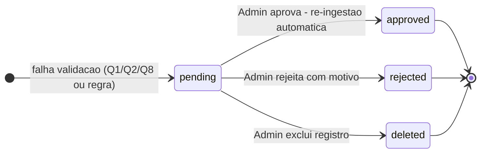
```mermaid
stateDiagram-v2
    direction LR

    [*] --> pending : falha validacao (Q1/Q2/Q8 ou regra)

    pending --> approved : Admin aprova - re-ingestao automatica
    pending --> rejected : Admin rejeita com motivo
    pending --> deleted : Admin exclui registro

    approved --> [*]
    rejected --> [*]
    deleted --> [*]
```

**Visibilidade por papel:**

| Papel | Rota | Dados visíveis |
|---|---|---|
| `admin` | `GET /api/quarantine` | Todos os registros |
| `user` | `GET /api/my/quarantine` | Apenas seus próprios uploads |

---

## Semáforo de Portfólio

O semáforo é uma barra macro no topo da página Dashboard, atualizada a cada carregamento da aplicação.

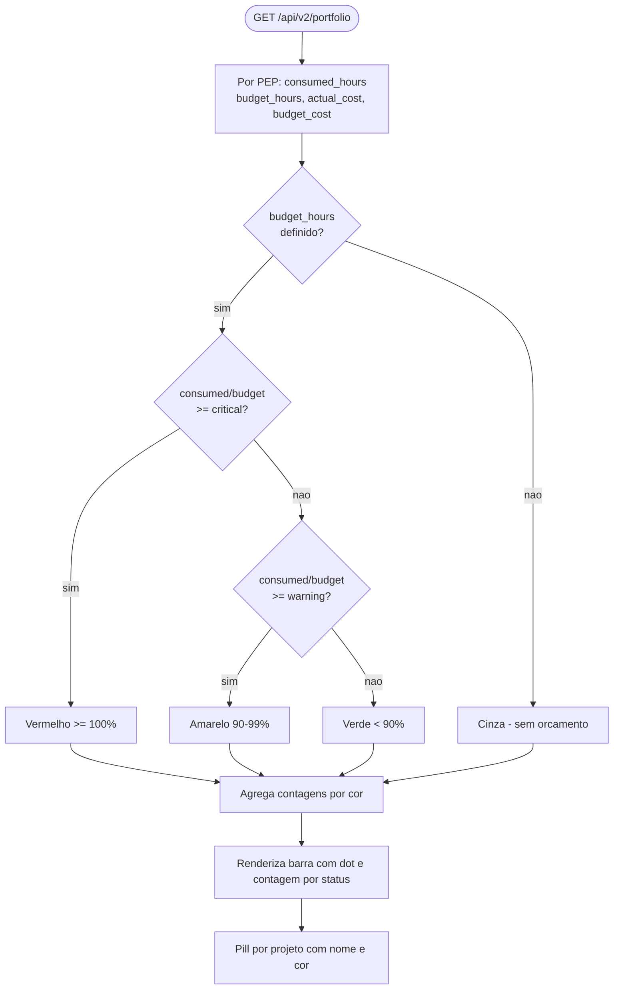
```mermaid
flowchart TD
    A([GET /api/v2/portfolio]) --> B["Por PEP: consumed_hours\nbudget_hours, actual_cost, budget_cost"]
    B --> C{"budget_hours\ndefinido?"}
    C -- nao --> GREY["Cinza - sem orcamento"]
    C -- sim --> D{"consumed/budget\n>= critical?"}
    D -- sim --> RED["Vermelho >= 100%"]
    D -- nao --> E{"consumed/budget\n>= warning?"}
    E -- sim --> YELLOW["Amarelo 90-99%"]
    E -- nao --> GREEN["Verde < 90%"]

    RED & YELLOW & GREEN & GREY --> F["Agrega contagens por cor"]
    F --> G["Renderiza barra com dot e contagem por status"]
    G --> H["Pill por projeto com nome e cor"]
```

---

## Frontend

### Estrutura de abas

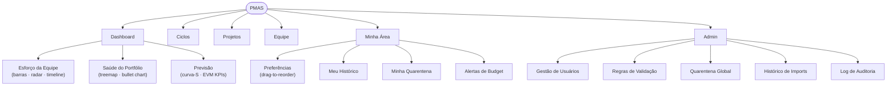
```mermaid
graph TD
    App([PMAS]) --> Dashboard
    App --> Ciclos
    App --> Projetos
    App --> Equipe
    App --> MinhaArea["Minha Área"]
    App --> Admin

    Dashboard --> Esforco["Esforço da Equipe\n(barras · radar · timeline)"]
    Dashboard --> Saude["Saúde do Portfólio\n(treemap · bullet chart)"]
    Dashboard --> Previsao["Previsão\n(curva-S · EVM KPIs)"]

    Admin --> UsuariosAdmin["Gestão de Usuários"]
    Admin --> RegrasAdmin["Regras de Validação"]
    Admin --> QuarentenaAdmin["Quarentena Global"]
    Admin --> HistoricoAdmin["Histórico de Imports"]
    Admin --> AuditAdmin["Log de Auditoria"]

    MinhaArea --> MinhaPrefs["Preferências\n(drag-to-reorder)"]
    MinhaArea --> MeuHistorico["Meu Histórico"]
    MinhaArea --> MinhaQuarentena["Minha Quarentena"]
    MinhaArea --> MeusAlertas["Alertas de Budget"]
```

### Gerenciamento de gráficos ECharts

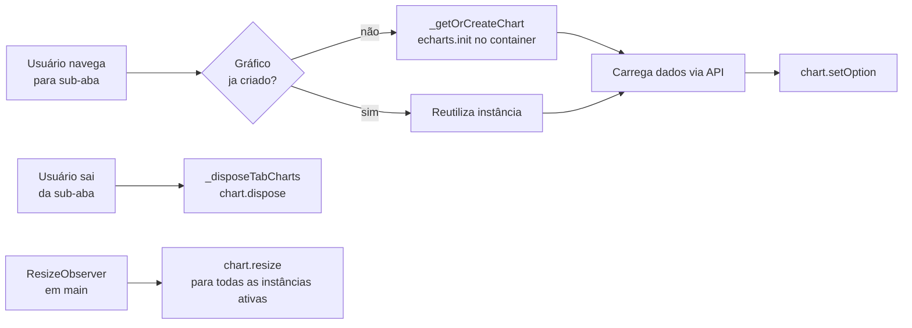
```mermaid
flowchart LR
    A[Usuário navega\npara sub-aba] --> B{Gráfico\nja criado?}
    B -- não --> C[_getOrCreateChart\necharts.init no container]
    B -- sim --> C2[Reutiliza instância]
    C & C2 --> D[Carrega dados via API]
    D --> E[chart.setOption]

    F[Usuário sai\nda sub-aba] --> G[_disposeTabCharts\nchart.dispose]

    H[ResizeObserver\nem main] --> I[chart.resize\npara todas as instâncias ativas]
```

**Registry `CHARTS_PER_TAB`:** cada sub-aba declara quais `chart_id` gerencia. `_disposeTabCharts(tab)` libera memória ao sair, evitando acúmulo de instâncias ECharts.

### i18n

531 chaves por idioma (`pt.js` e `en.js`). `_t(key)` retorna a tradução do idioma ativo. `_applyI18n()` percorre todos os elementos `[data-i18n]` e substitui `textContent`, `placeholder`, `title` e `aria-label`. Toggle de idioma persiste em `localStorage`.

---

## API REST

### Upload e ingestão

| Método | Rota | Descrição |
|---|---|---|
| `POST` | `/api/upload-timesheet` | Ingestão CSV/XLSX (pipeline 6 fases) |
| `GET` | `/api/upload-history` | Histórico de uploads (admin) |
| `GET` | `/api/upload-history/{id}` | Detalhes de um upload específico |

### Dashboard e Analytics (v2)

| Método | Rota | Descrição | Filtros principais |
|---|---|---|---|
| `GET` | `/api/v2/filters` | Colaboradores, PEPs e ciclos em uma única chamada | — |
| `GET` | `/api/v2/effort` | Esforço por colaborador (horas + custo) | `cycle_id` · `pep_wbs` · `pep_description` · `collaborator_id` · `date_from` · `date_to` |
| `GET` | `/api/v2/portfolio` | Saúde do portfólio por PEP (EVM + hours) | idem |
| `GET` | `/api/v2/forecast` | Previsão EVM completa por PEP (curva-S + CPI/SPI/EAC) | `pep_wbs` · `date_from` · `date_to` |
| `GET` | `/api/v2/runway` | Runway e risco por PEP (ciclos restantes, cost_risk) | idem effort |
| `GET` | `/api/v2/trends` | Queima de horas/custo por ciclo (cronológico) | `pep_wbs` · `date_from` · `date_to` |
| `GET` | `/api/v2/allocation` | Alocação: horas e custo por colaborador × PEP | idem effort |
| `GET` | `/api/v2/concentration` | Concentração: top contribuidores por PEP | idem effort |
| `GET` | `/api/v2/over-allocation` | Over-allocation: colaboradores acima da capacidade | `cycle_id` · `date_from` · `date_to` · `sort` |
| `POST` | `/api/v2/projects/{id}/simulate` | What-If: multiplica velocidade + horas extras → EAC projetado | body: `velocity_multiplier`, `extra_hours_per_cycle` |
| `GET` | `/api/v2/projects/{id}/monte-carlo` | Monte Carlo: P10/P50/P90 de conclusão + histograma | `iterations` · `date_from` · `date_to` · `seed` |

### Dashboard legado (v1)

| Método | Rota | Descrição |
|---|---|---|
| `GET` | `/api/dashboard/collaborator-timeline` | Evolução de horas por colaborador ao longo dos ciclos |

### Ciclos

| Método | Rota | Descrição |
|---|---|---|
| `GET/POST` | `/api/cycles` | Listar / criar |
| `PUT/DELETE` | `/api/cycles/{id}` | Atualizar / excluir |
| `PATCH` | `/api/cycles/{id}/toggle-status` | Bloquear / desbloquear |
| `POST/GET` | `/api/cycles/import` · `/api/cycles/export` | CSV import/export |

### Projetos e Planos

| Método | Rota | Descrição |
|---|---|---|
| `GET/POST` | `/api/projects` | Listar / criar |
| `PUT/DELETE` | `/api/projects/{id}` | Atualizar / excluir |
| `POST/GET` | `/api/projects/import` · `/api/projects/export` | CSV import/export |
| `GET/POST` | `/api/projects/{id}/plans` | Planos de ciclo (baseline S-curve) |
| `PUT/DELETE` | `/api/projects/{id}/plans/{plan_id}` | Atualizar / excluir plano |
| `GET/POST` | `/api/plans/export` · `/api/plans/import` | CSV de planos |
| `GET/POST/DELETE` | `/api/projects/{id}/access` | ACL por usuário (admin) |
| `POST` | `/api/projects/{id}/baseline` | Cria nova revisão de baseline (congela budget atual) |
| `GET` | `/api/projects/{id}/baselines` | Lista revisões de baseline do projeto |
| `DELETE` | `/api/projects/{id}/baselines/{bl_id}` | Exclui uma revisão (admin) |
| `POST` | `/api/projects/{id}/baselines/{bl_id}/activate` | Reativa um baseline histórico |

### Equipe e Rate Card

| Método | Rota | Descrição |
|---|---|---|
| `GET/POST/PUT/DELETE` | `/api/seniority-levels[/{id}]` | CRUD de níveis de senioridade |
| `GET/POST/PUT/DELETE` | `/api/rate-cards[/{id}]` | CRUD de taxas com vigência |
| `GET` | `/api/team` | Colaboradores com senioridade e taxa atual |
| `PUT` | `/api/team/{id}/seniority` | Atribuir senioridade individual |
| `PUT` | `/api/team/bulk-seniority` | Atribuir senioridade em lote |
| `GET/PUT` | `/api/config` | Multiplicadores EVM e limiares globais |

### Quarentena e Regras

| Método | Rota | Descrição |
|---|---|---|
| `GET` | `/api/quarantine` | Listar registros (admin) |
| `POST` | `/api/quarantine/{id}/approve` | Aprovar e re-ingestar |
| `POST` | `/api/quarantine/{id}/reject` | Rejeitar |
| `DELETE` | `/api/quarantine/{id}` | Excluir |
| `GET/POST` | `/api/validation-rules` | Listar / criar regras |
| `PUT/DELETE` | `/api/validation-rules/{id}` | Atualizar / excluir |
| `PATCH` | `/api/validation-rules/{id}/toggle` | Ativar / desativar |
| `POST` | `/api/validation-rules/reorder` | Reordenar |

### Usuários, Audit e Tema

| Método | Rota | Descrição |
|---|---|---|
| `POST` | `/api/token` | Login — retorna JWT (exp: 8h) |
| `GET/POST/PUT/DELETE` | `/api/users[/{id}]` | CRUD de usuários (admin) |
| `PUT` | `/api/users/{id}/password` | Alterar senha |
| `GET` | `/api/audit-log` | Log de auditoria (admin) |
| `GET/PUT` | `/api/theme` | Tema global |
| `POST/DELETE` | `/api/theme/logo` | Upload / remoção de logo |
| `GET/PUT` | `/api/my/preferences` | Preferências do usuário logado |
| `GET` | `/api/my/upload-history` | Histórico de uploads do usuário |
| `GET` | `/api/my/quarantine` | Quarentena do usuário |
| `GET` | `/api/my/budget-alerts` | Alertas de budget acessíveis ao usuário |
| `GET` | `/api/collaborators` | Lista colaboradores com registros |
| `GET` | `/api/peps` | Lista PEPs com descrições agrupadas |

---

## Instalação e Execução

### Pré-requisitos

- Python **3.11** ou **3.12**
- pip

### Execução direta

```bash
git clone https://github.com/RtaSistemas/PMAS.git
cd PMAS
pip install -r requirements.txt
python -m uvicorn backend.app.main:app --reload
```

Acesse **http://127.0.0.1:8000** — login padrão: `admin` / `admin`.

O banco `pmas.db` é criado automaticamente na primeira execução. Novas colunas são aplicadas via `_migrate_columns()` (`ALTER TABLE`) no startup — bancos existentes nunca perdem dados.

### Opções de inicialização

```bash
# Expor na rede local
python -m uvicorn backend.app.main:app --host 0.0.0.0 --port 8080

# Sem reload automático (produção)
python -m uvicorn backend.app.main:app --host 0.0.0.0 --port 8000 --workers 1
```

---

## Dados de Amostra

```bash
python amostras/generate_portfolio.py
```

Gera em `amostras/`:
- `ciclos.csv` — 29 ciclos mensais (Jan/2024 – Mai/2026)
- `projetos.csv` — 10 PEPs com códigos `60IT-XXX-01`
- `senioridade_rate_card.csv` — níveis e taxas
- `timesheets/AAAA-MM.csv` — timesheet mensal por ciclo, pronto para import

```bash
# Simulação de portfólio grande (opcional)
python amostras/generate_grande_sim.py
# Gera em amostras/grande_sim/: 5 anos de histórico, múltiplas equipes
```

---

## Configuração

### GlobalConfig (singleton — Admin → Configuração Global)

| Parâmetro | Padrão | Descrição |
|---|---|---|
| `extra_hours_multiplier` | `1.5` | Multiplicador de custo para horas extras |
| `standby_hours_multiplier` | `0.33` | Multiplicador de custo para horas sobreaviso |
| `budget_warning_threshold` | `0.9` | Limite para alerta ⚠ (amarelo) |
| `budget_critical_threshold` | `1.0` | Limite para alerta 🔴 (vermelho) |
| `anomaly_max_daily_hours` | `24.0` | Teto de horas diárias para regra de anomalia |
| `timezone` | `America/Sao_Paulo` | Fuso horário |

### Roles de usuário

| Role | Permissões |
|---|---|
| `admin` | Acesso total: todos os PEPs, todas as rotas de gestão |
| `user` | Leitura filtrada por ACL; upload de timesheets; visualização de próprios uploads/quarentena |

### ACL por PEP

`UserProjectAccess` define uma whitelist de PEPs por usuário. Whitelist vazia = acesso a todos os PEPs. Enforced em `/api/v2/portfolio`, `/api/v2/effort`, `/api/v2/runway`, `/api/v2/forecast` e no próprio upload.

---

## Testes

```bash
pip install pytest httpx
pytest tests/ -v
```

590 testes em 20 arquivos. Todos usam SQLite em memória (`StaticPool`) — nenhum `pmas.db` é tocado.

| Arquivo | Testes | Cobertura |
|---|---:|---|
| `test_evm_service.py` | 104 | Unitários de todas as funções de `services/evm.py` (happy/boundary/None) |
| `test_full_sample.py` | 83 | Pipeline end-to-end com dados de amostra completos |
| `test_ingestion.py` | 64 | Parse CSV/XLSX, quarentena, motor de regras |
| `test_v2_endpoints.py` | 64 | Todos endpoints `/api/v2` (filters, portfolio, effort, trends, forecast, allocation, concentration) |
| `test_ratecard.py` | 35 | SeniorityLevel, RateCard, EVM freeze |
| `test_rule_engine.py` | 32 | ValidationRule CRUD, toggle, reorder, avaliação por linha |
| `test_projects.py` | 27 | CRUD projetos + campos EVM (datas, status) |
| `test_theme.py` | 24 | CRUD tema UI + presets de tema |
| `test_quarantine.py` | 23 | Workflow approve/reject/delete |
| `test_runway_concentration.py` | 23 | `/api/v2/runway` + `/api/v2/concentration` (janela de velocidade, SPI/CPI, risco top-1) |
| `test_users.py` | 22 | CRUD usuários, troca de senha, restrição de roles |
| `test_cycles.py` | 20 | CRUD ciclos |
| `test_evm_integrity.py` | 20 | EVM HTTP integration — respostas render-ready, EV capped at BAC, CPI=EV/AC |
| `test_over_allocation.py` | 13 | Detecção de over-allocation (filtros, sort, CSV) |
| `test_validation_rules.py` | 10 | API de regras de validação |
| `test_monte_carlo.py` | 8 | Monte Carlo P10/P50/P90, histograma, guard de dados insuficientes |
| `test_simulate.py` | 7 | What-If: janela de velocidade, EAC projetado, burn-up |
| `test_auth.py` | 5 | Login JWT, validação de token |
| `test_my.py` | 5 | Endpoints `/api/my/*` per-user |
| `test_simulation.py` | 1 | Smoke test end-to-end de simulação de portfólio |

O fixture `clean_db` em `conftest.py` limpa todas as tabelas **antes** de cada teste (setup, não teardown), garantindo estado inicial conhecido.

---

## Estrutura do Projeto

```
PMAS/
├── backend/
│   └── app/
│       ├── main.py              # FastAPI: CORS, routers, static, init_db
│       ├── models.py            # 20 modelos ORM (SQLAlchemy 2.0)
│       ├── schemas.py           # Pydantic I/O
│       ├── database.py          # Engine SQLite, get_db(), _migrate_columns()
│       ├── deps.py              # JWT: get_current_user, require_admin
│       ├── audit.py             # log_audit() helper
│       ├── limiter.py           # Rate limiter
│       ├── utils.py             # now_br(), helpers
│       ├── routers/
│       │   ├── auth.py          # POST /api/token
│       │   ├── cycles.py        # CRUD + CSV ciclos
│       │   ├── projects.py      # CRUD + CSV projetos
│       │   ├── plans.py         # Baseline S-curve
│       │   ├── baselines.py     # Revisões de baseline
│       │   ├── ratecard.py      # Rate cards + equipe
│       │   ├── upload.py        # Upload de timesheet
│       │   ├── quarantine.py    # Fluxo de quarentena
│       │   ├── validation_rules.py
│       │   ├── users.py
│       │   ├── my.py            # Endpoints per-user
│       │   ├── acl.py           # ACL por PEP
│       │   ├── auditlog.py
│       │   ├── theme.py
│       │   └── v2/
│       │       ├── effort.py         # Esforço por colaborador
│       │       ├── portfolio.py      # Saúde do portfólio
│       │       ├── forecast.py       # EVM completo por PEP
│       │       ├── runway.py         # Runway + risco
│       │       ├── trends.py         # Queima de horas por ciclo
│       │       ├── allocation.py
│       │       ├── concentration.py
│       │       ├── over_allocation.py # Over-allocation por colaborador
│       │       ├── simulate.py        # What-If: cenário de velocidade + horas extras
│       │       ├── monte_carlo.py     # Monte Carlo: P10/P50/P90 + histograma
│       │       └── filters.py
│       └── services/
│           ├── evm.py           # ← Fonte única de todas as fórmulas EVM
│           ├── ingestion.py     # Pipeline 6 fases + _lookup_rate()
│           ├── rule_engine.py   # Motor de ValidationRules
│           ├── summaries.py     # Upsert PepCycleSummary / CollaboratorCycleSummary
│           ├── quarantine_svc.py
│           ├── upload_session_svc.py
│           └── theme_svc.py
├── frontend/
│   ├── index.html               # 6 abas + 3 sub-abas analíticas + modais
│   ├── style.css                # Design system: Dark Navy + Sky Blue
│   ├── app.js                   # Toda a lógica cliente (i18n · CRUD · charts · auth)
│   ├── ui-helpers.js            # _makePaginator · _renderTable · _buildTableRow
│   ├── multiselect.js           # Componente MultiSelect cascata
│   ├── evm-glossary.js          # Glossário EVM (tooltips)
│   ├── echarts.min.js           # ECharts 5 (bundle local)
│   └── charts/
│       ├── effort.js            # Barras de esforço por colaborador
│       ├── portfolio.js         # Treemap + Bullet chart
│       └── forecast.js          # Curva-S + KPIs EVM
├── frontend/lang/
│   ├── pt.js                    # 531 chaves PT-BR
│   └── en.js                    # 531 chaves EN
├── tests/                       # 20 arquivos, 590 testes
├── amostras/                    # Gerador de portfólio + CSVs prontos
├── assets/                      # Ícones para executável Windows
├── static/assets/logos/         # Logos enviados via /api/theme/logo
├── .github/workflows/
│   ├── tests.yml                # CI: pytest Python 3.11 e 3.12
│   └── release.yml              # Build PyInstaller Linux + Windows
├── CLAUDE.md                    # Guia de desenvolvimento para IA
├── MANUAL.md                    # Manual do usuário
├── requirements.txt
├── requirements-lock.txt
└── run.py                       # Entrypoint PyInstaller
```

---

## Build Standalone

O PMAS pode ser distribuído como executável único (sem Python instalado):

```bash
# Disparar build via GitHub Actions (publica em Releases)
git tag v1.2.0
git push origin v1.2.0

# Build local — Linux
pip install pyinstaller
pyinstaller --onefile --name pmas-linux-x64 \
  --add-data "frontend:frontend" \
  --add-data "static:static" \
  run.py

# Build local — Windows
pyinstaller --onefile --name pmas-windows-x64 \
  --icon assets\icon.ico \
  --add-data "frontend;frontend" \
  --add-data "static;static" \
  run.py
```

O workflow `.github/workflows/release.yml` executa ambos os builds em paralelo (runner Linux para x64, runner Windows para x64) e anexa os binários ao GitHub Release automaticamente.

---

## Licença

Distribuído sob licença MIT. Consulte [`LICENSE`](LICENSE) para detalhes.
