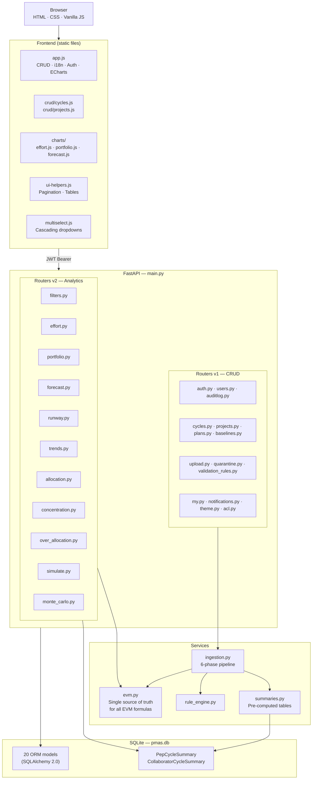
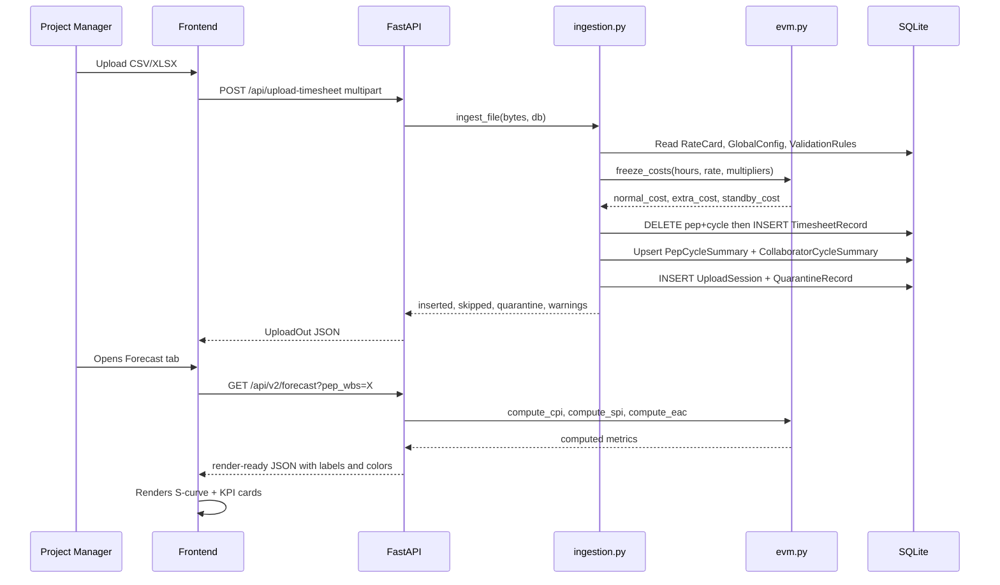
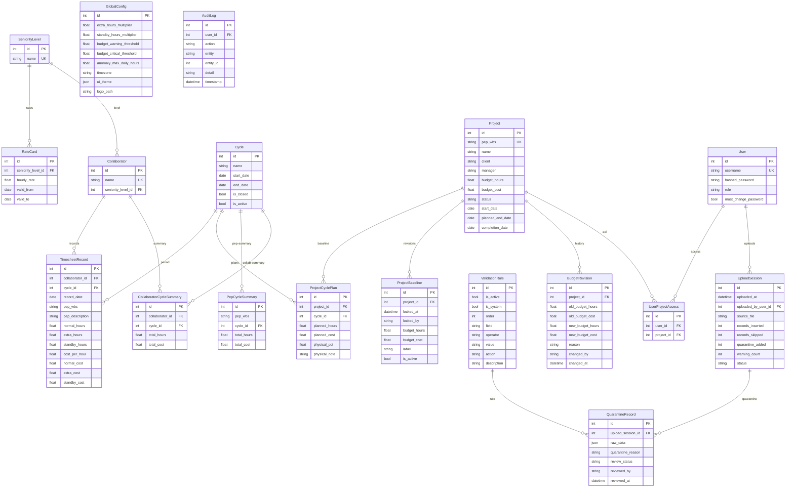
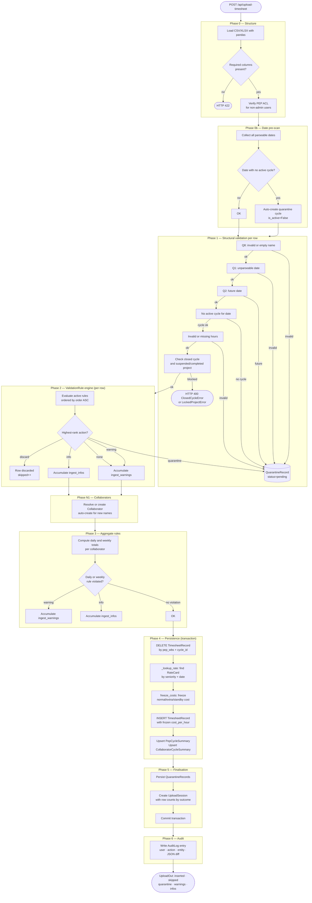
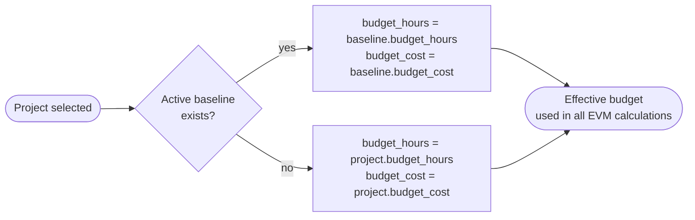
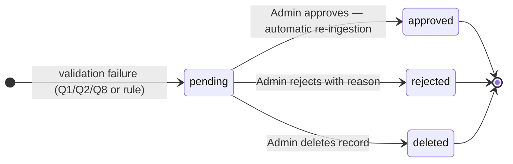

<h1 align="center">PMAS — Project Management Assistant System</h1>

<p align="center">
  <em>Timesheet analytics dashboard: hours, costs, EVM, and portfolio health — in real time.</em>
</p>

<p align="center">
  
  
  
  
  
</p>

---

## Table of Contents

1. [Overview](#overview)
2. [Stack](#stack)
3. [Quick Start](#quick-start)
4. [Sample Data](#sample-data)
5. [Configuration](#configuration)
6. [Architecture](#architecture)
7. [Data Model](#data-model)
8. [Ingestion Pipeline](#ingestion-pipeline)
9. [EVM Engine](#evm-engine)
10. [Validation Rule Engine](#validation-rule-engine)
11. [Quarantine Lifecycle](#quarantine-lifecycle)
12. [Portfolio Semaphore](#portfolio-semaphore)
13. [Frontend](#frontend)
14. [REST API Reference](#rest-api-reference)
15. [Tests](#tests)
16. [Project Structure](#project-structure)
17. [Standalone Build](#standalone-build)

---

## Overview

PMAS transforms timesheet exports (CSV or XLSX) into interactive project management dashboards. Project managers import monthly hour sheets, register billing cycles and budgeted projects, and visualise in real time the consumption of hours per collaborator, per PEP (project code) and per cycle — with actual cost calculated via a Rate Card frozen at ingestion time.

The system addresses three core PMO needs:

| Need | How PMAS addresses it |
|---|---|
| **Traceability** | Every upload creates an immutable `UploadSession` with row counts by outcome; all CRUD operations write to `AuditLog` |
| **Cost reliability** | EVM freeze pattern: `cost_per_hour` resolved at ingestion and immune to future Rate Card changes |
| **Portfolio health** | CPI, SPI, EAC, TCPI, VAC, CV, SV computed server-side via `services/evm.py`; visual macro traffic-light semaphore |

### What PMAS produces

**Human effort** — who did what and when:
- Hours per collaborator (normal / overtime / standby)
- Monthly timeline and daily activity heatmap per collaborator
- Month-by-month consumption trend
- Allocation matrix: collaborator × PEP

**Project financial health** — how much it costs and how much is left:
- Actual cumulative cost per project (AC), calculated with rates frozen at ingestion
- Consumed vs planned budget (bullet chart)
- Cost breakdown: normal hours, overtime, standby
- Concentration risk: which collaborators dominate each project's cost

**EVM performance** — whether projects are delivering value for what they spend:
- CPI, SPI, EAC, VAC, TCPI, CV, SV per project
- CPI and SPI history over cycles
- EVM quadrant: project positions in cost × schedule space
- Forecast: when it will finish and what the final cost will be

**Governance and traceability:**
- Quarantine workflow (pending → approved/rejected)
- Upload history with exact row counts per outcome
- Full audit log with before/after JSON snapshots
- Per-user access control by PEP

---

## Stack

| Layer | Technology |
|---|---|
| Backend | Python 3.11+ · FastAPI 0.111 · SQLAlchemy 2.0 |
| Database | Embedded SQLite (`pmas.db`, WAL mode) |
| Authentication | JWT (python-jose) · bcrypt |
| Frontend | HTML5 · CSS3 · Vanilla JavaScript |
| Charts | Apache ECharts 5 |
| Parsing | pandas · openpyxl |
| Tests | pytest · httpx · FastAPI TestClient |
| Build | PyInstaller (Linux x64 + Windows x64) |
| CI | GitHub Actions (Python 3.11 / 3.12) |

---

## Quick Start

### Prerequisites

- Python **3.11** or **3.12**
- pip

### Run

```bash
git clone https://github.com/RtaSistemas/PMAS.git
cd PMAS
pip install -r requirements.txt
python -m uvicorn backend.app.main:app --reload
```

Open **http://127.0.0.1:8000** — default login: `admin` / `admin`.

> **Change the default password immediately.** The admin account is created on first startup with a warning logged to the console.

The database `pmas.db` is created automatically on first run. New columns are applied non-destructively via `_migrate_columns()` (`ALTER TABLE`) on every startup — existing databases are never dropped.

### Other start options

```bash
# Expose on local network
python -m uvicorn backend.app.main:app --host 0.0.0.0 --port 8080

# Production mode (no auto-reload)
python -m uvicorn backend.app.main:app --host 0.0.0.0 --port 8000 --workers 1
```

### Makefile shortcuts

```bash
make serve        # start dev server
make test         # run all tests (backend + unit + e2e)
make test-backend # pytest only
```

---

## Sample Data

```bash
python amostras/generate_portfolio.py
```

Generates in `amostras/`:
- `ciclos.csv` — 29 monthly cycles (Jan/2024 – May/2026)
- `projetos.csv` — 10 PEPs with `60IT-XXX-01` codes
- `senioridade_rate_card.csv` — seniority levels and rates
- `timesheets/YYYY-MM.csv` — one timesheet file per cycle, ready to import

```bash
# Large portfolio simulation (optional)
python amostras/generate_grande_sim.py
# Generates amostras/grande_sim/: 5 years of history, multiple teams
```

---

## Configuration

### Environment variables (`.env`)

Copy `.env.example` to `.env` and set the values:

| Variable | Default | Description |
|---|---|---|
| `PMAS_SECRET_KEY` | *(random)* | JWT signing secret. **Required in production.** Generate with: `python -c "import secrets; print(secrets.token_hex(32))"` |
| `PMAS_PORT` | `8765` | Listening port |
| `PMAS_HOST` | `127.0.0.1` | Network interface |
| `PMAS_ENV` | `development` | `development` (auto-reload) or `production` |
| `PMAS_ALLOWED_ORIGINS` | *(empty)* | Additional CORS origins, comma-separated |
| `PMAS_DB_PATH` | *(project root)* | Path to `pmas.db` |
| `PMAS_LOG_LEVEL` | `INFO` | `DEBUG`, `INFO`, `WARNING`, or `ERROR` |

> Without `PMAS_SECRET_KEY`, a random key is generated at startup. All existing sessions are invalidated on restart. Set it for persistent sessions.

### GlobalConfig (singleton — Admin → Global Config)

| Parameter | Default | Description |
|---|---|---|
| `extra_hours_multiplier` | `1.5` | Cost multiplier for overtime hours |
| `standby_hours_multiplier` | `0.33` | Cost multiplier for standby hours |
| `budget_warning_threshold` | `0.9` | Warning badge threshold ⚠ (yellow) |
| `budget_critical_threshold` | `1.0` | Critical badge threshold 🔴 (red) |
| `anomaly_max_daily_hours` | `24.0` | Daily hours ceiling for the anomaly rule |
| `timezone` | `America/Sao_Paulo` | Timezone for display |

### User roles

| Role | Permissions |
|---|---|
| `admin` | Full access: all PEPs, all management routes |
| `user` | Filtered read access per ACL; timesheet upload; own upload history / quarantine |

### Per-PEP ACL

`UserProjectAccess` whitelists specific PEPs per user. Empty whitelist = access to all PEPs. Enforced in `/api/v2/portfolio`, `/api/v2/effort`, `/api/v2/runway`, `/api/v2/forecast`, and upload.

---

## Architecture


```mermaid
graph TD
    Browser["Browser\nHTML · CSS · Vanilla JS"]

    subgraph FE["Frontend (static files)"]
        AppJS["app.js\nCRUD · i18n · Auth · ECharts"]
        CrudFiles["crud/cycles.js\ncrud/projects.js"]
        Charts["charts/\neffort.js · portfolio.js · forecast.js"]
        UIHelpers["ui-helpers.js\nPagination · Tables"]
        MS["multiselect.js\nCascading dropdowns"]
    end

    subgraph API["FastAPI — main.py"]
        direction TB
        subgraph V1["Routers v1 — CRUD"]
            Auth["auth.py · users.py · auditlog.py"]
            Data["cycles.py · projects.py · plans.py · baselines.py"]
            Ops["upload.py · quarantine.py · validation_rules.py"]
            UX["my.py · notifications.py · theme.py · acl.py"]
        end
        subgraph V2["Routers v2 — Analytics"]
            direction LR
            Filters["filters.py"]
            Effort["effort.py"]
            Portfolio["portfolio.py"]
            Forecast["forecast.py"]
            Runway["runway.py"]
            Trends["trends.py"]
            Alloc["allocation.py"]
            Conc["concentration.py"]
            OA["over_allocation.py"]
            Sim["simulate.py"]
            MC["monte_carlo.py"]
        end
    end

    subgraph SVC["Services"]
        Ingestion["ingestion.py\n6-phase pipeline"]
        EVM["evm.py\nSingle source of truth\nfor all EVM formulas"]
        RuleEng["rule_engine.py"]
        Summaries["summaries.py\nPre-computed tables"]
    end

    subgraph DB["SQLite — pmas.db"]
        Models["20 ORM models\n(SQLAlchemy 2.0)"]
        Summary["PepCycleSummary\nCollaboratorCycleSummary"]
    end

    Browser --> FE
    FE -->|JWT Bearer| API
    V1 --> Ingestion
    Ingestion --> EVM
    Ingestion --> RuleEng
    Ingestion --> Summaries
    V2 --> EVM
    V2 --> Summary
    API --> Models
    Summaries --> Summary
```

### High-level data flow


```mermaid
sequenceDiagram
    participant PM as Project Manager
    participant UI as Frontend
    participant API as FastAPI
    participant ING as ingestion.py
    participant EVM as evm.py
    participant DB as SQLite

    PM->>UI: Upload CSV/XLSX
    UI->>API: POST /api/upload-timesheet multipart
    API->>ING: ingest_file(bytes, db)
    ING->>DB: Read RateCard, GlobalConfig, ValidationRules
    ING->>EVM: freeze_costs(hours, rate, multipliers)
    EVM-->>ING: normal_cost, extra_cost, standby_cost
    ING->>DB: DELETE pep+cycle then INSERT TimesheetRecord
    ING->>DB: Upsert PepCycleSummary + CollaboratorCycleSummary
    ING->>DB: INSERT UploadSession + QuarantineRecord
    ING-->>API: inserted, skipped, quarantine, warnings
    API-->>UI: UploadOut JSON

    PM->>UI: Opens Forecast tab
    UI->>API: GET /api/v2/forecast?pep_wbs=X
    API->>EVM: compute_cpi, compute_spi, compute_eac
    EVM-->>API: computed metrics
    API-->>UI: render-ready JSON with labels and colors
    UI->>UI: Renders S-curve + KPI cards
```

---

## Data Model

### ER Diagram


```mermaid
erDiagram
    SeniorityLevel {
        int id PK
        string name UK
    }
    RateCard {
        int id PK
        int seniority_level_id FK
        float hourly_rate
        date valid_from
        date valid_to
    }
    Collaborator {
        int id PK
        string name UK
        int seniority_level_id FK
    }
    Cycle {
        int id PK
        string name
        date start_date
        date end_date
        bool is_closed
        bool is_active
    }
    TimesheetRecord {
        int id PK
        int collaborator_id FK
        int cycle_id FK
        date record_date
        string pep_wbs
        string pep_description
        float normal_hours
        float extra_hours
        float standby_hours
        float cost_per_hour
        float normal_cost
        float extra_cost
        float standby_cost
    }
    Project {
        int id PK
        string pep_wbs UK
        string name
        string client
        string manager
        float budget_hours
        float budget_cost
        string status
        date start_date
        date planned_end_date
        date completion_date
    }
    ProjectBaseline {
        int id PK
        int project_id FK
        datetime locked_at
        string locked_by
        float budget_hours
        float budget_cost
        string label
        bool is_active
    }
    BudgetRevision {
        int id PK
        int project_id FK
        float old_budget_hours
        float old_budget_cost
        float new_budget_hours
        float new_budget_cost
        string reason
        string changed_by
        datetime changed_at
    }
    ProjectCyclePlan {
        int id PK
        int project_id FK
        int cycle_id FK
        float planned_hours
        float planned_cost
        float physical_pct
        string physical_note
    }
    User {
        int id PK
        string username UK
        string hashed_password
        string role
        bool must_change_password
    }
    UserProjectAccess {
        int id PK
        int user_id FK
        int project_id FK
    }
    GlobalConfig {
        int id PK
        float extra_hours_multiplier
        float standby_hours_multiplier
        float budget_warning_threshold
        float budget_critical_threshold
        float anomaly_max_daily_hours
        string timezone
        json ui_theme
        string logo_path
    }
    ValidationRule {
        int id PK
        bool is_active
        bool is_system
        int order
        string field
        string operator
        string value
        string action
        string description
    }
    UploadSession {
        int id PK
        datetime uploaded_at
        int uploaded_by_user_id FK
        string source_file
        int records_inserted
        int records_skipped
        int quarantine_added
        int warning_count
        string status
    }
    QuarantineRecord {
        int id PK
        int upload_session_id FK
        json raw_data
        string quarantine_reason
        string review_status
        string reviewed_by
        datetime reviewed_at
    }
    PepCycleSummary {
        int id PK
        string pep_wbs
        int cycle_id FK
        float total_hours
        float total_cost
    }
    CollaboratorCycleSummary {
        int id PK
        int collaborator_id FK
        int cycle_id FK
        float total_hours
        float total_cost
    }
    AuditLog {
        int id PK
        int user_id FK
        string action
        string entity
        int entity_id
        string detail
        datetime timestamp
    }

    SeniorityLevel ||--o{ RateCard : rates
    SeniorityLevel ||--o{ Collaborator : level
    Collaborator ||--o{ TimesheetRecord : records
    Cycle ||--o{ TimesheetRecord : period
    Cycle ||--o{ ProjectCyclePlan : plans
    Cycle ||--o{ PepCycleSummary : pep-summary
    Cycle ||--o{ CollaboratorCycleSummary : collab-summary
    Project ||--o{ ProjectCyclePlan : baseline
    Project ||--o{ ProjectBaseline : revisions
    Project ||--o{ BudgetRevision : history
    Project ||--o{ UserProjectAccess : acl
    User ||--o{ UserProjectAccess : access
    User ||--o{ UploadSession : uploads
    UploadSession ||--o{ QuarantineRecord : quarantine
    ValidationRule ||--o{ QuarantineRecord : rule
    Collaborator ||--o{ CollaboratorCycleSummary : summary
```

### Pre-computed summary tables

`PepCycleSummary` and `CollaboratorCycleSummary` are updated atomically within each `ingest_file()` transaction. The `/api/v2/*` endpoints read from these tables instead of raw `TimesheetRecord` rows — O(1) queries per PEP/cycle instead of full-scans.

---

## Ingestion Pipeline


```mermaid
flowchart TD
    A([POST /api/upload-timesheet]) --> P0

    subgraph P0["Phase 0 — Structure"]
        B[Load CSV/XLSX with pandas]
        C{Required columns\npresent?}
        B --> C
        C -- no --> ERR([HTTP 422])
        C -- yes --> D[Verify PEP ACL\nfor non-admin users]
    end

    D --> P0B

    subgraph P0B["Phase 0b — Date pre-scan"]
        E[Collect all parseable dates]
        F{Date with no active cycle?}
        E --> F
        F -- yes --> G[Auto-create quarantine cycle\nis_active=False]
        F -- no --> H[OK]
    end

    G & H --> P1

    subgraph P1["Phase 1 — Structural validation per row"]
        I1[Q8: invalid or empty name]
        I2[Q1: unparseable date]
        I3[Q2: future date]
        I4[No active cycle for date]
        I5[Invalid or missing hours]
        I1 -- invalid --> QR
        I1 -- ok --> I2
        I2 -- invalid --> QR
        I2 -- ok --> I3
        I3 -- future --> QR
        I3 -- ok --> I4
        I4 -- no cycle --> QR
        I4 -- cycle ok --> I5
        I5 -- invalid --> QR
        I5 -- ok --> RBAC
        RBAC[Check closed cycle\nand suspended/completed project]
        RBAC -- blocked --> ERR2([HTTP 400 ClosedCycleError\nor LockedProjectError])
    end

    QR[(QuarantineRecord\nstatus=pending)]

    RBAC -- ok --> P2

    subgraph P2["Phase 2 — ValidationRule engine (per row)"]
        L[Evaluate active rules\nordered by order ASC]
        M{Highest-rank action?}
        L --> M
        M -- quarantine --> QR
        M -- discard --> SKIP[Row discarded\nskipped++]
        M -- warning --> N[Accumulate ingest_warnings]
        M -- info --> NI[Accumulate ingest_infos]
        M -- none --> N
    end

    N & NI --> PN1

    subgraph PN1["Phase N1 — Collaborators"]
        O[Resolve or create Collaborator\nauto-create for new names]
    end

    O --> P3

    subgraph P3["Phase 3 — Aggregate rules"]
        P[Compute daily and weekly totals\nper collaborator]
        PA{Daily or weekly\nrule violated?}
        P --> PA
        PA -- warning --> NW[Accumulate ingest_warnings]
        PA -- info --> NI2[Accumulate ingest_infos]
        PA -- no violation --> R[OK]
    end

    R --> P4

    subgraph P4["Phase 4 — Persistence (transaction)"]
        S[DELETE TimesheetRecord\nby pep_wbs + cycle_id]
        T[_lookup_rate: find RateCard\nby seniority + date]
        U[freeze_costs: freeze\nnormal/extra/standby cost]
        V[INSERT TimesheetRecord\nwith frozen cost_per_hour]
        W[Upsert PepCycleSummary\nUpsert CollaboratorCycleSummary]
        S --> T --> U --> V --> W
    end

    W --> P5

    subgraph P5["Phase 5 — Finalisation"]
        X[Persist QuarantineRecords]
        Y[Create UploadSession\nwith row counts by outcome]
        Z[Commit transaction]
        X --> Y --> Z
    end

    Z --> P6

    subgraph P6["Phase 6 — Audit"]
        AA[Write AuditLog entry\nuser · action · entity · JSON diff]
    end

    AA --> RES([UploadOut: inserted · skipped\nquarantine · warnings · infos])
```

### Expected input format (CSV/XLSX)

| Column | Required | Type | Notes |
|---|:---:|---|---|
| `Colaborador` | ✅ | Text | Full name; invalid entries go to quarantine (Q8) |
| `Data` | ✅ | DD/MM/YYYY | Future dates → quarantine (Q2) |
| `Horas totais (decimal)` | ✅ | Float | e.g. `8.5` |
| `Hora extra` | — | `Sim`/`Não` | No column = `Não` |
| `Hora sobreaviso` | — | `Sim`/`Não` | No column = `Não` |
| `Código PEP` | — | Text | e.g. `60IT-001-01` |
| `PEP` | — | Text | Human-readable PEP description |
| `Hora Inicial [H]` | — | HH:MM | Disambiguates multiple entries on same day/PEP |

---

## EVM Engine

The module `services/evm.py` is the **single source of truth** for every EVM formula in the system. No other file may re-implement these equations.

### The EVM Freeze Pattern

At ingestion, `_lookup_rate(db, collab, record_date)` finds the `RateCard` matching the collaborator's seniority level and the record date. `freeze_costs()` then computes and stores the costs:

```
normal_cost  = normal_hours  × cost_per_hour
extra_cost   = extra_hours   × cost_per_hour × extra_multiplier
standby_cost = standby_hours × cost_per_hour × standby_multiplier
```

Costs are immutable after commit. Future Rate Card changes do NOT retroactively alter stored costs.

### Effective budget resolution


```mermaid
flowchart LR
    A([Project selected]) --> B{Active baseline\nexists?}
    B -- yes --> C[budget_hours = baseline.budget_hours\nbudget_cost = baseline.budget_cost]
    B -- no --> D[budget_hours = project.budget_hours\nbudget_cost = project.budget_cost]
    C & D --> E([Effective budget\nused in all EVM calculations])
```

`ProjectBaseline` records budget revisions (re-baselines). While an active baseline exists, it takes precedence over the project's direct fields.

### EVM metrics reference

#### Earned Value (EV)

```
EV = min(consumed_hours / budget_hours, 1.0) × BAC
```

EV is capped at BAC — a project cannot "earn" more than its budget allows (per PMBoK).

#### Cost Performance Index (CPI)

```
CPI = EV / AC
```

| Value | Meaning | Colour |
|---|---|---|
| ≥ 1.00 | Within budget | 🟢 success |
| 0.90 – 0.99 | Warning | 🟡 warning |
| < 0.90 | Over budget | 🔴 danger |

#### Schedule Performance Index (SPI)

PMAS uses the **AgileEVM hours proxy** (preferable when only a hours baseline exists, without per-cycle costs):

```
SPI = cumulative_actual_hours / cumulative_planned_hours
```

SPI is **frozen at the last planning-advance boundary** (`freeze_spi_boundary`): when the plan ends but the project is still consuming hours, SPI does not artificially regress — it stays at the value from the last cycle where `cumulative_planned_hours` advanced.

#### Estimate at Completion (EAC)

**Standard EAC (CPI-based):**
```
EAC = BAC / CPI
```

**Schedule-sensitive EAC (CPI × SPI):**
```
EAC_schedule = AC + (BAC − EV) / (CPI × SPI)
```

The `eac_method` field in the response indicates which variant was used (`"cpi"` or `"cpi_spi"`).

#### To-Complete Performance Index (TCPI)

```
TCPI = (BAC − EV) / (BAC − AC)
```

| Value | Meaning | Colour |
|---|---|---|
| ≤ 1.00 | Goal achievable | 🟢 success |
| 1.00 – 1.10 | Goal tight | 🟡 warning |
| > 1.10 | Goal infeasible at current rate | 🔴 danger |

#### VAC, CV, SV

```
VAC = BAC − EAC        (positive = projected saving; negative = projected overrun)
CV  = EV  − AC         (positive = under budget; negative = over budget)
SV  = cumulative_actual_hours − cumulative_planned_hours
```

#### Earned Schedule

For projects with a time-phased plan, PMAS also computes:
- **ES** (Earned Schedule in cycles)
- **SPI(t)** = ES / AT (time-based schedule efficiency)
- **SV(t)** = ES − AT
- **IEAC(t)** = planned duration / SPI(t)

#### Velocity windows

Three distinct windows govern average hours/cost per cycle. They are intentionally different:

| Context | Window | File | Notes |
|---|---|---|---|
| **Forecast** — completion estimate + uncertainty band | last **3** cycles | `v2/forecast.py` | Reactive to recent rhythm; all cycles in window |
| **Runway** — avg/cycle column + cycles-to-complete | last **3** non-zero cycles | `v2/runway.py` | Zero-hour cycles excluded from denominator |
| **Simulate (What-If)** — `avg_velocity` baseline | last **min(6, N)** cycles | `v2/simulate.py` | Smoother base for scenario planning; zeros included |
| **Monte Carlo** — Gaussian μ and σ | **all** cycles with h > 0 | `v2/monte_carlo.py` | Full history needed to model variance |
| **Sparkline (frontend)** — avg3 reference line | last **3** non-zero cycles | `app.js` | Computed client-side; aligns with Forecast |

#### Health classification (`classify_health`)

```
ratio = consumed / budget

ratio ≥ critical_threshold → "overrun"   🔴
ratio ≥ warning_threshold  → "warning"   🟡
otherwise                  → "ok"        🟢
no budget defined          → "no_budget" ⚫
```

Thresholds are configurable via `GlobalConfig` (defaults: 0.9 and 1.0).

---

## Validation Rule Engine

Rules are evaluated per row in `order ASC`. Each rule has a `field`, `operator`, `value`, `action`, and `is_active` flag. System rules (`is_system=True`) cannot be deleted, only toggled.

### Available fields (per-row)

| Field | Type | Description |
|---|---|---|
| `horas_individuais` | float | Total hours for this entry |
| `hora_extra` | string | `"Sim"` / `"Não"` |
| `hora_sobreaviso` | string | `"Sim"` / `"Não"` |
| `hora_extra_horas` | float | Numeric hours if `hora_extra=Sim`, else `0.0` |
| `hora_sobreaviso_horas` | float | Numeric hours if `hora_sobreaviso=Sim`, else `0.0` |
| `pep_wbs` | string | PEP code (may be `None`) |
| `dia_semana` | int | 0=Monday … 6=Sunday |

### Available fields (aggregate — Phase 3)

| Field | Type | Description |
|---|---|---|
| `soma_diaria` | float | Total hours for this collaborator on this day |
| `soma_semanal` | float | Total hours for this collaborator in this ISO week |

### Operators

| Operator | Type | Behaviour |
|---|---|---|
| `gt` / `gte` / `lt` / `lte` | numeric | Greater/greater-equal/less/less-equal |
| `eq` / `neq` | numeric or string | Equality (tries float first, falls back to string) |
| `vazio` | any | Field is `None` or empty string |
| `nao_vazio` | any | Field has content |
| `contem` | string | Substring (case-insensitive) |
| `nao_contem` | string | Absence of substring (case-insensitive) |
| `in_lista` | string | Value is in comma-separated list in `value` |

### Actions and priority rank

| Action | Rank | Effect |
|---|---|---|
| `info` | 0 | Recorded in `ingest_infos` (visible in history) |
| `warning` | 1 | Recorded in `ingest_warnings`; row accepted |
| `quarentena` | 2 | Row goes to `QuarantineRecord` |
| `descarte` | 3 | Row silently ignored (`skipped++`) |

When multiple rules match the same row, the **highest-rank action** prevails. Aggregate rules (`soma_diaria`, `soma_semanal`) only accept `info` or `warning` — any attempt to use `quarantena` or `descarte` is downgraded to `warning` automatically.

---

## Quarantine Lifecycle


```mermaid
stateDiagram-v2
    direction LR

    [*] --> pending : validation failure (Q1/Q2/Q8 or rule)

    pending --> approved : Admin approves — automatic re-ingestion
    pending --> rejected : Admin rejects with reason
    pending --> deleted : Admin deletes record

    approved --> [*]
    rejected --> [*]
    deleted --> [*]
```

| Role | Route | Visible data |
|---|---|---|
| `admin` | `GET /api/quarantine` | All records |
| `user` | `GET /api/my/quarantine` | Own uploads only |

---

## Portfolio Semaphore

The semaphore is a macro bar at the top of the Dashboard tab, refreshed on every application load.

```
ratio = consumed_hours / budget_hours

ratio ≥ critical_threshold → Red    (overrun ≥ 100%)
ratio ≥ warning_threshold  → Yellow (90–99%)
otherwise                  → Green  (< 90%)
no budget defined          → Grey
```

Each project is shown as a coloured pill. Clicking a pill filters the Portfolio tab to that PEP.

---

## Frontend

### Tab structure

```
PMAS
├── Dashboard
│   ├── Team Effort  (bars · radar · timeline)
│   ├── Portfolio Health  (treemap · bullet chart)
│   └── Forecast  (S-curve · EVM KPIs)
├── Ciclos  (billing cycles CRUD)
├── Projetos  (projects/PEPs CRUD + plans + baselines + ACL)
├── Equipe  (seniority levels · rate cards · collaborator assignment)
├── Minha Área
│   ├── Preferences  (drag-to-reorder charts)
│   ├── My History
│   ├── My Quarantine
│   └── Budget Alerts
└── Admin
    ├── Users
    ├── Validation Rules
    ├── Global Quarantine
    ├── Import History
    └── Audit Log
```

### Key front-end patterns

- **Auth:** JWT Bearer token in `sessionStorage`. `_getTokenPayload()` decodes it. `_isAdmin()` gates the Admin tab. `_bootApp()` is the central init called after login and on page load.
- **ECharts lifecycle:** `CHARTS_PER_TAB` registry; `_disposeTabCharts()` on sub-tab leave; `_getOrCreateChart()` on enter; single `ResizeObserver` on `<main>` for responsiveness.
- **i18n:** 531 keys per language (`pt.js` / `en.js`). `_t(key)` returns the active language translation. `_applyI18n()` walks all `[data-i18n]` elements. Language toggle persists in `localStorage`.
- **Color rules (GR-3):** Chart data-series colors must use `_getPalette()`. Semantic/status colors (health alerts, thresholds) may use `_cssVar()`. Hardcoded hex literals in chart options are **forbidden**.
- **Locale pattern:** `_locale === 'pt' ? 'pt-BR' : 'en-US'` — never hardcode `'pt-BR'` directly in `toLocaleString`.
- **Currency pattern:** Always format through `_fmtCost()` — never raw `toLocaleString` with `minimumFractionDigits: 2`.
- **Script loading order:** `app.js` → `crud/cycles.js` → `crud/projects.js` → `charts/*.js`. Later scripts share `window` scope with earlier ones (plain `<script>` tags, not ES modules).
- **Global error handler:** `window.addEventListener('unhandledrejection', ...)` catches unhandled Promise rejections and surfaces them via `notify()`.
- **Session expiry warning:** `_checkTokenExpiry()` runs every 5 minutes and warns the user when fewer than 10 minutes remain.
- **Visibility refresh:** `document.addEventListener('visibilitychange', ...)` reloads stale data when the tab is brought back into focus.

---

## REST API Reference

### Upload and ingestion

| Method | Route | Description |
|---|---|---|
| `POST` | `/api/upload-timesheet` | CSV/XLSX ingestion (6-phase pipeline) |
| `GET` | `/api/upload-history` | Upload history (admin) |
| `GET` | `/api/upload-history/{id}` | Details of a specific upload |

### Dashboard and Analytics (v2)

| Method | Route | Description | Main filters |
|---|---|---|---|
| `GET` | `/api/v2/filters` | Collaborators, PEPs and cycles in one call | — |
| `GET` | `/api/v2/effort` | Effort by collaborator (hours + cost) | `cycle_id` · `pep_wbs` · `pep_description` · `collaborator_id` · `date_from` · `date_to` |
| `GET` | `/api/v2/portfolio` | Portfolio health by PEP (EVM + hours) | same as effort |
| `GET` | `/api/v2/forecast` | Full EVM forecast per PEP (S-curve + CPI/SPI/EAC) | `pep_wbs` · `date_from` · `date_to` |
| `GET` | `/api/v2/runway` | Runway and risk per PEP (remaining cycles, cost_risk) | same as effort |
| `GET` | `/api/v2/trends` | Hours/cost burn per cycle (chronological) | `pep_wbs` · `date_from` · `date_to` |
| `GET` | `/api/v2/allocation` | Allocation matrix: hours and cost per collaborator × PEP | same as effort |
| `GET` | `/api/v2/concentration` | Concentration risk: top contributors per PEP | same as effort |
| `GET` | `/api/v2/over-allocation` | Over-allocation: collaborators exceeding capacity | `cycle_id` · `date_from` · `date_to` · `sort` |
| `POST` | `/api/v2/projects/{id}/simulate` | What-If: multiply velocity + extra hours → projected EAC | body: `velocity_multiplier`, `extra_hours_per_cycle` |
| `GET` | `/api/v2/projects/{id}/monte-carlo` | Monte Carlo: P10/P50/P90 completion + histogram | `iterations` · `date_from` · `date_to` · `seed` |

### Cycles

| Method | Route | Description |
|---|---|---|
| `GET/POST` | `/api/cycles` | List / create |
| `PUT/DELETE` | `/api/cycles/{id}` | Update / delete |
| `PATCH` | `/api/cycles/{id}/toggle-status` | Lock / unlock |
| `POST/GET` | `/api/cycles/import` · `/api/cycles/export` | CSV import/export |

### Projects and Plans

| Method | Route | Description |
|---|---|---|
| `GET/POST` | `/api/projects` | List / create |
| `PUT/DELETE` | `/api/projects/{id}` | Update / delete |
| `POST/GET` | `/api/projects/import` · `/api/projects/export` | CSV import/export |
| `GET/POST` | `/api/projects/{id}/plans` | Cycle plans (baseline S-curve) |
| `PUT/DELETE` | `/api/projects/{id}/plans/{plan_id}` | Update / delete plan |
| `GET/POST` | `/api/plans/export` · `/api/plans/import` | Plans CSV |
| `GET/POST/DELETE` | `/api/projects/{id}/access` | Per-user ACL (admin) |
| `POST` | `/api/projects/{id}/baseline` | Lock current budget as a new baseline revision |
| `GET` | `/api/projects/{id}/baselines` | List baseline revisions |
| `DELETE` | `/api/projects/{id}/baselines/{bl_id}` | Delete a revision (admin) |
| `POST` | `/api/projects/{id}/baselines/{bl_id}/activate` | Reactivate a historical baseline |
| `GET` | `/api/projects/{id}/budget-history` | Budget revision log (sparkline data) |

### Team and Rate Card

| Method | Route | Description |
|---|---|---|
| `GET/POST/PUT/DELETE` | `/api/seniority-levels[/{id}]` | Seniority level CRUD |
| `GET/POST/PUT/DELETE` | `/api/rate-cards[/{id}]` | Rate cards CRUD (with date ranges) |
| `GET` | `/api/team` | Collaborators with current seniority and rate |
| `PUT` | `/api/team/{id}/seniority` | Assign seniority to one collaborator |
| `PUT` | `/api/team/bulk-seniority` | Bulk seniority assignment |
| `GET/PUT` | `/api/config` | Global EVM multipliers and thresholds |

### Quarantine and Rules

| Method | Route | Description |
|---|---|---|
| `GET` | `/api/quarantine` | List records (admin) |
| `POST` | `/api/quarantine/{id}/approve` | Approve and re-ingest |
| `POST` | `/api/quarantine/{id}/reject` | Reject |
| `DELETE` | `/api/quarantine/{id}` | Delete |
| `GET/POST` | `/api/validation-rules` | List / create rules |
| `PUT/DELETE` | `/api/validation-rules/{id}` | Update / delete |
| `PATCH` | `/api/validation-rules/{id}/toggle` | Enable / disable |
| `POST` | `/api/validation-rules/reorder` | Reorder |

### Users, Audit and Theme

| Method | Route | Description |
|---|---|---|
| `POST` | `/api/token` | Login — returns JWT (exp: 8h) |
| `GET/POST/PUT/DELETE` | `/api/users[/{id}]` | User CRUD (admin) |
| `PUT` | `/api/users/{id}/password` | Change password |
| `GET` | `/api/audit-log` | Audit log (admin) |
| `GET/PUT` | `/api/theme` | Global theme |
| `POST/DELETE` | `/api/theme/logo` | Logo upload / removal |
| `GET/PUT` | `/api/my/preferences` | Logged-in user preferences |
| `GET` | `/api/my/upload-history` | User's own upload history |
| `GET` | `/api/my/quarantine` | User's own quarantine |
| `GET` | `/api/my/budget-alerts` | Budget alerts accessible to the user |

---

## Tests

```bash
pip install pytest httpx
pytest tests/ -v
```

635 tests across 21 files. All use an in-memory SQLite database (`StaticPool`) — no `pmas.db` is touched.

| File | Tests | Coverage |
|---|---:|---|
| `test_evm_service.py` | 104 | Unit tests for every function in `services/evm.py` (happy/boundary/None) |
| `test_full_sample.py` | 83 | End-to-end upload + analytics pipeline with full sample data |
| `test_ingestion.py` | 64 | CSV/XLSX parsing, quarantine, rule engine integration |
| `test_v2_endpoints.py` | 64 | All `/api/v2` analytics endpoints |
| `test_ratecard.py` | 35 | SeniorityLevel, RateCard, team, rate lookup, EVM freeze |
| `test_rule_engine.py` | 32 | ValidationRule CRUD, toggle, reorder, per-row evaluation |
| `test_projects.py` | 27 | Project CRUD + EVM fields (dates, status) |
| `test_theme.py` | 24 | UI theme CRUD + theme presets |
| `test_quarantine.py` | 23 | QuarantineRecord workflow (approve/reject/delete) |
| `test_runway_concentration.py` | 23 | `/api/v2/runway` + `/api/v2/concentration` |
| `test_users.py` | 22 | User CRUD, password change, role enforcement |
| `test_cycles.py` | 20 | Cycle CRUD |
| `test_evm_integrity.py` | 20 | EVM HTTP integration — render-ready responses, EV capped at BAC |
| `test_over_allocation.py` | 13 | Over-allocation detection (filters, sort, CSV) |
| `test_upload_guards.py` | 11 | Upload rate-limiting and auth guards |
| `test_validation_rules.py` | 10 | ValidationRule API |
| `test_monte_carlo.py` | 8 | Monte Carlo P10/P50/P90, histogram, insufficient-data guard |
| `test_simulate.py` | 7 | What-If: velocity window, projected EAC, burn-up |
| `test_auth.py` | 5 | JWT login, token validation |
| `test_my.py` | 5 | `/api/my/*` per-user endpoints |
| `test_simulation.py` | 1 | End-to-end portfolio simulation smoke test |

The `conftest.py` `clean_db` fixture wipes all rows **before** each test (setup, not teardown) so every test starts from a known empty state.

### Golden rules tests (`test_golden_rules.py`)

Automated checks that enforce architectural constraints on every CI run:
- No EVM formulas outside `services/evm.py` (GR-2)
- No hardcoded hex literals in chart color properties (GR-3)
- No hardcoded `'pt-BR'` locale in `app.js`, `crud/cycles.js`, `crud/projects.js`

---

## Project Structure

```
PMAS/
├── backend/
│   └── app/
│       ├── main.py              # FastAPI: CORS, routers, static mount, init_db
│       ├── models.py            # 20 ORM models (SQLAlchemy 2.0)
│       ├── schemas.py           # Pydantic I/O models
│       ├── database.py          # SQLite engine, get_db(), _migrate_columns()
│       ├── deps.py              # JWT: get_current_user, require_admin
│       ├── audit.py             # log_audit() helper
│       ├── limiter.py           # Rate limiter (slowapi)
│       ├── utils.py             # now_br(), misc helpers
│       ├── routers/
│       │   ├── auth.py          # POST /api/token
│       │   ├── cycles.py        # CRUD + CSV for billing cycles
│       │   ├── projects.py      # CRUD + CSV for projects
│       │   ├── plans.py         # Baseline S-curve (cycle plans)
│       │   ├── baselines.py     # Budget baseline revisions
│       │   ├── ratecard.py      # Rate cards + team seniority
│       │   ├── upload.py        # Timesheet upload
│       │   ├── quarantine.py    # Quarantine workflow
│       │   ├── validation_rules.py
│       │   ├── users.py
│       │   ├── my.py            # Per-user endpoints
│       │   ├── acl.py           # Per-PEP ACL
│       │   ├── auditlog.py
│       │   ├── theme.py
│       │   └── v2/
│       │       ├── effort.py         # Effort by collaborator
│       │       ├── portfolio.py      # Portfolio health (EVM-aware)
│       │       ├── forecast.py       # Full EVM forecast per PEP
│       │       ├── runway.py         # Runway + schedule risk
│       │       ├── trends.py         # Hour/cost burn per cycle
│       │       ├── allocation.py     # Allocation matrix
│       │       ├── concentration.py  # Concentration risk
│       │       ├── over_allocation.py
│       │       ├── simulate.py       # What-If scenario
│       │       ├── monte_carlo.py    # Monte Carlo P10/P50/P90
│       │       └── filters.py
│       └── services/
│           ├── evm.py           # ← Single source of truth for all EVM formulas
│           ├── ingestion.py     # 6-phase pipeline + _lookup_rate()
│           ├── rule_engine.py   # ValidationRule engine
│           ├── summaries.py     # Upsert PepCycleSummary / CollaboratorCycleSummary
│           ├── quarantine_svc.py
│           ├── upload_session_svc.py
│           └── theme_svc.py
├── frontend/
│   ├── index.html               # 6 tabs + 3 analytics sub-tabs + modals
│   ├── style.css                # Dark Navy + Sky Blue design system
│   ├── app.js                   # Auth · i18n · ECharts lifecycle · Equipe/Admin CRUD
│   ├── crud/
│   │   ├── cycles.js            # Billing cycles CRUD (split from app.js)
│   │   └── projects.js          # Projects/PEPs CRUD + plans + baselines + ACL
│   ├── ui-helpers.js            # _makePaginator · _renderTable · _buildTableRow
│   ├── multiselect.js           # Self-contained MultiSelect cascading component
│   ├── evm-glossary.js          # EVM glossary (tooltips)
│   ├── echarts.min.js           # ECharts 5 (local bundle)
│   └── charts/
│       ├── effort.js            # Effort bar charts
│       ├── portfolio.js         # Treemap + Bullet chart
│       └── forecast.js          # S-curve + EVM KPI cards
├── frontend/lang/
│   ├── pt.js                    # 531 keys — pt-BR
│   └── en.js                    # 531 keys — en
├── tests/                       # 21 files, 635 tests
│   └── frontend/e2e/            # Playwright E2E tests
├── amostras/                    # Portfolio generator + ready-to-import CSVs
├── assets/                      # Icons for Windows executable
├── static/assets/logos/         # Logos uploaded via /api/theme/logo
├── .github/workflows/
│   ├── tests.yml                # CI: pytest on Python 3.11 and 3.12
│   └── release.yml              # Build: PyInstaller Linux + Windows
├── CLAUDE.md                    # AI development guidance
├── CHANGELOG.md                 # Version history
├── Makefile                     # Shortcuts: serve, test, test-backend
├── requirements.txt
├── .env.example
└── run.py                       # PyInstaller entrypoint
```

---

## Standalone Build

PMAS can be distributed as a single executable (no Python required):

```bash
# Trigger build via GitHub Actions (publishes to Releases)
git tag v2.0.0
git push origin v2.0.0

# Local build — Linux
pip install pyinstaller
pyinstaller --onefile --name pmas-linux-x64 \
  --add-data "frontend:frontend" \
  --add-data "static:static" \
  run.py

# Local build — Windows
pyinstaller --onefile --name pmas-windows-x64 \
  --icon assets\icon.ico \
  --add-data "frontend;frontend" \
  --add-data "static;static" \
  run.py
```

The workflow `.github/workflows/release.yml` runs both builds in parallel (Linux runner for x64, Windows runner for x64) and attaches the binaries to the GitHub Release automatically.

---

## License

Distributed under the MIT License. See [`LICENSE`](LICENSE) for details.
