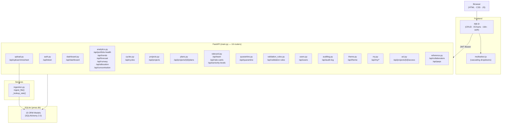
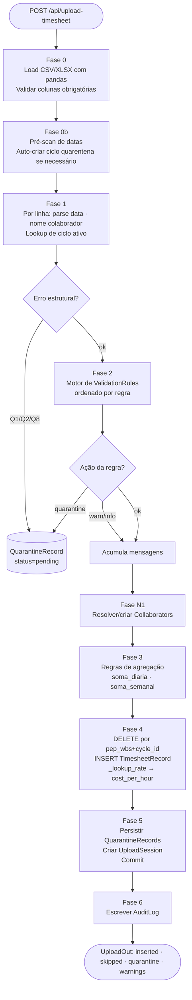
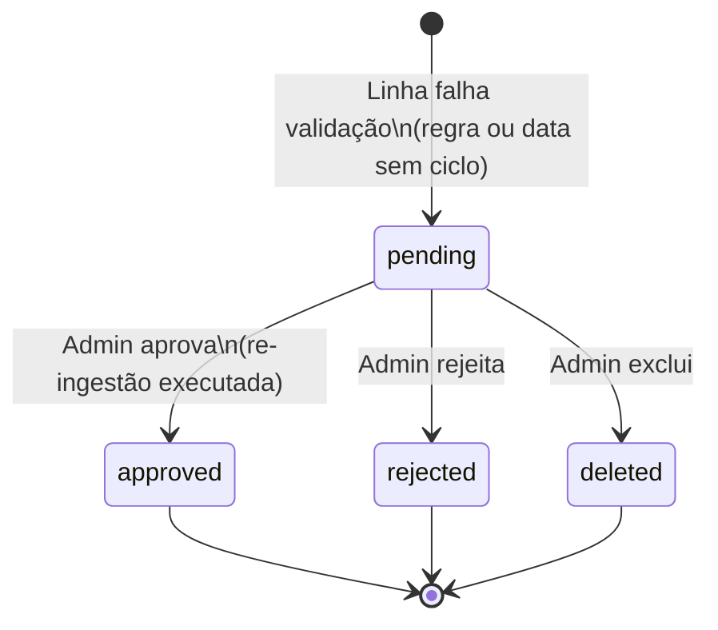

<h1 align="center">PMAS — Project Management Assistant System</h1>
<p align="center">
  <em>Dashboard analítico de timesheets para gestores que precisam de visibilidade real sobre horas, custos e saúde do portfólio.</em>
</p>
<p align="center">
  
  
  
  
  
</p>

---

## Visão Geral

O PMAS transforma exports de timesheet (CSV ou XLSX) em dashboards interativos de gestão de projetos. Gerentes importam planilhas de horas, definem ciclos de apuração e projetos com orçamento, e visualizam em tempo real o consumo por colaborador, por PEP e por ciclo — com custo real calculado via Rate Card congelado no momento da ingestão.

A abordagem técnica central é o **EVM freeze pattern**: o `cost_per_hour` de cada registro é resolvido na hora da importação pelo histórico de Rate Card (senioridade do colaborador × data do registro) e jamais é recalculado retroativamente. Isso garante que relatórios de períodos passados permaneçam estáveis mesmo após reajustes de taxa. O pipeline de ingestão passa por seis fases — do parse do arquivo até a auditoria — com um motor de regras de validação configurável que decide por linha entre quarentena, alerta ou rejeição.

O projeto está em uso operacional, com banco SQLite embutido (sem dependência externa), frontend em HTML/JS puro e build standalone via PyInstaller para Linux x64 e Windows x64. A suite de testes cobre 446 casos em 17 arquivos, todos em SQLite em memória.

<p align="center">
  
</p>

---

## Funcionalidades

### Importação e Validação
- **Pipeline de ingestão de 6 fases** — parse CSV/XLSX com pandas, verificações estruturais por linha, motor de regras configurável, deduplicação, agregação por dia/semana, bulk insert + auditoria
- **Motor de regras de validação** — regras ordenadas e ativáveis; campos: `horas_individuais`, `hora_extra`, `hora_sobreaviso`, `pep_wbs`, `dia_semana`, `soma_diaria`, `soma_semanal`; ações: `quarantine`, `warn`, `reject`
- **Quarentena automática** — datas sem ciclo cadastrado criam um ciclo de quarentena; nenhum dado é descartado silenciosamente
- **Ciclo de revisão de quarentena** — registros em `pending` podem ser aprovados (re-ingestados) ou rejeitados pelo admin; usuários veem seus próprios registros em "Minha Área"
- **UploadSession transparente** — cada importação cria um registro com filename, usuário, timestamp e contagens por outcome (inserido / ignorado / quarentena / warning / info)

### Dashboard Analítico (3 sub-abas)
- **Esforço da Equipe** — barras horizontais (horas normais, extras, sobreaviso por colaborador), KPIs de total, radar de horas/custo por PEP, gráfico orçado vs. realizado, timeline de colaborador ao clicar na barra
- **Saúde do Portfólio** — treemap proporcional ao consumo + bullet chart de utilização; toggle Horas/R$ alterna entre `consumed_hours`/`budget_hours` e `actual_cost`/`budget_cost`
- **Previsão (EVM)** — curva-S por projeto: planejado vs. realizado por ciclo, projeção de conclusão com CPI/SPI, EAC, variância de prazo

### Saúde e Risco do Portfólio
- **Semáforo macro** — barra de tráfego no topo da página: verde/amarelo/vermelho/cinza por projeto com contadores; atualizado a cada carga
- **Portfolio Runway** — por PEP: `pct_consumed`, `cycles_to_complete`, `estimated_completion_cycle`, `spi`, `cpi`, `risk` e `cost_risk` (calculado no backend via limiares de GlobalConfig)
- **Concentração de esforço** — top contribuidores por PEP com percentual de horas e custo; risco `high`/`medium`/`low`

### Módulo EVM
- **Freeze de custo** — `cost_per_hour` resolvido em `_lookup_rate()` no momento da ingestão; imutável após commit
- **Multiplicadores globais** — hora extra e sobreaviso configuráveis; fórmula: `custo = normal_h × rate + extra_h × rate × mult_extra + standby_h × rate × mult_standby`
- **Baseline S-curve** — `ProjectCyclePlan` registra horas planejadas por ciclo; curva-S compara planejado vs. realizado acumulado

### Cadastros e Governança
- **Ciclos** — CRUD com busca em tempo real, toggle de bloqueio, import/export CSV
- **Projetos / PEPs** — código WBS, budget de horas e R$, alertas visuais (⚠ ≥90%, 🔴 ≥100%), import/export CSV, ACL por usuário
- **Equipe e Rate Card** — níveis de senioridade, taxas horárias com vigência (`valid_from`/`valid_to`), atribuição individual e em lote, import/export CSV
- **Audit Log** — toda ação com usuário, entidade, IDs e snapshot JSON old/new; visível ao admin
- **ACL por PEP** — whitelist de PEPs por usuário; whitelist vazia = acesso a tudo

### UX e Infraestrutura
- **i18n PT-BR / EN** — 531 chaves por idioma; toggle com persistência em `localStorage`; `_applyI18n()` cobre atributos `textContent`, `placeholder`, `title` e `aria-label`
- **Layout personalizável** — drag-to-reorder dos painéis do dashboard; preferências persistidas no banco por usuário
- **Tema configurável** — cores, densidade, paleta de gráficos e logo via API `/api/theme`; aplicado no frontend sem reload
- **Schema migration** — `_migrate_columns()` em `database.py` aplica `ALTER TABLE` no startup para bancos existentes (sem perda de dados)
- **Executável standalone** — PyInstaller Linux x64 e Windows x64 publicados via GitHub Actions ao criar uma tag de versão

---

## Arquitetura


```mermaid
graph TD
    Browser["Browser\n(HTML · CSS · JS)"]

    subgraph Frontend
        AppJS["app.js\n(CRUD · ECharts · i18n · auth)"]
        MultiSelect["multiselect.js\n(cascading dropdowns)"]
    end

    subgraph FastAPI["FastAPI (main.py — 16 routers)"]
        Auth["auth.py\n/api/token"]
        Upload["upload.py\n/api/upload-timesheet"]
        Dashboard["dashboard.py\n/api/dashboard"]
        Analytics["analytics.py\n/api/portfolio-health\n/api/trends\n/api/forecast\n/api/runway\n/api/allocation\n/api/concentration"]
        Cycles["cycles.py\n/api/cycles"]
        Projects["projects.py\n/api/projects"]
        Plans["plans.py\n/api/projects/{id}/plans"]
        Ratecard["ratecard.py\n/api/team\n/api/rate-cards\n/api/seniority-levels"]
        Quarantine["quarantine.py\n/api/quarantine"]
        Rules["validation_rules.py\n/api/validation-rules"]
        Users["users.py\n/api/users"]
        Auditlog["auditlog.py\n/api/audit-log"]
        Theme["theme.py\n/api/theme"]
        My["my.py\n/api/my/*"]
        ACL["acl.py\n/api/projects/{id}/access"]
        Reference["reference.py\n/api/collaborators\n/api/peps"]
    end

    subgraph Services
        Ingestion["ingestion.py\ningest_file()\n_lookup_rate()"]
    end

    subgraph DB["SQLite (pmas.db)"]
        Models["15 ORM Models\n(SQLAlchemy 2.0)"]
    end

    Browser --> AppJS
    AppJS --> MultiSelect
    AppJS -->|JWT Bearer| FastAPI
    Upload --> Ingestion
    Ingestion --> Models
    FastAPI --> Models
```

---

## Instalação

### Pré-requisitos

- Python **3.11** ou **3.12**
- pip

### Execução direta

```bash
# 1. Clone o repositório
git clone https://github.com/RtaSistemas/PMAS.git
cd PMAS

# 2. Instale as dependências
pip install -r requirements.txt

# 3. Inicie o servidor
python -m uvicorn backend.app.main:app --reload
```

Acesse em **http://127.0.0.1:8000** — login padrão: `admin` / `admin`.

O banco `pmas.db` (SQLite) é criado automaticamente na primeira execução. Novas colunas são aplicadas via `ALTER TABLE` no startup.

### Executável standalone (sem Python)

```bash
# Dispara o build via GitHub Actions (publica na aba Releases)
git tag v1.0.0
git push origin v1.0.0
```

Para build local:

```bash
pip install pyinstaller

# Linux
pyinstaller --onefile --name pmas-linux-x64 --add-data "frontend:frontend" run.py

# Windows
pyinstaller --onefile --name pmas-windows-x64 --icon assets\icon.ico --add-data "frontend;frontend" run.py
```

---

## Uso Rápido

```bash
# 1. Inicie o servidor
python -m uvicorn backend.app.main:app --reload

# 2. Acesse http://127.0.0.1:8000 e faça login (admin / admin)

# 3. Crie um ciclo em Ciclos → Novo Ciclo (ex: Jan/2026, 01/01/2026–31/01/2026)

# 4. Importe um timesheet CSV via o botão de upload no cabeçalho
#    (use samples/timesheet_jan2026.csv como ponto de partida)

# 5. Visualize em Dashboard → Esforço da Equipe
```

Resultado esperado: barras horizontais com horas por colaborador, KPIs de total na lateral e radar de horas por PEP. Se houver datas fora do ciclo cadastrado, os registros aparecem na quarentena com status `pending`.

Gere dados de portfólio completo (29 ciclos, 10 PEPs, rate cards) com:

```bash
python amostras/generate_portfolio.py
# Importar os CSVs gerados em amostras/ via a interface
```

---

## Fluxo de Ingestão


```mermaid
flowchart TD
    A([POST /api/upload-timesheet]) --> B[Fase 0\nLoad CSV/XLSX com pandas\nValidar colunas obrigatórias]
    B --> C[Fase 0b\nPré-scan de datas\nAuto-criar ciclo quarentena se necessário]
    C --> D[Fase 1\nPor linha: parse data · nome colaborador\nLookup de ciclo ativo]
    D --> E{Erro estrutural?}
    E -- Q1/Q2/Q8 --> Q[(QuarantineRecord\nstatus=pending)]
    E -- ok --> F[Fase 2\nMotor de ValidationRules\nordenado por regra]
    F --> G{Ação da regra?}
    G -- quarantine --> Q
    G -- warn/info --> H[Acumula mensagens]
    G -- ok --> H
    H --> I[Fase N1\nResolver/criar Collaborators]
    I --> J[Fase 3\nRegras de agregação\nsoma_diaria · soma_semanal]
    J --> K[Fase 4\nDELETE por pep_wbs+cycle_id\nINSERT TimesheetRecord\n_lookup_rate → cost_per_hour]
    K --> L[Fase 5\nPersistir QuarantineRecords\nCriar UploadSession\nCommit]
    L --> M[Fase 6\nEscrever AuditLog]
    M --> N([UploadOut: inserted · skipped · quarantine · warnings])
```

---

## Configuração

### GlobalConfig (via interface → Equipe → Fatores Globais)

| Parâmetro | Tipo | Padrão | Descrição |
|---|---|---|---|
| `extra_hours_multiplier` | float > 0 | `1.5` | Multiplicador de custo para horas extras |
| `standby_hours_multiplier` | float > 0 | `1.0` | Multiplicador de custo para horas sobreaviso |
| `budget_warning_threshold` | float 0–1 | `0.9` | Limite para alerta ⚠ (ex: 0.9 = 90%) |
| `budget_critical_threshold` | float 0–2 | `1.0` | Limite para alerta 🔴 (ex: 1.0 = 100%) |
| `timezone` | string | `America/Sao_Paulo` | Fuso horário da aplicação |

### Servidor

| Parâmetro | Como configurar | Padrão |
|---|---|---|
| Porta | `--port 8080` na linha de comando | `8000` |
| Host | `--host 0.0.0.0` (expose na rede) | `127.0.0.1` |
| Banco | Variável de ambiente `DATABASE_URL` (opcional) | `./pmas.db` |

### Formato CSV de timesheet

| Coluna | Obrigatório | Tipo | Descrição |
|---|:---:|---|---|
| `Colaborador` | ✅ | Texto | Nome completo |
| `Data` | ✅ | DD/MM/AAAA | Data do registro |
| `Horas totais (decimal)` | ✅ | Decimal | Total de horas (ex: `8.5`) |
| `Hora extra` | — | `Sim`/`Não` | Indicador de hora extra |
| `Hora sobreaviso` | — | `Sim`/`Não` | Indicador de sobreaviso |
| `Código PEP` | — | Texto | Código WBS (ex: `60IT-001-01`) |
| `PEP` | — | Texto | Descrição do PEP |
| `Hora Inicial [H]` | — | HH:MM | Diferencia lançamentos do mesmo dia/PEP |

---

## API REST

### Upload e ingestão

| Método | Rota | Descrição |
|---|---|---|
| `POST` | `/api/upload-timesheet` | Ingestão CSV/XLSX (pipeline 6 fases) |
| `GET` | `/api/upload-history` | Histórico de uploads (admin) |
| `GET` | `/api/upload-history/{id}` | Detalhes de um upload (admin) |

### Dashboard

| Método | Rota | Descrição |
|---|---|---|
| `GET` | `/api/dashboard` | Horas por colaborador — toda a base |
| `GET` | `/api/dashboard/{cycle_id}` | Horas por colaborador no ciclo |
| `GET` | `/api/dashboard/pep-radar` | Horas e custo por PEP (radar chart) |
| `GET` | `/api/dashboard/collaborator-timeline` | Evolução de horas por colaborador |

Todos suportam `?pep_code=&pep_description=&collaborator_id=&date_from=&date_to=`.

### Analytics

| Método | Rota | Descrição |
|---|---|---|
| `GET` | `/api/portfolio-health` | Consumo e budget por PEP (horas + custo) |
| `GET` | `/api/trends` | Queima de horas/custo por ciclo (cronológico) |
| `GET` | `/api/projects/{id}/forecast` | Forecast EVM por projeto (S-curve + CPI/SPI/EAC) |
| `GET` | `/api/portfolio-runway` | Runway e risco por PEP (pct_consumed, cycles_to_complete, cost_risk) |
| `GET` | `/api/portfolio-allocation` | Alocação: horas e custo por colaborador+PEP |
| `GET` | `/api/portfolio-concentration` | Concentração: top contribuidores por PEP |

### Ciclos

| Método | Rota | Descrição |
|---|---|---|
| `GET` | `/api/cycles` | Lista com contagem de registros |
| `POST` | `/api/cycles` | Criar ciclo |
| `PUT` | `/api/cycles/{id}` | Atualizar ciclo |
| `DELETE` | `/api/cycles/{id}` | Excluir (apenas sem registros) |
| `PATCH` | `/api/cycles/{id}/toggle-status` | Bloquear / desbloquear |
| `POST` | `/api/cycles/import` | Importar via CSV |
| `GET` | `/api/cycles/export` | Exportar CSV |

### Projetos e Planos

| Método | Rota | Descrição |
|---|---|---|
| `GET/POST` | `/api/projects` | Listar / criar |
| `PUT/DELETE` | `/api/projects/{id}` | Atualizar / excluir |
| `POST` | `/api/projects/import` | Importar via CSV (upsert por PEP) |
| `GET` | `/api/projects/export` | Exportar CSV |
| `GET/POST` | `/api/projects/{id}/plans` | Listar / criar planos de ciclo (baseline) |
| `PUT/DELETE` | `/api/projects/{id}/plans/{plan_id}` | Atualizar / excluir plano |
| `GET` | `/api/plans/export` | Exportar todos os planos CSV |
| `POST` | `/api/plans/import` | Importar planos CSV (upsert) |
| `GET/POST/DELETE` | `/api/projects/{id}/access` | Gerenciar ACL por usuário (admin) |

### Equipe e Rate Card

| Método | Rota | Descrição |
|---|---|---|
| `GET/POST/PUT/DELETE` | `/api/seniority-levels[/{id}]` | CRUD de níveis |
| `GET/POST/PUT/DELETE` | `/api/rate-cards[/{id}]` | CRUD de taxas com vigência |
| `GET` | `/api/team` | Colaboradores com senioridade e taxa atual |
| `PUT` | `/api/team/{id}/seniority` | Atribuir senioridade individual |
| `PUT` | `/api/team/bulk-seniority` | Atribuir senioridade em lote |
| `GET/PUT` | `/api/config` | Multiplicadores globais EVM |

### Quarentena e Regras

| Método | Rota | Descrição |
|---|---|---|
| `GET` | `/api/quarantine` | Listar registros (admin) |
| `POST` | `/api/quarantine/{id}/approve` | Aprovar (re-ingestar) |
| `POST` | `/api/quarantine/{id}/reject` | Rejeitar |
| `DELETE` | `/api/quarantine/{id}` | Excluir registro |
| `GET/POST` | `/api/validation-rules` | Listar / criar regras |
| `PUT/DELETE` | `/api/validation-rules/{id}` | Atualizar / excluir |
| `PATCH` | `/api/validation-rules/{id}/toggle` | Ativar / desativar |
| `POST` | `/api/validation-rules/reorder` | Reordenar |

### Usuários, Audit e Tema

| Método | Rota | Descrição |
|---|---|---|
| `POST` | `/api/token` | Login — retorna JWT |
| `GET/POST/PUT/DELETE` | `/api/users[/{id}]` | CRUD de usuários (admin) |
| `PUT` | `/api/users/{id}/password` | Alterar senha |
| `GET` | `/api/audit-log` | Log de auditoria (admin) |
| `GET/PUT` | `/api/theme` | Ler / atualizar tema global |
| `POST/DELETE` | `/api/theme/logo` | Upload / remoção de logo |
| `GET/PUT` | `/api/my/preferences` | Preferências do usuário logado |
| `GET` | `/api/my/upload-history` | Histórico de uploads do usuário |
| `GET` | `/api/my/quarantine` | Quarentena do usuário |
| `GET` | `/api/my/budget-alerts` | Alertas de budget acessíveis ao usuário |

### Referência

| Método | Rota | Descrição |
|---|---|---|
| `GET` | `/api/collaborators` | Lista colaboradores com registros |
| `GET` | `/api/peps` | Lista PEPs com descrições agrupadas |

---

## Ciclo de Vida da Quarentena


```mermaid
stateDiagram-v2
    [*] --> pending : Linha falha validação\n(regra ou data sem ciclo)

    pending --> approved : Admin aprova\n(re-ingestão executada)
    pending --> rejected : Admin rejeita

    approved --> [*]
    rejected --> [*]

    pending --> deleted : Admin exclui
    deleted --> [*]
```

---

## Desenvolvimento

### Pré-requisitos

- Python 3.11 ou 3.12
- pip

### Setup

```bash
git clone https://github.com/RtaSistemas/PMAS.git
cd PMAS
pip install -r requirements.txt
pip install pytest httpx
```

### Executar testes

```bash
pytest tests/ -v
```

446 testes em 17 arquivos, todos usando SQLite em memória (StaticPool) — nenhum `pmas.db` é tocado.

| Arquivo | Testes | Cobertura |
|---|---:|---|
| `test_full_sample.py` | 108 | Pipeline end-to-end completo |
| `test_ingestion.py` | 65 | Parse CSV/XLSX, quarentena, motor de regras |
| `test_analytics.py` | 36 | portfolio-health, trends, EVM cost |
| `test_ratecard.py` | 35 | SeniorityLevel, RateCard, EVM freeze |
| `test_rule_engine.py` | 32 | ValidationRule CRUD, toggle, reorder, avaliação |
| `test_runway_concentration.py` | 23 | Runway, concentração, cost_risk |
| `test_quarantine.py` | 23 | Workflow approve/reject/delete |
| `test_users.py` | 22 | CRUD usuários, JWT, papéis |
| `test_evm_integrity.py` | 17 | Integridade do freeze de custo |
| `test_cycles.py` | 20 | CRUD ciclos |
| `test_projects.py` | 16 | CRUD projetos |
| `test_reference.py` | 13 | Endpoints de filtro cascata |
| `test_dashboard.py` | 11 | Agregação, ACL |
| `test_validation_rules.py` | 10 | API de regras |
| `test_auth.py` | 5 | Login, token |
| `test_my.py` | 5 | Endpoints `/api/my/*` |
| `test_theme.py` | 5 | CRUD tema |

### Dados de amostra

```bash
python amostras/generate_portfolio.py
# Gera em amostras/: ciclos.csv, projetos.csv, senioridade_rate_card.csv
#                    e timesheets mensais de Jan/2024 a Mai/2026
```

### Estrutura do projeto

```
PMAS/
├── backend/app/
│   ├── main.py              # FastAPI: CORS, 16 routers, static files, init_db
│   ├── models.py            # 15 modelos ORM (SQLAlchemy 2.0)
│   ├── schemas.py           # Pydantic I/O (inputs, outputs, EVM types)
│   ├── database.py          # Engine SQLite, get_db(), _migrate_columns()
│   ├── deps.py              # JWT: get_current_user, require_admin
│   ├── routers/             # 16 módulos de router
│   └── services/
│       └── ingestion.py     # Pipeline 6 fases + _lookup_rate() EVM freeze
├── frontend/
│   ├── index.html           # 6 abas + 3 sub-abas analíticas + modais
│   ├── style.css            # Design system: Dark Navy + Sky Blue
│   ├── multiselect.js       # Componente MultiSelect cascata
│   └── app.js               # i18n (531 keys), ECharts, CRUD, auth, export
├── tests/                   # 17 arquivos, 446 testes
├── amostras/                # Gerador de portfólio + CSVs prontos
├── samples/                 # CSVs de exemplo para import manual
├── assets/                  # Ícones para executável Windows
├── .github/workflows/
│   ├── tests.yml            # CI: pytest Python 3.11 e 3.12
│   └── release.yml          # Build PyInstaller Linux + Windows
├── CLAUDE.md
├── MANUAL.md
├── requirements.txt
└── run.py                   # Entrypoint PyInstaller
```

---

## Stack

| Camada | Tecnologia |
|---|---|
| Backend | Python 3.11+ · FastAPI 0.111 · SQLAlchemy 2.0 |
| Banco de dados | SQLite embutido (`pmas.db`) |
| Autenticação | JWT (python-jose) · bcrypt |
| Frontend | HTML5 · CSS3 · JavaScript Vanilla |
| Gráficos | Apache ECharts 5 |
| Parsing | pandas · openpyxl |
| Testes | pytest · httpx · FastAPI TestClient |
| Build | PyInstaller (Linux x64 + Windows x64) |
| CI | GitHub Actions (Python 3.11 / 3.12) |

---

## Licença

Distribuído sob licença MIT. Consulte [`LICENSE`](LICENSE) para detalhes.
