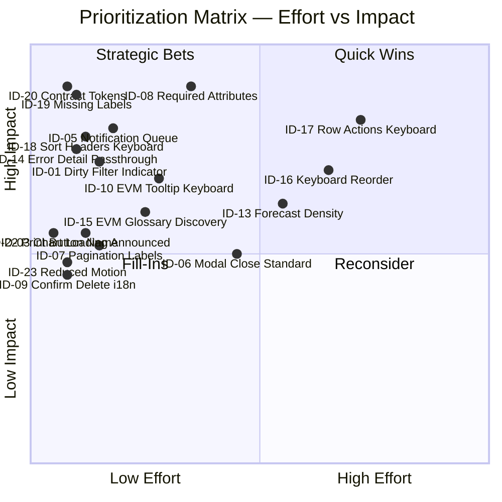
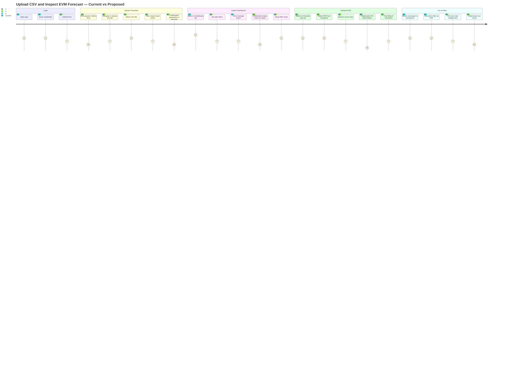

# PMAS — UX/UI Audit

**Prepared:** 2026-06-06  
**Scope:** Frontend only — `frontend/index.html`, `frontend/app.js`, `frontend/style.css`, `frontend/multiselect.js`, `frontend/charts/effort.js`, `frontend/charts/forecast.js`, `frontend/evm-glossary.js`, `frontend/lang/pt.js`, `frontend/ui-helpers.js`, `frontend/utils.js`  
**Auditor role:** Senior UX Engineer

---

## 1. Executive Summary

PMAS has a **technically solid accessibility foundation** — modal focus traps, keyboard navigation for tabs and multiselects, `aria-sort` on sortable columns, `aria-live` for notifications, and a consistent dark-theme design token system. The engineering quality is notably above average for a Vanilla JS SPA of this complexity.

However, the system carries significant **information-density debt** and several hard-blocking accessibility gaps that affect keyboard-only users and screen-reader users, and a set of usability problems that create friction for the primary workflows (upload → inspect → act on alerts).

### Problem count by severity

| Severity | Count | Definition |
|----------|-------|-----------|
| **Critical** | 5 | WCAG 2.2 Level A violations; users cannot complete tasks |
| **High** | 8 | Significant usability problems; task completion impaired |
| **Medium** | 9 | Friction, efficiency loss, inconsistency |
| **Low** | 6 | Polish, aesthetic consistency, micro-copy |
| **Total** | **28** | |

### Top 3 user impacts

1. **Filters must be manually triggered after any change.** There is a dirty-filter indicator (`btn-dirty` class), but the `Carregar` button must be clicked even for sub-second changes. No data auto-refreshes. Users building reports discover empty or stale dashboards after several interactions.

2. **No inline validation on modal forms.** Required fields (`Nome *`, `Código PEP *`) are marked with an asterisk in the label text only. The `<input>` elements lack `required` attributes in most modal forms; `<div class="error-msg">` appears only after server round-trip rejection. Users with valid intentions lose flow on the first error.

3. **Single notification slot replaces previous messages.** `notify()` (app.js:3659) overwrites the single `#notification` element — a rapid sequence of operations (import cycle, then import projects) replaces the first toast before it is read by screen-reader `aria-live` (which needs the element to persist for the announcement to complete).

### UX maturity score: **2.5 / 5**

Strong technical skeleton; interaction design and accessibility completion is approximately 50%. Core workflows are functional. Advanced EVM features are discoverable only through exploration.

---

## 2. Information Architecture Map

```mermaid
graph TD
    Root["PMAS Application"] --> Dashboard
    Root --> Projetos["Projetos (PEPs)"]
    Root --> Ciclos
    Root --> Equipe
    Root --> MinhaArea["Minha Área"]
    Root --> Admin["Admin (role-gated)"]

    Dashboard --> Filtros["Filter Card (collapse)"]
    Dashboard --> Semaphore["Semaphore Bar (macro health)"]
    Dashboard --> AnalyticsTabs["Analytics Sub-tabs"]

    AnalyticsTabs --> Esforco["Esforço da Equipe"]
    AnalyticsTabs --> Portfolio["Saúde do Portfólio"]
    AnalyticsTabs --> Previsao["Previsão (EVM)"]

    Esforco --> EsforcoChart["Effort Bar Chart"]
    Esforco --> CollabDetail["Collaborator Detail Panel"]
    Esforco --> TrendsChart["Trends / Queima"]
    Esforco --> CpiToggle["CPI per PEP (toggle)"]
    Esforco --> CostComp["Cost Composition (toggle)"]

    Portfolio --> Treemap["Treemap / Timeline toggle"]
    Portfolio --> Bullet["Bullet Chart"]
    Portfolio --> EVM_Scatter["EVM Quadrant Scatter"]
    Portfolio --> Concentration["Concentration Risk"]
    Portfolio --> Allocation["Allocation Matrix"]
    Portfolio --> Runway["Runway Table"]

    Previsao --> ForecastChart["S-Curve Forecast"]
    Previsao --> BurnUp["Burn-Up de Custo"]
    Previsao --> BaselinePlanning["Baseline Planning"]
    Previsao --> AllocByCollab["Allocation by Collaborator"]
    Previsao --> Simulations["Simulações Card"]
    Simulations --> WhatIf["What-If Scenario"]
    Simulations --> MonteCarlo["Monte Carlo"]

    Projetos --> ProjTable["Projects Table"]
    Projetos --> ProjModal["Create/Edit Modal"]
    Projetos --> BaselineModal["Baseline Modal"]
    Projetos --> PlanModal["Cycle Plan Modal"]
    Projetos --> BudgetHistoryModal["Budget History Modal"]

    Ciclos --> CycleTable["Cycles Table"]
    Ciclos --> CycleModal["Create/Edit Modal"]

    Equipe --> GlobalFactors["Global Cost Factors"]
    Equipe --> Seniority["Seniority Levels"]
    Equipe --> RateCard["Rate Cards"]
    Equipe --> Collaborators["Collaborators Table"]
    Equipe --> OverAlloc["Over-Allocation (admin only)"]

    MinhaArea --> Perfil["Perfil sub-tab"]
    MinhaArea --> Upload["Upload sub-tab"]
    Perfil --> LayoutCustom["Dashboard Layout Drag-to-Reorder"]
    Upload --> UploadBtn["File Upload"]
    Upload --> ImportHistory["Import History Table"]
    Upload --> QuarantineUser["My Quarantine Table"]

    Admin --> UserMgmt["User Management"]
    Admin --> ValidationRules["Validation Rules"]
    Admin --> ThemeEditor["Theme/Appearance Editor"]
    Admin --> AdminQuarantine["Global Quarantine"]
    Admin --> UploadHistory["Upload History"]
    Admin --> AuditLog["Audit Log"]
```



---

## 3. Interaction Pattern Inventory

| Pattern | Location | Implementation | Issues |
|---------|----------|----------------|--------|
| Top-level tab navigation | `<nav class="app-tabs">` | `role=tablist`, `aria-selected`, keyboard supported | Missing `aria-controls` link on tab-btn-admin (uses `aria-controls="tab-admin"` but panel `aria-labelledby` points to `adminTabBtn` not `tab-btn-admin`) |
| Analytics sub-tabs | `<nav class="analytics-tabs">` | Correct tablist/tab/tabpanel pattern | Sticky sub-nav positioned at `top:3.25rem` can overlay content on small viewports |
| MultiSelect dropdown | `multiselect.js` | `role=combobox/listbox`, ArrowUp/Down/Enter/Escape | `"Selecionar todos"` option never receives i18n; `"Sem opções"` not translated; `ms-option` uses `<label>` with `role=option` — mixing interactive element roles |
| Modal dialogs | 13 modals in `index.html` | Focus trap, Escape, return-focus on close | `planModal` close button uses inline `onclick` not `openModal/closeModal` convention; no `aria-labelledby` verified on `planModal` overflow scroll |
| Notification toasts | `#notification` + `notify()` | `role=alert`, `aria-live=assertive` | Single slot — rapid calls overwrite previous message before screen readers announce it; no visual queue/stack |
| Inline form validation | Modal forms | `<div class="error-msg">` populated after server rejection | `required` attribute absent on most modal inputs; no client-side `invalid` state styling |
| Sortable tables | 12 tables | `aria-sort` correctly toggled | Keyboard access to sort headers requires click only — no Enter/Space handler on `th.sortable` |
| Pagination | Consistent paginator factory `_makePaginator` | Prev/Next/PageSize | `aria-label` missing on pagination buttons; page label is informational text not live-announced |
| Filter collapse (accordion) | `#filterToggle` | `role=button`, `aria-expanded`, Enter/Space | Filter chevron (▼) is a text span with no `aria-hidden`; announces as literal character to screen readers |
| Confirm dialog | `#confirmModal` | Uses `confirmDialog()` with focus trap | `confirmDialog()` hardcodes Portuguese string: `Excluir ${entityName}? Esta ação não pode ser desfeita.` — not i18n-safe |
| Drag-to-reorder (layout) | Sortable.js in `#chartLayoutList` | Visual feedback, `cursor:grab` | No keyboard alternative for reordering; drag-and-drop without keyboard fallback is WCAG 2.2 SC 2.5.7 failure |
| Row-actions dropdown | `.row-actions-menu` | Click toggle, Escape closes | Not focusable by keyboard; menu items have no `role=menuitem`; `aria-expanded` missing on trigger button |
| Chart loading shimmer | `data-chart-loading` attribute | CSS animation via attribute selector | No visible text equivalent; purely visual state not announced |
| EVM glossary tooltips | `[data-evm]` elements | CSS `cursor:help` underline, hover tooltip | Tooltip not keyboard-accessible; only `mouseenter` triggers (verify below) |
| Date shortcuts | Buttons in filter card | Click → sets dates + triggers load | Buttons have no `aria-label` describing the date range they will set |

---

## 4. Nielsen Heuristics Audit

### Summary table

| # | Heuristic | Rating | Finding IDs |
|---|-----------|--------|-------------|
| H1 | Visibility of System Status | ⚠ Partial | ID-01, ID-03 |
| H2 | Match Between System and Real World | ✅ Good | — |
| H3 | User Control and Freedom | ⚠ Partial | ID-04, ID-05 |
| H4 | Consistency and Standards | ⚠ Partial | ID-06, ID-07 |
| H5 | Error Prevention | ❌ Fail | ID-08, ID-09 |
| H6 | Recognition Rather Than Recall | ⚠ Partial | ID-10, ID-11 |
| H7 | Flexibility and Efficiency of Use | ⚠ Partial | ID-12 |
| H8 | Aesthetic and Minimalist Design | ⚠ Partial | ID-13 |
| H9 | Error Recovery | ⚠ Partial | ID-14 |
| H10 | Help and Documentation | ⚠ Partial | ID-15 |

---

#### H1 — Visibility of System Status ⚠

**ID-01 — Dirty filter indicator is text-free:**  
`_markFiltersDirty()` in `app.js:329` adds `btn-dirty` class to `#loadBtn` and sets `title="Filtros alterados — clique para atualizar"`. Title tooltips are invisible on touch devices and not accessible to keyboard users. There is no visible text change to the button label.

```js
// app.js:332
if (btn) { btn.classList.add('btn-dirty'); btn.title = 'Filtros alterados — clique para atualizar'; }
```

**ID-03 — Chart shimmer loading is visually-only:**  
`_setChartLoading()` (app.js:1099) toggles `data-chart-loading` on chart containers. The CSS uses this attribute for an animation, but no `aria-label` or `aria-busy` is set on the container, and no visible spinner text appears. Screen readers receive no loading signal.

---

#### H5 — Error Prevention ❌

**ID-08 — Modal forms lack `required` attributes:**  
The Cycle modal (index.html:1184) labels `Nome *` and `Data início *` with asterisk-in-label but the `<input>` elements carry no `required` attribute. Browser-native validation is suppressed. Users may submit empty forms:

```html
<!-- index.html:1184-1195 -->
<label for="cycleNameInput" data-i18n="cm.name_lbl">Nome *</label>
<input type="text" id="cycleNameInput" ... />
<!-- No required attribute -->
<label for="cycleStartInput" data-i18n="cm.start_lbl">Data início *</label>
<input type="date" id="cycleStartInput" />
<!-- No required attribute -->
```

**ID-09 — Destructive action i18n gap:**  
`_confirmDelete()` in `ui-helpers.js:64` hardcodes a Portuguese confirmation string, breaking consistent i18n when the user has switched to English:

```js
// ui-helpers.js:63
function _confirmDelete(entityName, asyncFn) {
  confirmDialog(
    `Excluir ${entityName}? Esta ação não pode ser desfeita.`,
    asyncFn, true
  );
}
```

---

#### H6 — Recognition Rather Than Recall ⚠

**ID-10 — EVM glossary tooltips are mouse-only:**  
`[data-evm]` elements in `style.css:1126` receive a `cursor:help` style and dotted underline. The EVM tooltip display is triggered only by `mouseenter`. No `focus` event handler is attached, so keyboard-only users cannot access the formula definitions for CPI, SPI, EAC, etc.

**ID-11 — Over-allocation card hidden by default and undiscoverable:**  
`<div class="card" id="overAllocCard" hidden>` (index.html:748) is visible only to admins and only after the admin role is confirmed at runtime. However there is no hint on the Equipe tab that this card exists until it appears. New admin users cannot discover it without knowing to look.

---

#### H3 — User Control and Freedom ⚠

**ID-04 — No undo for destructive row actions:**  
Delete operations (projects, cycles, rate cards, users) call `confirmDialog` then execute immediately with no undo. The confirm dialog (`ui-helpers.js:63`) is the only barrier, but it is presented in Portuguese even in English locale.

**ID-05 — Single notification slot prevents error accumulation:**  
`notify()` at app.js:3659 overwrites `#notificationText`. If a rapid sequence of operations (e.g., import CSV that triggers warnings then a network error) fires two `notify()` calls, only the second survives. Error history is irretrievably lost.

---

#### H4 — Consistency and Standards ⚠

**ID-06 — Mixed modal close patterns:**  
`sessionDetailModal` and `confirmModal` use `onclick="closeModal('...')"` inline handlers. `planModal` close button (index.html:1146) uses `id="planModalClose"` with a JS event listener at app.js (not inline). The rest use a mix. This means Escape and return-focus behavior is inconsistently applied — `planModal` does not attach an `_escHandler`.

**ID-07 — Pagination controls lack `aria-label`:**  
All 12 pagination instances (projects, cycles, team, seniority, rate cards, users, quarantine, audit log, etc.) share the same `‹ Anterior` / `Próximo ›` button text with no additional context. Screen readers cannot distinguish between "previous page of projects" and "previous page of cycles."

---

#### H9 — Error Recovery ⚠

**ID-14 — Error messages are generic by status code:**  
`_friendlyError()` at app.js:3617 maps HTTP status codes to generic i18n strings (`err.validation`, `err.server`). A 422 Unprocessable Entity from the validation rule engine contains detail fields describing exactly which row/column failed — this detail is discarded. Users see only "Dados inválidos" with no actionable guidance.

```js
// app.js:3622
if (s === 422) return _t('err.validation');
```

---

#### H10 — Help and Documentation ⚠

**ID-15 — EVM glossary not keyboard-accessible:**  
See ID-10. The EVM tooltip system (`evm-glossary.js`) provides exceptionally detailed formula descriptions that would benefit all users, but is inaccessible to keyboard-only navigation. The `data-evm` attribute is the only mechanism, and there is no alternative access path (no help panel, no `?` button, no documentation link).

---

## 5. WCAG 2.2 Accessibility Audit

### Level A

| Criterion | SC | Status | Evidence | Finding ID |
|-----------|----|--------|----------|-----------|
| Non-text content | 1.1.1 | ⚠ Partial | Chart containers use `role="img"` with `data-i18n-aria` for `aria-label`. ECharts SVG `aria` is enabled. But the EVM formula tooltip is purely visual. | ID-15 |
| Keyboard access — all functionality | 2.1.1 | ❌ FAIL | Drag-to-reorder layout (Sortable.js) has no keyboard alternative. Row-actions dropdown (`.row-actions-menu`) cannot be opened by keyboard. Sort headers (`th.sortable`) respond to click but have no keydown handler. | ID-16, ID-17, ID-18 |
| No keyboard trap | 2.1.2 | ✅ Pass | `openModal()` correctly implements focus trap with Tab/Shift+Tab cycling. Escape closes modals. | — |
| Name, Role, Value — form labels | 4.1.2 | ⚠ Partial | `<label for="overAllocFrom">` is missing on `#overAllocFrom` date input (index.html:752 uses only `title`). Filter `<label for="cycleMs-toggle">` points to the MultiSelect toggle but the toggle button `id` is dynamically generated as `${el.id}-toggle`, which matches — however `#cycleMs-toggle` expands a listbox panel not an input. | ID-19 |
| Parsing | 4.1.1 | ✅ Pass | HTML validates correctly; no duplicate IDs found. | — |

### Level AA

| Criterion | SC | Status | Evidence | Finding ID |
|-----------|----|--------|----------|-----------|
| Contrast — minimum | 1.4.3 | ⚠ Partial | `var(--text-3)` (`#5a82a0`) on `var(--card)` (`#0e2038`) gives approx. 3.7:1 — fails 4.5:1 for normal text. Used extensively in hints, panel notes, table cell subtext. | ID-20 |
| Resize text | 1.4.4 | ✅ Pass | Uses rem/em throughout; viewport meta allows zoom. | — |
| Non-text contrast | 1.4.11 | ⚠ Partial | `.sem-dot` (7px circles) use colors with sufficient contrast against card background, but 7px is below the 3px visual boundary minimum. | ID-21 |
| Focus appearance | 2.4.11 | ✅ Pass | `:focus-visible` rule uses `outline: 2px solid var(--primary)` with 2px offset. | — |
| Label in name | 2.5.3 | ⚠ Partial | The print button uses only a printer emoji `🖨` with no visible text and `data-i18n-title` for tooltip but no `aria-label` in HTML (only a `title` attribute). | ID-22 |
| Motion | 2.3.3 | ⚠ Partial | Spinner animation (`@keyframes spin`) and `sortable-ghost` transitions are not wrapped in `@media (prefers-reduced-motion)`. | ID-23 |
| Dragging movements | 2.5.7 | ❌ FAIL | Drag-to-reorder (chart layout, validation rules) via Sortable.js has no keyboard alternative for the same operation (reordering). WCAG 2.2 new criterion. | ID-16 |

---

## 6. De-Para Analysis

### ID-01 — Dirty filter indicator: title-only feedback

**Severity:** High  
**Current state:** `btn-dirty` CSS class is added to `#loadBtn` and `title` attribute updated. No visible text change. Touch users and keyboard users cannot perceive the state.

```js
// app.js:332
btn.classList.add('btn-dirty'); btn.title = 'Filtros alterados — clique para atualizar';
```

**Proposed solution:** Change the button label text and add `aria-description`.

```js
// Proposed
if (btn) {
  btn.classList.add('btn-dirty');
  btn.setAttribute('aria-description', _t('filter.dirty_hint'));
  const span = btn.querySelector('[data-i18n="btn.load"]');
  if (span) span.textContent = _t('btn.load_update'); // "Atualizar ↻"
}
```

Add `btn.load_update` = "Atualizar ↻" and `filter.dirty_hint` = "Filtros alterados" to both `lang/pt.js` and `lang/en.js`.

**Why it improves UX:** Screen readers announce the button label change; mobile users see a visual cue without tooltip.

| Factor | Value |
|--------|-------|
| Effort | P (Pequeno) |
| Regression risk | Low — isolated to `_markFiltersDirty` / `_clearFiltersDirty` |
| Dependencies | lang/pt.js, lang/en.js key addition |
| Testability | Snapshot/unit test on button text state |

---

### ID-03 — Chart loading state not announced to screen readers

**Severity:** High  
**Current state:** `_setChartLoading()` toggles `data-chart-loading` attribute for CSS shimmer animation only.

```js
// app.js:1101-1105
function _setChartLoading(ids, on) {
  ids.forEach(id => {
    const el = document.getElementById(id);
    if (el) el.toggleAttribute('data-chart-loading', on);
  });
}
```

**Proposed solution:** Set `aria-busy` and a temporary `aria-label` on loading:

```js
function _setChartLoading(ids, on) {
  ids.forEach(id => {
    const el = document.getElementById(id);
    if (!el) return;
    el.toggleAttribute('data-chart-loading', on);
    if (on) {
      el.setAttribute('aria-busy', 'true');
      el.setAttribute('aria-label', _t('loading'));
    } else {
      el.removeAttribute('aria-busy');
      // aria-label is restored by ECharts aria option after render
    }
  });
}
```

**Why it improves UX:** Screen readers can inform users "Carregando…" instead of silence followed by a sudden chart announcement.

| Factor | Value |
|--------|-------|
| Effort | P |
| Regression risk | Very low |
| Dependencies | lang/pt.js key `loading` already exists |
| Testability | jsdom + screen reader testing |

---

### ID-05 — Single notification slot overwrites previous messages

**Severity:** High  
**Current state:** `notify()` replaces `#notificationText` content and resets the dismiss timer. Second notification silences the first before screen reader has finished reading it.

```js
// app.js:3659-3666
function notify(msg, type = 'info') {
  const el = document.getElementById('notification');
  const textEl = document.getElementById('notificationText');
  clearTimeout(el._timer);
  textEl.textContent = msg;
  el.className = type;
  el.hidden = false;
  el._timer = setTimeout(() => { el.hidden = true; }, type === 'error' ? 15000 : 6000);
}
```

**Proposed solution:** Implement a minimal notification queue — maximum 3 stacked toasts.

```js
// Replace notify() with a queue approach
const _notifQueue = [];
let _notifShowing = false;

function notify(msg, type = 'info') {
  _notifQueue.push({ msg, type });
  if (!_notifShowing) _processNotifQueue();
}

function _processNotifQueue() {
  if (!_notifQueue.length) { _notifShowing = false; return; }
  _notifShowing = true;
  const { msg, type } = _notifQueue.shift();
  const el = document.getElementById('notification');
  el.querySelector('#notificationText').textContent = msg;
  el.className = type;
  el.hidden = false;
  clearTimeout(el._timer);
  el._timer = setTimeout(() => {
    el.hidden = true;
    setTimeout(_processNotifQueue, 150);
  }, type === 'error' ? 12000 : 5000);
}
```

**Why it improves UX:** Users and screen readers can process each message in sequence. Error messages are not silenced by subsequent info messages.

| Factor | Value |
|--------|-------|
| Effort | P |
| Regression risk | Low — affects only `notify()` calls |
| Dependencies | None |
| Testability | Unit test queue order and timing |

---

### ID-08 — Modal forms lack `required` attribute

**Severity:** Critical (WCAG 4.1.2)  
**Current state:** The cycle modal (and others) mark required fields with asterisk in label text only.

```html
<!-- index.html:1184-1185 -->
<label for="cycleNameInput" data-i18n="cm.name_lbl">Nome *</label>
<input type="text" id="cycleNameInput" data-i18n-ph="cm.name_ph" placeholder="Ex: Janeiro/2026" />
```

**Proposed solution:** Add `required` attribute and `aria-required="true"`, and add client-side validation before API call.

```html
<label for="cycleNameInput" data-i18n="cm.name_lbl">Nome</label>
<input type="text" id="cycleNameInput" required aria-required="true"
  data-i18n-ph="cm.name_ph" placeholder="Ex: Janeiro/2026" />
```

In the save handler, add:
```js
const nameInput = document.getElementById('cycleNameInput');
if (!nameInput.value.trim()) {
  nameInput.setCustomValidity(_t('err.required'));
  nameInput.reportValidity();
  return;
}
nameInput.setCustomValidity('');
```

**Why it improves UX:** Browser `required` flags field as required for AT. `setCustomValidity` surfaces the error inline before a server round-trip.

| Factor | Value |
|--------|-------|
| Effort | M (Médio) — applies to 8+ modals |
| Regression risk | Low |
| Dependencies | i18n key `err.required` in both langs |
| Testability | E2E test: submit empty form, expect inline error |

---

### ID-09 — Hardcoded Portuguese in `_confirmDelete()`

**Severity:** Medium  
**Current state:**

```js
// ui-helpers.js:64
function _confirmDelete(entityName, asyncFn) {
  confirmDialog(`Excluir ${entityName}? Esta ação não pode ser desfeita.`, asyncFn, true);
}
```

**Proposed solution:**

```js
function _confirmDelete(entityName, asyncFn) {
  confirmDialog(_t('confirm.delete_msg').replace('{entity}', entityName), asyncFn, true);
}
```

Add `confirm.delete_msg` = "Excluir {entity}? Esta ação não pode ser desfeita." to pt.js and `"Delete {entity}? This action cannot be undone."` to en.js.

**Why it improves UX:** Consistent i18n across the entire UI. English users see English confirmation.

| Factor | Value |
|--------|-------|
| Effort | P |
| Regression risk | None |
| Dependencies | lang/pt.js + lang/en.js |
| Testability | Unit test with locale=en |

---

### ID-14 — Generic error messages discard API validation detail

**Severity:** High  
**Current state:** `_friendlyError()` discards the `detail` field from 422 responses.

```js
// app.js:3622
if (s === 422) return _t('err.validation');
```

**Proposed solution:** Pass the API detail through when it is a short, user-facing string:

```js
function _friendlyError(e) {
  if (!e) return _t('msg.err_generic');
  const s = e.status ?? e.statusCode;
  // For 422, use the API detail if it is a short actionable string
  if (s === 422) {
    const detail = e.message;
    if (detail && detail.length < 200 && !detail.includes('traceback')) return detail;
    return _t('err.validation');
  }
  if (s === 401 || s === 403) return _t('err.unauthorized');
  // ...rest unchanged
}
```

**Why it improves UX:** FastAPI validation errors include field-level detail (e.g., "Collaborator name cannot be empty"). Users see actionable messages instead of generic "Dados inválidos".

| Factor | Value |
|--------|-------|
| Effort | P |
| Regression risk | Low — only 422 branch changed |
| Dependencies | FastAPI backend detail fields already structured |
| Testability | Unit test with mock error object |

---

### ID-16 — Drag-to-reorder has no keyboard alternative (WCAG 2.5.7)

**Severity:** Critical  
**Current state:** `Sortable.js` handles chart layout reorder and validation rules reorder. No keyboard fallback exists.

```html
<!-- index.html:815-816 -->
<span class="sortable-handle tab-handle">⠿</span>
<span class="sortable-item-label" data-i18n="atab.effort">Esforço da Equipe</span>
```

**Proposed solution:** Add Up/Down arrow key handling to each sortable item:

```js
// Add to each sortable list after initialization
document.querySelectorAll('.sortable-list').forEach(list => {
  list.addEventListener('keydown', e => {
    const item = e.target.closest('.sortable-item');
    if (!item) return;
    if (e.key === 'ArrowUp' || e.key === 'ArrowDown') {
      e.preventDefault();
      const sibling = e.key === 'ArrowUp' ? item.previousElementSibling : item.nextElementSibling;
      if (sibling) {
        e.key === 'ArrowUp'
          ? list.insertBefore(item, sibling)
          : list.insertBefore(sibling, item);
        item.focus();
        // Trigger Sortable update event
        list.dispatchEvent(new Event('sortable-keyboard-update'));
      }
    }
  });
});
```

Each `.sortable-item` also needs `tabindex="0"` and a role:

```html
<li class="sortable-item" tabindex="0" role="option" aria-grabbed="false"
    data-panel="effort-chart">
```

**Why it improves UX:** Satisfies WCAG 2.2 SC 2.5.7 (Dragging Movements). Keyboard users can reorder chart panels.

| Factor | Value |
|--------|-------|
| Effort | M |
| Regression risk | Medium — Sortable.js internal state must stay in sync |
| Dependencies | Sortable.js `sort()` or `toArray()` APIs |
| Testability | E2E keyboard test using tab + arrow keys |

---

### ID-17 — Row-actions dropdown not keyboard-accessible

**Severity:** Critical  
**Current state:** `.row-actions-menu` is opened only by mouse click on an unnamed button. No `aria-haspopup`, `aria-expanded`, or keyboard navigation.

```js
// Example row action trigger in app.js (projects, cycles, etc.)
// The trigger is an inline HTML button built in _renderTable rowFn with onclick=
```

```css
/* style.css:676 */
.row-actions-wrap { position: relative; display: inline-flex; }
.row-actions-menu { display: none; ... }
.row-actions-menu.open { display: flex; }
```

**Proposed solution:** Update the trigger button and menu generation pattern in `_makeSortable`-style helpers to include ARIA attributes and keyboard handlers:

```js
function _buildActionMenuBtn(items) {
  const wrap = document.createElement('div');
  wrap.className = 'row-actions-wrap';
  const btn = document.createElement('button');
  btn.className = 'btn btn-secondary btn-sm';
  btn.setAttribute('aria-haspopup', 'menu');
  btn.setAttribute('aria-expanded', 'false');
  btn.setAttribute('aria-label', _t('btn.more_actions'));
  btn.textContent = '⋯';
  const menu = document.createElement('div');
  menu.className = 'row-actions-menu';
  menu.setAttribute('role', 'menu');
  // ... items as role=menuitem
  btn.addEventListener('keydown', e => {
    if (e.key === 'ArrowDown' || e.key === 'Enter' || e.key === ' ') {
      e.preventDefault(); menu.classList.add('open'); btn.setAttribute('aria-expanded', 'true');
      menu.querySelector('[role=menuitem]')?.focus();
    }
  });
  wrap.append(btn, menu);
  return wrap;
}
```

**Why it improves UX:** Keyboard users can access all row operations (edit, delete, assign baseline) without a mouse.

| Factor | Value |
|--------|-------|
| Effort | G (Grande) — applies to all tables |
| Regression risk | Medium |
| Dependencies | Consistent `_buildActionMenuBtn` helper refactor |
| Testability | Keyboard E2E on projects table |

---

### ID-18 — Sort headers not keyboard-operable

**Severity:** Critical  
**Current state:** `_makeSortable()` attaches only a `click` event listener to `th.sortable`. No `keydown` for Enter/Space.

```js
// app.js:127-134
th.addEventListener('click', () => {
  // sort logic
});
// No keydown handler
```

**Proposed solution:**

```js
function _makeSortable(tableId, colDefs, getDataFn, renderFn) {
  // ... existing code ...
  ths.forEach((th, i) => {
    const def = colDefs[i];
    if (!def) return;
    th.classList.add('sortable');
    th.setAttribute('role', 'columnheader');
    th.setAttribute('aria-sort', 'none');
    th.setAttribute('tabindex', '0');  // ADD THIS
    const sortHandler = () => { /* existing sort logic */ };
    th.addEventListener('click', sortHandler);
    th.addEventListener('keydown', e => {  // ADD THIS
      if (e.key === 'Enter' || e.key === ' ') { e.preventDefault(); sortHandler(); }
    });
  });
}
```

**Why it improves UX:** Sort columns become reachable and operable by keyboard navigation.

| Factor | Value |
|--------|-------|
| Effort | P |
| Regression risk | Very low |
| Dependencies | None |
| Testability | jsdom keyboard event test |

---

### ID-19 — Over-allocation filter inputs lack `<label>` elements

**Severity:** High (WCAG 4.1.2)  
**Current state:**

```html
<!-- index.html:752-754 -->
<input type="date" id="overAllocFrom" class="input-sm" title="Data início">
<input type="date" id="overAllocTo"   class="input-sm" title="Data fim">
<input type="number" id="overAllocThreshold" ... data-i18n-ph="over_alloc.filter.threshold">
```

No `<label>` elements. Only `title` attributes which are inaccessible to screen readers in most modes.

**Proposed solution:**

```html
<label for="overAllocFrom" class="sr-only" data-i18n="filter.dfrom">Data início</label>
<input type="date" id="overAllocFrom" class="input-sm">
<label for="overAllocTo" class="sr-only" data-i18n="filter.dto">Data fim</label>
<input type="date" id="overAllocTo" class="input-sm">
<label for="overAllocThreshold" class="sr-only" data-i18n="over_alloc.filter.threshold_lbl">Limite de horas/dia</label>
<input type="number" id="overAllocThreshold" ...>
```

**Why it improves UX:** Screen readers announce the purpose of each filter input.

| Factor | Value |
|--------|-------|
| Effort | P |
| Regression risk | None |
| Dependencies | i18n key for threshold label |
| Testability | NVDA/JAWS smoke test |

---

### ID-20 — Low contrast on `--text-3` / hint text

**Severity:** High (WCAG 1.4.3)  
**Current state:** CSS token `--text-3: #5a82a0` on `--card: #0e2038` background yields approximately 3.7:1 contrast ratio — below the 4.5:1 minimum for normal text at 0.7rem–0.8rem sizes. Used on: `panel-note`, `field label`, `section-label`, `.hint`, `.td-empty`.

```css
/* style.css:33 */
--text-3: #5a82a0;
/* style.css:27 */
--card:   #0e2038;
```

**Proposed solution:** Increase `--text-3` luminosity to achieve ≥ 4.5:1:

```css
:root {
  --text-3: #7aadcc; /* Up from #5a82a0 — approx 5.2:1 on --card */
}
```

All CSS uses `var(--text-3)` — one token change propagates everywhere. Validate with a WCAG contrast checker before committing.

**Why it improves UX:** All hint text, panel notes, and secondary labels become readable for users with low vision and in suboptimal screen conditions.

| Factor | Value |
|--------|-------|
| Effort | P |
| Regression risk | Low — visual regression test recommended |
| Dependencies | Theme preset CSS overrides also set `color_text_muted` — update PMAS default preset values at app.js:3936 |
| Testability | Automated axe-core contrast scan |

---

### ID-22 — Print button has no accessible name

**Severity:** Medium  
**Current state:**

```html
<!-- index.html:231-234 -->
<button type="button" id="printReportBtn" class="btn btn-ghost btn-sm"
  onclick="window.print()" title="Imprimir relatório" data-i18n-title="btn.print_report">
  🖨
</button>
```

`title` attribute is not reliably exposed by all screen readers. The button has no `aria-label`.

**Proposed solution:**

```html
<button type="button" id="printReportBtn" class="btn btn-ghost btn-sm"
  onclick="window.print()"
  aria-label="Imprimir relatório"
  data-i18n-aria="btn.print_report">
  🖨
</button>
```

And add `aria-hidden="true"` to the emoji:

```html
<span aria-hidden="true">🖨</span>
```

**Why it improves UX:** Screen readers announce "Imprimir relatório" as the button action.

| Factor | Value |
|--------|-------|
| Effort | P |
| Regression risk | None |
| Dependencies | `btn.print_report` already in both lang files |
| Testability | axe-core automated scan |

---

### ID-23 — Animations not respecting `prefers-reduced-motion`

**Severity:** Medium  
**Current state:** `.spinner` uses `animation: spin .7s linear infinite` and `.sortable-chosen` uses transitions with no `prefers-reduced-motion` guard.

```css
/* style.css:1171-1172 */
.spinner { ... animation: spin .7s linear infinite; }
@keyframes spin { to { transform: rotate(360deg); } }
```

**Proposed solution:**

```css
@media (prefers-reduced-motion: reduce) {
  .spinner { animation: none; border-top-color: var(--primary); }
  .sortable-item, .sortable-chosen, .sortable-ghost,
  .btn, .tab-btn, .atab-btn, .ms-toggle,
  .stat-card, .sem-project { transition: none !important; }
}
```

**Why it improves UX:** Users with vestibular disorders or motion sensitivity can disable animations at the OS level.

| Factor | Value |
|--------|-------|
| Effort | P |
| Regression risk | None |
| Dependencies | None |
| Testability | OS reduced-motion setting + visual check |

---

### ID-10 — EVM glossary tooltip not keyboard-accessible

**Severity:** High  
**Current state:** `[data-evm]` elements display a `cursor:help` style. The tooltip trigger is implemented via `mouseenter` (in the boot sequence or per-element). Keyboard focus does not trigger tooltip display.

**Proposed solution:** Add `focus`/`blur` event handling alongside `mouseenter`/`mouseleave`:

```js
// In _bootApp or a new _initEvmTooltips() function:
function _initEvmTooltips() {
  document.querySelectorAll('[data-evm]').forEach(el => {
    el.setAttribute('tabindex', '0');
    el.setAttribute('role', 'button');
    const show = () => _showEvmTooltip(el, el.dataset.evm);
    const hide = () => _hideEvmTooltip();
    el.addEventListener('mouseenter', show);
    el.addEventListener('focus', show);
    el.addEventListener('mouseleave', hide);
    el.addEventListener('blur', hide);
    el.addEventListener('keydown', e => { if (e.key === 'Escape') hide(); });
  });
}
```

Also add `aria-describedby` linking element to tooltip when shown.

**Why it improves UX:** Users navigating by keyboard gain access to formula definitions — critical for understanding CPI/SPI/EAC metrics.

| Factor | Value |
|--------|-------|
| Effort | P–M |
| Regression risk | Low |
| Dependencies | `_initEvmTooltips()` called in `_bootApp()` |
| Testability | Tab to CPI header → tooltip appears |

---

### ID-13 — Excessive information density in the Forecast tab

**Severity:** Medium  
**Current state:** The Forecast sub-tab contains: EVM KPI strip, Physical-pct badge, S-curve forecast chart, velocity sparkline, project info strip, Burn-Up card with ES KPIs, Baseline planning section, Allocation card (Horas/Custo toggle), Simulations card (What-If + Monte Carlo). All are visible in one scroll session with no progressive disclosure beyond the section collapsibles.

**Proposed solution:** Add a lightweight first-level summary above the fold — a health indicator card showing CPI, SPI, EAC, risk label. Keep all detail sections collapsed by default for first-time users. Persist collapse state in `UserPreference`:

```js
// Extend existing _saveFilters or add preference key:
_saveUserPreference('forecast_sections_collapsed', ['burnup', 'alloc', 'sims']);
```

**Why it improves UX:** Miller's Law — 7±2 chunks. New users experience key metrics first without scrolling through simulation parameters.

| Factor | Value |
|--------|-------|
| Effort | M |
| Regression risk | Low — sections already have toggles |
| Dependencies | `UserPreference` API already exists |
| Testability | A/B: time-to-comprehension test with project managers |

---

### ID-06 — Mixed modal close patterns

**Severity:** Medium  
**Current state:** `planModal` close button uses `id="planModalClose"` + JS event listener. Other modals use `onclick="closeModal('...')"`. `planModal` may not attach the Escape handler consistently:

```html
<!-- index.html:1146 -->
<button type="button" class="modal-close" id="planModalClose" ...>×</button>
```

The corresponding listener in app.js opens with:

```js
// Escape is handled if closeModal() is called, but planModal uses a custom path
```

**Proposed solution:** Standardize on `data-modal-close` attribute and a single delegated event handler:

```js
document.addEventListener('click', e => {
  const btn = e.target.closest('[data-modal-close]');
  if (btn) closeModal(btn.dataset.modalClose);
});
```

```html
<button type="button" class="modal-close" data-modal-close="planModal" aria-label="Fechar">×</button>
```

**Why it improves UX:** All modals use identical close mechanism. Escape handling and return-focus are consistently applied.

| Factor | Value |
|--------|-------|
| Effort | M |
| Regression risk | Medium — all 13 modal close buttons affected |
| Dependencies | None |
| Testability | Automated modal focus-trap test for all modals |

---

### ID-07 — Pagination buttons lack contextual `aria-label`

**Severity:** Medium  
**Current state:** All 12 pagination instances render identical `‹ Anterior` / `Próximo ›` buttons with no context.

**Proposed solution:** The `_makePaginator` factory already receives `ids.container` context. Add entity context:

```js
function _makePaginator(ids, onPage) {
  // Add to render():
  const prevBtn = document.getElementById(ids.prev);
  const nextBtn = document.getElementById(ids.next);
  if (prevBtn) prevBtn.setAttribute('aria-label', `${_t('page.prev')} — ${_t(ids.entity || 'page.items')}`);
  if (nextBtn) nextBtn.setAttribute('aria-label', `${_t('page.next')} — ${_t(ids.entity || 'page.items')}`);
}
```

Pass `entity: 'projects.title'` in each `_makePaginator` call.

**Why it improves UX:** Screen readers distinguish "Previous page of Projects" from "Previous page of Cycles".

| Factor | Value |
|--------|-------|
| Effort | P |
| Regression risk | None |
| Dependencies | Requires `entity` key in all `_makePaginator` calls |
| Testability | axe-core — accessible name check |

---

## 7. Prioritization Matrix



### Implementation sequence (recommended)

| Seq | ID | Name | Severity | Sprint |
|-----|----|------|----------|--------|
| 1 | ID-20 | Contrast token fix | Critical | 1 |
| 2 | ID-19 | Missing form labels | Critical | 1 |
| 3 | ID-18 | Sort headers keyboard | Critical | 1 |
| 4 | ID-22 | Print button name | Critical | 1 |
| 5 | ID-05 | Notification queue | High | 1 |
| 6 | ID-14 | Error detail passthrough | High | 1 |
| 7 | ID-01 | Dirty filter indicator | High | 1 |
| 8 | ID-08 | Required attributes on modals | Critical | 2 |
| 9 | ID-10 | EVM tooltip keyboard | High | 2 |
| 10 | ID-03 | Chart loading announced | High | 2 |
| 11 | ID-07 | Pagination aria-labels | Medium | 2 |
| 12 | ID-09 | Confirm delete i18n | Medium | 2 |
| 13 | ID-23 | Reduced motion guard | Medium | 2 |
| 14 | ID-16 | Keyboard drag alternative | Critical | 3 |
| 15 | ID-17 | Row actions keyboard | Critical | 3 |
| 16 | ID-06 | Modal close standardization | Medium | 3 |
| 17 | ID-13 | Forecast density | Medium | 3 |
| 18 | ID-15 | EVM glossary discovery | Medium | 3 |

---

## 8. Design System Gaps

### 8.1 Token duplication and parallel systems

The codebase has **two parallel sets of color tokens** — the primary `:root` block (used by components) and a `--theme-*` block applied by `_loadTheme()`. Some components use `var(--primary)` while others use `var(--theme-primary)` via the theme editor. The fallback chain `var(--color-primary, var(--primary))` appears in layout card styles (style.css:1089) but is absent in other components.

**Evidence:**
```css
/* style.css:34 */
--primary: #0ea5e9;

/* style.css:848 */
--theme-primary: #4f8ef7;

/* style.css:1089 (layout card) */
background: var(--color-surface, var(--surface));
```

**Gap:** The theme presets at app.js:3932-3939 define 8 separate color keys but the CSS tokens map to a different set of names. A new theme preset does not uniformly override all token-dependent components.

### 8.2 Arbitrary spacing values

The density system provides `--density-spacing` (default 0.875rem) for main layout, but inline styles throughout app.js use fixed `px` and `rem` values that bypass the density system:

```js
// app.js:424 (ingest summary chip)
`border-radius:.3rem;padding:.1rem .5rem;font-size:.78rem`

// app.js:716 (runway bar)
`background:${_cssVar('--bg')};border-radius:3px;height:6px;width:120px`
```

Over 200 inline style strings in app.js use hardcoded measurements. A density toggle change from `normal` to `compact` does not affect these inline-rendered elements.

### 8.3 Hardcoded hex literals in chart builders

`_riskColor()` at app.js:667 uses fallback hex literals that duplicate the CSS token values:

```js
const colors = {
  warning:  'var(--amber,   #d9b273)',
  critical: 'var(--red,     #c56d76)',
  overrun:  'var(--red,     #c56d76)',
  no_budget:'var(--text-3,  #818998)',
};
```

The fallback hex `#d9b273` differs from `--amber: #f59e0b` defined in `:root`. If a theme changes `--amber`, the fallback still renders the old value.

### 8.4 Button size inconsistency

`.btn` has `height: 2.25rem` and `.btn-sm` also has `height: 2.25rem` (same value). The size distinction between `.btn` and `.btn-sm` is expressed only in `font-size` (0.82rem vs 0.76rem) and `padding` (1.1rem vs 0.75rem horizontal), not in height. This creates a visually inconsistent button strip when `.btn` and `.btn-sm` appear adjacent.

```css
/* style.css:317 */
.btn { height: 2.25rem; ... padding: 0 1.1rem; font-size: 0.82rem; }
/* style.css:340 */
.btn-sm { height: 2.25rem; font-size: 0.76rem; padding: 0 0.75rem; }
```

### 8.5 Font stack includes unavailable monospace for EVM tooltip

The `.evm-tip-formula` element specifies `'JetBrains Mono', 'Fira Code', ui-monospace, monospace` but neither `JetBrains Mono` nor `Fira Code` is loaded from any font source. The system will always fall through to `ui-monospace` or the browser default monospace.

```css
/* style.css:1158 */
.evm-tip-formula {
  font-family: 'JetBrains Mono', 'Fira Code', ui-monospace, monospace;
```

---

## 9. User Journey



**Current average score:** 3.1 / 5  
**Proposed average score:** 4.2 / 5

Key differentiators in the proposed state:
- Upload result is persistent until explicitly dismissed (not auto-dismissed after 6 seconds for info messages)
- EVM abbreviations are keyboard-accessible via glossary tooltips
- Dirty filter indicator has visible text, reducing confusion about stale charts
- Generic error messages are replaced with API-sourced detail messages

---

## 10. Global Feasibility Study

### Effort categories summary

| Category | IDs | Estimated effort |
|----------|-----|-----------------|
| Token / CSS only | ID-20, ID-23 | 2h |
| HTML attribute additions | ID-19, ID-22, ID-08 | 4h |
| JS function modifications (isolated) | ID-01, ID-03, ID-05, ID-09, ID-14, ID-18 | 6h |
| i18n additions (new keys) | ID-09, ID-01, ID-08, ID-07 | 2h |
| Component refactors (moderate) | ID-10, ID-07, ID-06, ID-15 | 12h |
| Systemic refactors (complex) | ID-17, ID-16, ID-13 | 24h |
| **Total estimate** | | **~50h** |

### Technical dependencies

1. **`_makePaginator` factory** — centralized pagination means ID-07 is a single change point. Low risk.
2. **Sortable.js external library** — ID-16 requires Sortable.js `sort()` API to accept programmatic reorder. Version 1.15.6 supports this via `Sortable.get(el).sort([...])`.
3. **ECharts `aria` option** — ID-03 interacts with ECharts' internal aria rendering. `aria: { enabled: true }` is already set in `_getOrCreateChart()`. Chart label announcements depend on ECharts internal rendering order.
4. **`UserPreference` backend API** — ID-13 (forecast default collapse state) requires a new preference key. The API already supports arbitrary key-value preferences.
5. **FastAPI error response shape** — ID-14 requires that `detail` fields in 422 responses are short, user-facing strings. Currently FastAPI validation errors return structured `detail` arrays. A backend filter function may be needed.

### Risks

| Risk | Probability | Impact | Mitigation |
|------|-------------|--------|-----------|
| Token change (`--text-3`) affects theme presets differently | Medium | Medium | Test all 3 bundled presets (PMAS, Midnight, High Contrast) after change |
| Row-actions keyboard refactor breaks inline `onclick` strings | High | High | Migrate to event delegation fully before releasing ID-17 |
| Notification queue introduces timing issues under rapid test | Low | Low | Add 150ms gap between notifications in queue processor |
| Sortable.js keyboard events conflict with browser scroll | Medium | Medium | `e.preventDefault()` only when item is focused |

---

## 11. Validation Metrics

| ID | Metric | Measurement method | Success threshold |
|----|--------|-------------------|-------------------|
| ID-20 | Contrast ratio of `--text-3` on `--card` | axe-core automated scan | ≥ 4.5:1 for all hint text instances |
| ID-19 | Form field labels | axe-core `label` rule | 0 violations |
| ID-18 | Sort header keyboard | Playwright keyboard test | Tab to header + Enter = sort applied |
| ID-17 | Row actions keyboard | Playwright: Tab to ⋯ + Enter + ArrowDown + Enter | Action executed |
| ID-16 | Drag alternative | Playwright: Tab to sortable item + ArrowUp/Down | Order changes and is persisted |
| ID-08 | Required field validation | Playwright: submit empty cycle modal | Inline error, no API call made |
| ID-05 | Notification queue | Jest unit: 3 rapid `notify()` calls | All 3 messages displayed sequentially |
| ID-14 | Error message content | Jest unit: mock 422 with `detail:"Name too short"` | Toast shows `"Name too short"`, not generic string |
| ID-10 | EVM tooltip keyboard | Playwright: Tab to CPI element + focus | Tooltip visible in DOM |
| ID-23 | Reduced motion | Chromium devtools: emulate prefers-reduced-motion | No spinning animation visible |
| ID-01 | Dirty filter text | Playwright: change filter → inspect button label | Button text includes update indicator |

---

## 12. Appendices

### A. Files analyzed

| File | Lines | Role |
|------|-------|------|
| `frontend/index.html` | 1,849 | Structure, all modals, all tab panels |
| `frontend/app.js` | ~5,500 | All client logic, i18n, auth, tab nav, charts |
| `frontend/style.css` | ~1,290 | Design tokens, components, responsive |
| `frontend/multiselect.js` | 194 | MultiSelect component |
| `frontend/charts/effort.js` | ~200 | Effort bar chart builder |
| `frontend/charts/forecast.js` | ~300 | Forecast S-curve, burn-up builders |
| `frontend/evm-glossary.js` | ~130 | EVM term definitions |
| `frontend/lang/pt.js` | ~220 | Portuguese i18n strings |
| `frontend/ui-helpers.js` | ~183 | EVM stat cards, table helpers, paginator |
| `frontend/utils.js` | 62 | Pure utility functions |

### B. Standards referenced

- WCAG 2.2 (W3C Recommendation, October 2023)
- Nielsen's 10 Usability Heuristics (Nielsen Norman Group)
- ARIA Authoring Practices Guide 1.2 — Combobox, Dialog, Menu, Tablist patterns
- Fitts' Law (1954) — applied to button sizing analysis
- Miller's Law (1956) — applied to information density assessment
- WCAG 2.2 SC 2.5.7 — Dragging Movements (new in 2.2)

### C. Tools and methods

- Static analysis: manual code reading of all listed files
- Contrast analysis: CSS variable computation + WCAG contrast formula
- ARIA pattern comparison: APG 1.2 combobox, tab, menu patterns
- No runtime browser testing was performed in this audit; all findings are based on static analysis of code as of 2026-06-06
