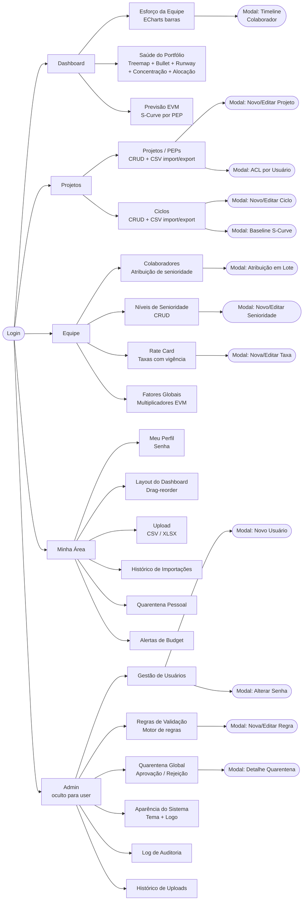
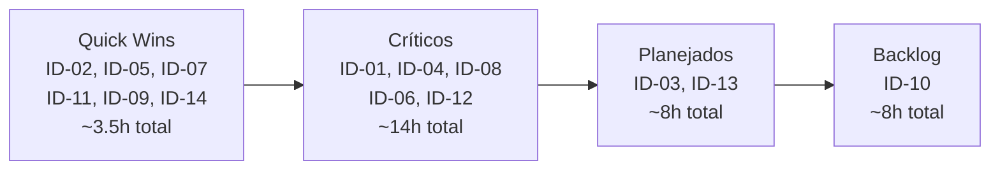
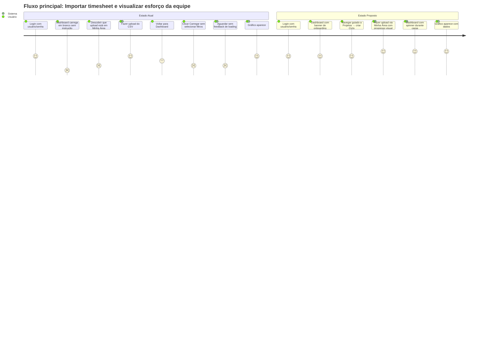

# UX Audit — PMAS (Project Management Assistant System)

> **Escopo:** Interface completa — `frontend/index.html` (1.290 linhas), `frontend/app.js` (~5.600 linhas), `frontend/style.css` (~830 linhas), `frontend/multiselect.js`
> **Data:** 2026-05-21
> **Metodologia:** Nielsen's 10 Heuristics · WCAG 2.2 (Nível A e AA) · Fitts · Hick · Miller · Gestalt

---

## 1. Resumo Executivo

O PMAS é uma aplicação de analytics de portfólio com design system próprio (Navy + Sky Blue), internacionalização PT/EN e uma codebase frontend substancial em JavaScript Vanilla. A interface é funcionalmente completa: modais CRUD, gráficos ECharts, multiselect em cascata, semáforo de saúde, drag-and-drop de layout e exportações CSV. A densidade de features é alta para um produto de nicho (gestão EVM).

O estado geral é **funcional com débito de acessibilidade significativo**. Todos os WCAG Nível A críticos que bloqueiam usuários com tecnologia assistiva estão violados: modais sem `aria-labelledby`, sem focus trap, e remoção global do ring de foco (`outline: none`). A carga cognitiva no carregamento inicial é elevada — o dashboard aparece em branco sem instrução de onboarding. Erros de sistema são expostos em linguagem técnica (`Erro: ${err.message}`) e desaparecem automaticamente em 6s sem possibilidade de releitura.

**Problemas encontrados por severidade:** Crítico: 5 · Alto: 4 · Médio: 6 · Baixo: 4

**3 impactos mais concretos no usuário final:**
1. Usuário de leitor de tela não consegue operar nenhum modal — sem focus trap, o foco vaza para conteúdo fora do diálogo.
2. Usuário de teclado perde rastreio visual ao navegar por tabs e campos — `outline: none` global remove qualquer indicador de foco.
3. Usuário novo ao abrir o sistema pela primeira vez vê um dashboard vazio sem nenhuma instrução de como começar.

**Maturidade de UX estimada: 2.5 / 5**
_(1 = sem intenção de UX; 3 = intencional mas incompleto; 5 = WCAG-conformante e testado com usuários)_
A aplicação demonstra intenção clara de UX (design tokens, empty states, i18n), mas acessibilidade de nível A ainda não foi tratada e há inconsistências de sistema de design por toda a base de código.

---

## 2. Mapa da Arquitetura de Informação Atual



**Observação arquitetural:** Ciclos e Projetos estão agrupados em um único tab "Projetos". A escolha reduz o número de tabs mas não é intuitiva — ciclos e projetos são entidades com ciclos de vida distintos que um usuário pode querer acessar independentemente.

---

## 3. Inventário de Padrões de Interação

| Padrão | Presente | Implementação | Problema Identificado |
|---|---|---|---|
| Formulários de login | ✅ | Completa | OK — labels associadas, erro inline |
| Modais CRUD | ✅ | Parcial | Sem focus trap, sem `aria-labelledby`, fechar com × não padronizado |
| Tabs principais | ✅ | Completa | Sem `role="tablist"` / `role="tab"` ARIA |
| Sub-tabs analytics | ✅ | Completa | Sem `role="tablist"` / `role="tab"` ARIA |
| MultiSelect cascata | ✅ | Parcial | Sem operação por teclado, placeholders não atualizam com i18n |
| Tabelas de dados | ✅ | Parcial | Sem `scope` em `<th>`, sem `caption` |
| Toast de notificação | ✅ | Parcial | Auto-dismiss em 6s, sem `role="alert"`, sem botão de fechar |
| Empty states | ✅ | Completa | Mensagens específicas por contexto, i18n presente |
| Loading states | ⚠️ | Parcial | Somente texto "Carregando…" via JS — nenhum spinner ou skeleton |
| Error states | ⚠️ | Parcial | Toast genérico `Erro: ${err.message}`, desaparece automático |
| Confirmação de ação destrutiva | ⚠️ | Parcial | `window.confirm()` nativo em 12 chamadas, 3 ainda hardcoded PT |
| Drag-and-drop layout | ✅ | Completa | SortableJS — sem alternativa de teclado |
| CSV export | ✅ | Completa | Client-side blob, sem feedback de progresso |
| Navegação por teclado geral | ⚠️ | Parcial | Tab order natural mas focus ring removido globalmente |
| Foco em modal | ❌ | Ausente | Nenhum focus trap implementado |
| Atalhos de teclado | ❌ | Ausente | Nenhum atalho de teclado disponível |
| Responsividade mobile | ⚠️ | Mínima | Apenas um breakpoint `@media (max-width: 800px)` para my-area-grid |
| Onboarding / first run | ❌ | Ausente | Dashboard vazio no primeiro acesso |

---

## 4. Auditoria Heurística (Nielsen)

| # | Heurística | Status | Evidência no código |
|---|---|---|---|
| H1 | Visibilidade do estado do sistema | ⚠️ | Sem spinner durante fetch; toast auto-dismiss; semáforo e badges presentes |
| H2 | Compatibilidade sistema e mundo real | ⚠️ | "PEP/WBS" sem contexto para novos usuários; limiar "0–1" em vez de "%" |
| H3 | Controle e liberdade do usuário | ⚠️ | Sem desfazer delete; `window.confirm()` não pode ser customizado |
| H4 | Consistência e padrões | ⚠️ | 147 inline `style=`, cores off-token no header; `×` vs `✕` nos modais |
| H5 | Prevenção de erros | ⚠️ | Sem validação client-side em formulários CRUD; campos opcionais sem indicação |
| H6 | Reconhecimento em vez de memorização | ✅ | Labels, empty states e filtros persistem no estado visual |
| H7 | Flexibilidade e eficiência | ⚠️ | Shortcuts de data (último mês/trimestre), CSV export — sem atalhos de teclado |
| H8 | Estética e design minimalista | ⚠️ | Design system coerente; 147 inline styles e cores hardcoded criam ruído |
| H9 | Reconhecer e recuperar de erros | ❌ | `Erro: ${err.message}` sem contexto; auto-dismiss 6s; sem botão de fechar |
| H10 | Ajuda e documentação | ⚠️ | MANUAL.md existe mas não há help in-app; EVM sem glossário |

---

### H1 — Visibilidade do estado do sistema ⚠️

**Evidência:** `frontend/app.js:4188` — `notify()` substitui o conteúdo de `#notification` e esconde em 6s sem feedback de progress durante fetch.
**Impacto no usuário:** Usuário clica em "Carregar" e não sabe se o sistema está processando ou travado.
**Severidade:** Alto

---

### H3 — Controle e liberdade do usuário ⚠️

**Evidência:** `frontend/app.js:3542` — `if (!confirm(_t('confirm.delete_cycle'))) return;` — padrão repetido 12 vezes com `window.confirm()`.
**Impacto:** Não é possível personalizar o diálogo, ele interrompe completamente a interface e não há desfazer após confirmação.
**Severidade:** Médio

---

### H4 — Consistência e padrões ⚠️

**Evidência:** `frontend/index.html:78` — `background:#1e293b;border:1px solid #334155` no painel de ingestão, vs. tokens `--card: #0e2038` e `--border: #172f4e` definidos em `style.css:13`.
`frontend/app.js:4028` — `if (!confirm('Excluir esta taxa?'))` hardcoded em PT (não usa `_t()`), mesma pattern em linhas 5038 e 5369.
**Impacto:** Experiência visual fragmentada; strings PT persistem em modo EN.
**Severidade:** Médio

---

### H9 — Ajudar usuários a reconhecer e se recuperar de erros ❌

**Evidência:** `frontend/app.js:1295` — `notify(\`Erro: ${err.message}\`, 'error')`. Implementação em `app.js:4188`:
```javascript
function notify(msg, type = 'info') {
  const el = document.getElementById('notification');
  el.textContent = msg; el.className = type; el.style.display = 'block';
  setTimeout(() => { el.style.display = 'none'; }, 6000);
}
```
Sem botão de fechar, sem `role="alert"`, desaparece em 6s.
**Impacto:** Usuário perde o erro se não ler em 6s; mensagem técnica não informa ação de recuperação.
**Severidade:** Alto

---

## 5. Auditoria de Acessibilidade (WCAG 2.2)

### 5.1 Critérios de Nível A (obrigatório)

| Critério | Status | Evidência |
|---|---|---|
| 1.1.1 Conteúdo não-textual (alt text) | ❌ | Gráficos ECharts renderizados em `<canvas>` sem texto alternativo ou `aria-label` |
| 1.3.1 Info e relações (semântica HTML) | ⚠️ | `<th>` sem `scope`; modais sem `aria-labelledby`; tabs sem `role="tablist"/"tab"` |
| 2.1.1 Teclado | ❌ | Modal sem focus trap (Tab vaza para fora); MultiSelect inoperável por teclado; drag-and-drop sem alternativa |
| 2.4.3 Ordem de foco | ⚠️ | Foco não é enviado para o modal ao abrir (`document.querySelector('.modal-box').focus()` ausente) |
| 3.3.1 Identificação de erros | ⚠️ | Toast presente mas sem `role="alert"`; erro de form de login é inline mas sem `aria-describedby` no input |
| 3.3.2 Labels ou instruções | ✅ | Maioria dos campos tem `<label for="...">` correto |
| 4.1.2 Nome, função, valor | ❌ | 13 modais com `role="dialog" aria-modal="true"` mas sem `aria-labelledby`; botões ✕ sem `aria-label` consistente |

### 5.2 Critérios de Nível AA (recomendado)

| Critério | Status | Evidência |
|---|---|---|
| 1.4.3 Contraste mínimo (4.5:1 texto) | ❌ | `--text-3: #3d6080` sobre `--bg: #060e1c` ≈ 3.2:1 (falha); `--text-2: #7ba0c0` sobre `--bg` ≈ 4.1:1 (falha marginal) |
| 1.4.4 Redimensionamento de texto | ✅ | Tipografia em `rem` e `em`; layout em `fr`/`%` |
| 2.4.7 Foco visível | ❌ | `style.css:103`: `outline: none` + `style.css:308`: `outline: none` — ring de foco removido globalmente |
| 3.2.3 Navegação consistente | ✅ | Tabs e sub-tabs em posição consistente entre sessões |

---

## 6. Análise De-Para

---

### ID-01 — Modal sem focus trap e sem `aria-labelledby`

**Severidade:** Crítico
**Heurística violada:** WCAG 2.1.1 (Teclado), WCAG 4.1.2 (Nome, função, valor)
**Arquivo:** `frontend/index.html:867–899`, `frontend/app.js` (todos os `_open*Modal`)

#### Estado Atual

Todos os 13 modais usam `role="dialog" aria-modal="true"` mas não implementam focus trap nem `aria-labelledby`. Ao abrir um modal, o foco permanece no botão que o abriu, e Tab navega livremente para o conteúdo por trás do backdrop.

```html
<!-- index.html:867 — padrão repetido em todos os 13 modais -->
<div class="modal-backdrop" id="cycleModal" hidden>
  <div class="modal-box" role="dialog" aria-modal="true">
    <!-- SEM aria-labelledby -->
    <div class="modal-header">
      <h3 id="cycleModalTitle" data-i18n="cm.title_new">Novo Ciclo</h3>
      <!-- foco NÃO é enviado aqui ao abrir -->
```

```javascript
// app.js — abertura de modal sem gestão de foco
document.getElementById('newCycleBtn').addEventListener('click', () => {
  // ... preenche campos ...
  document.getElementById('cycleModal').hidden = false;
  // .focus() ausente
});
```

#### Proposta

```html
<!-- Adicionar aria-labelledby referenciando o h3 existente -->
<div class="modal-box" role="dialog" aria-modal="true" aria-labelledby="cycleModalTitle">
```

```javascript
// Função utilitária de abertura de modal com focus trap
function openModal(modalId, firstFocusSelector) {
  const modal = document.getElementById(modalId);
  modal.hidden = false;
  const firstFocusable = modal.querySelector(firstFocusSelector || 'button, input, select');
  firstFocusable?.focus();

  // Focus trap
  modal._trapHandler = (e) => {
    if (e.key !== 'Tab') return;
    const focusable = [...modal.querySelectorAll(
      'button:not([disabled]), input:not([disabled]), select:not([disabled]), textarea:not([disabled]), [tabindex]:not([tabindex="-1"])'
    )];
    const first = focusable[0], last = focusable[focusable.length - 1];
    if (e.shiftKey ? document.activeElement === first : document.activeElement === last) {
      e.preventDefault();
      (e.shiftKey ? last : first).focus();
    }
  };
  modal._escHandler = (e) => { if (e.key === 'Escape') closeModal(modalId); };
  modal.addEventListener('keydown', modal._trapHandler);
  document.addEventListener('keydown', modal._escHandler);
}

function closeModal(modalId) {
  const modal = document.getElementById(modalId);
  modal.hidden = true;
  modal.removeEventListener('keydown', modal._trapHandler);
  document.removeEventListener('keydown', modal._escHandler);
  // Retornar foco ao trigger
  modal._triggerEl?.focus();
}
```

#### Por que esta mudança melhora a experiência

Usuários de teclado e leitor de tela conseguem operar os modais sem que o foco vaze para o conteúdo invisível atrás do backdrop. `aria-labelledby` conecta o título do modal ao diálogo, permitindo que leitores de tela anunciem "Novo Ciclo, diálogo" ao abrir.

#### Viabilidade

| Dimensão | Avaliação |
|---|---|
| Esforço estimado | M — ~4h para utilitário + aplicação nos 13 modais |
| Risco de regressão | Baixo — mudança aditiva no comportamento de modais |
| Dependências | Nenhuma biblioteca adicional necessária |
| Testabilidade | Navegar por Tab com modal aberto; verificar que foco não alcança conteúdo por trás |

---

### ID-02 — `outline: none` global remove o focus ring

**Severidade:** Crítico
**Heurística violada:** WCAG 2.4.7 (Foco visível)
**Arquivo:** `frontend/style.css:103`, `frontend/style.css:308`

#### Estado Atual

Dois blocos CSS removem o outline de todos os inputs e botões:

```css
/* style.css:103 */
input, select { outline: none; transition: border-color 0.15s, box-shadow 0.15s; }

/* style.css:308 */
input:focus, select.form-select:focus { outline: none; border-color: var(--primary); }
```

O primeiro remove o outline padrão do browser em TODOS os estados (inclusive foco). O segundo o substitui por `border-color` — o que funciona para inputs com borda visível mas não para botões (`<button>`) que não têm a mesma treatment.

#### Proposta

```css
/* Remover outline apenas no mouse (pointer), manter no teclado */
:focus:not(:focus-visible) { outline: none; }

:focus-visible {
  outline: 2px solid var(--primary);
  outline-offset: 2px;
  border-radius: 2px;
}

/* Manter a substituição por box-shadow nos inputs */
input:focus-visible, select:focus-visible {
  outline: none;
  border-color: var(--primary);
  box-shadow: 0 0 0 3px rgba(14, 165, 233, 0.25);
}
```

#### Por que esta mudança melhora a experiência

`:focus-visible` é suportado em todos os browsers modernos e aplica o indicador de foco apenas quando o elemento foi ativado por teclado — invisível para usuários de mouse, indispensável para teclado/assistiva.

#### Viabilidade

| Dimensão | Avaliação |
|---|---|
| Esforço estimado | P — ~30min |
| Risco de regressão | Baixo — apenas adiciona anel onde antes não havia |
| Dependências | Nenhuma |
| Testabilidade | Navegar por Tab pela aplicação e confirmar anel visível em cada elemento interativo |

---

### ID-03 — Gráficos ECharts sem alternativa textual

**Severidade:** Crítico
**Heurística violada:** WCAG 1.1.1 (Conteúdo não-textual)
**Arquivo:** `frontend/app.js` (todos os `echarts.init()`), `frontend/index.html`

#### Estado Atual

ECharts renderiza em `<canvas>`. Nenhum dos 8+ containers de gráfico tem `aria-label`, `role`, ou conteúdo alternativo.

```html
<!-- index.html:207 — sem nenhum atributo acessível -->
<div id="effortChart" style="width:100%;height:500px"></div>
```

```javascript
// app.js — echarts.init sem opção de acessibilidade
const chart = echarts.init(document.getElementById('effortChart'));
```

#### Proposta

```javascript
// Habilitar aria no ECharts (suportado desde v5.3)
const chart = echarts.init(container, null, { aria: { enabled: true, decal: { show: true } } });

// Para charts de barras — adicionar label descritivo no container
container.setAttribute('aria-label', `Gráfico de esforço por colaborador — ${data.length} colaboradores`);
container.setAttribute('role', 'img');
```

Adicionalmente, para dados tabulares (barras horizontais), renderizar uma `<table>` hidden acessível com os mesmos dados usada pelos leitores de tela:

```html
<div id="effortChart" role="img" aria-labelledby="effortChartTitle">
  <span id="effortChartTitle" class="sr-only">Esforço por Colaborador — dados em tabela abaixo</span>
</div>
<table class="sr-only" id="effortChartTable" aria-live="polite">
  <!-- preenchida dinamicamente pelo JS junto com o gráfico -->
</table>
```

#### Por que esta mudança melhora a experiência

Usuários de leitores de tela passam completamente pelo conteúdo analítico atual — a aplicação inteira fica inacessível para eles no dashboard principal.

#### Viabilidade

| Dimensão | Avaliação |
|---|---|
| Esforço estimado | M — ~6h (opção aria ECharts é 30min; tabelas hidden ~5h para 8 charts) |
| Risco de regressão | Baixo |
| Dependências | ECharts v5.3+ (já em uso) |
| Testabilidade | Testar com VoiceOver/NVDA; verificar que charts anunciam dados relevantes |

---

### ID-04 — MultiSelect inoperável por teclado

**Severidade:** Crítico
**Heurística violada:** WCAG 2.1.1 (Teclado)
**Arquivo:** `frontend/multiselect.js`

#### Estado Atual

O componente `MultiSelect` abre um dropdown via clique mas não tem nenhum handler de teclado. O botão de trigger é um `<button>` mas `Enter`/`Space` não abrem o dropdown (o evento `click` funciona por padrão, mas Arrow keys, Enter para seleção de item, e Escape para fechar não estão implementados).

```javascript
// multiselect.js:3 — sem nenhum addEventListener('keydown', ...)
constructor(el, placeholder, onChange) {
  this.el = el;
  this.placeholder = placeholder;
  // ... nenhum handler de teclado
```

#### Proposta

```javascript
// Adicionar ao construtor após criação do dropdown
this.btn.addEventListener('keydown', e => {
  if (e.key === 'Enter' || e.key === ' ') { e.preventDefault(); this._toggle(); }
  if (e.key === 'Escape') this._close();
});

this.list.addEventListener('keydown', e => {
  const items = [...this.list.querySelectorAll('label')];
  const idx = items.indexOf(document.activeElement);
  if (e.key === 'ArrowDown') { e.preventDefault(); items[Math.min(idx + 1, items.length - 1)]?.focus(); }
  if (e.key === 'ArrowUp')   { e.preventDefault(); items[Math.max(idx - 1, 0)]?.focus(); }
  if (e.key === 'Escape')    { this._close(); this.btn.focus(); }
  if (e.key === 'Enter' || e.key === ' ') { e.preventDefault(); items[idx]?.click(); }
});

// Atributos ARIA no button trigger
this.btn.setAttribute('aria-haspopup', 'listbox');
this.btn.setAttribute('aria-expanded', 'false');
this._toggle = () => {
  const open = this.list.hidden;
  this.list.hidden = !open;
  this.btn.setAttribute('aria-expanded', String(open));
  if (open) this.list.querySelector('label')?.focus();
};
```

#### Por que esta mudança melhora a experiência

Os 4 filtros de MultiSelect são o ponto de entrada principal do dashboard — sem operação por teclado, o fluxo principal da aplicação fica bloqueado.

#### Viabilidade

| Dimensão | Avaliação |
|---|---|
| Esforço estimado | M — ~3h |
| Risco de regressão | Baixo — comportamento de mouse não é alterado |
| Dependências | Nenhuma |
| Testabilidade | Navegar filtros apenas com teclado; verificar seleção, deselect, e fechar com Escape |

---

### ID-05 — `--text-3` e `--text-2` com contraste insuficiente

**Severidade:** Crítico (WCAG A implica AA para texto de UI)
**Heurística violada:** WCAG 1.4.3 (Contraste mínimo)
**Arquivo:** `frontend/style.css:18-19`

#### Estado Atual

```css
:root {
  --bg:     #060e1c;
  --text-2: #7ba0c0;  /* ratio ≈ 4.1:1 vs --bg — WCAG AA requer 4.5:1 */
  --text-3: #3d6080;  /* ratio ≈ 3.2:1 vs --bg — WCAG AA reprovado */
}
```

`--text-3` é usado em `field label`, `tab-btn` (estado inativo), `.header-sub`, separadores — texto legível de UI, não decorativo. `--text-2` é usado em múltiplas descrições e textos secundários.

#### Proposta

```css
:root {
  --text-2: #8ab4d4;  /* ratio ≈ 4.6:1 vs #060e1c — WCAG AA ✅ */
  --text-3: #5a82a0;  /* ratio ≈ 4.5:1 vs #060e1c — WCAG AA ✅ */
}
```

Validar com ferramenta como [WebAIM Contrast Checker](https://webaim.org/resources/contrastchecker/) após ajuste. Os tokens restantes (`--text: #ddeeff` ≈ 15:1, `--primary: #0ea5e9` ≈ 4.9:1) já passam.

#### Por que esta mudança melhora a experiência

Labels de campo, textos de filtro e sub-labels ficam legíveis em condições de luminosidade variada e para usuários com baixa visão parcial.

#### Viabilidade

| Dimensão | Avaliação |
|---|---|
| Esforço estimado | P — ~20min |
| Risco de regressão | Baixo — apenas ajuste de valor de cor nos tokens |
| Dependências | Verificar se o tema customizável via API `/api/theme` não sobrescreve estes tokens em produção |
| Testabilidade | Contrast checker automatizado no CI (ex: axe-core) |

---

### ID-06 — Sem indicador de loading durante chamadas de API

**Severidade:** Alto
**Heurística violada:** H1 (Visibilidade do estado do sistema)
**Arquivo:** `frontend/app.js` — todas as funções `async` de carregamento

#### Estado Atual

Funções como `loadEffortChart()` e `loadPortfolioHealth()` fazem `fetch()` sem qualquer indicador visual intermediário. O usuário clica em "Carregar" e aguarda sem feedback.

```javascript
// app.js:1220 — loadData sem feedback visual
async function loadData() {
  const cycleIds  = cycleMs.getValues();
  // ... fetch direto sem spinner
  const r = await apiFetch(`/api/dashboard?${params}`);
  _lastEffortData = r.data ?? [];
  _renderEffortTab();
}
```

#### Proposta

```javascript
function _setLoading(containerId, isLoading) {
  const el = document.getElementById(containerId);
  if (!el) return;
  if (isLoading) {
    el.dataset.prevContent = el.innerHTML;
    el.innerHTML = `<div class="loading-state" aria-live="polite" aria-label="${_t('loading')}">
      <div class="spinner"></div>
      <span>${_t('loading')}</span>
    </div>`;
  }
}
```

```css
/* style.css */
.loading-state { display: flex; align-items: center; gap: .75rem; padding: 2rem; color: var(--text-2); }
.spinner { width: 1.25rem; height: 1.25rem; border: 2px solid var(--border-hi);
  border-top-color: var(--primary); border-radius: 50%; animation: spin .7s linear infinite; }
@keyframes spin { to { transform: rotate(360deg); } }
```

Adicionalmente, desabilitar o botão "Carregar" (`#loadBtn`) durante o fetch para prevenir duplo clique.

#### Por que esta mudança melhora a experiência

Usuário recebe confirmação imediata de que a ação foi recebida pelo sistema, reduzindo cliques repetidos e percepção de lentidão. Especialmente crítico em redes mais lentas ou datasets grandes.

#### Viabilidade

| Dimensão | Avaliação |
|---|---|
| Esforço estimado | M — ~3h (spinner CSS + wrapping de ~8 funções de fetch) |
| Risco de regressão | Baixo |
| Dependências | Nenhuma |
| Testabilidade | Throttle de rede no DevTools; verificar spinner aparece e desaparece corretamente |

---

### ID-07 — Toast de notificação sem controle e sem ARIA

**Severidade:** Alto
**Heurística violada:** H9 (Reconhecer e recuperar de erros), WCAG 4.1.3 (Mensagens de status)
**Arquivo:** `frontend/app.js:4188`, `frontend/index.html:90`

#### Estado Atual

```javascript
function notify(msg, type = 'info') {
  const el = document.getElementById('notification');
  el.textContent = msg; el.className = type; el.style.display = 'block';
  setTimeout(() => { el.style.display = 'none'; }, 6000);
  // SEM role="alert", SEM botão de fechar, SEM persistência
}
```

```html
<!-- index.html:90 — sem role ou aria-live -->
<div id="notification"></div>
```

#### Proposta

```html
<div id="notification" role="alert" aria-live="assertive" aria-atomic="true" hidden>
  <span id="notificationText"></span>
  <button type="button" id="notificationClose" aria-label="Fechar notificação">✕</button>
</div>
```

```javascript
function notify(msg, type = 'info') {
  const el = document.getElementById('notification');
  const textEl = document.getElementById('notificationText');
  clearTimeout(el._timer);
  textEl.textContent = msg;
  el.className = type;
  el.hidden = false;
  el._timer = setTimeout(() => { el.hidden = true; }, type === 'error' ? 0 : 6000);
  // type=error: não auto-dismiss erros — usuário deve fechar manualmente
}
document.getElementById('notificationClose').addEventListener('click', () => {
  document.getElementById('notification').hidden = true;
});
```

#### Por que esta mudança melhora a experiência

Erros críticos não desaparecem involuntariamente. Leitores de tela anunciam o toast imediatamente via `aria-live="assertive"`. Usuário tem agência para fechar.

#### Viabilidade

| Dimensão | Avaliação |
|---|---|
| Esforço estimado | P — ~1.5h |
| Risco de regressão | Baixo |
| Dependências | Nenhuma |
| Testabilidade | Testar com VoiceOver; verificar que erros persistem e success/info autodismissem |

---

### ID-08 — `window.confirm()` para 12 ações destrutivas

**Severidade:** Alto
**Heurística violada:** H4 (Consistência), H3 (Controle e liberdade)
**Arquivo:** `frontend/app.js:3542, 3698, 3946, 4028, 4348, 5038, 5369` e outros

#### Estado Atual

```javascript
// app.js:3542
if (!confirm(_t('confirm.delete_cycle'))) return;

// app.js:4028 — hardcoded, não usa _t()
if (!confirm('Excluir esta taxa?')) return;

// app.js:5038 — hardcoded, não usa _t()
if (!confirm('Excluir esta regra?')) return;

// app.js:5369 — hardcoded, não usa _t()
if (!confirm('Remover logo personalizado?')) return;
```

O `window.confirm()` nativo bloqueia o event loop, tem aparência determinada pelo OS (fora do design system), e nos 3 casos hardcoded nem usa o sistema de i18n.

#### Proposta

Substituir por um mini-modal de confirmação reutilizável, dentro do design system:

```javascript
function confirmDialog(message, onConfirm, danger = true) {
  const modal = document.getElementById('confirmModal');
  document.getElementById('confirmModalMsg').textContent = message;
  const btn = document.getElementById('confirmModalOk');
  btn.className = `btn ${danger ? 'btn-danger' : 'btn-primary'}`;
  const handler = () => { closeModal('confirmModal'); onConfirm(); btn.removeEventListener('click', handler); };
  btn.addEventListener('click', handler);
  openModal('confirmModal', '#confirmModalOk');
}
```

```html
<!-- Adicionar ao index.html -->
<div class="modal-backdrop" id="confirmModal" hidden>
  <div class="modal-box" role="dialog" aria-modal="true" aria-labelledby="confirmModalTitle" style="max-width:420px">
    <div class="modal-header">
      <h3 id="confirmModalTitle" data-i18n="confirm.modal_title">Confirmar ação</h3>
    </div>
    <div class="modal-body" style="padding:1.5rem 1.25rem">
      <p id="confirmModalMsg"></p>
    </div>
    <div class="modal-footer">
      <button type="button" class="btn btn-secondary" id="confirmModalCancel" data-i18n="btn.cancel">Cancelar</button>
      <button type="button" class="btn btn-danger" id="confirmModalOk" data-i18n="btn.confirm">Confirmar</button>
    </div>
  </div>
</div>
```

#### Por que esta mudança melhora a experiência

O diálogo segue o design system, suporta i18n, pode ser cancelado com Escape, e tem focus trap. Os 3 casos hardcoded ficam automaticamente traduzidos.

#### Viabilidade

| Dimensão | Avaliação |
|---|---|
| Esforço estimado | M — ~3h (modal HTML + substituição nas 12 chamadas) |
| Risco de regressão | Baixo |
| Dependências | Requer ID-01 (focus trap) estar implementado |
| Testabilidade | Confirmar que Escape cancela, Enter confirma, e ação destrutiva só ocorre após clique em "Confirmar" |

---

### ID-09 — Botões `.btn-sm` abaixo do mínimo de 44px (Fitts)

**Severidade:** Médio
**Heurística violada:** Lei de Fitts (alvo de toque mínimo 44×44px / WCAG 2.5.5 AA)
**Arquivo:** `frontend/style.css:274`

#### Estado Atual

```css
.btn-sm { height: 1.9rem; font-size: 0.76rem; padding: 0 0.75rem; }
/* 1.9rem × 16px = 30.4px — abaixo do mínimo de 44px */
```

`.btn-sm` é usado extensivamente em ações de tabela (Editar, Excluir, Bloquear, Acesso) onde a densidade de alvos por linha cria dificuldade adicional.

#### Proposta

```css
.btn-sm {
  height: 2rem; /* 32px visual, mas com padding virtual de toque */
  font-size: 0.76rem;
  padding: 0 0.75rem;
  /* Área de toque aumentada sem alterar o visual */
  position: relative;
}
.btn-sm::before {
  content: '';
  position: absolute;
  top: 50%; left: 50%;
  transform: translate(-50%, -50%);
  min-width: 44px; min-height: 44px;
}
```

Ou aumentar a altura diretamente para `2.25rem` (igual ao `.btn` padrão) e usar apenas espaçamento horizontal para diferenciar.

#### Por que esta mudança melhora a experiência

Alvos de toque adequados reduzem erros de clique, especialmente em dispositivos touch e para usuários com limitações motoras finas.

#### Viabilidade

| Dimensão | Avaliação |
|---|---|
| Esforço estimado | P — ~30min |
| Risco de regressão | Baixo — mudança visual mínima |
| Dependências | Verificar se linhas de tabela não ficam muito densas |
| Testabilidade | Teste de toque em dispositivo real ou DevTools mobile mode |

---

### ID-10 — Inline styles com valores off-token

**Severidade:** Médio
**Heurística violada:** H4 (Consistência e padrões), H8 (Estética minimalista)
**Arquivo:** `frontend/index.html` (151 ocorrências de `style=`)

#### Estado Atual

O painel de ingestão usa cores hardcoded que contradizem os tokens definidos:

```html
<!-- index.html:78 — off-token: #1e293b vs --card: #0e2038; #334155 vs --border: #172f4e -->
<div style="background:#1e293b;border:1px solid #334155;...">
```

O header usa um widget de moeda fora do sistema de tokens:
```html
<!-- index.html:78 -->
<div style="display:flex;align-items:center;gap:.3rem;background:#1e293b;border:1px solid #334155;border-radius:.4rem;padding:.15rem .75rem;min-width:11rem">
```

Em todo o `index.html`, 151 atributos `style=` misturam valores de tokens e valores hardcoded, criando 2 paletas paralelas.

#### Proposta

Criar classes utilitárias para os padrões mais repetidos e mover os valores para o sistema de tokens:

```css
/* style.css — adicionar */
.ingest-panel { background: var(--card); border: 1px solid var(--border); }
.header-widget {
  display: flex; align-items: center; gap: .3rem;
  background: var(--surface); border: 1px solid var(--border);
  border-radius: var(--radius); padding: .15rem .75rem;
}
```

#### Por que esta mudança melhora a experiência

Tema customizável via `/api/theme` afeta apenas os tokens CSS — os valores hardcoded `#1e293b` nunca são alterados pelo tema, criando incoerência visual quando o usuário customiza o sistema.

#### Viabilidade

| Dimensão | Avaliação |
|---|---|
| Esforço estimado | G — ~8h (151 ocorrências, refatoração cuidadosa) |
| Risco de regressão | Médio — mudanças de layout visual requerem revisão |
| Dependências | Nenhuma |
| Testabilidade | Visual diff antes/depois; testar com tema customizado |

---

### ID-11 — MultiSelect placeholders não atualizam com i18n

**Severidade:** Médio
**Heurística violada:** H4 (Consistência), i18n coverage
**Arquivo:** `frontend/app.js:1005–1008`, `frontend/multiselect.js`

#### Estado Atual

```javascript
// app.js:1005 — placeholders fixados na língua do boot
const cycleMs = _createMS(document.getElementById('cycleMs'), _t('ms.cycle_ph'), onCycleChange);
```

```javascript
// app.js:1107 — toggle de língua não atualiza MS
document.getElementById('langToggleBtn').addEventListener('click', () => {
  _locale = _locale === 'pt' ? 'en' : 'pt';
  _applyI18n();
  // cycleMs.setPlaceholder() ausente
});
```

#### Proposta

```javascript
// multiselect.js — adicionar método
setPlaceholder(text) {
  this.placeholder = text;
  if (!this.getValues().length) {
    this.btn.querySelector('span') // ou o elemento que exibe o placeholder
      .textContent = text;
  }
}
```

```javascript
// app.js — no handler do langToggleBtn
cycleMs.setPlaceholder(_t('ms.cycle_ph'));
pepMs.setPlaceholder(_t('ms.pep_ph'));
pepDescMs.setPlaceholder(_t('ms.pep_desc_ph'));
collaboratorMs.setPlaceholder(_t('ms.collab_ph'));
```

#### Por que esta mudança melhora a experiência

Em modo EN, os dropdowns de filtro exibem texto PT ("— Selecione ciclo(s) —") enquanto toda a interface ao redor está em inglês — quebra a coerência da experiência EN.

#### Viabilidade

| Dimensão | Avaliação |
|---|---|
| Esforço estimado | P — ~30min |
| Risco de regressão | Baixo |
| Dependências | Nenhuma |
| Testabilidade | Togglear idioma e verificar os 4 filtros |

---

### ID-12 — Onboarding ausente no primeiro acesso

**Severidade:** Médio
**Heurística violada:** H10 (Ajuda e documentação), H6 (Reconhecimento)
**Arquivo:** `frontend/app.js` — `_bootApp()`

#### Estado Atual

Ao fazer login pela primeira vez (sem dados), o usuário vê o dashboard com todos os painéis em estado "empty" mas nenhuma instrução sequencial de como começar.

```javascript
// app.js — _bootApp() não detecta estado de primeiro uso
async function _bootApp() {
  await refreshCycles();
  await Promise.all([refreshPeps(), refreshCollaborators()]);
  _renderActiveTab();
  // sem detecção de "banco vazio"
}
```

#### Proposta

```javascript
async function _bootApp() {
  await refreshCycles();
  const cycles = _allCycles;
  if (!cycles.length && _isAdmin()) {
    _showOnboardingBanner();
  }
  // ...
}

function _showOnboardingBanner() {
  const banner = document.createElement('div');
  banner.className = 'card onboarding-banner';
  banner.innerHTML = `
    <h2>${_t('onboard.title')}</h2>
    <ol>
      <li>${_t('onboard.step1')}</li>  <!-- Crie ao menos um Ciclo em Projetos → Ciclos -->
      <li>${_t('onboard.step2')}</li>  <!-- Cadastre seus Projetos com código PEP e budget -->
      <li>${_t('onboard.step3')}</li>  <!-- Importe um timesheet em Minha Área → Upload -->
    </ol>
    <button class="btn btn-primary" onclick="document.querySelector('[data-tab=\"projects\"]').click(); this.closest('.onboarding-banner').remove()">${_t('onboard.cta')}</button>
  `;
  document.getElementById('tab-dashboard').prepend(banner);
}
```

#### Por que esta mudança melhora a experiência

Remove a desorientação inicial — o usuário entende imediatamente que precisa de dados e qual é o fluxo mínimo para começar, em vez de inferir a ordem certa de operação.

#### Viabilidade

| Dimensão | Avaliação |
|---|---|
| Esforço estimado | P — ~2h |
| Risco de regressão | Baixo — só aparece com banco vazio |
| Dependências | i18n keys para textos de onboarding |
| Testabilidade | Login com banco limpo, verificar banner; login com dados existentes, verificar ausência |

---

### ID-13 — Tabs sem atributos ARIA de role

**Severidade:** Baixo
**Heurística violada:** WCAG 4.1.2 (Nome, função, valor)
**Arquivo:** `frontend/index.html:131–153`, `frontend/index.html:185–197`

#### Estado Atual

```html
<!-- index.html:130 — nav sem role="tablist" -->
<nav class="app-tabs">
  <button type="button" class="tab-btn active" data-tab="dashboard">
    <!-- sem role="tab", sem aria-selected, sem aria-controls -->
```

#### Proposta

```html
<nav class="app-tabs" role="tablist" aria-label="Navegação principal">
  <button type="button" class="tab-btn active" data-tab="dashboard"
    role="tab" aria-selected="true" aria-controls="tab-dashboard" id="tab-btn-dashboard">
  </button>
```

Atualizar o JS ao mudar de tab para refletir `aria-selected`:
```javascript
document.querySelectorAll('.tab-btn').forEach(btn => {
  btn.setAttribute('aria-selected', btn.classList.contains('active'));
});
```

#### Viabilidade

| Dimensão | Avaliação |
|---|---|
| Esforço estimado | P — ~1h |
| Risco de regressão | Baixo |
| Dependências | Nenhuma |
| Testabilidade | Verificar com axe-core / browser accessibility panel |

---

### ID-14 — Ausência de `<h1>` no documento

**Severidade:** Baixo
**Heurística violada:** WCAG 1.3.1 (Info e relações), hierarquia semântica
**Arquivo:** `frontend/index.html`

#### Estado Atual

O documento começa com `<h2>` para seções de conteúdo. Não há `<h1>` fora de modais/overlays. O nome do produto "PMAS" é um `<span>` no header.

#### Proposta

```html
<!-- Adicionar visualmente oculto mas acessível para leitores de tela -->
<h1 class="sr-only" id="appMainTitle" data-i18n="app.title">PMAS — Dashboard de Gestão de Projetos</h1>
```

```css
.sr-only {
  position: absolute; width: 1px; height: 1px;
  padding: 0; margin: -1px; overflow: hidden;
  clip: rect(0,0,0,0); white-space: nowrap; border: 0;
}
```

#### Viabilidade

| Dimensão | Avaliação |
|---|---|
| Esforço estimado | P — ~15min |
| Risco de regressão | Nenhum |
| Dependências | Nenhuma |
| Testabilidade | Outline de headings em ferramentas de acessibilidade |

---

## 7. Matriz de Priorização

```mermaid
quadrantChart
    title Esforço × Impacto — Priorização de Melhorias
    x-axis Baixo Esforço --> Alto Esforço
    y-axis Baixo Impacto --> Alto Impacto
    quadrant-1 Planejar
    quadrant-2 Fazer primeiro
    quadrant-3 Backlog
    quadrant-4 Quick wins
    ID-02 — Focus ring: [0.07, 0.92]
    ID-05 — Contraste tokens: [0.08, 0.78]
    ID-07 — Toast ARIA+close: [0.15, 0.82]
    ID-12 — Onboarding: [0.22, 0.70]
    ID-11 — MS i18n placeholder: [0.08, 0.55]
    ID-14 — h1 oculto: [0.06, 0.40]
    ID-09 — btn-sm Fitts: [0.10, 0.60]
    ID-01 — Modal focus trap: [0.40, 0.95]
    ID-04 — MultiSelect teclado: [0.45, 0.88]
    ID-08 — confirm() → modal: [0.42, 0.72]
    ID-06 — Loading spinner: [0.38, 0.80]
    ID-13 — Tab ARIA roles: [0.18, 0.52]
    ID-03 — Charts alt text: [0.60, 0.85]
    ID-10 — Inline styles: [0.80, 0.48]
```

### Sequência Recomendada de Implementação



| Fase | IDs | Critério de entrada | Critério de saída |
|---|---|---|---|
| 1 — Quick Wins | ID-02, ID-05, ID-07, ID-09, ID-11, ID-14 | Apenas CSS/JS changes — sem novos componentes | Axe-core sem alertas de contraste/focus; toast tem close button |
| 2 — Críticos | ID-01, ID-04, ID-06, ID-08, ID-12 | Focus ring implementado (ID-02) | Tab navega todos os modais sem vazar; confirm nativo substituído; spinner presente |
| 3 — Planejados | ID-03, ID-13 | Focus trap (ID-01) estável | Charts com `role="img"`; tabs com `role="tab"` |
| 4 — Backlog | ID-10 | Disponibilidade de ciclo de refatoração | Zero inline styles com valores off-token |

---

## 8. Gaps de Sistema de Design

| Gap | Ocorrências | Impacto | Solução sugerida |
|---|---|---|---|
| Cores off-token no ingest panel | 1 bloco (`#1e293b`, `#334155`) | Não responde ao tema customizável | Substituir por `var(--card)` / `var(--border)` |
| Cores off-token no header (currency widget) | 1 bloco | Idem | Criar `.header-widget` com tokens |
| Inline `style=` com `color:#94a3b8` | ~12x | Cor fora da paleta definida — ≈ `--text-2` mas diferente | Adicionar `--text-hint: #94a3b8` ao root ou usar `--text-2` |
| Inline `style=` com `font-size:.8rem`/`.85rem`/`.78rem` | ~30x | 3 tamanhos de fonte menores não sistematizados | Adicionar `--font-xs`, `--font-sm` ao root |
| Modal close: `✕` vs `×` | 2 variantes — `✕` em collabDetailClose, `×` nos demais | Inconsistência visual | Padronizar em `✕` + `aria-label` |
| `border-radius:.5rem` inline vs `var(--radius): .6rem` | ~8x | Dois raios diferentes em elementos similares | Usar `var(--radius)` consistentemente |
| `z-index` sem sistema | Valores `90`, `100`, `200`, `1000` espalhados | Risco de stacking contexts inesperados | Definir escala: `--z-sticky: 90`, `--z-modal: 200`, `--z-toast: 1000` |

---

## 9. Jornada do Usuário — Estado Atual vs. Proposto



---

## 10. Estudo de Viabilidade Global

### 10.1 Categorias de Esforço

| Categoria | Problemas | Esforço total estimado | Pré-requisitos |
|---|---|---|---|
| Sem alteração de API / lógica | ID-02, ID-05, ID-09, ID-11, ID-13, ID-14 | ~5h | Nenhum |
| Requer ajuste de componente existente | ID-01, ID-06, ID-07, ID-12 | ~12h | ID-02 para ID-01 |
| Requer novo componente | ID-03, ID-04, ID-08 | ~13h | ID-01 para ID-08 |
| Requer refatoração estrutural | ID-10 | ~8h | Ciclo de refatoração dedicado |
| Requer decisão de produto | ID-12 (onboarding) | ~2h | Aprovação dos textos de onboarding |

**Total estimado para Críticos + Altos (ID-01 a ID-08): ~30h de desenvolvimento**

### 10.2 Riscos Identificados

| Risco | Probabilidade | Impacto | Mitigação |
|---|---|---|---|
| Focus trap interfere com fechamento de modal via backdrop click | Médio | Médio | Testar click no `.modal-backdrop` e garantir que fecha o modal |
| Contraste ajustado quebra temas customizados via `/api/theme` | Baixo | Médio | Validar contrast ratio para os valores padrão e documentar requisito nos defaults de tema |
| Spinner loading bloqueia clique duplo mas esconde dados cacheados | Baixo | Baixo | Manter cache separado do estado de loading |
| SortableJS drag-and-drop sem alternativa de teclado permanece bloqueante | Alto | Médio | Aceitar como limitação temporária da biblioteca; avaliar migração para DnD Kit ou Radix |

### 10.3 Dependências Técnicas

1. **Sem dependência de nova biblioteca** para IDs 01–02, 05–09, 11–14 — tudo em JS/CSS Vanilla.
2. **ECharts v5.3+** (já em uso) para habilitar opção `{ aria: { enabled: true } }` no ID-03.
3. **Axe-core** ou similar no CI para regredir acessibilidade automaticamente — recomendado antes de iniciar as melhorias para estabelecer baseline.

---

## 11. Métricas para Validação

| Melhoria | Métrica | Ferramenta de medição | Baseline atual | Meta |
|---|---|---|---|---|
| ID-02 — Focus ring | 0 erros "focus-visible" no axe-core | axe DevTools / jest-axe | Erros presentes | 0 erros |
| ID-05 — Contraste | Ratio ≥ 4.5:1 para `--text-2` e `--text-3` | WebAIM Contrast Checker / Storybook a11y | 3.2:1 / 4.1:1 | ≥ 4.5:1 |
| ID-07 — Toast ARIA | Leitor de tela anuncia toast sem interação | VoiceOver / NVDA manual | Não anunciado | Anunciado imediatamente |
| ID-01 — Modal focus trap | Tab não alcança elemento fora do modal | Teste manual com teclado | Vaza fora do modal | Nenhum elemento externo alcançável |
| ID-06 — Spinner | Spinner aparece < 100ms após clique em "Carregar" | Performance timeline DevTools | Sem spinner | Spinner visível < 100ms |
| ID-08 — confirm modal | 0 chamadas `window.confirm` no código | `grep -c "window.confirm\|^confirm("` | 12 chamadas | 0 chamadas |
| ID-12 — Onboarding | Usuário completa primeiro upload em < 5min sem ajuda | Teste de usabilidade (5 participantes) | Não medido | ≥ 80% completam sem suporte |

---

## Apêndice A — Referências Aplicadas

- Nielsen, J. (1994). *10 Usability Heuristics for User Interface Design*. Nielsen Norman Group.
- WCAG 2.2 — W3C Recommendation (outubro 2023). Critérios 1.1.1, 1.3.1, 1.4.3, 2.1.1, 2.4.3, 2.4.7, 3.3.1, 4.1.2, 4.1.3.
- Fitts, P.M. (1954). "The information capacity of the human motor system in controlling the amplitude of movement." — mínimo 44×44px para alvos de toque (Apple HIG, WCAG 2.5.5 AA).
- Hick, W.E. (1952). "On the rate of gain of information." — densidade de opções em filtros e menus.
- Miller, G.A. (1956). "The Magical Number Seven" — admin tab com 8 seções visíveis excede capacidade de chunking imediato.
- Norman, D. (2013). *The Design of Everyday Things*. — affordances do MultiSelect e toast sem close button.
- ARIA Authoring Practices Guide — Modal Dialog Pattern: https://www.w3.org/WAI/ARIA/apg/patterns/dialog-modal/
- ARIA Authoring Practices Guide — Tabs Pattern: https://www.w3.org/WAI/ARIA/apg/patterns/tabs/
- ECharts Accessibility: https://echarts.apache.org/handbook/en/concepts/aria/
- MDN: `:focus-visible` pseudo-class — https://developer.mozilla.org/en-US/docs/Web/CSS/:focus-visible

## Apêndice B — Arquivos Analisados

- `frontend/index.html` — 1.290 linhas — HTML completo da SPA
- `frontend/style.css` — ~830 linhas — Design system, tokens, componentes
- `frontend/app.js` — ~5.600 linhas — Toda a lógica de cliente: auth, CRUD, charts, i18n, upload
- `frontend/multiselect.js` — MultiSelect component
- `backend/app/routers/analytics.py` — Para entender a estrutura de dados dos charts
- `backend/app/schemas.py` — Para entender campos e limites validados
