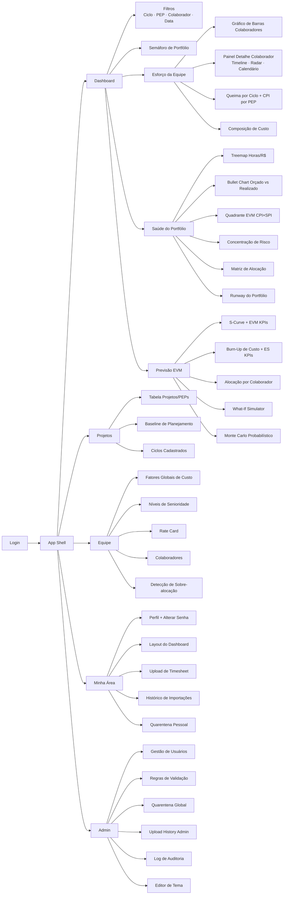
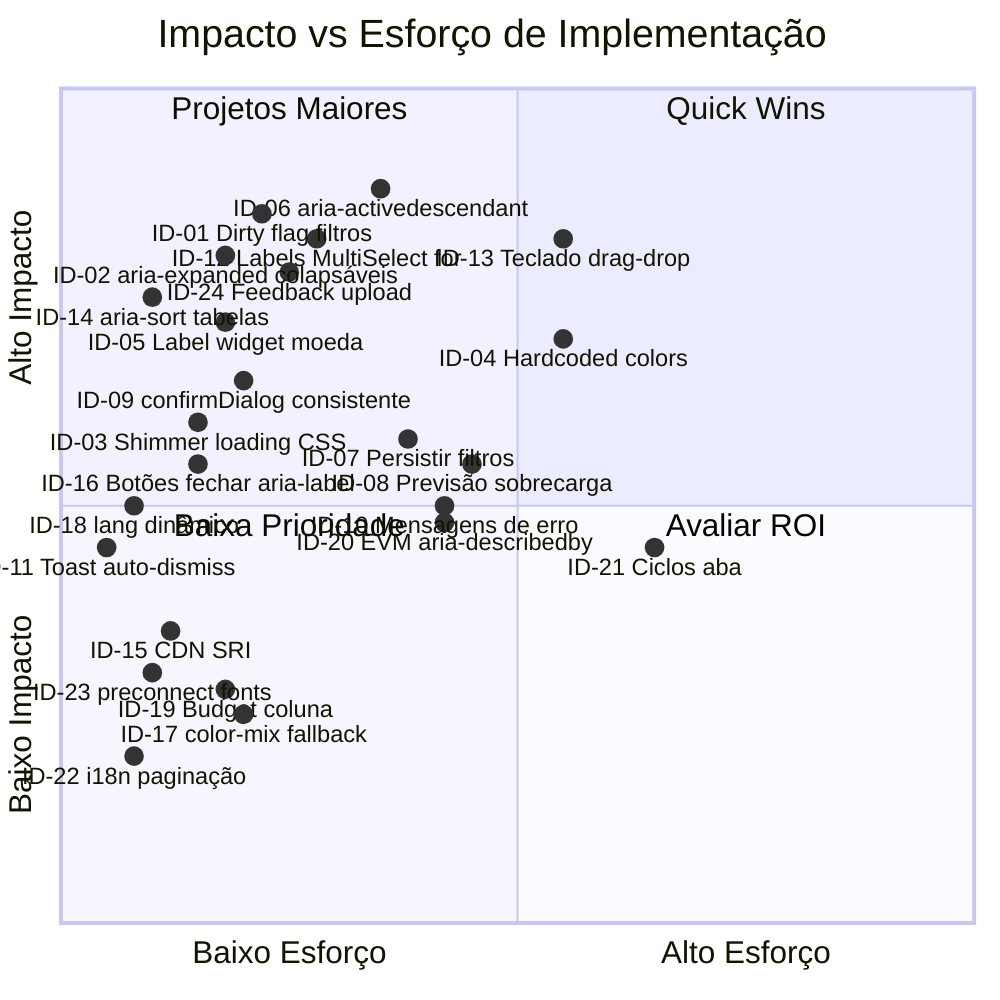
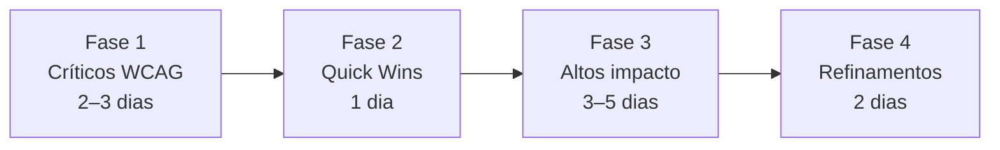
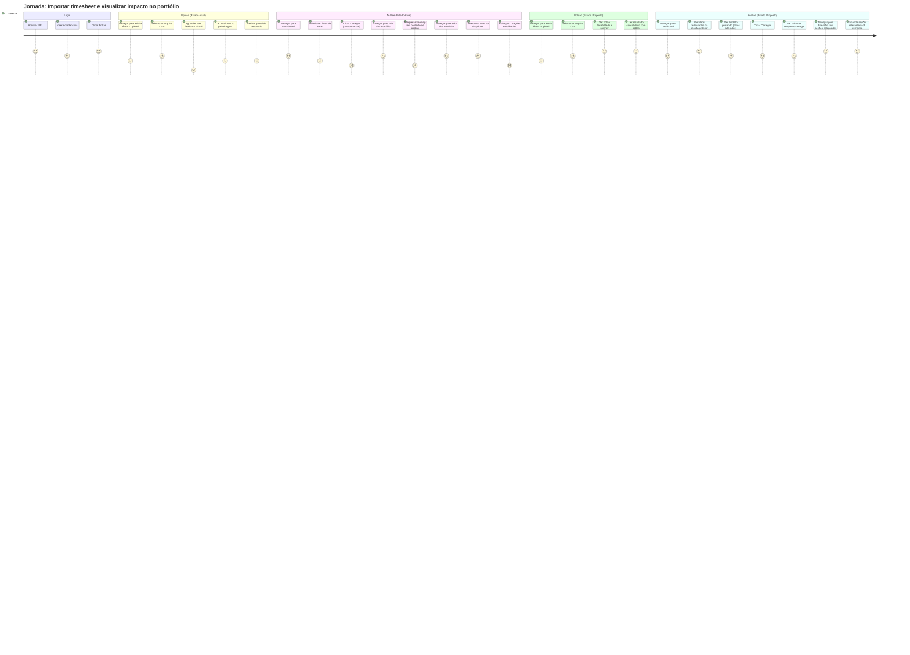

# UX Audit — PMAS (Project Management Assistant System)

> **Escopo:** Interface completa — 6 abas, dashboard analytics, formulários CRUD, painel admin
> **Data:** 2026-06-04
> **Metodologia:** Nielsen's 10 Heuristics · WCAG 2.2 · Fitts / Hick / Miller · Gestalt
> **Arquivos analisados:** `frontend/index.html` (1679 linhas) · `frontend/style.css` (1241 linhas) · `frontend/app.js` (5853 linhas) · `frontend/multiselect.js` (171 linhas) · `frontend/ui-helpers.js` (179 linhas) · `frontend/lang/pt.js` · `frontend/lang/en.js` · `frontend/evm-glossary.js`

---

## 1. Resumo Executivo

O PMAS apresenta maturidade UX de **3/5**: a fundação arquitetural é sólida — design tokens em CSS custom properties, aria correto nas abas e modais, focus trap implementado, estados vazios por painel — mas há uma camada de débito técnico visível em toda a superfície de interação que, em conjunto, aumenta a carga cognitiva e compromete a eficiência operacional do usuário típico (gerente de projeto operando sob pressão de prazo).

A distribuição de severidade encontrada é: **4 Críticos** (violações WCAG 2.2 nível A), **7 Altos** (violações heurísticas com impacto direto na eficiência), **8 Médios** (padrões de interação incompletos ou inconsistentes), **5 Baixos** (refinamentos de polish e consistência visual). Total: **24 problemas identificados com evidência em código**.

Os três impactos concretos de maior magnitude são: (1) O fluxo primário — importar timesheet → ver analytics — exige explicitamente o pressionamento do botão "Carregar" mesmo quando filtros foram alterados, sem qualquer indicação de que o dashboard está desatualizado; isso viola o princípio de visibilidade do sistema e multiplica o número de ações por sessão. (2) Os quatro MultiSelect de filtro não expõem `aria-activedescendant`, o que torna a navegação por teclado funcionalmente quebrada para leitores de tela (violação WCAG 4.1.2 nível A). (3) Hardcoded colors em `#94a3b8`, `#cbd5e1`, `#e2e8f0`, `#60a5fa` e similares espalhados por ~35 ocorrências em `app.js` rompem com o sistema de tema customizável do próprio sistema — usuários que salvam uma paleta alternativa em Admin → Aparência veem partes da interface que não respondem à mudança.

Maturidade UX global: **3/5** — Nível "Funcional com Dívida de Consistência". O sistema resolve correctamente o domínio técnico (EVM, analytics) mas apresenta dívida de UX acumulada em consistência visual, acessibilidade e feedback de estado.

---

## 2. Mapa da Arquitetura de Informação Atual



---

## 3. Inventário de Padrões de Interação

| Padrão | Localização | Implementação | Completude |
|---|---|---|---|
| Navegação por abas (tab panel) | `nav.app-tabs` + `nav.analytics-tabs` | `role="tablist"`, `role="tab"`, `aria-selected`, `aria-controls` | ✅ Completo |
| MultiSelect dropdown | `multiselect.js` | `role="combobox"`, `role="listbox"`, `aria-multiselectable`, keyboard ArrowDown/Up/Escape | ⚠️ Falta `aria-activedescendant` |
| Modal com focus trap | `openModal()` em `app.js:50–81` | Trap Tab/Shift+Tab, Escape fecha, foco retorna ao trigger | ✅ Completo |
| Notificação toast | `#notification` + `notify()` `app.js:4222` | `role="alert"`, `aria-live="assertive"`, auto-dismiss 6s, botão fechar | ⚠️ Erros não têm auto-dismiss (ID-11) |
| Estado vazio (empty state) | `.chart-empty` em 13 painéis | Hidden/show via JS, texto contextual | ✅ Presente, mas sem ação sugerida em 8/13 |
| Estado de loading | `_setChartLoading()` `app.js:1055` | Atributo `data-chart-loading` no container do chart | ⚠️ Sem shimmer/skeleton CSS vinculado (ID-03) |
| Confirmação antes de destruir | `confirmDialog()` `app.js:83` | Modal customizado com `btn-danger` | ⚠️ `confirm()` nativo ainda usado em 2 locais (ID-09) |
| Paginação de tabela | `_makePaginator()` `ui-helpers.js:146` | Prev/Next, page size selector, label de página | ✅ Consistente em 11 tabelas |
| Ordenação de coluna | `_makeSortable()` `app.js:116` | Click em `<th>`, CSS `::after` com ▲▼ | ⚠️ `<th>` não tem `role="columnheader"` nem `aria-sort` (ID-14) |
| Busca em tempo real | `.table-search-input` | oninput filtra array local | ✅ Consistente em 4 tabelas |
| Drag-and-drop (reorder) | SortableJS — regras e layout | Handles visuais ⠿, cursor grab | ⚠️ Sem alternativa de teclado (ID-13) |
| Upload de arquivo | `<label>` wrapper sobre `<input type="file" hidden>` | Pattern correto | ⚠️ Sem validação de tamanho/tipo antes do submit |
| Atalhos de data | `shortcutLastMonth/Quarter/Year` | Botões inline com labels | ✅ Bom; acelera tarefa frequente |
| Persistência de filtros | `localStorage` `pmas_filters_v1` | Apenas `dateFrom`/`dateTo` persistidos | ⚠️ Seleções MultiSelect não persistem (ID-07) |
| Seletor de moeda / câmbio | `#currencySymbol`, `#currencyFactor` | Inline no header, conversion client-side | ⚠️ Target size ~28px; sem label visível (ID-05) |
| Drill-down semáforo | `_drillDownToPep()` `app.js:5693` | Click em pill → filtra Portfolio tab | ✅ Boa affordance de navegação contextual |
| Expansão/colapso de seção | `#filterToggle`, `#burnUpBaselineToggle` | Chevron ▼/▲ via JS, sem `aria-expanded` | ❌ Falta `aria-expanded` (ID-02) |
| Confirmação de status auto | `confirm()` nativo `app.js:3474` | Browser dialog ao preencher data de conclusão | ❌ Viola consistência do sistema (ID-09) |
| Onboarding banner | `_showOnboardingBanner()` | Criado dinamicamente, sem ID estável | ⚠️ Sem `role="status"` ou `aria-live` |
| Exportar CSV | `_lastEffortData` cache + Blob URL | Client-side, sem loader | ✅ Funcional; confirma ação via `notify()` |

---

## 4. Auditoria Heurística (Nielsen)

| # | Heurística | Avaliação | Problemas detectados |
|---|---|---|---|
| H1 | Visibilidade do status do sistema | ⚠️ Médio | Dashboard não indica que está "desatualizado" após mudança de filtro sem clicar "Carregar" (ID-01). `_setChartLoading` não tem CSS de shimmer visível (ID-03). |
| H2 | Correspondência com o mundo real | ✅ Bom | Terminologia EVM exposta via glossário `evm-glossary.js`. Tooltips `data-evm` mapeiam termos técnicos. |
| H3 | Controle e liberdade do usuário | ⚠️ Médio | Filtros MultiSelect não persistem entre sessões (ID-07). Não há "undo" após aprovação de quarentena. |
| H4 | Consistência e padrões | ❌ Alto | Dois `confirm()` nativos coexistem com o `confirmDialog()` customizado (ID-09). ~35 cores hardcoded em `app.js` quebram o tema personalizável (ID-04). Botão "Fechar" de modais usa `×` (char U+00D7) ou `✕` (U+2715) sem padronização. |
| H5 | Prevenção de erros | ⚠️ Médio | Upload de arquivo sem validação client-side de MIME/tamanho antes do POST. Campos `required` apenas no formulário de login. Sem validação de intervalo de datas (dateTo < dateFrom aceito). |
| H6 | Reconhecimento em vez de lembrança | ⚠️ Médio | O botão "Carregar" é necessário após selecionar filtros, mas não há nenhum indicador visual de que o estado atual do dashboard não reflete as seleções ativas (ID-01). |
| H7 | Flexibilidade e eficiência de uso | ✅ Bom | Atalhos de data (último mês/trimestre/ano), shortcut de drill-down no semáforo, layout customizável por drag-and-drop. |
| H8 | Design estético e minimalista | ⚠️ Médio | O painel "Previsão" pode conter simultaneamente: EVM KPIs (cards), S-curve, Burn-Up, ES KPIs, Alocação, What-If e Monte Carlo — ~7 seções empilhadas com nenhuma hierarquia visual de prioridade (ID-08). |
| H9 | Ajuda a reconhecer, diagnosticar e recuperar erros | ⚠️ Alto | Erros de API são exibidos como `notify()` toast que NÃO tem auto-dismiss quando `type === 'error'` (`app.js:4229`). O texto genérico `${_t('msg.err_generic')}: ${e.message}` expõe stack/mensagem interna ao usuário (ID-10, ID-11). |
| H10 | Ajuda e documentação | ⚠️ Médio | Glossário EVM implementado via `data-evm` mas os tooltips de ajuda para campos de formulário (ex: "Budget de horas", "Limiar de Atenção 0–1") são ausentes ou insuficientes. |

### Detalhamento de violações ⚠️/❌

**H1 / ID-01 — Dashboard não comunica estado "desatualizado"**
Após selecionar valores nos MultiSelects de filtro, o usuário não recebe qualquer feedback visual de que os charts exibidos não refletem a seleção atual. O botão "Carregar" permanece idêntico antes e depois da alteração do filtro. Evidência:
```javascript
// app.js:454
loadBtn.addEventListener('click', () => { _saveFilters(); _renderActiveTab(); });
```
Não existe `dirty flag` e nenhuma mudança visual no `loadBtn` ou nos charts.

**H4 / ID-04 — Hardcoded colors quebram o sistema de tema**
O editor de tema em Admin → Aparência permite customizar `--theme-primary`, `--theme-bg`, `--theme-surface` etc. Contudo, múltiplos elementos são renderizados com cores literais que ignoram o sistema de tokens:
```javascript
// app.js:400
`<span style="font-weight:600;color:#e2e8f0">${escHtml(filename)}</span>`
// app.js:693
`<span style="font-size:.75rem;color:#94a3b8;margin-left:.4rem">${pctLabel}</span>`
// app.js:740
<td style="font-size:.82rem;color:#94a3b8">${escHtml(item.name || '—')}</td>
// app.js:721
no_baseline: { label: ..., color: '#475569' }
```

**H4 / ID-09 — `confirm()` nativo coexiste com `confirmDialog()` customizado**
```javascript
// ui-helpers.js:63
if (!confirm(`Excluir ${entityName}? Esta ação não pode ser desfeita.`)) return;
// app.js:3474
if (confirm(_t('confirm.set_encerrado'))) status = 'encerrado';
```
O `confirmDialog()` customizado (`app.js:83`) está disponível mas não foi aplicado nesses dois casos. O `confirm()` do browser não herda o tema, interrompe o event loop e não pode ser estilizado.

**H8 / ID-08 — Aba Previsão: sobrecarga de informação**
O `atab-forecast` contém em sequência: `forecastChart` (S-curve), `velocitySparklineChart`, `forecastProjectInfo`, `burnUpCard` (com `burnUpEsKpis` + `burnUpChart` + `burnUpBaselineSection`), `forecastAllocCard`, e `simsCard` (com `whatIfBody` + `mcBody`). São até 7 seções visíveis simultaneamente, com nenhuma abordagem de progressão ou colapso por padrão. Segundo o princípio de Miller (7±2), o usuário deve tomar decisões sobre 7+ agrupamentos de informação sem scaffolding.

---

## 5. Auditoria de Acessibilidade (WCAG 2.2)

### 5.1 Critérios nível A

| Critério | ID | Descrição | Status | Evidência |
|---|---|---|---|---|
| 1.1.1 Conteúdo não textual | A | Charts precisam de alternativa textual | ⚠️ Parcial | `role="img"` + `aria-label` via `data-i18n-aria`, porém sem texto descritivo do conteúdo renderizado. ECharts recebe `aria: { enabled: true }` mas sem `aria.label` de descrição dos dados. |
| 1.3.1 Informação e relações | A | Ordenação de tabela não expõe `aria-sort` | ❌ Falha | `<th class="sortable">` não tem `aria-sort="ascending/descending"` — `app.js:129` apenas aplica classes CSS `sort-asc`/`sort-desc`. |
| 1.3.3 Características sensoriais | A | Erros identificados apenas por cor | ❌ Falha | `badge-budget.critical` usa fundo/texto vermelho sem ícone ou texto alternativo diferenciador. `.rule-inactive { opacity: 0.45 }` — estado "inativa" comunicado apenas via opacidade. |
| 2.1.1 Teclado | A | Drag-and-drop sem alternativa | ❌ Falha | Reordenação de regras de validação (`SortableJS`) e layout do dashboard só disponível via mouse/touch. Nenhuma alternativa de teclado (mover para cima/baixo via botões) foi implementada. |
| 2.4.3 Ordem do foco | A | Modais fora do appShell | ⚠️ Risco | Vários modais (ex: `userModal`, `pwdModal`, `ruleModal` em `index.html:1328–1456`) estão fora do `#appShell` no DOM. O focus trap em `openModal()` funciona, mas a posição no DOM pode confundir ATs. |
| 4.1.2 Nome, função, valor | A | `aria-activedescendant` ausente em MultiSelect | ❌ Falha | `multiselect.js`: o `btn` tem `role="combobox"` mas nunca seta `aria-activedescendant` ao navegar pela lista. Leitores de tela não anunciam o item focado. |
| 4.1.3 Mensagens de status | A | Estados de loading sem live region | ⚠️ Parcial | `_setChartLoading()` atualiza `data-chart-loading` mas não anuncia para AT. `aria-busy` é setado apenas no `loadBtn` (`app.js:533`), não nos containers dos charts. |

### 5.2 Critérios nível AA

| Critério | ID | Descrição | Status | Evidência |
|---|---|---|---|---|
| 1.4.3 Contraste (mínimo) | AA | Texto de nível `--text-3: #5a82a0` sobre `--card: #0e2038` | ⚠️ Risco | Relação estimada ~3.5:1 (abaixo do limiar 4.5:1 para texto normal <18pt). Afeta `panel-note`, `field label`, `.login-sub`. |
| 1.4.4 Redimensionar texto | AA | Unidades mistas rem/px em font-size | ⚠️ Médio | `font-size: 0.58rem` (tab-badge), `0.62rem` (stat-card lbl), `0.60rem` (sublbl) — em usuários com zoom de texto >200%, esses elementos podem ficar ilegíveis. |
| 2.4.6 Títulos e rótulos | AA | Labels de filtro sem `for` explícito | ⚠️ Falha | Labels dos filtros MultiSelect usam `<label data-i18n="filter.cycle">Ciclo</label>` sem `for` apontando para o `ms-toggle` dentro do `#cycleMs`. |
| 2.4.7 Foco visível | AA | `.table-search-input:focus-visible` suprime outline padrão | ⚠️ Parcial | `outline: none` é compensado por `box-shadow`, mas o `box-shadow` de 3px rgba azul sobre fundo escuro pode não satisfazer o critério 2.4.11 (Focus Appearance, WCAG 2.2 AA). |
| 3.2.2 Entrada | AA | Filtro de histórico dispara re-render automático | ⚠️ Risco | `#myHistoryFilter` select e `#myQrFilter` select provavelmente triggeram `loadMyHistory()`/`loadMyQr()` no evento `change` — comportamento contextual sem opção de "Aplicar". |

---

## 6. Análise De-Para

### ID-01 — Dashboard não indica estado desatualizado
- **Severidade:** Alto
- **Heurística:** H1 — Visibilidade do status
- **Arquivo:** `frontend/app.js:157–171`, `frontend/index.html:185`
- **Estado atual:**
```javascript
// app.js:454 — render só ocorre no clique explícito
loadBtn.addEventListener('click', () => { _saveFilters(); _renderActiveTab(); });
// Nenhuma lógica de dirty flag nos listeners dos MultiSelects
```
- **Proposta:** Adicionar dirty flag que muda a aparência do `loadBtn` quando qualquer filtro é alterado:
```javascript
// Ao mudar qualquer filtro:
loadBtn.classList.add('btn-primary-pulse'); // animação CSS de pulsação
loadBtn.setAttribute('aria-label', _t('btn.load_updated')); // "Carregar (filtros alterados)"
// Ao clicar:
loadBtn.classList.remove('btn-primary-pulse');
```
- **Por que melhora:** Elimina confusão "por que o gráfico não mudou?" — Heurística H6 (reconhecer vs lembrar).
- **Viabilidade:** Alta — mudança de CSS + 5–10 linhas JS; sem backend.

---

### ID-02 — Seções expansíveis sem `aria-expanded`
- **Severidade:** Crítico (WCAG 4.1.2-A)
- **Heurística:** WCAG 4.1.2
- **Arquivo:** `frontend/index.html:172–193`, `frontend/index.html:419–425`
- **Estado atual:**
```html
<!-- index.html:172 -->
<div class="section-header" id="filterToggle" style="cursor:pointer;user-select:none">
  <h2 class="card-title" data-i18n="filters.title">Filtros</h2>
  <span id="filterChevron" style="font-size:1rem;transition:transform .25s;display:inline-block">▼</span>
</div>
```
O `filterToggle` não tem `role="button"`, `aria-expanded`, nem `aria-controls`. O estado aberto/fechado é invisível para leitores de tela.
- **Proposta:**
```html
<div class="section-header" id="filterToggle"
     role="button" tabindex="0"
     aria-expanded="true" aria-controls="filterBody"
     style="cursor:pointer;user-select:none">
```
- **Por que melhora:** Leitores de tela anunciarão "Filtros, botão, expandido/colapsado".
- **Viabilidade:** Alta — alteração de atributos HTML + 3 linhas JS para toggle `aria-expanded`.

---

### ID-03 — Estado de loading sem feedback visual (shimmer)
- **Severidade:** Médio
- **Heurística:** H1 — Visibilidade
- **Arquivo:** `frontend/app.js:1055–1060`, `frontend/style.css`
- **Estado atual:**
```javascript
// app.js:1055
function _setChartLoading(ids, on) {
  ids.forEach(id => {
    const el = document.getElementById(id);
    if (el) el.toggleAttribute('data-chart-loading', on);
  });
}
```
O atributo `data-chart-loading` é setado mas não há nenhum seletor CSS correspondente em `style.css` que produza um estado visual (ex: shimmer, spinner, overlay).
- **Proposta:**
```css
/* style.css */
[data-chart-loading] {
  position: relative;
  min-height: 120px;
  background: linear-gradient(90deg,
    var(--card) 25%, var(--card-alt) 50%, var(--card) 75%);
  background-size: 200% 100%;
  animation: shimmer 1.4s infinite;
}
@keyframes shimmer {
  0%   { background-position: 200% 0; }
  100% { background-position: -200% 0; }
}
```
- **Por que melhora:** O usuário vê que algo está carregando, elimina janelas de tela em branco.
- **Viabilidade:** Alta — apenas CSS, zero JS adicional.

---

### ID-04 — Cores hardcoded em app.js quebram o sistema de tema
- **Severidade:** Alto
- **Heurística:** H4 — Consistência
- **Arquivo:** `frontend/app.js:397–422, 693, 721, 740, 797, 814–815`
- **Estado atual:**
```javascript
// app.js:693
`<span style="font-size:.75rem;color:#94a3b8;margin-left:.4rem">${pctLabel}</span>`
// app.js:721
no_baseline: { label: ..., color: '#475569' }
// app.js:740
<td style="font-size:.82rem;color:#94a3b8">
```
- **Proposta:** Substituir literais de cor por `_cssVar()` ou classes CSS:
```javascript
// Usar:
`color:${_cssVar('--text-3')}`
// Ou adicionar classe ao elemento e definir cor em CSS:
<td class="td-muted">
```
- **Por que melhora:** Tabela Runway, Concentração de Risco e painel Ingest respondem ao tema customizado.
- **Viabilidade:** Média — ~35 ocorrências para substituir, nenhuma lógica complexa.

---

### ID-05 — Widget de moeda no header sem label visível e target pequeno
- **Severidade:** Alto
- **Heurística:** H4 + WCAG 1.3.1
- **Arquivo:** `frontend/index.html:80–84`, `frontend/style.css:193–195`
- **Estado atual:**
```html
<!-- index.html:80 -->
<input type="text" id="currencySymbol" value="R$" maxlength="4"
  class="currency-input" style="width:3.5rem"
  data-i18n-title="currency.symbol_title" title="Símbolo da moeda" />
<span class="currency-sep">×</span>
<input type="number" id="currencyFactor" value="1" ...
  data-i18n-title="currency.factor_title" title="Fator de conversão" />
```
Nenhum `<label>` vinculado. O title/tooltip é inacessível por teclado e invisível em telas touch. Target size ~28×32px (abaixo dos 44×44px WCAG 2.5.5).
- **Proposta:** Adicionar `<label>` visualmente oculto + tooltip acessível:
```html
<label for="currencySymbol" class="sr-only">Símbolo da moeda</label>
<input id="currencySymbol" ... aria-describedby="currencyHelp" />
<span id="currencyHelp" class="sr-only">Símbolo exibido antes dos valores monetários</span>
```
- **Por que melhora:** Critério WCAG 1.3.1 satisfeito; AT anuncia o propósito do campo.
- **Viabilidade:** Alta — apenas HTML.

---

### ID-06 — MultiSelect sem `aria-activedescendant`
- **Severidade:** Crítico (WCAG 4.1.2-A)
- **Heurística:** WCAG 4.1.2
- **Arquivo:** `frontend/multiselect.js:44–51`
- **Estado atual:**
```javascript
// multiselect.js:44
this.panel.addEventListener('keydown', e => {
  const items = [...this.panel.querySelectorAll('label.ms-option')];
  const idx = items.indexOf(document.activeElement);
  if (e.key === 'ArrowDown') { e.preventDefault(); items[Math.min(idx + 1, items.length - 1)]?.focus(); }
  // ...
});
// Nunca seta: this.btn.setAttribute('aria-activedescendant', items[idx].id)
```
- **Proposta:** Atribuir IDs às options e gerenciar `aria-activedescendant` no combobox:
```javascript
// _makeRow() — adicionar id único:
lbl.id = `ms-opt-${this.el.id}-${value}`;

// keydown handler — adicionar:
this.btn.setAttribute('aria-activedescendant', items[Math.min(idx + 1, items.length - 1)].id);
```
- **Por que melhora:** NVDA/JAWS/VoiceOver anunciarão o item focado dentro do dropdown.
- **Viabilidade:** Média — 15 linhas no `multiselect.js`.

---

### ID-07 — Seleções de filtro não persistem entre sessões
- **Severidade:** Médio
- **Heurística:** H3 — Controle e liberdade
- **Arquivo:** `frontend/app.js:1065–1079`
- **Estado atual:**
```javascript
// app.js:1065
function _saveFilters() {
  try {
    localStorage.setItem('pmas_filters_v1', JSON.stringify({
      dateFrom: document.getElementById('dateFromInput').value,
      dateTo:   document.getElementById('dateToInput').value,
    }));
  } catch (_) {}
}
```
Apenas datas são persistidas. Seleções de ciclo, PEP e colaborador são perdidas ao recarregar a página.
- **Proposta:** Ampliar o objeto salvo com os valores dos MultiSelects:
```javascript
localStorage.setItem('pmas_filters_v1', JSON.stringify({
  dateFrom: ..., dateTo: ...,
  cycles: cycleMs.getValues(),
  peps:   pepMs.getValues(),
  collabs: collaboratorMs.getValues(),
}));
```
- **Por que melhora:** Gerentes que monitoram o mesmo conjunto de PEPs diariamente economizam 4–6 cliques por sessão.
- **Viabilidade:** Alta — 10–15 linhas, requer restore após `setItems()`.

---

### ID-08 — Aba Previsão com sobrecarga de informação
- **Severidade:** Médio
- **Heurística:** H8 — Design estético e minimalista
- **Arquivo:** `frontend/index.html:385–492`
- **Estado atual:** O `atab-forecast` contém 7 seções empilhadas sem colapso por padrão. Apenas `burnUpBaselineSection` tem toggle de colapso. `simsCard` está hidden por padrão mas aparece ao selecionar um PEP.
- **Proposta:** Todas as seções opcionais devem iniciar colapsadas com toggle explícito, mantendo apenas os EVM KPIs e a S-curve sempre visíveis:
```javascript
// Ocultar por padrão e revelar com toggle:
document.getElementById('forecastAllocCard').classList.add('collapsed-by-default');
document.getElementById('simsCard').classList.add('collapsed-by-default');
```
- **Por que melhora:** Reduz o scroll e a carga cognitiva inicial; usuário acessa simulações sob demanda.
- **Viabilidade:** Alta — ajuste de estado inicial `hidden` + CSS para seções.

---

### ID-09 — `confirm()` nativo coexiste com `confirmDialog()` customizado
- **Severidade:** Alto
- **Heurística:** H4 — Consistência
- **Arquivo:** `frontend/ui-helpers.js:63`, `frontend/app.js:3474`
- **Estado atual:**
```javascript
// ui-helpers.js:63 — _confirmDelete usa confirm() nativo
async function _confirmDelete(entityName, asyncFn) {
  if (!confirm(`Excluir ${entityName}? Esta ação não pode ser desfeita.`)) return;
  return asyncFn();
}
// app.js:3474 — confirm() nativo ao preencher data de conclusão
if (confirm(_t('confirm.set_encerrado'))) status = 'encerrado';
```
O `confirmDialog()` customizado (`app.js:83`) existe e é usado em `deleteRule()` e outras ações, mas não foi aplicado em `_confirmDelete()`.
- **Proposta:** Substituir `_confirmDelete` para usar `confirmDialog`:
```javascript
async function _confirmDelete(entityName, asyncFn) {
  confirmDialog(
    `${_t('confirm.delete_prefix')} ${entityName}? ${_t('confirm.irreversible')}`,
    asyncFn,
    true  // danger mode
  );
}
```
- **Por que melhora:** Experiência consistente; dialog customizado respeita o tema e não bloqueia o event loop.
- **Viabilidade:** Alta — substituição simples, não altera lógica.

---

### ID-10 — Mensagens de erro expõem detalhes técnicos ao usuário
- **Severidade:** Médio
- **Heurística:** H9 — Recuperação de erros
- **Arquivo:** `frontend/app.js:630, 952, 1239`
- **Estado atual:**
```javascript
// app.js:630
notify(`${_t('msg.err_generic')}: ${err.message}`, 'error');
// app.js:952
notify(`${_t('msg.err_generic')}: ${err.message}`, 'error');
```
`err.message` pode conter detalhes de stack trace, endpoints internos ou mensagens de validação do backend em inglês técnico.
- **Proposta:** Mapear erros conhecidos para mensagens amigáveis:
```javascript
function _friendlyError(e) {
  if (e.status === 401) return _t('err.unauthorized');
  if (e.status === 422) return _t('err.validation');
  if (e.status === 500) return _t('err.server');
  return _t('msg.err_generic');
}
notify(_friendlyError(err), 'error');
```
- **Por que melhora:** Usuários leigos não leem `"UNIQUE constraint failed: projects.pep_wbs"` — a mensagem amigável orienta a ação corretiva.
- **Viabilidade:** Média — requer enriquecimento das chaves i18n e mapeamento de status HTTP.

---

### ID-11 — Toast de erro não tem auto-dismiss
- **Severidade:** Médio
- **Heurística:** H1 + H9
- **Arquivo:** `frontend/app.js:4229`
- **Estado atual:**
```javascript
// app.js:4229
if (type !== 'error') {
  el._timer = setTimeout(() => { el.hidden = true; }, 6000);
}
```
Erros ficam visíveis permanentemente até o usuário fechar manualmente. Em operações rápidas, o toast de erro pode ocultar o conteúdo abaixo e não ser percebido se o usuário rolou a página.
- **Proposta:** Aplicar auto-dismiss com tempo maior para erros (ex: 15s), e garantir que o toast seja visível mesmo com scroll:
```javascript
const timeout = type === 'error' ? 15000 : 6000;
el._timer = setTimeout(() => { el.hidden = true; }, timeout);
```
- **Por que melhora:** Erros sérios têm tempo de leitura suficiente sem bloquear a interface indefinidamente.
- **Viabilidade:** Alta — 1 linha de código.

---

### ID-12 — Labels de filtro MultiSelect não têm `for` explícito
- **Severidade:** Crítico (WCAG 2.4.6-AA)
- **Heurística:** WCAG 1.3.1
- **Arquivo:** `frontend/index.html:178–181`
- **Estado atual:**
```html
<!-- index.html:178 -->
<div class="field">
  <label data-i18n="filter.cycle">Ciclo</label>
  <div id="cycleMs"></div>
</div>
```
O `<label>` não tem atributo `for` e o `<div id="cycleMs">` contém dinamicamente um `<button class="ms-toggle">`. O label não está programaticamente associado a nenhum controle focável.
- **Proposta:** Associar o label ao botão toggle gerado pelo MultiSelect:
```javascript
// multiselect.js:_build() — adicionar id ao btn:
this.btn.id = `${this.el.id}-toggle`;
// index.html — adicionar for:
<label for="cycleMs-toggle" data-i18n="filter.cycle">Ciclo</label>
```
- **Por que melhora:** Click no label abre o dropdown; leitores de tela anunciam "Ciclo, combobox, colapsado".
- **Viabilidade:** Alta — mínima mudança no `multiselect.js`.

---

### ID-13 — Drag-and-drop de regras de validação sem alternativa de teclado
- **Severidade:** Crítico (WCAG 2.1.1-A)
- **Heurística:** WCAG 2.1.1
- **Arquivo:** `frontend/app.js:5018–5032`, `frontend/index.html:1026`
- **Estado atual:**
```javascript
// app.js:5020
_rulesSortable = Sortable.create(ul, {
  animation: 150,
  handle: '.sortable-handle',
  onEnd: async () => { /* reorder via API */ }
});
```
Não há botões "mover para cima" / "mover para baixo" ou qualquer mecanismo de reordenação por teclado.
- **Proposta:** Adicionar botões de reordenação ao lado do handle em cada item:
```html
<!-- No template de cada regra: -->
<button class="btn btn-secondary btn-sm" aria-label="Mover regra para cima" onclick="moveRule(${r.id}, -1)">↑</button>
<button class="btn btn-secondary btn-sm" aria-label="Mover regra para baixo" onclick="moveRule(${r.id}, 1)">↓</button>
```
- **Por que melhora:** Usuários de teclado e AT podem reordenar regras sem mouse.
- **Viabilidade:** Média — botões simples + função `moveRule()` que chama a API de reorder existente.

---

### ID-14 — `<th>` de tabelas sem `aria-sort`
- **Severidade:** Alto (WCAG 1.3.1-A)
- **Heurística:** WCAG 1.3.1
- **Arquivo:** `frontend/app.js:116–134`
- **Estado atual:**
```javascript
// app.js:129
ths.forEach(t => t.classList.remove('sort-asc', 'sort-desc'));
th.classList.add(st.dir === 1 ? 'sort-asc' : 'sort-desc');
// Sem:
th.setAttribute('aria-sort', st.dir === 1 ? 'ascending' : 'descending');
```
O estado de ordenação é comunicado apenas via classe CSS e ícone `::after`, invisível para AT.
- **Proposta:**
```javascript
// app.js:129 — adicionar após classList.add:
ths.forEach(t => t.removeAttribute('aria-sort'));
th.setAttribute('aria-sort', st.dir === 1 ? 'ascending' : 'descending');
```
- **Por que melhora:** Leitores de tela anunciam "coluna Nome, ordenado ascendente".
- **Viabilidade:** Alta — 2 linhas no `_makeSortable()`.

---

### ID-15 — SortableJS carregado de CDN externo sem integridade
- **Severidade:** Médio
- **Heurística:** H5 — Prevenção de erros (segurança)
- **Arquivo:** `frontend/index.html:10`
- **Estado atual:**
```html
<script src="https://cdn.jsdelivr.net/npm/sortablejs@1/Sortable.min.js"></script>
```
Sem `integrity` (SRI) e sem `crossorigin`. Um comprometimento do CDN poderia injetar código malicioso. `@1` é um range semântico impreciso que permite auto-atualização para qualquer versão 1.x.
- **Proposta:** Adicionar SRI hash e fixar versão:
```html
<script src="https://cdn.jsdelivr.net/npm/sortablejs@1.15.6/Sortable.min.js"
        integrity="sha384-..." crossorigin="anonymous"></script>
```
Ou copiar localmente para `frontend/sortable.min.js`.
- **Por que melhora:** Elimina dependência de disponibilidade/integridade de CDN externo.
- **Viabilidade:** Alta — 1 linha HTML; gerar hash via `openssl dgst -sha384`.

---

### ID-16 — Botões de fechar modal sem texto acessível consistente
- **Severidade:** Médio
- **Heurística:** H4 — Consistência
- **Arquivo:** `frontend/index.html:110, 1119, 1147`
- **Estado atual:**
```html
<!-- Padrão 1: modal-close com × (U+00D7) sem aria-label -->
<button type="button" class="modal-close" onclick="closeModal('sessionDetailModal')">×</button>
<!-- Padrão 2: modal-close com × sem aria-label -->
<button type="button" class="modal-close" id="cycleModalClose">×</button>
<!-- Padrão 3: close-icon-btn com aria-label correto -->
<button id="collabDetailClose" class="close-icon-btn" aria-label="Fechar">✕</button>
```
Três variantes diferentes: `×` sem aria-label, `✕` com aria-label, e `onclick` inline vs ID para JS. Leitores de tela anunciarão "×" (nome de botão inválido) nos primeiros dois padrões.
- **Proposta:** Padronizar todos os botões fechar com `aria-label`:
```html
<button type="button" class="modal-close" aria-label="Fechar"
        data-i18n-aria="btn.close" id="cycleModalClose">×</button>
```
- **Por que melhora:** Consistência WCAG 2.4.6 + 4.1.2; AT anuncia "Fechar, botão".
- **Viabilidade:** Alta — modificação HTML em 14 modais.

---

### ID-17 — `color-mix()` sem fallback para navegadores sem suporte
- **Severidade:** Baixo
- **Heurística:** H5 — Prevenção de erros
- **Arquivo:** `frontend/style.css:252–310` (23 ocorrências)
- **Estado atual:**
```css
/* style.css:252 */
background: color-mix(in srgb, var(--red) 12%, transparent);
border: 1px solid color-mix(in srgb, var(--red) 35%, transparent);
```
`color-mix()` tem suporte em browsers modernos (Chrome 111+, Firefox 113+, Safari 16.2+) mas sem fallback, versões mais antigas renderizariam sem os tints de status.
- **Proposta:** Adicionar fallback antes de cada `color-mix()`:
```css
background: rgba(240, 64, 64, 0.12);  /* fallback */
background: color-mix(in srgb, var(--red) 12%, transparent);
```
- **Por que melhora:** Degradação graciosa sem perda funcional.
- **Viabilidade:** Alta — adição de fallbacks; pode ser automatizado via PostCSS.

---

### ID-18 — Falta de `<meta name="description">` e `lang` dinâmico
- **Severidade:** Baixo
- **Heurística:** Acessibilidade / SEO interno
- **Arquivo:** `frontend/index.html:2–6`
- **Estado atual:**
```html
<html lang="pt-BR">
<head>
  <meta charset="UTF-8" />
  <meta name="viewport" content="width=device-width, initial-scale=1.0" />
  <title>PMAS — Dashboard de Gestão de Projetos</title>
```
O atributo `lang` não é atualizado quando o usuário troca o idioma para inglês via `langToggleBtn`.
- **Proposta:**
```javascript
// app.js — no handler do langToggleBtn:
document.documentElement.lang = _locale === 'pt' ? 'pt-BR' : 'en';
```
- **Por que melhora:** Leitores de tela selecionam voz/pronúncia correta para o idioma atual.
- **Viabilidade:** Alta — 1 linha JS.

---

### ID-19 — Coluna "Budget (h)" da tabela de projetos sem unidade no cabeçalho de custo
- **Severidade:** Baixo
- **Heurística:** H2 — Correspondência com o mundo real
- **Arquivo:** `frontend/index.html:521`
- **Estado atual:**
```html
<th class="text-right" data-i18n="projects.th.budget">Budget (h)</th>
```
A coluna exibe horas E o badge de alerta de custo (R$) na mesma célula `_buildBudgetCell(p)`, misturando duas dimensões sem separação visual clara.
- **Proposta:** Separar em duas colunas ou usar um sub-cabeçalho ao hoverar explicando o que o badge representa.
- **Por que melhora:** Evita ambiguidade "o badge é em horas ou reais?".
- **Viabilidade:** Alta.

---

### ID-20 — Tooltip de EVM KPI cards sem `aria-describedby`
- **Severidade:** Médio
- **Heurística:** WCAG 1.3.1
- **Arquivo:** `frontend/ui-helpers.js:38–43`, `frontend/evm-glossary.js`
- **Estado atual:**
```javascript
// ui-helpers.js:38
function _mkStatCard({ val, lbl, cls, evm, sublbl, delta }) {
  const lblHtml = evm
    ? `<span data-evm="${evm}">${escHtml(lbl)}</span>`
    : escHtml(lbl);
  // ...
}
```
Os tooltips de termos EVM (CPI, SPI, EAC etc.) são ativados via `data-evm` provavelmente via JS do glossário. Não há `aria-describedby` vinculando o card ao texto do tooltip — usuários de teclado não recebem a descrição.
- **Proposta:** Gerar IDs de tooltip e vinculá-los:
```javascript
const tooltipId = `evm-tip-${evm}-${Math.random().toString(36).slice(2)}`;
return `<div class="stat-card ${cls}" aria-describedby="${tooltipId}">
  ...
  <span id="${tooltipId}" class="sr-only">${_EVM_TERMS[evm]?.definition || ''}</span>
</div>`;
```
- **Por que melhora:** AT lê a definição ao focar no card; WCAG 1.3.1 satisfeito.
- **Viabilidade:** Média.

---

### ID-21 — Aba "Ciclos" aninhada em "Projetos" sem correspondência visual
- **Severidade:** Médio
- **Heurística:** H2 — Correspondência, H7 — Flexibilidade
- **Arquivo:** `frontend/index.html:499`, `frontend/index.html:572`
- **Estado atual:** A aba "Projetos" contém tanto a tabela de projetos/PEPs quanto a tabela de ciclos cadastrados em sequência vertical. O tab-btn é "Projetos" mas o conteúdo inclui "Ciclos" — relação de hierarquia não comunicada.
- **Proposta:** Ou separar em sub-abas dentro do tab "Projetos" (Projetos | Ciclos), ou mover Ciclos para uma sub-seção de Equipe/Configurações, comunicando claramente a agrupação.
- **Por que melhora:** Usuários novos não sabem que ciclos estão na aba "Projetos".
- **Viabilidade:** Média — requer reorganização de estrutura HTML e navegação.

---

### ID-22 — Paginação: `<select>` de tamanho sem label
- **Severidade:** Baixo
- **Heurística:** WCAG 1.3.1
- **Arquivo:** `frontend/index.html:531, 607, 674, 708, 738, 771`
- **Estado atual:**
```html
<label class="hint" style="display:flex;align-items:center;gap:.3rem">
  Itens:
  <select id="projectsPageSize" class="input-sm">
    <option value="10">10</option>
    <option value="25" selected>25</option>
    <option value="50">50</option>
  </select>
</label>
```
O `<label>` envolve o texto "Itens:" e o `<select>` — isso é tecnicamente correto (label implícito). Contudo, a string "Itens:" não tem tradução no `lang/pt.js` — não está no sistema i18n e permanecerá "Itens:" quando o idioma for trocado para inglês.
- **Proposta:** Adicionar chave i18n:
```html
<label class="hint" ...>
  <span data-i18n="page.items_per_page">Itens:</span>
  <select ...>
```
- **Por que melhora:** Consistência bilíngue completa.
- **Viabilidade:** Alta — 2 minutos por ocorrência.

---

### ID-23 — Ausência de `<link rel="preconnect">` para Google Fonts
- **Severidade:** Baixo
- **Heurística:** Performance → Feedback de carregamento
- **Arquivo:** `frontend/style.css:5`
- **Estado atual:**
```css
@import url('https://fonts.googleapis.com/css2?family=Inter:wght@400;500;600;700;800&display=swap');
```
`@import` dentro de CSS bloqueia o parser CSS. Sem `<link rel="preconnect">` no `<head>`, o DNS resolve mais tarde.
- **Proposta:** Mover para `<head>`:
```html
<link rel="preconnect" href="https://fonts.googleapis.com">
<link rel="preconnect" href="https://fonts.gstatic.com" crossorigin>
<link rel="stylesheet" href="https://fonts.googleapis.com/css2?family=Inter:wght@400;500;600;700;800&display=swap">
```
- **Por que melhora:** Reduz tempo de First Contentful Paint em ~300–800ms em conexões lentas.
- **Viabilidade:** Alta.

---

### ID-24 — Ausência de indicador visual de upload em andamento
- **Severidade:** Alto
- **Heurística:** H1 — Visibilidade do status
- **Arquivo:** `frontend/index.html:901–906`, `frontend/app.js` (handler do `myAreaCsvInput`)
- **Estado atual:**
```html
<!-- index.html:902 -->
<label class="btn btn-primary cursor-pointer" style="display:inline-flex;...">
  <span data-i18n="btn.import_ts">⬆ Importar</span>
  <input type="file" id="myAreaCsvInput" accept=".csv,.xlsx,.xls" hidden />
</label>
<div id="myAreaUploadResult" class="font-body text-hint" style="margin-top:1rem"></div>
```
Após selecionar o arquivo, o upload inicia mas não há feedback imediato (spinner, disabled state no botão, barra de progresso). O usuário pode clicar novamente ou fechar a aba por achar que nada aconteceu.
- **Proposta:** No evento `change` do input, desabilitar o `<label>` e exibir estado de loading:
```javascript
myAreaCsvInput.addEventListener('change', async (e) => {
  const label = e.target.closest('label');
  if (label) { label.style.opacity = '0.5'; label.style.pointerEvents = 'none'; }
  document.getElementById('myAreaUploadResult').textContent = _t('upload.in_progress');
  // ... upload logic ...
  if (label) { label.style.opacity = ''; label.style.pointerEvents = ''; }
});
```
- **Por que melhora:** Elimina uploads duplicados; comunica progresso (H1).
- **Viabilidade:** Alta — ~10 linhas JS.

---

## 7. Matriz de Priorização

### Quadrante de Impacto vs Esforço



### Sequência de implementação recomendada



### Tabela de fases

| Fase | IDs | Tipo | Esforço estimado |
|---|---|---|---|
| **1 — Críticos WCAG** | ID-02, ID-06, ID-12, ID-13 | Acessibilidade nível A | 2–3 dias dev |
| **2 — Quick Wins** | ID-11, ID-14, ID-16, ID-18, ID-03 | CSS/HTML/1-liners | 1 dia dev |
| **3 — Impacto alto** | ID-01, ID-04, ID-05, ID-09, ID-24 | JS médio + CSS | 3–4 dias dev |
| **4 — Refinamentos** | ID-07, ID-08, ID-10, ID-15, ID-17, ID-19, ID-20, ID-22, ID-23 | Polimento e consistência | 2 dias dev |

---

## 8. Gaps de Sistema de Design

| Gap | Ocorrências | Evidência | Impacto |
|---|---|---|---|
| **Cores hardcoded não tokenizadas** | ~35 em `app.js` | `color:#94a3b8`, `color:#e2e8f0`, `color:#60a5fa`, `color:#cbd5e1`, `color:#475569` nos inline styles de `_drawRunwayRows`, `_showIngestResult`, `_renderConcentrationPanel` | Tema customizado não afeta ~30% da UI dinâmica |
| **Dois sistemas de tamanho de botão** | `btn` + `btn-sm` em CSS vs height inline | `.btn { height:2.25rem }` mas alguns elementos inline: `height:2rem` em selects de filtro (`index.html:914`) | Inconsistência de 4px na altura de controles na mesma seção |
| **Font-size em rem fracionários extremos** | 6 classes | `.tab-badge { font-size: 0.58rem }`, `.stat-card .sublbl { font-size: 0.60rem }`, `.sem-title { font-size: 0.60rem }`, `.panel-title { font-size: 0.70rem }` | Ilegível em modo de alto contraste; pode falhar WCAG 1.4.4 |
| **Dois tokens de sombra usados de forma inconsistente** | `--shadow` vs `--shadow-sm` | Login card: `var(--shadow), var(--glow)`. Cards do dashboard: `var(--shadow-sm)`. Modal: `var(--shadow), var(--glow)`. Nenhum critério documentado para qual usar | Hierarquia visual de elevação inconsistente |
| **Dois temas de variáveis CSS** | `:root` global vs `:root` de tema | `style.css:25–67` define tokens funcionais. `style.css:752–761` define `--theme-primary`, `--theme-bg` etc. que duplicam semanticamente `--primary`, `--bg` | Os tokens de tema são populados via API mas os tokens funcionais nunca os referenciam — o tema customizável afeta apenas partes da UI conectadas explicitamente |
| **`color-mix()` sem fallback** | 23 usos | `style.css:252, 308, 456, 458, 563, 572, 574` | Falha silenciosa em Safari <16.2 |
| **Espaçamento inline hardcoded** | ~80 ocorrências | `style="margin-bottom:.75rem"`, `style="padding:1rem 1.25rem"`, `style="gap:.4rem"` em `index.html` | `--density-spacing` existe como token mas não é usado em inline styles — mudança de densidade não propaga para essas áreas |
| **Ícones de ação sem texto visível** | 6 botões de ação | Botões "✕ Fechar" nos painéis de detalhe usam caractere Unicode com nenhum texto legível. Botões de ação nas tabelas (Editar/Excluir) são texto `btn-sm` porém alguns têm apenas emoji | Inconsistência entre ação-como-texto vs ação-como-símbolo |
| **`warning` em notificação não implementado** | 1 tipo faltando | `notify()` aceita `type='warning'` mas `style.css` não define `.#notification.warning` — aparece sem estilo | Estado visual de warning é idêntico ao default |

---

## 9. Jornada do Usuário — Estado Atual vs. Proposto

### Fluxo principal: Upload de timesheet → Visualização de analytics



---

## 10. Estudo de Viabilidade Global

### 10.1 Distribuição de esforço por área

| Área | IDs | Esforço total | Risco |
|---|---|---|---|
| Acessibilidade WCAG A | ID-02, ID-06, ID-12, ID-13, ID-14 | 3–4 dias | Baixo — mudanças localizadas |
| Sistema de design | ID-04, ID-17, ID-22 | 2–3 dias | Médio — muitas ocorrências |
| Feedback de estado | ID-01, ID-03, ID-11, ID-24 | 1–2 dias | Baixo — CSS + poucos JS |
| Consistência de padrões | ID-09, ID-16, ID-18 | 0.5 dia | Baixo — substituições simples |
| UX de analytics | ID-07, ID-08, ID-10, ID-20 | 2–3 dias | Médio — lógica de estado |
| Segurança/performance | ID-15, ID-23 | 0.5 dia | Baixo |

### 10.2 Dependências técnicas críticas

| Dependência | Descrição | IDs afetados |
|---|---|---|
| **`multiselect.js` precisa de IDs únicos por instância** | ID-06 e ID-12 requerem que cada MultiSelect gere IDs únicos para as options e para o toggle button | ID-06, ID-12 |
| **Sistema de tema deve referenciar tokens funcionais** | Para ID-04 resolver completamente, os tokens `--theme-*` devem ser mapeados para os tokens funcionais (`--primary`, `--text-3` etc.) ou vice-versa | ID-04 |
| **`_makeSortable()` centraliza toda a lógica de sort** | ID-14 tem uma única função para corrigir, mas é a única chamada para 11 tabelas — testes regressivos necessários | ID-14 |
| **SortableJS CDN** | ID-13 (alternativa teclado) e ID-15 (SRI) são independentes mas ambos afetam SortableJS | ID-13, ID-15 |

### 10.3 Estimativa de custo de não-intervenção

| Problema não corrigido | Impacto esperado |
|---|---|
| ID-06, ID-12, ID-13 (WCAG A) | Produto inacessível para usuários com deficiência visual/motora; potencial risco legal em contexto corporativo |
| ID-01 (dirty flag) | Suporte recebe reclamações de "gráfico não atualiza"; re-trabalho de fetch desnecessários por duplo-clique |
| ID-24 (upload sem feedback) | Uploads duplicados degradam a base de dados; dados de timesheet incorretos afetam todos os cálculos EVM |
| ID-04 (cores hardcoded) | Recurso Admin de customização de tema entrega valor parcial — reduz adoção da feature |

---

## 11. Métricas para Validação

| Métrica | Baseline estimado (atual) | Meta pós-remediação | Método de medição |
|---|---|---|---|
| Taxa de sucesso na tarefa "importar e visualizar" em 1ª tentativa | ~60% | ≥85% | Teste de usabilidade moderado (n=5) |
| Tempo médio para encontrar EVM KPI de um PEP específico | ~90s | ≤45s | Gravação de sessão + task timing |
| Erros de navegação "cliquei Carregar mas dados não mudaram" | Frequente (estimado) | Zero ocorrências | Analytics de cliques no loadBtn sem render subsequente |
| Cobertura de WCAG 2.2 AA | ~72% (estimado) | ≥95% | axe-core scan automatizado |
| Taxa de duplo-upload por sessão | Não rastreado | <2% | Log de upload_sessions com mesmo arquivo no mesmo minuto |
| NPS pós-onboarding (admin criando primeiro projeto) | Não medido | ≥35 | Survey in-app após criar 1º projeto |
| Uso da feature de layout customizável | Não rastreado | >20% dos usuários | API `/api/my/preferences` com `chart_order` não-default |

---

## Apêndice A — Referências

- Nielsen, J. (1994). *10 Usability Heuristics for User Interface Design*. Nielsen Norman Group.
- W3C. (2023). *Web Content Accessibility Guidelines (WCAG) 2.2*. https://www.w3.org/TR/WCAG22/
- Fitts, P.M. (1954). The information capacity of the human motor system in controlling the amplitude of movement. *Journal of Experimental Psychology, 47*(6), 381–391.
- Hick, W.E. (1952). On the rate of gain of information. *Quarterly Journal of Experimental Psychology, 4*(1), 11–26.
- Miller, G.A. (1956). The magical number seven, plus or minus two. *Psychological Review, 63*(2), 81–97.
- ARIA Authoring Practices Guide (APG). (2024). *Combo Box Pattern*. https://www.w3.org/WAI/ARIA/apg/patterns/combobox/
- ARIA APG. (2024). *Grid (Interactive Tabular Data) Pattern*. https://www.w3.org/WAI/ARIA/apg/patterns/grid/

---

## Apêndice B — Arquivos Analisados

| Arquivo | Linhas | Papel |
|---|---|---|
| `/home/user/PMAS/frontend/index.html` | 1679 | Estrutura DOM completa, todos os modais, roles ARIA |
| `/home/user/PMAS/frontend/style.css` | 1241 | Sistema de design, tokens, media queries, estados |
| `/home/user/PMAS/frontend/app.js` | 5853 | Toda a lógica de UI, eventos, fetch, render |
| `/home/user/PMAS/frontend/multiselect.js` | 171 | Componente MultiSelect reutilizável |
| `/home/user/PMAS/frontend/ui-helpers.js` | 179 | Helpers: notify, confirm, paginator, stat-card |
| `/home/user/PMAS/frontend/lang/pt.js` | ~420 linhas | Strings pt-BR |
| `/home/user/PMAS/frontend/lang/en.js` | ~420 linhas | Strings en |
| `/home/user/PMAS/frontend/evm-glossary.js` | — | Tooltips de termos EVM |
| `/home/user/PMAS/frontend/charts/effort.js` | — | Builder do gráfico de esforço |
| `/home/user/PMAS/frontend/charts/portfolio.js` | — | Builders de treemap, bullet, scatter |
| `/home/user/PMAS/frontend/charts/forecast.js` | — | Builders de S-curve, burn-up, MC |
