# PMAS User Manual

> **Version:** 2.0.1 · **Released:** 2026-06-11 · **Status:** Final

---

## Table of Contents

1. [Introduction](#1-introduction)
2. [System Overview](#2-system-overview)
3. [Architecture](#3-architecture)
4. [Getting Started](#4-getting-started)
5. [User Roles and Permissions](#5-user-roles-and-permissions)
6. [Core Workflows](#6-core-workflows)
7. [EVM Reference](#7-evm-reference)
8. [Business Rules](#8-business-rules)
9. [Corner Cases](#9-corner-cases)
10. [Data Formats and Standards](#10-data-formats-and-standards)
11. [API Reference](#11-api-reference)
12. [Export and Reporting](#12-export-and-reporting)
13. [Error Reference](#13-error-reference)
14. [Administration](#14-administration)
15. [Authorship and Version History](#15-authorship-and-version-history)

---

## 1. Introduction

### 1.1 Purpose

PMAS (Project Management Assistant System) solves the problem that project managers face when their timekeeping platform exports raw hour sheets but provides no financial performance view. Every month, staff register their hours in an upstream legacy system. That system knows *who worked when*, but does not answer the questions that matter to a PMO:

- Is this project over budget?
- Is the team delivering work at the expected pace?
- If nothing changes, when will the project finish and what will it cost?

PMAS bridges that gap. It ingests the hour-sheet exports (CSV or XLSX), applies frozen rate cards to convert hours into cost, and calculates a full suite of Earned Value Management indicators — CPI, SPI, EAC, TCPI, VAC, CV, SV, Earned Schedule — for every project simultaneously. The results are displayed in an interactive browser dashboard that any project manager can read without EVM expertise.

### 1.2 Scope

This manual covers PMAS version 2.0.1. It describes every end-user workflow, every business rule enforced by the system, all API endpoints, and all administration tasks. It does not cover the development environment, CI/CD pipeline, or PyInstaller standalone build process (those are described in `README.md`).

### 1.3 Intended Audience

| Audience | Relevant Sections |
|---|---|
| **Project Manager (PM)** | 1, 2, 4, 6.1–6.5, 6.7, 6.8, 7 |
| **PMO Administrator** | All sections |
| **IT / System Administrator** | 3, 4, 11, 14 |
| **Finance / Controller** | 2, 6.6, 7, 8.3–8.7 |
| **Auditor** | 6.8, 8.10, 11.8, 12 |
| **Developer / Integrator** | 3, 8, 11 |

### 1.4 Document Conventions

| Symbol | Meaning |
|---|---|
| **BR-XXX** | A numbered Business Rule defined in Section 8 |
| **CC-XXX** | A numbered Corner Case defined in Section 9 |
| `code` | Exact field name, column name, endpoint path, or code identifier |
| ⚠ | Important warning — ignoring this may cause data loss or incorrect analysis |
| 💡 | Helpful tip or best practice |
| 🔴 | Critical state — immediate attention required |
| 🟡 | Warning state — monitor closely |
| 🟢 | Healthy state |

---

## 2. System Overview

### 2.1 Product Description

PMAS is a read-and-analyze layer built on top of an existing timekeeping platform. The upstream legacy system is the authoritative source for timesheet data; PMAS never creates or modifies individual hour entries directly. Instead, it receives periodic CSV/XLSX exports from that system, validates them, and transforms them into financial and schedule performance metrics.

A project manager's typical interaction with PMAS is:

1. Export the month's timesheet from the upstream system.
2. Upload the CSV or XLSX file to PMAS via the browser.
3. Review the import result (how many rows were accepted, quarantined, or flagged).
4. Open the Dashboard to inspect project health indicators, EVM cards, and forecasts.

Everything beyond that — rate cards, billing cycles, project budgets, user access — is set up once by an administrator and maintained as the portfolio evolves.

### 2.2 Key Capabilities

| Capability | Description |
|---|---|
| CSV/XLSX ingestion | Multi-phase validation pipeline with configurable rule engine |
| Cost freezing | `cost_per_hour` resolved at import time; immune to future rate changes |
| Full EVM suite | CPI, SPI, EAC, TCPI, VAC, CV, SV, Earned Schedule computed server-side |
| Physical Percent Complete | PM-declared physical progress as alternative EV basis |
| Portfolio treemap | Visual health map of all projects by hours or cost |
| Bullet chart | Consumed vs budget per project |
| Trends chart | Month-by-month burn per cycle |
| S-curve | Planned vs actual cumulative hours/cost |
| What-If simulation | Velocity and overtime scenario to projected cost and cycle count |
| Monte Carlo forecast | P10/P50/P90 probabilistic completion with histogram |
| Runway table | Remaining cycles and risk level per project |
| Over-allocation detection | Collaborators exceeding daily capacity |
| Concentration risk | Top-1 contributor dependency per project |
| Quarantine workflow | Rows failing validation held for admin review/approval |
| Validation rule engine | Configurable per-row and aggregate rules |
| Per-user ACL | PEP whitelist per non-admin user |
| Budget baselines | Lock and activate approved budget revisions |
| Audit log | Every create/update/delete with before/after JSON |
| Bell notifications | Per-user alert tray for threshold crossings |
| Alert center | Persistent `ProjectAlert` records with auto-resolution |
| CSV export | Effort, runway, over-allocation, cycles, projects, rate cards |
| i18n | Portuguese (pt-BR) UI; English API |

### 2.3 System Boundaries

| In scope | Out of scope |
|---|---|
| Importing timesheet CSV/XLSX | Creating individual timesheet entries |
| Visualising hours, costs, and EVM metrics | Editing or deleting individual `TimesheetRecord` rows |
| Rate card management | Payroll or HR systems integration |
| Project and cycle CRUD | Project scheduling (Gantt, WBS decomposition) |
| Budget baseline management | Contract management |
| Quarantine workflow | Source-system data correction |
| User and ACL management | SSO / LDAP integration |
| Alert and notification system | Email or SMS delivery of alerts |
| Audit log | Long-term archival or SIEM integration |

### 2.4 Maturity and Alerting

PMAS operates at **Maturity Level 5 (Predictive)**. The system does not merely report what happened; it detects emerging risk patterns and proactively alerts stakeholders before thresholds are breached.

The `ProjectAlert` model is the foundation of this capability:

- **Budget alerts** (`budget_warning`, `budget_overrun`) fire automatically after every upload when a project's consumed hours exceed 90% or 100% of budget.
- **Schedule-risk alerts** (`schedule_risk`) fire when SPI falls below the configurable threshold (default 0.85) for a configurable number of consecutive cycles (default 2).
- Alerts are **deduplicated**: the same alert type at the same level generates only one active record per project.
- Alerts **auto-resolve** on the next upload when the triggering metric recovers.
- Bell-tray `Notification` records deliver the same information to individual users.

---

## 3. Architecture

### 3.1 High-Level Architecture

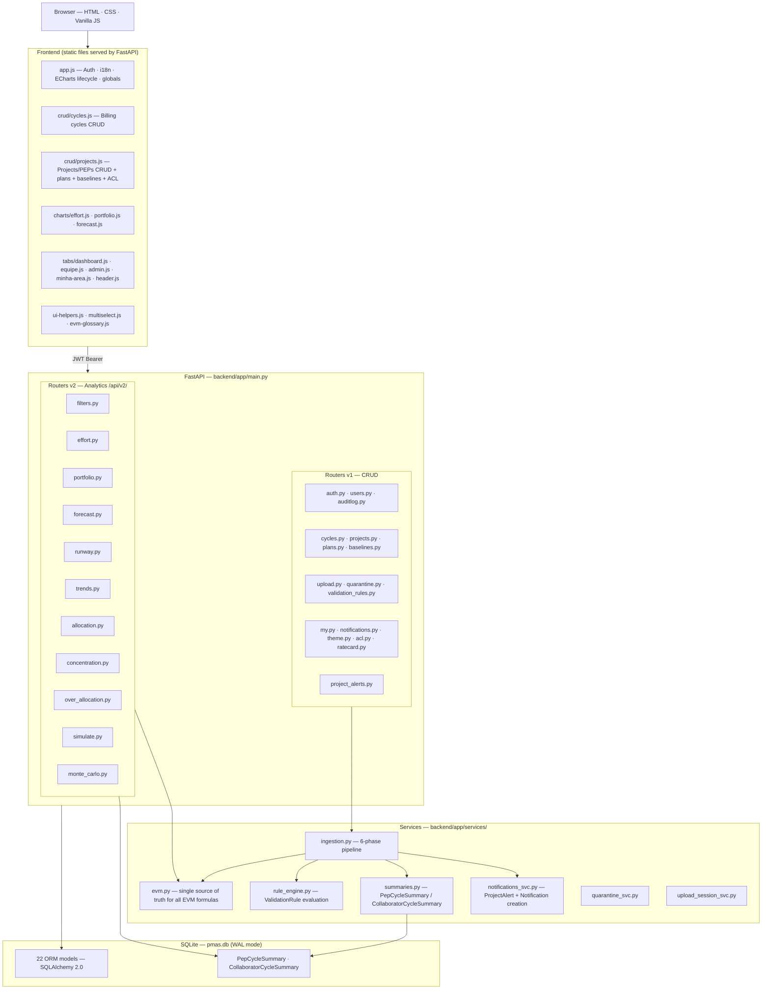

### 3.2 Data Model

```mermaid
erDiagram
    SeniorityLevel {
        int id PK
        string name UK
    }
    RateCard {
        int id PK
        int seniority_level_id FK
        float hourly_rate
        date valid_from
        date valid_to
    }
    Collaborator {
        int id PK
        string name UK
        int seniority_level_id FK
    }
    Cycle {
        int id PK
        string name
        date start_date
        date end_date
        bool is_closed
        bool is_active
    }
    TimesheetRecord {
        int id PK
        int collaborator_id FK
        int cycle_id FK
        date record_date
        string pep_wbs
        string pep_description
        float normal_hours
        float extra_hours
        float standby_hours
        float cost_per_hour
        float normal_cost
        float extra_cost
        float standby_cost
    }
    Project {
        int id PK
        string pep_wbs UK
        string name
        string client
        string manager
        float budget_hours
        float budget_cost
        string status
        date start_date
        date planned_end_date
        date completion_date
    }
    ProjectBaseline {
        int id PK
        int project_id FK
        datetime locked_at
        string locked_by
        float budget_hours
        float budget_cost
        string label
        bool is_active
    }
    BudgetRevision {
        int id PK
        int project_id FK
        float old_budget_hours
        float old_budget_cost
        float new_budget_hours
        float new_budget_cost
        string reason
        string changed_by
        datetime changed_at
    }
    ProjectCyclePlan {
        int id PK
        int project_id FK
        int cycle_id FK
        float planned_hours
        float planned_cost
        float physical_pct
        string physical_note
    }
    User {
        int id PK
        string username UK
        string hashed_password
        string role
        bool must_change_password
    }
    GlobalConfig {
        int id PK
        float extra_hours_multiplier
        float standby_hours_multiplier
        float budget_warning_threshold
        float budget_critical_threshold
        float anomaly_max_daily_hours
        string timezone
        json ui_theme
        string logo_path
        float spi_warning_threshold
        int spi_risk_consecutive_cycles
    }
    AuditLog {
        int id PK
        int user_id FK
        string username
        string action
        string entity
        int entity_id
        string detail
        datetime timestamp
    }
    UserProjectAccess {
        int id PK
        int user_id FK
        int project_id FK
    }
    ValidationRule {
        int id PK
        bool is_active
        bool is_system
        int order
        string field
        string operator
        string value
        string action
        string description
        string created_by
        datetime created_at
    }
    UploadSession {
        int id PK
        datetime uploaded_at
        int uploaded_by_user_id FK
        string uploaded_by_username
        string source_file
        int records_inserted
        int records_skipped
        int quarantine_added
        int warning_count
        int info_count
        string status
        json warnings_detail
        json infos_detail
    }
    QuarantineRecord {
        int id PK
        datetime ingested_at
        int upload_session_id FK
        int uploaded_by_user_id FK
        string uploaded_by_username
        json raw_data
        string quarantine_reason
        int rule_id FK
        bool reviewed
        string reviewed_by
        datetime reviewed_at
        string review_status
    }
    UserPreference {
        int id PK
        int user_id FK
        json dashboard
        datetime updated_at
    }
    PepCycleSummary {
        int id PK
        string pep_wbs
        int cycle_id FK
        float total_hours
        float normal_hours
        float extra_hours
        float standby_hours
        float total_cost
        float normal_cost
        float extra_cost
        float standby_cost
        datetime refreshed_at
    }
    CollaboratorCycleSummary {
        int id PK
        int collaborator_id FK
        int cycle_id FK
        float normal_hours
        float extra_hours
        float standby_hours
        float total_hours
        float total_cost
        float normal_cost
        float extra_cost
        float standby_cost
        datetime refreshed_at
    }
    ThemePreset {
        int id PK
        string name UK
        bool is_builtin
        json config
        datetime created_at
    }
    Notification {
        int id PK
        int user_id FK
        string message
        string level
        bool is_read
        datetime created_at
    }
    ProjectAlert {
        int id PK
        int project_id FK
        string pep_wbs
        string alert_type
        string level
        string message
        float metric_value
        int consecutive_cycles
        datetime created_at
        datetime resolved_at
        bool is_resolved
    }

    SeniorityLevel ||--o{ RateCard : "rates"
    SeniorityLevel ||--o{ Collaborator : "level"
    Collaborator ||--o{ TimesheetRecord : "records"
    Cycle ||--o{ TimesheetRecord : "period"
    Cycle ||--o{ ProjectCyclePlan : "plans"
    Cycle ||--o{ PepCycleSummary : "pep-summary"
    Cycle ||--o{ CollaboratorCycleSummary : "collab-summary"
    Project ||--o{ ProjectCyclePlan : "baseline"
    Project ||--o{ ProjectBaseline : "revisions"
    Project ||--o{ BudgetRevision : "history"
    Project ||--o{ UserProjectAccess : "acl"
    Project ||--o{ ProjectAlert : "alerts"
    User ||--o{ UserProjectAccess : "access"
    User ||--o{ UploadSession : "uploads"
    User ||--o{ Notification : "notifications"
    User ||--o{ UserPreference : "preference"
    UploadSession ||--o{ QuarantineRecord : "quarantine"
    ValidationRule ||--o{ QuarantineRecord : "rule"
    Collaborator ||--o{ CollaboratorCycleSummary : "summary"
```

### 3.3 Ingestion Pipeline

```mermaid
flowchart TD
    A([POST /api/upload-timesheet]) --> P0

    subgraph P0["Phase 0 — Load and Validate Structure"]
        B[Load CSV or XLSX with pandas]
        C{Required columns present?\nColaborador · Data · Horas totais}
        B --> C
        C -- no --> ERR1([HTTP 422 — missing columns])
        C -- yes --> D[Filter rows by user PEP ACL\nfor non-admin users]
    end

    D --> P0B

    subgraph P0B["Phase 0b — Date Pre-scan"]
        E[Collect all unique parseable past dates]
        F{Date covered by an active Cycle?}
        E --> F
        F -- no --> G[Auto-create quarantine Cycle\nis_active=False]
        F -- yes --> H[Add to cycle_cache]
    end

    G & H --> P1

    subgraph P1["Phase 1 — Per-row Structural Validation"]
        I1["Q8: collaborator name empty\nor in invalid set"]
        I2["Q1: date unparseable"]
        I3["Q2: date is in the future"]
        I4["No active cycle covers this date"]
        I5["Hours field missing or non-numeric"]
        I1 -- invalid --> QR
        I1 -- ok --> I2
        I2 -- invalid --> QR
        I2 -- ok --> I3
        I3 -- future --> QR
        I3 -- ok --> I4
        I4 -- no cycle --> QR
        I4 -- cycle ok --> I5
        I5 -- invalid --> QR
        I5 -- ok --> RBAC
        RBAC[RBAC: check is_closed cycle\ncheck encerrado/suspenso project]
        RBAC -- blocked --> ERR2([HTTP 400\nClosedCycleError or LockedProjectError])
    end

    QR[(QuarantineRecord\nreview_status = pending)]

    RBAC -- ok --> P2

    subgraph P2["Phase 2 — ValidationRule Engine (per row)"]
        L[Evaluate active rules ordered by order ASC]
        M{Highest-priority action?}
        L --> M
        M -- descarte --> SKIP[Row discarded\nskipped++]
        M -- quarentena --> QR
        M -- warning --> WARN[Accumulate ingest_warnings]
        M -- info --> INFO[Accumulate ingest_infos]
        M -- none --> WARN
    end

    WARN & INFO --> P3

    subgraph P3["Phase 3 — Aggregate Rules"]
        P[Compute daily and weekly hour sums\nper collaborator]
        PA{soma_diaria or soma_semanal\nrule violated?}
        P --> PA
        PA -- warning --> WARNA[Accumulate aggregate warnings]
        PA -- info --> INFOA[Accumulate aggregate infos]
        PA -- no violation --> ROK[All valid rows proceed]
    end

    ROK --> P4

    subgraph P4["Phase 4 — Upsert Records (transaction)"]
        S[DELETE TimesheetRecord WHERE\npep_wbs + cycle_id in scope]
        T[_lookup_rate: find RateCard\nby seniority level + record_date]
        U[freeze_costs: compute normal_cost\nextra_cost  standby_cost]
        V[INSERT TimesheetRecord\nwith frozen cost_per_hour]
        W[Upsert PepCycleSummary\nUpsert CollaboratorCycleSummary]
        S --> T --> U --> V --> W
    end

    W --> P5

    subgraph P5["Phase 5 — Finalisation"]
        X[Persist QuarantineRecord rows]
        Y[Create UploadSession with row counts]
        Z[db.commit]
        X --> Y --> Z
    end

    Z --> P6

    subgraph P6["Phase 6 — Post-commit"]
        AA[Write AuditLog entry]
        AB[notify_threshold_crossings — budget alerts]
        AC[notify_schedule_risk — SPI alerts]
        AA --> AB --> AC
    end

    AC --> RES([Return UploadOut:\ninserted · skipped · quarantine · warnings · infos])
```

### 3.4 EVM Calculation Pipeline

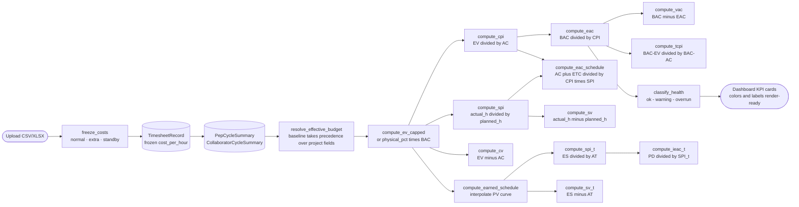

### 3.5 State Machines

#### QuarantineRecord

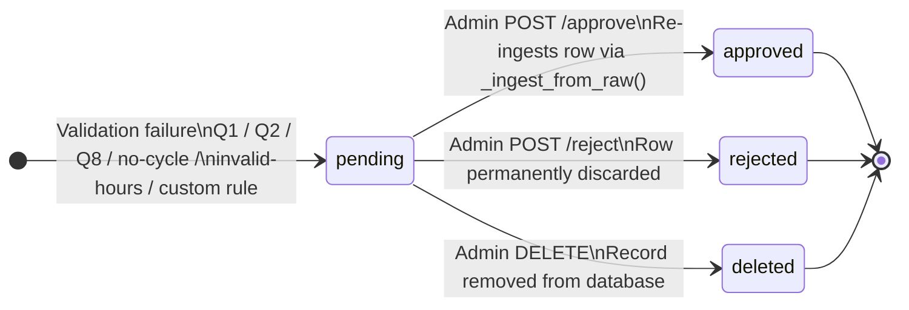

#### Project.status

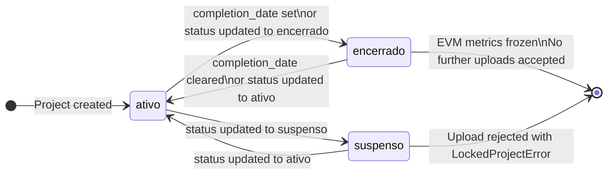

#### Cycle States

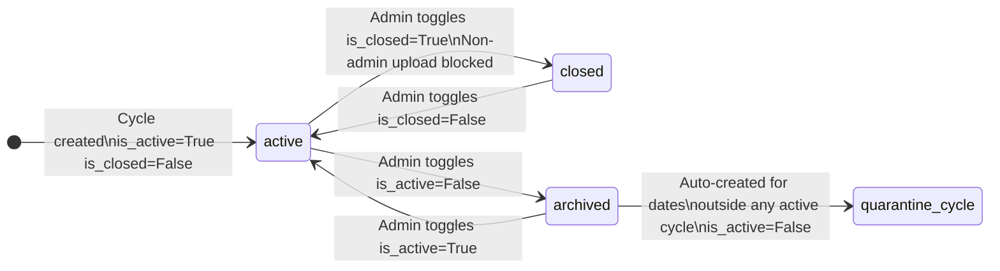

#### ProjectAlert Lifecycle

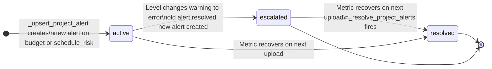

---

## 4. Getting Started

### 4.1 Prerequisites

- Python **3.11** or **3.12**
- pip (bundled with Python)
- A modern browser (Chrome 110+, Firefox 115+, Edge 110+)
- Network access to port 8000 (or the configured port)

### 4.2 Installation

```bash
# Clone the repository
git clone https://github.com/RtaSistemas/PMAS.git
cd PMAS

# Install Python dependencies
pip install -r requirements.txt

# Start the development server
python -m uvicorn backend.app.main:app --reload

# Open the browser at http://127.0.0.1:8000
# Default credentials: admin / admin
```

**Production start (no auto-reload, multiple workers):**

```bash
python -m uvicorn backend.app.main:app --host 0.0.0.0 --port 8000 --workers 2
```

**Environment variables** (copy `.env.example` to `.env`):

| Variable | Default | Description |
|---|---|---|
| `PMAS_SECRET_KEY` | *(random)* | JWT signing key — **must be set in production** |
| `PMAS_PORT` | `8765` | Listening port |
| `PMAS_HOST` | `127.0.0.1` | Network interface |
| `PMAS_ENV` | `development` | `development` or `production` |
| `PMAS_ALLOWED_ORIGINS` | *(empty)* | Additional CORS origins (comma-separated) |
| `PMAS_DB_PATH` | *(project root)* | Path to `pmas.db` |
| `PMAS_LOG_LEVEL` | `INFO` | `DEBUG`, `INFO`, `WARNING`, or `ERROR` |

⚠ Without `PMAS_SECRET_KEY`, a random key is generated at startup. All existing sessions are invalidated on every restart. Always set this variable in production.

### 4.3 First-Time Setup

```mermaid
flowchart LR
    A([Install and start]) --> B[Login as admin/admin]
    B --> C[Change admin password\nAdmin tab - Users]
    C --> D[Create seniority levels\nEquipe tab - Senioridade]
    D --> E[Create rate cards\nEquipe tab - Rate Cards]
    E --> F[Create billing cycles\nCiclos tab]
    F --> G[Create projects with budget\nProjetos tab]
    G --> H[Assign collaborator seniority\nEquipe tab - Team]
    H --> I[Upload first timesheet\nDashboard - Upload button]
    I --> J([View analytics])
```

### 4.4 Generating Sample Data

The repository includes a portfolio generator for demonstration and testing:

```bash
# Generate 29 monthly cycles, 10 PEPs, rate cards, and per-month timesheet CSVs
python amostras/generate_portfolio.py

# Output in amostras/:
#   ciclos.csv             — 29 cycles Jan/2024 to May/2026
#   projetos.csv           — 10 PEPs with 60IT-XXX-01 codes
#   senioridade_rate_card.csv
#   timesheets/YYYY-MM.csv — one file per cycle

# Large portfolio simulation (optional)
python amostras/generate_grande_sim.py
```

Import order for sample data:
1. Import `amostras/ciclos.csv` via Ciclos tab — Importar CSV
2. Import `amostras/projetos.csv` via Projetos tab — Importar CSV
3. Import `amostras/senioridade_rate_card.csv` via Equipe tab — Importar
4. Upload each file in `amostras/timesheets/` via Dashboard — Enviar Planilha

---

## 5. User Roles and Permissions

### 5.1 Role Definitions

| Role | Description |
|---|---|
| `admin` | Full access to all PEPs and all management routes. Can create/edit/delete users, rules, cycles, projects, rate cards, baselines. Reviews quarantine records. Views audit log. |
| `user` | Read access filtered by PEP ACL. Can upload timesheets for authorized PEPs. Sees own upload history and quarantine records. Cannot access admin-only sections. |

### 5.2 Permission Matrix

| Feature Area | admin view | admin create | admin edit | admin delete | user view | user create | user edit | user delete |
|---|:---:|:---:|:---:|:---:|:---:|:---:|:---:|:---:|
| Dashboard analytics | Yes | — | — | — | Yes (ACL) | — | — | — |
| Upload timesheet | Yes | Yes | — | — | Yes | Yes (ACL) | — | — |
| Billing cycles | Yes | Yes | Yes | Yes | Yes | — | — | — |
| Projects / PEPs | Yes | Yes | Yes | Yes | Yes | — | — | — |
| Project plans | Yes | Yes | Yes | Yes | Yes | — | — | — |
| Budget baselines | Yes | Yes | Yes | Yes | Yes | — | — | — |
| Rate cards | Yes | Yes | Yes | Yes | Yes | — | — | — |
| Team seniority | Yes | — | Yes | — | Yes | — | — | — |
| Quarantine records | Yes (all) | — | Yes | Yes | Yes (own) | — | — | — |
| Validation rules | Yes | Yes | Yes | Yes* | — | — | — | — |
| Users | Yes | Yes | Yes | Yes | — | — | — | — |
| Per-PEP ACL | Yes | Yes | Yes | Yes | — | — | — | — |
| Audit log | Yes | — | — | — | — | — | — | — |
| Project alerts (admin) | Yes | — | — | — | — | — | — | — |
| My alerts (user) | Yes | — | — | — | Yes (ACL) | — | — | — |
| Theme / logo | Yes | Yes | Yes | Yes | — | — | — | — |
| Notifications | Yes | — | Yes | Yes | Yes | — | Yes | Yes |
| My preferences | Yes | — | Yes | — | Yes | — | Yes | — |

*System rules (`is_system=True`) cannot be deleted, only toggled on/off.

### 5.3 Per-PEP ACL

The `UserProjectAccess` table whitelists specific PEPs per non-admin user.

- **Empty whitelist** means the user can access **all** PEPs (same view as admin for analytics).
- **Non-empty whitelist** means the user sees only the listed PEPs in all analytics views, upload, quarantine, and alerts.
- Enforced in all `/api/v2/` analytics endpoints (via `_allowed_peps()` helper), `/api/upload-timesheet`, `/api/my/quarantine`, `/api/my/alerts`, and `/api/my/budget-alerts`.

ACL is managed by an admin via Projetos tab — select project — Acesso tab.

### 5.4 Role Assignment Flow

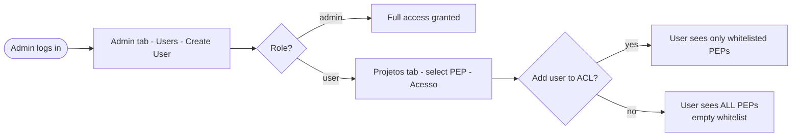

---

## 6. Core Workflows

### 6.1 Timesheet Upload

The upload is the only pathway for timesheet data to enter PMAS (see BR-001).

**Supported formats:** CSV (UTF-8 or UTF-8-BOM) and XLSX.

**Required columns:**

| Column | Type | Notes |
|---|---|---|
| `Colaborador` | Text | Full name; length >= 2; not in `{nan, none, unnamed, 0, -, —}` |
| `Data` | DD/MM/YYYY | Future dates are quarantined (Q2) |
| `Horas totais (decimal)` | Float | e.g. `8.5`; comma or period accepted as decimal separator |

**Optional columns:**

| Column | Type | Notes |
|---|---|---|
| `Hora extra` | `Sim`/`Não` | Absent = `Não` |
| `Hora sobreaviso` | `Sim`/`Não` | Absent = `Não` |
| `Código PEP` | Text | Machine code, e.g. `60IT-001-01` |
| `PEP` | Text | Human-readable description |
| `Hora Inicial [H]` | HH:MM | Disambiguates multiple entries on same day/PEP |

**How to upload:**
1. Log in and open the **Dashboard** tab.
2. Click **Enviar Planilha** (the upload button).
3. Select the CSV or XLSX file.
4. Review the result dialog: **Inseridos**, **Duplicatas**, **Quarentena**, **Avisos**.

**Upload result fields:**

| Field | Meaning |
|---|---|
| `records_inserted` | Rows successfully written to `TimesheetRecord` |
| `records_skipped` | Exact duplicates within the file; rows with 0 hours |
| `quarantine_added` | Rows sent to quarantine for review |
| `warning_count` | Rows accepted but with a flagged condition |
| `info_count` | Informational messages (new collaborators created, duplicate info entries) |

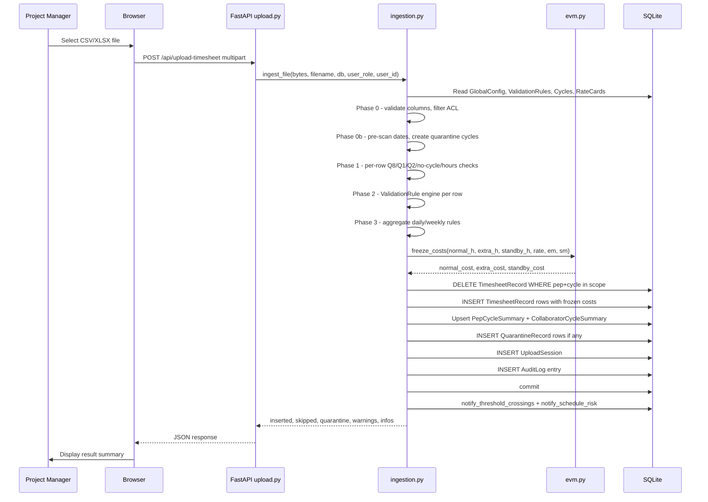

💡 If the file contains data for a PEP not yet registered in PMAS, rows with that PEP code are still accepted (the PEP code is stored as a string). Registering the project later enables EVM calculations for those rows.

⚠ Uploading a file that covers a (PEP, cycle) pair already in the database **replaces** all existing records for that pair. This is the surgical DELETE+INSERT upsert pattern (see BR-003).

### 6.2 Managing Billing Cycles

Billing cycles define the time periods to which timesheet records are assigned.

**Creating a cycle:**
1. Open the **Ciclos** tab.
2. Click **Novo Ciclo**.
3. Enter name (e.g. `2024-01`), start date, and end date.
4. Save.

**Cycle states:**

| State | Flags | Effect |
|---|---|---|
| Active (normal) | `is_active=True`, `is_closed=False` | Accepts timesheet uploads |
| Closed | `is_active=True`, `is_closed=True` | Admin uploads still accepted; non-admin upload blocked with `ClosedCycleError` |
| Archived | `is_active=False` | Hidden from default list; not used for new records; excluded from analytics |
| Quarantine cycle | `is_active=False`, auto-created | Holds dates outside all registered cycles; excluded from Trends chart |

**Closing a cycle:** use the lock icon in the Ciclos table. Closed cycles prevent non-admin users from re-uploading data for that period, protecting month-end figures.

**Quarantine cycles:** when the ingestion pipeline encounters a date that does not fall within any active cycle, it auto-creates a quarantine cycle for that date (name: `quarentena-YYYY-MM-DD`). Records in these cycles are excluded from Trends and Portfolio charts. Create the proper cycle and re-upload the file to migrate those records.

**Overlap validation:** cycle date ranges cannot overlap. The API returns HTTP 422 if a new or updated cycle would overlap with an existing one.

**Deleting a cycle:** only possible when the cycle has zero `TimesheetRecord` rows. The API returns HTTP 409 otherwise.

### 6.3 Managing Projects (PEPs)

Projects are the cost objects tracked by PMAS. Each project has a unique PEP code (`pep_wbs`) that maps to the code used in timesheet exports.

**Creating a project:**
1. Open the **Projetos** tab.
2. Click **Novo Projeto**.
3. Enter: PEP code, name, client, manager, budget hours, budget cost, start date, planned end date.
4. Save.

**Budget fields:** `budget_hours` and `budget_cost` are required for EVM to work. Without them, CPI/SPI/EAC cards will show "N/A" (see CC-007).

**Project status values:**

| Status | Meaning | Upload behavior |
|---|---|---|
| `ativo` | Project is active | Uploads accepted |
| `suspenso` | Project is suspended | Upload blocked with `LockedProjectError` |
| `encerrado` | Project is closed/completed | Upload blocked; EVM metrics frozen at final state |

Setting `completion_date` automatically sets `status = "encerrado"` (see BR-023).

**Budget baselines:** a baseline locks the current `budget_hours` and `budget_cost` as an approved revision. While an active baseline exists, it takes precedence over the project's direct budget fields in all EVM calculations. To create a baseline: Projetos — select project — Baselines — Bloquear. To activate a historical baseline: click Ativar next to that baseline entry.

**Physical Progress (% Avanço Físico):** when hours do not accurately represent delivery progress, the PM can declare the actual physical completion percentage per cycle. This overrides the hours-proxy EV formula. Enter physical progress via Projetos — select project — Planos — edit a plan row and set `physical_pct` (0.0–1.0). A badge in the Forecast tab indicates when this mode is active.

### 6.4 Baseline Planning (ProjectCyclePlan)

`ProjectCyclePlan` defines how many hours (and optionally how much cost) were planned for each cycle of a project. This enables:

- **SPI calculation** (cumulative actual hours / cumulative planned hours)
- **S-curve chart** (planned vs actual per cycle)
- **Earned Schedule** (ES, SPI(t), SV(t), IEAC(t))
- **Physical Percent Complete** per cycle

**Creating plans:**

Option A — UI: Projetos — select project — Planos — fill in planned hours and planned cost per cycle.

Option B — CSV import: use `POST /api/plans/import` with a CSV containing columns `pep_wbs`, `cycle_name`, `planned_hours`, and optionally `planned_cost`.

**Effect of missing plan data:** if no `ProjectCyclePlan` rows exist for a project, SPI/SV/Earned Schedule will be `null`, and the S-curve will show only the actual line without a plan line.

**physical_pct field:** cumulative percentage complete declared by the PM (range 0.0 = 0% to 1.0 = 100%). When the most recent cycle with a non-null `physical_pct` is found AND the project has `budget_cost`, the system switches to EV Mode 2 (see Section 7.4).

### 6.5 Quarantine Workflow

Records that fail validation during ingestion are held in quarantine with `review_status = "pending"`. An admin must review each record.

**How records land in quarantine:**

| Reason code | Cause |
|---|---|
| Q1 | Date unparseable (e.g. `2024/01/32`, `abc`) |
| Q2 | Date is in the future |
| Q8 | Collaborator name empty, too short, or in the invalid-name set |
| No cycle | Date not covered by any active cycle |
| Invalid hours | Hours field missing, NaN, Inf, or non-numeric |
| Custom rule | A `ValidationRule` with `action=quarentena` matched the row |

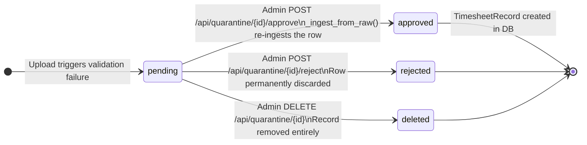

**Approving a quarantine record:**
1. Go to Admin — Quarentena (or Minha Área — Quarentena for own records).
2. Click the eye icon to open the record and review the raw data and reason.
3. If the record is valid (e.g. an out-of-range date now has a cycle created for it), click **Aprovar**.
4. The system calls `_ingest_from_raw()`, which re-ingests the row bypassing validation rules (since the admin has explicitly approved it).
5. If the underlying problem cannot be corrected within PMAS (e.g. wrong date in source), click **Rejeitar** to permanently discard the row. Correct the source and re-upload.

⚠ Approving a quarantine record bypasses the validation rule engine. This is intentional: the admin has reviewed the raw data and decided to accept it. If rules have changed since the original upload, the newly inserted row will not be re-evaluated.

### 6.6 Rate Cards and Seniority

Rate cards define the hourly cost for each seniority level within a date range.

**Setup order:**
1. Create seniority levels (e.g. `Junior`, `Pleno`, `Senior`) via Equipe — Senioridade.
2. Create rate cards for each level, specifying `hourly_rate`, `valid_from`, and optionally `valid_to` via Equipe — Rate Cards.
3. Assign a seniority level to each collaborator via Equipe — Team.

**Cost freeze at ingestion:** when a row is inserted during `_phase_upsert_records()`, `_lookup_rate(db, collab, record_date)` finds the `RateCard` where `seniority_level_id` matches, `valid_from <= record_date`, and (`valid_to IS NULL OR valid_to >= record_date`). The resolved `hourly_rate` is stored permanently in `TimesheetRecord.cost_per_hour`. Future rate card changes do NOT retroactively alter existing records (see BR-022).

**No rate card match:** if no rate card covers the collaborator and date, `cost_per_hour = 0.0`. The upload proceeds but generates a warning (see CC-002).

**Multipliers:** `GlobalConfig.extra_hours_multiplier` (default 1.5) and `GlobalConfig.standby_hours_multiplier` (default 0.33) are applied at ingestion time and frozen alongside the rate.

### 6.7 Dashboard and Analytics

The Dashboard tab has three sub-tabs, a shared filter card, and a semaphore header bar.

**Shared filters:**
- **Date range** (`date_from` / `date_to`): restrict all analytics to a period.
- **Collaborator** (MultiSelect): filter by one or more collaborators.
- **PEP code** (MultiSelect): filter by one or more PEP codes.
- **PEP description** (MultiSelect): filter by human-readable PEP labels.

**Esforço da Equipe (Team Effort):**
- Horizontal stacked/grouped bar chart: hours per collaborator, broken down by hour type (normal / extra / standby).
- Toggle between hours view and cost view.
- Client-side CSV export via "Exportar CSV" button (uses cached response — no server round-trip).
- Data source: `/api/v2/effort`.

**Saúde do Portfólio (Portfolio Health):**
- **Treemap**: each project is a rectangle sized by total hours or total cost. Color indicates health (green/yellow/red/grey).
- **Bullet chart**: consumed vs budget per project, with threshold markers.
- Toggle between **Horas** and **R$** modes.
- Data source: `/api/v2/portfolio`.

**Previsão EVM (Forecast):**
- Select a PEP from the dropdown to load its full EVM analysis.
- **KPI cards**: CPI, SPI, EAC, TCPI, VAC, CV, SV — each with a color badge and a human-readable label.
- **S-curve**: cumulative planned vs actual hours/cost over cycles.
- **Burn-up chart**: how quickly the project is consuming its budget.
- **Earned Schedule panel**: ES, SPI(t), SV(t), IEAC(t) (when a plan exists).
- **What-If panel**: enter a velocity multiplier and extra hours per cycle to see projected remaining cycles and EAC.
- **Monte Carlo panel**: run N iterations to get P10/P50/P90 completion estimates and a histogram.
- **Alert card**: inline list of active and resolved `ProjectAlert` records for the selected PEP.
- Data source: `/api/v2/forecast`, `/api/v2/projects/{id}/simulate`, `/api/v2/projects/{id}/monte-carlo`.

**Tendências (Trends):**
- Line chart of hours and cost per cycle in chronological order.
- Quarantine cycles are excluded.
- Data source: `/api/v2/trends`.

**Semaphore (header bar):**
- Appears at the top of the Dashboard after login.
- Each registered project is shown as a colored pill: green (< 90% budget consumed), yellow (90–99%), red (>= 100%), grey (no budget defined).
- Clicking a pill drills down to the Portfolio tab filtered to that PEP.
- Refreshed on every application load via `loadSemaphore()` in `header.js`.

### 6.8 Alert System

**Budget threshold alerts:**
- `notify_threshold_crossings()` runs after every successful upload.
- For each affected PEP, compares `consumed_hours / budget_hours` against `warning_threshold` (default 0.9) and `critical_threshold` (default 1.0).
- Creates a `ProjectAlert` of type `budget_warning` (level `warning`) or `budget_overrun` (level `error`).
- Creates a `Notification` record for every user with access to that PEP (admins + ACL users).

**Schedule-risk alerts:**
- `notify_schedule_risk()` runs after every successful upload.
- For each affected PEP that has a `ProjectCyclePlan`, looks at the last `spi_risk_consecutive_cycles` (default 2) non-quarantine cycles and computes per-cycle SPI.
- If all of those cycles have SPI < `spi_warning_threshold` (default 0.85), creates a `ProjectAlert` of type `schedule_risk` (level `warning`).
- Creates `Notification` records for users with access.

**Deduplication and escalation:**
- If an active alert of the same type already exists at the same level: no duplicate created.
- If an active alert exists but at a different level (e.g. `warning` to `error`): the old alert is resolved and a new one is created.

**Auto-resolution:**
- On the next upload, if `health == "ok"` for budget alerts, or if all recent SPI values recover above threshold, `_resolve_project_alerts()` marks the alert `is_resolved=True` with a `resolved_at` timestamp.

**Viewing alerts:**
- **Admin:** Admin tab — Central de Alertas. Filterable by PEP, alert type, is_resolved, date range.
- **Regular user:** Minha Área — Alertas sub-tab. Shows only alerts for ACL-authorized PEPs. Hidden for admin users (they use the Admin tab).
- **Bell tray:** the bell icon in the header shows unread `Notification` count. Click to expand; mark individual or all as read.
- **Forecast tab:** when a PEP is selected, an alert card appears below the KPI cards if any `ProjectAlert` records exist for that PEP.

### 6.9 Validation Rule Engine

The rule engine allows administrators to configure custom per-row and aggregate validation rules that supplement the hardcoded structural checks (Q1, Q2, Q8).

**System rules vs custom rules:**
- `is_system=True`: created by code, not by the UI. Cannot be deleted. Only `value` and `is_active` are editable.
- `is_system=False`: created by admins via Admin — Regras de Validação. Can be deleted, reordered, and fully edited.

**Rule fields:**

| Field | Description |
|---|---|
| `field` | Which attribute to check (see table below) |
| `operator` | Comparison operator |
| `value` | Threshold value or comparison string |
| `action` | What to do when the rule matches |
| `is_active` | Whether the rule is evaluated during ingestion |
| `order` | Evaluation order (ascending; lower number evaluated first) |
| `description` | Human-readable description shown in the UI |

**Per-row fields:**

| Field name | Type | Description |
|---|---|---|
| `horas_individuais` | float | Total hours in this entry |
| `hora_extra` | string | "Sim" or "Não" |
| `hora_sobreaviso` | string | "Sim" or "Não" |
| `hora_extra_horas` | float | Hours if hora_extra=Sim, else 0 |
| `hora_sobreaviso_horas` | float | Hours if hora_sobreaviso=Sim, else 0 |
| `pep_wbs` | string | PEP code (may be None) |
| `dia_semana` | int | 0 = Monday through 6 = Sunday |

**Aggregate fields (Phase 3):**

| Field name | Type | Description |
|---|---|---|
| `soma_diaria` | float | Total hours for this collaborator on this date |
| `soma_semanal` | float | Total hours for this collaborator in this ISO week |

**Operators:**

| Operator | Applicable to | Behavior |
|---|---|---|
| `gt` / `gte` / `lt` / `lte` | numeric | Greater / greater-equal / less / less-equal |
| `eq` / `neq` | any | Equality (tries float first, then string) |
| `vazio` | any | Field is None or empty string |
| `nao_vazio` | any | Field has a value |
| `contem` | string | Case-insensitive substring match |
| `nao_contem` | string | Case-insensitive absence of substring |
| `in_lista` | string | Value is in comma-separated list |

**Actions and priority rank:**

| Action | Rank | Effect |
|---|---|---|
| `info` | 0 | Recorded in `ingest_infos`; row accepted |
| `warning` | 1 | Recorded in `ingest_warnings`; row accepted |
| `quarentena` | 2 | Row sent to `QuarantineRecord` |
| `descarte` | 3 | Row silently discarded (`records_skipped++`) |

When multiple rules match the same row, the highest-rank action wins. Aggregate rules only support `warning` and `info`; `quarentena` and `descarte` actions on aggregate rules are silently downgraded to `warning`.

---

## 7. EVM Reference

### 7.1 Methodology

PMAS implements the **AgileEVM** methodology as described in the PMI Practice Standard for Earned Value Management (PMI 19-006-2019, 3rd edition) with specific adaptations:

- **SPI uses an hours proxy** (actual hours / planned hours) rather than monetary EV/PV, because many projects have an hours-only baseline.
- **EV is capped at BAC** — a project cannot earn more than its total budget.
- **Physical Percent Complete** overrides the hours proxy when explicitly declared by the PM.
- **SPI is frozen** at the last cycle where cumulative planned hours advanced, preventing artificial SPI degradation.

All formulas reside exclusively in `backend/app/services/evm.py` (GR-2).

### 7.2 Glossary

| Term | Abbreviation | Definition |
|---|---|---|
| Budget at Completion | BAC | The total approved budget for a project (`budget_cost`) |
| Earned Value | EV | Value of work performed, expressed in currency |
| Planned Value | PV | Authorized budget for work scheduled to be done |
| Actual Cost | AC | Actual cost incurred for work performed |
| Cost Performance Index | CPI | Ratio of earned value to actual cost |
| Schedule Performance Index | SPI | Ratio of actual hours to planned hours |
| Estimate at Completion | EAC | Forecasted total cost at project completion |
| Estimate to Complete | ETC | Remaining cost to finish the project |
| Variance at Completion | VAC | Difference between BAC and EAC |
| Cost Variance | CV | Difference between EV and AC |
| Schedule Variance | SV | Difference between actual and planned hours |
| To-Complete Performance Index | TCPI | Efficiency needed to complete within budget |
| Earned Schedule | ES | The time-unit at which EV equals the cumulative PV |
| Actual Time | AT | Number of cycles consumed |
| Planned Duration | PD | Number of planned cycles |
| SPI(t) | SPI(t) | Time-based schedule efficiency: ES / AT |
| SV(t) | SV(t) | Time-based schedule variance: ES minus AT |
| IEAC(t) | IEAC(t) | Independent EAC in time: PD / SPI(t) |

### 7.3 Formulas

All formulas use:
- $BAC$ = `budget_cost` (or baseline budget cost if an active baseline exists)
- $AC$ = cumulative `total_cost` from `PepCycleSummary`
- $h_{actual}$ = cumulative `total_hours`
- $h_{planned}$ = cumulative `planned_hours` from `ProjectCyclePlan`
- $h_{budget}$ = `budget_hours`

#### Earned Value (hours proxy — Mode 1)

$$EV = \min\!\left(\frac{h_{actual}}{h_{budget}},\ 1.0\right) \times BAC$$

#### Earned Value (Physical Percent Complete — Mode 2)

$$EV = \phi \times BAC$$

where $\phi$ is the declared `physical_pct` from the most recent `ProjectCyclePlan` with a non-null value.

#### Cost Performance Index

$$CPI = \frac{EV}{AC}$$

Returns `None` when $AC = 0$ or $EV = 0$.

#### Schedule Performance Index

$$SPI = \frac{h_{actual,\text{frozen}}}{h_{planned,\text{frozen}}}$$

where the frozen values come from `freeze_spi_boundary()`. Returns `None` when $h_{planned} = 0$.

#### Estimate at Completion (CPI-based)

$$EAC = \frac{BAC}{CPI}$$

When $CPI$ is `None` (no performance data yet), $EAC$ defaults to $BAC$.

#### Estimate at Completion (schedule-sensitive)

$$EAC_{schedule} = AC + \frac{BAC - EV}{CPI \times SPI}$$

#### Estimate to Complete

$$ETC = \max(EAC - AC,\ 0)$$

#### Variance at Completion

$$VAC = BAC - EAC$$

Positive = projected saving; negative = projected overrun.

#### Cost Variance

$$CV = EV - AC$$

Positive = under budget; negative = over budget.

#### Schedule Variance (hours)

$$SV = h_{actual,\text{frozen}} - h_{planned,\text{frozen}}$$

Positive = ahead of schedule; negative = behind.

#### To-Complete Performance Index

$$TCPI = \frac{BAC - EV}{BAC - AC}$$

Returns `None` when $BAC - AC = 0$.

#### Earned Schedule

$$ES = i + \frac{EV - PV_{i-1}}{PV_i - PV_{i-1}}$$

where $i$ is the first cycle index where cumulative $PV_i \geq EV$.

#### Time-Based SPI

$$SPI(t) = \frac{ES}{AT}$$

#### Time-Based Schedule Variance

$$SV(t) = ES - AT$$

#### Independent EAC (time-based)

$$IEAC(t) = \frac{PD}{SPI(t)}$$

#### Velocity-based forecast

$$\overline{h} = \frac{1}{3}\sum_{i=n-2}^{n} h_i$$

$$\text{est\_cycles} = \frac{\text{remaining\_hours}}{\overline{h}}$$

#### Uncertainty band

$$\text{est\_cycles\_optimistic} = \frac{\text{remaining\_hours}}{\max(h_{n-2},\ h_{n-1},\ h_n)}$$

$$\text{est\_cycles\_pessimistic} = \frac{\text{remaining\_hours}}{\min(h_{n-2},\ h_{n-1},\ h_n)}$$

$$EAC_{low} = AC + \text{remaining\_hours} \times \min(r_i)$$

$$EAC_{high} = AC + \text{remaining\_hours} \times \max(r_i)$$

where $r_i = c_i / h_i$ (cost rate) for each of the last 3 cycles.

### 7.4 EV Dual-Mode

| Mode | Name | Trigger | EV formula |
|---|---|---|---|
| 1 | Hours proxy (default) | No `physical_pct` declared, or no `budget_cost` | $\min(h_{actual}/h_{budget},\ 1.0) \times BAC$ |
| 2 | Physical Percent Complete | At least one `ProjectCyclePlan` row has `physical_pct IS NOT NULL` AND `budget_cost` is set | $\phi \times BAC$ |

**Impact of mode switch:** CPI, CV, TCPI, EAC, and VAC all recalculate using the new EV basis. `remaining_hours` also changes:

- Mode 1: $h_{budget} - h_{actual}$
- Mode 2: $(1 - \phi) \times h_{budget}$

**When to use Mode 2:** when hours do not represent delivery — for example, a research spike where the team worked 200 hours but functional scope advanced by only 30%. The PM declares `physical_pct = 0.30`, and PMAS computes cost efficiency against that real progress.

**UI indicator:** a badge labeled with the current physical percentage appears in the Forecast tab when `uses_physical_pct = true`.

### 7.5 EVM Freeze Pattern

`cost_per_hour` is resolved at ingestion time by `_lookup_rate(db, collab, record_date)`:

1. Look up the collaborator's `seniority_level_id`.
2. Find the `RateCard` where `seniority_level_id` matches, `valid_from <= record_date`, and (`valid_to IS NULL OR valid_to >= record_date`).
3. Take the `hourly_rate` from the most recent matching rate card.

`freeze_costs()` then computes:

$$\text{normal\_cost} = h_{normal} \times r$$

$$\text{extra\_cost} = h_{extra} \times r \times m_{extra}$$

$$\text{standby\_cost} = h_{standby} \times r \times m_{standby}$$

These three values are stored in `TimesheetRecord` and never change. Future updates to rate cards, multipliers, or seniority assignments do not retroactively alter stored costs.

### 7.6 SPI Freeze Boundary

`freeze_spi_boundary(actual_series, plan_series)` walks the actual cycles chronologically and tracks the last cycle at which cumulative planned hours advanced. At that point, it returns `(last_actual_h, last_planned_h)`.

All SPI and SV calculations use this frozen pair instead of raw cumulative totals. This prevents SPI from drifting downward when the project continues consuming hours after the last planned cycle ends.

### 7.7 Interpretation Guide

| Metric | Favorable | Monitor | Critical |
|---|---|---|---|
| CPI | >= 1.00 | 0.90–0.99 | < 0.90 |
| SPI | >= 1.00 | 0.90–0.99 | < 0.90 |
| TCPI | <= 1.00 | 1.00–1.10 | > 1.10 |
| VAC | > 0 (saving) | 0 | < 0 (overrun) |
| CV | > 0 (under budget) | 0 | < 0 (over budget) |
| SV | > 0 (ahead) | 0 | < 0 (behind) |
| SPI(t) | >= 1.00 | 0.90–0.99 | < 0.90 |
| Health | `ok` (< 90%) | `warning` (90–99%) | `overrun` (>= 100%) |

### 7.8 Velocity Window Rules

Different analytics contexts use different velocity windows, by design:

| Context | Window | File | Notes |
|---|---|---|---|
| Forecast — completion estimate + uncertainty band | Last **3** cycles | `v2/forecast.py` | Reactive to current rhythm; all cycles in window |
| Runway — avg/cycle + cycles-to-complete | Last **3** non-zero cycles | `v2/runway.py` | Zero-hour cycles excluded from denominator |
| Simulate (What-If) — `avg_velocity` baseline | Last **min(6, N)** cycles | `v2/simulate.py` | Smoother base for scenario planning; zeros included |
| Monte Carlo — Gaussian mu and sigma | **All** cycles with hours > 0 | `v2/monte_carlo.py` | Full history needed to model variance |
| Sparkline (frontend) — avg3 reference line | Last **3** non-zero cycles | `app.js` | Computed client-side; aligns with Forecast |

---

## 8. Business Rules

### 8.1 Data Entry

**BR-001** — Timesheet data may only enter PMAS through the established ingestion pipeline (`POST /api/upload-timesheet` → `ingest_file()`). No endpoint exists for direct creation of individual `TimesheetRecord` rows. This rule is enforced architecturally and tested in `test_golden_rules.py`. *(GR-1; `backend/app/routers/upload.py`)*

**BR-002** — Errors in imported data must be corrected at the source (the upstream timekeeping platform) and re-imported. PMAS does not provide a UI to edit individual imported rows. The only in-system intervention allowed is the quarantine workflow. *(GR-1)*

**BR-003** — Uploading a file that covers a (pep_wbs, cycle_id) scope already in the database replaces all existing records for that scope. The operation is a surgical DELETE+INSERT. This is intentional to allow re-uploads with corrections. *(Enforced: `ingestion.py:_phase_upsert_records()`)*

### 8.2 Ingestion Validation

**BR-004** — **Q8**: Any row where the `Colaborador` column is empty, shorter than 2 characters, or matches an invalid-name sentinel value (`nan`, `none`, `unnamed`, `0`, empty string, `-`, `—`) is quarantined with reason "Nome de colaborador inválido". *(Enforced: `ingestion.py:_phase_validate_rows()` Phase 1a)*

**BR-005** — **Q1**: Any row where the `Data` column cannot be parsed as a date is quarantined with reason "Data inválida". *(Enforced: `ingestion.py:_phase_validate_rows()` Phase 1b)*

**BR-006** — **Q2**: Any row where the parsed date is strictly greater than `date.today()` is quarantined with reason "Data futura". *(Enforced: `ingestion.py:_phase_validate_rows()` Phase 1c)*

**BR-007** — **No active cycle**: Any row whose date does not fall within any active cycle is quarantined with reason "Nenhum ciclo ativo cobre a data". Before quarantining, the system creates a quarantine cycle (`is_active=False`) to group these records. *(Enforced: `ingestion.py:_phase_validate_rows()` Phase 1d)*

**BR-008** — **Invalid hours**: Any row where `Horas totais (decimal)` is missing, NaN, Inf, or non-numeric is quarantined with reason "Horas inválidas ou ausentes". *(Enforced: `ingestion.py:_phase_validate_rows()` Phase 1e)*

**BR-009** — Rows with `Horas totais (decimal) = 0.0` are silently skipped (`records_skipped++`) after passing all validation phases. *(Enforced: `ingestion.py:_phase_upsert_records()`)*

**BR-010** — The `ValidationRule` engine evaluates active rules in ascending `order` value per row after all structural checks pass. If multiple rules match the same row, the highest-rank action wins: `descarte` (3) > `quarentena` (2) > `warning` (1) > `info` (0). *(Enforced: `services/rule_engine.py`)*

**BR-011** — Aggregate rules (`soma_diaria`, `soma_semanal`) are evaluated in Phase 3 over daily/weekly sums per collaborator. They only support `warning` and `info` actions; `quarentena` and `descarte` are downgraded to `warning`. *(Enforced: `ingestion.py:_phase_aggregate_rules()`)*

**BR-012** — The weekly aggregate rule (`soma_semanal`) fires at most **once per collaborator per ISO week**. The date shown in the warning is the earliest day with actual data in that week. *(Enforced: `ingestion.py:_phase_aggregate_rules()`; regression tests in `test_ingestion_phases.py`)*

**BR-013** — Non-admin users uploading files with PEP codes they are not authorized for: authorized rows are ingested; unauthorized rows are discarded with a warning. If no rows are authorized, the upload is rejected with HTTP 403. *(Enforced: `ingestion.py:_phase_authorize_peps()`)*

**BR-014** — A non-admin user uploading data for a **closed** cycle receives `ClosedCycleError` (HTTP 400). Admin users can upload to closed cycles. *(Enforced: `ingestion.py:ingest_file()` RBAC check)*

**BR-015** — Uploading data for a project with `status = "encerrado"` or `status = "suspenso"` raises `LockedProjectError` (HTTP 400) for all users including admin. *(Enforced: `ingestion.py:ingest_file()` locked project check)*

### 8.3 Cycle Rules

**BR-016** — Cycle date ranges cannot overlap. The API returns HTTP 422 if a new or updated cycle would overlap with any existing cycle. *(Enforced: `cycles.py:_check_overlap()`)*

**BR-017** — A cycle cannot be deleted if it has any associated `TimesheetRecord` rows. The API returns HTTP 409. *(Enforced: `cycles.py:delete_cycle()`)*

**BR-018** — Quarantine cycles (auto-created, `is_active=False`) are excluded from all v2 analytics endpoints. Analytics queries filter `Cycle.is_active = True`. *(Enforced: analytics queries in `v2/` routers)*

**BR-019** — Closing a cycle (`is_closed=True`) prevents non-admin users from uploading to it. It does not affect existing `TimesheetRecord` rows. *(Enforced: `ingestion.py:ingest_file()`)*

### 8.4 Project and Budget Rules

**BR-020** — `budget_hours` and `budget_cost` are required for EVM calculations. If either is absent or zero, `compute_ev_capped()` returns `None`, and all downstream metrics (CPI, SPI, EAC, TCPI, VAC, CV) will be `null`. *(Enforced: `services/evm.py`)*

**BR-021** — When an active `ProjectBaseline` exists, it takes precedence over `project.budget_hours` and `project.budget_cost` in all EVM calculations. `resolve_effective_budget(project, baseline)` enforces this rule. *(Enforced: `services/evm.py:resolve_effective_budget()`)*

**BR-022** — EVM freeze pattern: `cost_per_hour` is resolved at ingestion time and stored permanently in `TimesheetRecord`. Future rate card changes do NOT retroactively alter stored costs. *(Enforced: `ingestion.py:_lookup_rate()`, `services/evm.py:freeze_costs()`)*

**BR-023** — Setting `Project.completion_date` to a non-null value automatically sets `project.status = "encerrado"`. *(Enforced: `projects.py:create_project()` and `update_project()`)*

**BR-024** — For a closed project (`status=encerrado` AND `completion_date IS NOT NULL`), the forecast endpoint freezes metrics at the final state: `remaining_hours = 0`, `remaining_cost = 0`, `tcpi = None`, `eac = actual_cost`. *(Enforced: `v2/forecast.py`)*

**BR-025** — EV is capped at BAC: `compute_ev_capped()` applies `min(consumed/budget, 1.0)`. *(Enforced: `services/evm.py:compute_ev_capped()`)*

**BR-026** — Physical Percent Complete overrides the hours-proxy EV when: (a) at least one `ProjectCyclePlan` row has `physical_pct IS NOT NULL`, AND (b) `budget_cost` is set. *(Enforced: `v2/forecast.py`)*

### 8.5 Rate Card Rules

**BR-027** — Rate cards are scoped to a seniority level and a date range (`valid_from`, optional `valid_to`). The ingestion pipeline finds the most recent matching rate card for each collaborator–date pair. *(Enforced: `ingestion.py:_lookup_rate()`)*

**BR-028** — If no rate card covers a collaborator–date pair, `cost_per_hour = 0.0`. The upload proceeds with a per-collaborator warning. *(Enforced: `ingestion.py:_phase_upsert_records()`)*

**BR-029** — Deleting a `SeniorityLevel` is blocked (`RESTRICT`) if any `RateCard` rows reference it. *(Enforced: SQLAlchemy FK constraint)*

### 8.6 Quarantine Rules

**BR-030** — Approving a quarantine record calls `_ingest_from_raw()`, which re-ingests the row bypassing the `ValidationRule` engine. The admin's approval is the authorization. *(Enforced: `quarantine.py:approve_quarantine()`)*

**BR-031** — Approving an already-approved quarantine record returns HTTP 409. Rejecting an already-approved record also returns HTTP 409. *(Enforced: `quarantine.py`)*

**BR-032** — Only admin users can approve, reject, or delete quarantine records. Non-admin users can only view their own quarantine records. *(Enforced: `quarantine.py` uses `AdminUser` dependency)*

**BR-033** — Approving a quarantine record where the date is no longer covered by any active cycle raises HTTP 422. The admin must create or activate the appropriate cycle first. *(Enforced: `quarantine.py:_ingest_from_raw()`)*

### 8.7 EVM Calculation Rules

**BR-034** — All EVM formulas are implemented exclusively in `backend/app/services/evm.py`. No other file may re-implement these equations. *(GR-2; tested in `test_golden_rules.py`)*

**BR-035** — Every EVM function in `evm.py` guards against division by zero and returns `None` when inputs are insufficient. Callers must handle `None`. *(Enforced: `services/evm.py`)*

**BR-036** — SPI uses the hours proxy (actual_h / planned_h). SPI is frozen at the last plan-advance boundary via `freeze_spi_boundary()`. *(Enforced: `services/evm.py`, `v2/forecast.py`)*

**BR-037** — SPI and SV show `null` in the Forecast tab when no `ProjectCyclePlan` rows exist. SPI requires a plan. *(Enforced: `v2/forecast.py` `has_plan` guard)*

**BR-038** — Forecast responses are render-ready: every EVM number comes with a `*_color` field and a `*_label` string. The frontend performs no EVM arithmetic. *(GR-2; `v2/forecast.py`)*

**BR-039** — The velocity window for Forecast is the last **3** cycles. Runway uses last 3 non-zero. Simulate uses min(6,N). Monte Carlo uses all non-zero cycles. These differences are intentional and must not be standardized without explicit approval. *(Enforced: respective v2 router files)*

### 8.8 Alert Rules

**BR-040** — Budget threshold crossing alerts fire automatically after every upload via `notify_threshold_crossings()`. The function is non-critical: exceptions are swallowed so they never block the upload response. *(Enforced: `notifications_svc.py`)*

**BR-041** — Schedule-risk alerts fire when SPI < `spi_warning_threshold` (default 0.85) for at least `spi_risk_consecutive_cycles` (default 2) consecutive cycles. Requires `ProjectCyclePlan` rows to compute per-cycle SPI. *(Enforced: `notifications_svc.py:notify_schedule_risk()`)*

**BR-042** — Alert deduplication: if an active `ProjectAlert` of the same type already exists at the same level, no duplicate is created. If the level changes, the old alert is resolved and a new one is created. *(Enforced: `notifications_svc.py:_upsert_project_alert()`)*

**BR-043** — Alerts auto-resolve on the next upload when the triggering metric recovers. *(Enforced: `notifications_svc.py:_resolve_project_alerts()`)*

**BR-044** — `Notification` records (bell tray) are created for **every** upload that detects an active alert, regardless of whether the `ProjectAlert` is new. This ensures persistent alerts remain visible in the bell tray. *(Enforced: `notifications_svc.py` — no `if created:` guard, fixed in v2.0.1)*

**BR-045** — Alert recipients are all admin users plus all users with explicit `UserProjectAccess` entries for the affected project. *(Enforced: `notifications_svc.py:_get_notif_recipients()`)*

### 8.9 User and ACL Rules

**BR-046** — Only two roles exist: `admin` and `user`. *(Enforced: `models.py:User.role`)*

**BR-047** — An empty `UserProjectAccess` whitelist for a user means the user has access to **all** PEPs. Adding at least one entry restricts the user to only those listed PEPs. *(Enforced: `v2/portfolio.py:_allowed_peps()`)*

**BR-048** — The `must_change_password` flag is enforced only in the frontend. The backend does not block API calls when this flag is set. *(Known gap: CLAUDE.md)*

**BR-049** — Login rate limiting: `POST /api/token` is rate-limited at 30 requests per minute via slowapi. *(Enforced: `backend/app/limiter.py`)*

### 8.10 Audit Rules

**BR-050** — Every create, update, and delete operation on tracked entities writes an `AuditLog` entry with `user_id`, `username`, `action`, `entity`, `entity_id`, `detail` (JSON), and `timestamp`. Tracked entities include: `cycle`, `project`, `project_plan`, `validation_rule`, `quarantine_record`, `user`, `seniority_level`, `rate_card`, `timesheet` (upload), `project_baseline`, `budget_revision`. *(Enforced: `backend/app/audit.py:log_audit()`, called in all router mutations)*

**BR-051** — Audit log entries are never deleted by the application. They are append-only. *(Enforced: no DELETE endpoint for `AuditLog`)*

**BR-052** — The audit log is accessible only to admin users via `GET /api/audit-log`. *(Enforced: `auditlog.py` uses `AdminUser` dependency)*

---

## 9. Corner Cases

**CC-001** — **No projects registered.** Portfolio treemap and semaphore bar are empty. Analytics endpoints return empty arrays or 404. The Dashboard shows "Nenhum dado" empty-state messages. *(References: BR-020)*

**CC-002** — **No rate card match.** When `_lookup_rate()` finds no matching `RateCard`, `cost_per_hour = 0.0`. The upload completes with a warning. All cost metrics for that collaborator will be R$0.00, but hour metrics remain correct. *(References: BR-028)*

**CC-003** — **Date outside all cycles.** The ingestion pre-scan auto-creates a quarantine cycle for that date (`is_active=False`). The row is quarantined. Trends and Portfolio charts exclude quarantine cycles. To fix: create a proper cycle, then approve the quarantine record. *(References: BR-007, BR-018)*

**CC-004** — **Future date in CSV.** Q2 quarantine fires regardless of whether a cycle exists for that date. Re-import after the date has passed. *(References: BR-006)*

**CC-005** — **Invalid date format.** Q1 quarantine fires. Correct the source file and re-upload. *(References: BR-005)*

**CC-006** — **Unknown collaborator.** A `Collaborator` row is auto-created with no seniority assignment. This is NOT a quarantine condition. An info message is generated. Assign seniority afterward and re-upload to get correct costs. *(References: BR-004, BR-028)*

**CC-007** — **Budget not configured.** When `budget_hours` or `budget_cost` is null or zero, all EVM cards show "N/A". The semaphore shows the project as grey. Add budget values to the project and re-fetch analytics. *(References: BR-020)*

**CC-008** — **`physical_pct` declared but no `budget_cost`.** `uses_physical_pct = False` even when `physical_pct` is present. The system falls back to hours-proxy mode because EV in R$ cannot be computed without a cost budget. *(References: BR-026)*

**CC-009** — **SPI frozen at boundary.** After the last planned cycle ends, SPI stays at the value it had when the plan was last meaningful, not at the artificially deflated value from continued hours consumption. *(References: BR-036)*

**CC-010** — **EV capped at BAC.** Even if a project has consumed more hours than budgeted, EV = BAC. This ensures CPI < 1.0 for over-budget projects. *(References: BR-025)*

**CC-011** — **Closed project (`encerrado`).** The forecast endpoint freezes metrics at the final state: `remaining_hours = 0`, `remaining_cost = 0`, `eac = actual_cost`, `tcpi = None`, `est_cycles = None`. Upload to an `encerrado` project raises `LockedProjectError`. *(References: BR-024, BR-015)*

**CC-012** — **CPI = None (AC = 0).** When actual cost is zero (no rate cards assigned), `compute_cpi()` returns `None`. `compute_eac(budget_cost, None, default_to_bac=True)` returns BAC as the default projection. *(References: BR-035)*

**CC-013** — **Monte Carlo with fewer than 2 non-zero cycles.** The endpoint returns HTTP 400 "Dados insuficientes para simulação." *(References: BR-039)*

**CC-014** — **What-If simulation with no velocity history.** The endpoint returns HTTP 400 "Dados insuficientes para simulação." *(References: BR-039)*

**CC-015** — **Quarantine record approved after rules changed.** `_ingest_from_raw()` bypasses the `ValidationRule` engine. The approved row is inserted regardless of whether current rules would quarantine it again. *(References: BR-030)*

**CC-016** — **Upload rate limit.** `POST /api/upload-timesheet` is rate-limited. Exceeding the limit returns HTTP 429. Wait and retry. *(References: BR-049)*

**CC-017** — **JWT token expiry.** API calls with an expired token return HTTP 401. The frontend redirects to the login page. The session expiry warning fires 10 minutes before expiry. *(References: BR-049)*

**CC-018** — **Per-user ACL empty.** A user with no `UserProjectAccess` rows sees ALL PEPs in analytics, same as an admin. Adding even one ACL entry restricts the user to only that PEP. *(References: BR-047)*

**CC-019** — **Closed/archived cycle data excluded.** Trends chart queries filter `Cycle.is_active = True`. Records in quarantine cycles are excluded from all v2 analytics. *(References: BR-018)*

**CC-020** — **Consecutive low-SPI cycles trigger schedule_risk alert.** After the configured number of consecutive cycles with SPI below the threshold, a `ProjectAlert` of type `schedule_risk` is created. The alert auto-resolves on the next upload if SPI recovers. *(References: BR-041, BR-043)*

**CC-021** — **Duplicate entries within the same file.** Rows that are exact duplicates of a row already seen in the same upload are counted as `records_skipped` with an `info` message. They do not cause a validation error. *(References: BR-009)*

**CC-022** — **Both `Hora extra` and `Hora sobreaviso` are "Sim".** The row is classified as extra (overtime takes precedence). A warning is generated. *(Enforced: `ingestion.py:_phase_upsert_records()`)*

**CC-023** — **Re-upload replacing existing data.** Uploading a file that covers a (pep_wbs, cycle_id) scope already in the database deletes all existing records for that scope and inserts the new rows. Historical data for that scope is replaced, not appended. *(References: BR-003)*

**CC-024** — **File exceeds size limit.** CSV/XLSX import endpoints have a 10 MB limit. The upload returns HTTP 413. *(Enforced: `projects.py`, `plans.py`, `cycles.py` MAX_CSV_BYTES constant)*

---

## 10. Data Formats and Standards

### 10.1 Date Formats

| Context | Format | Example |
|---|---|---|
| CSV input column `Data` | DD/MM/YYYY | `15/03/2024` |
| UI display | DD/MM/YYYY | `15/03/2024` |
| API input (query parameters) | ISO 8601 | `2024-03-15` |
| API output (date fields) | ISO 8601 | `2024-03-15` |
| API output (datetime fields) | ISO 8601 with timezone | `2024-03-15T14:30:00+00:00` |
| CSV import for cycles/projects | ISO 8601 or pandas-parseable | `2024-03-15` |

### 10.2 CSV/XLSX Import Columns

**Timesheet upload (`POST /api/upload-timesheet`):**

| Column | Required | Type | Notes |
|---|:---:|---|---|
| `Colaborador` | Yes | Text | Min 2 chars; not in invalid-name set |
| `Data` | Yes | DD/MM/YYYY | Future dates trigger Q2 quarantine |
| `Horas totais (decimal)` | Yes | Float | Comma or period as decimal separator |
| `Hora extra` | No | `Sim`/`Não` | Absent = `Não` |
| `Hora sobreaviso` | No | `Sim`/`Não` | Absent = `Não` |
| `Código PEP` | No | Text | PEP machine code |
| `PEP` | No | Text | PEP human-readable description |
| `Hora Inicial [H]` | No | HH:MM | Disambiguates same-day duplicate entries |

**Cycles CSV (`POST /api/cycles/import`):** `name`, `start_date`, `end_date`

**Projects CSV (`POST /api/projects/import`):** `pep_wbs` (required), `name`, `client`, `manager`, `budget_hours`, `budget_cost`, `status`, `start_date`, `planned_end_date`, `completion_date`

**Plans CSV (`POST /api/plans/import`):** `pep_wbs`, `cycle_name`, `planned_hours` (required), `planned_cost`

### 10.3 Currency Display

- Default symbol: `R$` (Brazilian Real)
- Locale: pt-BR (thousands separator `.`, decimal separator `,`)
- Example: `R$ 1.234,56`
- The `_fmtCost()` function in the frontend is the single formatting point.

### 10.4 Export Formats

All CSV exports use UTF-8 encoding with BOM for Excel compatibility. Files are streamed as `text/csv` with `Content-Disposition: attachment` header.

### 10.5 API Date/Time

All API date/time values follow ISO 8601 (RFC 3339). Query parameters accept `YYYY-MM-DD`. Response JSON returns full ISO 8601 datetime strings for `DateTime` fields and `YYYY-MM-DD` strings for `Date` fields.

---

## 11. API Reference

### 11.1 Authentication

```
POST /api/token
Content-Type: application/x-www-form-urlencoded
Body: username=admin&password=admin
```

Returns: `{"access_token": "<JWT>", "token_type": "bearer"}`

The JWT is valid for **8 hours**. Pass it as `Authorization: Bearer <JWT>` in all subsequent requests. Rate limit: 30 requests per minute.

### 11.2 Upload and Ingestion

| Method | Route | Auth | Description |
|---|---|---|---|
| `POST` | `/api/upload-timesheet` | Any | Ingest CSV/XLSX (multipart form, field `file`) |
| `GET` | `/api/upload-history` | Any | List upload sessions (admin sees all; users see own) |
| `GET` | `/api/upload-history/{id}` | Any | Detail of a specific upload session |

### 11.3 Dashboard and Analytics v2

All endpoints under `/api/v2/` enforce per-user PEP ACL.

| Method | Route | Description | Key query params |
|---|---|---|---|
| `GET` | `/api/v2/filters` | Cascading filter options | — |
| `GET` | `/api/v2/effort` | Effort by collaborator | `date_from`, `date_to`, `cycle_id`, `pep_wbs`, `collaborator_id` |
| `GET` | `/api/v2/portfolio` | Portfolio health per PEP | `date_from`, `date_to`, `pep_wbs` |
| `GET` | `/api/v2/forecast` | Full EVM forecast per PEP | `pep_wbs` (required), `date_from`, `date_to` |
| `GET` | `/api/v2/runway` | Runway and risk per PEP | `date_from`, `date_to`, `pep_wbs` |
| `GET` | `/api/v2/trends` | Hours/cost burn per cycle | `date_from`, `date_to`, `pep_wbs` |
| `GET` | `/api/v2/allocation` | Allocation matrix | `date_from`, `date_to`, `pep_wbs` |
| `GET` | `/api/v2/concentration` | Concentration risk per PEP | `date_from`, `date_to`, `pep_wbs` |
| `GET` | `/api/v2/over-allocation` | Collaborators exceeding capacity | `date_from`, `date_to`, `cycle_id`, `sort` |
| `POST` | `/api/v2/projects/{id}/simulate` | What-If scenario | Body: `velocity_multiplier`, `extra_hours_per_cycle` |
| `GET` | `/api/v2/projects/{id}/monte-carlo` | Monte Carlo P10/P50/P90 | `iterations`, `date_from`, `date_to`, `seed` |

### 11.4 Cycles

| Method | Route | Auth | Description |
|---|---|---|---|
| `GET` | `/api/cycles` | Any | List cycles (active only; `include_archived=true` for all) |
| `POST` | `/api/cycles` | Admin | Create cycle |
| `PUT` | `/api/cycles/{id}` | Admin | Update cycle |
| `DELETE` | `/api/cycles/{id}` | Admin | Delete cycle (fails if records exist) |
| `PATCH` | `/api/cycles/{id}/toggle-status` | Admin | Toggle `is_closed` |
| `PATCH` | `/api/cycles/{id}/toggle-archive` | Admin | Toggle `is_active` |
| `POST` | `/api/cycles/import` | Admin | CSV import |
| `GET` | `/api/cycles/export` | Any | CSV export |

### 11.5 Projects and Plans

| Method | Route | Auth | Description |
|---|---|---|---|
| `GET` | `/api/projects` | Any | List all projects |
| `POST` | `/api/projects` | Admin | Create project |
| `PUT` | `/api/projects/{id}` | Admin | Update project |
| `DELETE` | `/api/projects/{id}` | Admin | Delete project |
| `POST` | `/api/projects/import` | Admin | CSV import |
| `GET` | `/api/projects/export` | Any | CSV export |
| `GET` | `/api/projects/{id}/plans` | Any | List cycle plans |
| `PUT` | `/api/projects/{id}/plans/{cycle_id}` | Admin | Upsert plan for a cycle |
| `DELETE` | `/api/projects/{id}/plans/{cycle_id}` | Admin | Delete plan |
| `PATCH` | `/api/projects/{id}/plans/physical-progress` | Admin | Bulk update physical_pct |
| `GET` | `/api/projects/{id}/plans/export` | Any | Export plans as CSV |
| `POST` | `/api/plans/import` | Admin | Import plans CSV (multi-project) |
| `GET` | `/api/projects/{id}/budget-history` | Any (ACL) | Budget revision log |
| `POST` | `/api/projects/{id}/baseline` | Admin | Lock current budget as baseline |
| `GET` | `/api/projects/{id}/baselines` | Any | List baselines |
| `DELETE` | `/api/projects/{id}/baselines/{bl_id}` | Admin | Delete a baseline revision |
| `POST` | `/api/projects/{id}/baselines/{bl_id}/activate` | Admin | Activate a historical baseline |
| `GET` | `/api/projects/{id}/access` | Admin | List ACL entries |
| `POST` | `/api/projects/{id}/access` | Admin | Add user to ACL |
| `DELETE` | `/api/projects/{id}/access/{user_id}` | Admin | Remove user from ACL |

### 11.6 Team and Rate Card

| Method | Route | Auth | Description |
|---|---|---|---|
| `GET/POST/PUT/DELETE` | `/api/seniority-levels[/{id}]` | Admin | Seniority level CRUD |
| `GET/POST/PUT/DELETE` | `/api/rate-cards[/{id}]` | Admin | Rate card CRUD |
| `GET` | `/api/team` | Any | Collaborators with seniority and current rate |
| `PUT` | `/api/team/{id}/seniority` | Admin | Assign seniority to collaborator |
| `PUT` | `/api/team/bulk-seniority` | Admin | Bulk assign seniority |
| `GET/PUT` | `/api/config` | Admin | Read/update GlobalConfig |

### 11.7 Quarantine and Rules

| Method | Route | Auth | Description |
|---|---|---|---|
| `GET` | `/api/quarantine` | Any | List quarantine records (admin sees all) |
| `GET` | `/api/quarantine/{id}` | Any | Get single quarantine record |
| `POST` | `/api/quarantine/{id}/approve` | Admin | Approve and re-ingest |
| `POST` | `/api/quarantine/{id}/reject` | Admin | Reject record |
| `DELETE` | `/api/quarantine/{id}` | Admin | Delete record |
| `GET/POST` | `/api/validation-rules` | Admin | List / create rules |
| `PUT/DELETE` | `/api/validation-rules/{id}` | Admin | Update / delete rule |
| `PATCH` | `/api/validation-rules/{id}/toggle` | Admin | Toggle `is_active` |
| `POST` | `/api/validation-rules/reorder` | Admin | Bulk reorder |

### 11.8 Users, Audit, and Theme

| Method | Route | Auth | Description |
|---|---|---|---|
| `POST` | `/api/token` | — | Login; returns JWT |
| `GET/POST/PUT/DELETE` | `/api/users[/{id}]` | Admin | User CRUD |
| `PUT` | `/api/users/{id}/password` | Admin or self | Change password |
| `GET` | `/api/audit-log` | Admin | List audit log entries |
| `GET/PUT` | `/api/theme` | Admin | Read/update global theme |
| `POST/DELETE` | `/api/theme/logo` | Admin | Upload / remove logo |
| `GET/PUT` | `/api/my/preferences` | Any | Own preferences |
| `GET` | `/api/my/upload-history[/{id}]` | Any | Own upload history |
| `GET` | `/api/my/quarantine` | Any | Own quarantine records |
| `GET` | `/api/my/quarantine/export` | Any | Export own quarantine as CSV |
| `GET` | `/api/my/budget-alerts` | Any (ACL) | Budget alerts for accessible PEPs |
| `GET` | `/api/my/alerts` | Any (ACL) | ProjectAlerts for accessible PEPs |

### 11.9 Notifications and Alerts

| Method | Route | Auth | Description |
|---|---|---|---|
| `GET` | `/api/notifications` | Any | List own notifications |
| `PATCH` | `/api/notifications/{id}/read` | Any | Mark as read |
| `POST` | `/api/notifications/mark-all-read` | Any | Mark all as read |
| `DELETE` | `/api/notifications/{id}` | Any | Delete notification |
| `GET` | `/api/project-alerts` | Admin | List all ProjectAlerts with filters |

**`GET /api/project-alerts` filters:** `pep_wbs`, `alert_type` (`budget_warning`, `budget_overrun`, `schedule_risk`), `is_resolved` (bool), `date_from`, `date_to`, `limit` (max 500), `offset`.

### 11.10 Error Responses

| HTTP Code | Meaning | Common causes |
|---|---|---|
| 400 | Bad Request | `ClosedCycleError`, `LockedProjectError` |
| 401 | Unauthorized | Missing or expired JWT |
| 403 | Forbidden | Insufficient permissions; ACL denied |
| 404 | Not Found | Entity does not exist |
| 409 | Conflict | Duplicate PEP; deleting cycle with records; re-approving record |
| 413 | Payload Too Large | CSV file exceeds 10 MB |
| 422 | Unprocessable Entity | Missing required columns; invalid data; validation error |
| 429 | Too Many Requests | Rate limit exceeded |
| 500 | Internal Server Error | Unexpected server-side error |

---

## 12. Export and Reporting

### 12.1 Available Exports

| Data | Format | Endpoint / Location | Notes |
|---|---|---|---|
| Team effort | CSV | Client-side (cached `_lastEffortData`) | No server round-trip |
| Runway | CSV | `GET /api/v2/runway?export=csv` | All computed metrics |
| Over-allocation | CSV | `GET /api/v2/over-allocation?export=csv` | Cycle, collaborator, hours |
| Billing cycles | CSV | `GET /api/cycles/export` | All active cycles |
| Projects | CSV | `GET /api/projects/export` | All project fields |
| Project plans | CSV | `GET /api/projects/{id}/plans/export` | Per-project baseline |
| Seniority levels | CSV | `GET /api/seniority-levels/export` | Level names |
| Rate cards | CSV | `GET /api/rate-cards/export` | All rate cards |
| Team (collaborators) | CSV | `GET /api/team/export` | All collaborators |
| Quarantine records (own) | CSV | `GET /api/my/quarantine/export` | Own records with raw data |
| Theme presets | CSV | `GET /api/theme/presets/export` | Named presets |

### 12.2 PDF Print Report

The application includes a print-optimized CSS layout (`@media print`). Press the **Imprimir** button (`#printReportBtn`) in the Forecast tab to open the browser's print dialog. Charts and KPI cards are formatted for A4 output.

### 12.3 Export Column Specifications

**Effort CSV:** `collaborator`, `cycle`, `normal_hours`, `extra_hours`, `standby_hours`, `total_hours`, `normal_cost`, `extra_cost`, `standby_cost`, `total_cost`

**Runway CSV:** `pep_wbs`, `name`, `consumed_hours`, `budget_hours`, `avg_hours_per_cycle`, `est_cycles_to_complete`, `cpi`, `spi`, `health`

**Quarantine CSV:** `id`, `ingested_at`, `upload_session_id`, `uploaded_by_username`, `collaborator`, `date`, `hours`, `pep_code`, `pep_desc`, `extra_hours`, `standby_hours`, `quarantine_reason`, `rule_id`, `reviewed`, `reviewed_by`, `reviewed_at`

---

## 13. Error Reference

### 13.1 Upload Errors

| Error | Cause | Resolution |
|---|---|---|
| HTTP 422: "Colunas obrigatórias ausentes" | File missing required columns | Re-export the source with all required columns |
| HTTP 422: "Arquivo vazio ou sem registros" | File has no data rows | Check file contents |
| HTTP 413: "Arquivo CSV excede o limite de 10 MB" | File too large | Split by period or PEP |
| HTTP 429: Rate limit exceeded | Too many uploads per minute | Wait and retry |
| HTTP 403: "Acesso negado" | No authorized PEPs in file | Request ACL access or check file content |
| HTTP 400: ClosedCycleError | Data covers a closed cycle (non-admin user) | Ask admin to re-open cycle |
| HTTP 400: LockedProjectError | Data covers an `encerrado` or `suspenso` project | Correct project status if needed |

### 13.2 Quarantine Reasons

| Code | Message | Fix |
|---|---|---|
| Q1 | "Data inválida: '...'" | Correct the date format in the source system (use DD/MM/YYYY) |
| Q2 | "Data futura (...)" | Wait for the date to pass; re-upload after |
| Q8 | "Nome de colaborador inválido: '...'" | Correct the collaborator name in the source |
| No cycle | "Nenhum ciclo ativo cobre a data ..." | Create the appropriate cycle, then approve the quarantine record |
| Invalid hours | "Horas inválidas ou ausentes: '...'" | Correct the hours value in the source |
| Custom rule | Rule description text | Address the condition described by the rule |

### 13.3 API Error Codes

See Section 11.10.

### 13.4 System Errors

| Symptom | Likely cause | Resolution |
|---|---|---|
| All API calls return 401 | JWT expired or `PMAS_SECRET_KEY` changed on restart | Log in again; set `PMAS_SECRET_KEY` in `.env` |
| Database locked | Concurrent writes (SQLite single-writer) | Use `--workers 1` for uvicorn |
| Charts empty after upload | ACL restriction — user sees no PEPs | Admin should check `UserProjectAccess` for that user |
| Semaphore not appearing after refresh | Was a known bug (P4) — fixed in v2.0.1 | Update to v2.0.1 |

---

## 14. Administration

### 14.1 Initial Setup Checklist

- [ ] Change default admin password (Admin — Usuários — admin — edit)
- [ ] Set `PMAS_SECRET_KEY` in `.env` (required for persistent sessions)
- [ ] Configure `GlobalConfig`: multipliers, thresholds, timezone
- [ ] Create seniority levels (Equipe — Senioridade)
- [ ] Create rate cards with date ranges (Equipe — Rate Cards)
- [ ] Create billing cycles (Ciclos tab)
- [ ] Create projects with budget hours and budget cost (Projetos tab)
- [ ] Create non-admin users if needed (Admin — Usuários)
- [ ] Configure per-PEP ACL for non-admin users (Projetos — select PEP — Acesso)
- [ ] Create baseline plans for EVM (Projetos — select PEP — Planos)
- [ ] Upload first timesheet (Dashboard — Enviar Planilha)
- [ ] Verify semaphore appears and analytics load correctly

### 14.2 User Management

**Creating a user:** Admin — Usuários — Novo Usuário — enter `username`, `password`, `role` (`admin` or `user`).

**Editing a user:** click the edit icon to change name, role, or set `must_change_password`.

**Deleting a user:** click the delete icon. Audit log entries referencing the user are preserved (`user_id` set to NULL via `SET NULL` FK).

**Password change:** Admin can change any user's password via `PUT /api/users/{id}/password`. Users can change their own password when authenticated.

**Default credentials:** `admin` / `admin`. **Change immediately after installation.**

### 14.3 Global Configuration

Access via Admin tab — Configurações Globais, or `GET/PUT /api/config`.

| Parameter | Default | Description |
|---|---|---|
| `extra_hours_multiplier` | `1.5` | Cost multiplier for overtime hours at ingestion |
| `standby_hours_multiplier` | `0.33` | Cost multiplier for standby hours at ingestion |
| `budget_warning_threshold` | `0.9` | Consumed/budget ratio triggering yellow alert |
| `budget_critical_threshold` | `1.0` | Consumed/budget ratio triggering red alert |
| `anomaly_max_daily_hours` | `24.0` | Daily hours ceiling for anomaly detection rule |
| `timezone` | `America/Sao_Paulo` | Timezone for display |
| `spi_warning_threshold` | `0.85` | SPI threshold below which schedule-risk detection fires |
| `spi_risk_consecutive_cycles` | `2` | Consecutive cycles below SPI threshold required to fire an alert |

⚠ Changing multipliers only affects **future uploads**. Historical `TimesheetRecord.cost_per_hour` values are frozen and will not change.

### 14.4 Validation Rule Engine

Access via Admin — Regras de Validação.

**Creating a rule:** click New Rule, set `field`, `operator`, `value`, `action`, `description`, and `order`. Save; the rule is active by default.

**System rules:** cannot be deleted. Only `value` and `is_active` are editable. Attempting to change other fields returns HTTP 422.

**Toggling:** click the toggle switch to enable/disable without deleting.

**Reordering:** drag-and-drop in the UI sends `POST /api/validation-rules/reorder`.

### 14.5 Audit Log

Access via Admin — Log de Auditoria.

Each entry contains: `timestamp`, `username`, `action`, `entity`, `entity_id`, `detail` (JSON with before/after values or summary statistics). Filterable by date range, user, entity, and action.

### 14.6 Theme and Branding

Access via Admin — Aparência do Sistema.

- **Logo:** upload PNG/SVG. Stored in `static/assets/logos/`.
- **Color theme:** CSS variable overrides stored in `GlobalConfig.ui_theme`.
- **Theme presets:** named presets can be saved, exported to CSV, imported, and applied.

### 14.7 Backup

The included `backup_pmas.sh` script uses SQLite's `VACUUM INTO` to create a consistent copy of `pmas.db`:

```bash
# Default: creates pmas_backup_YYYY-MM-DD.db
./backup_pmas.sh

# Configure via environment variables:
# PMAS_DB_PATH=/opt/pmas/pmas.db
# PMAS_BACKUP_DIR=/backups/pmas
# PMAS_BACKUP_RETENTION_DAYS=30
```

Add a cron entry in production:

```cron
0 2 * * * /opt/pmas/backup_pmas.sh >> /var/log/pmas_backup.log 2>&1
```

**Restore procedure:**

```bash
systemctl stop pmas
cp /backups/pmas/pmas_backup_2026-06-01.db /opt/pmas/pmas.db
systemctl start pmas
```

### 14.8 Production Hardening

| Ref | Item | Action required |
|---|---|---|
| P1 | `PMAS_SECRET_KEY` not enforced at startup | Set the key in `.env`. Without it, all sessions invalidate on restart. |
| P2 | No `/ready` liveness probe | `GET /health` exists. `GET /ready` (runs `SELECT 1`, returns 503 on DB failure) does not yet exist. |
| P3 | Backup script without cron | `backup_pmas.sh` is implemented. Add the cron entry. |
| P4 | Dependency lock file | `requirements-lock.txt` exists. Use it in production: `pip install -r requirements-lock.txt`. |
| P5 | No systemd unit | Create `pmas.service` with `uvicorn --workers 2`, `Restart=on-failure`, `EnvironmentFile`. |

**Additional risks on record:**
- HTTPS not enforced internally — deploy behind nginx or Caddy with TLS termination.
- Login has no per-user lockout; only the 30/min rate limit applies.
- Write routes have no rate limiting beyond upload and login.
- `must_change_password` is only enforced in the frontend.
- Manual schema migration has no versioning or rollback strategy.

---

## 15. Authorship and Version History

### 15.1 This Document

| Field | Value |
|---|---|
| Document title | PMAS User Manual |
| Version | 2.0.1 |
| Release date | 2026-06-11 |
| Status | Released |
| Classification | Internal |
| Generated from | Source code reconnaissance of `/home/user/PMAS` at commit `92df0b3` |

### 15.2 Version History

| Version | Date | Summary |
|---|---|---|
| 2.0.1 | 2026-06-08 | Pagination bar single-line fix, admin tab section order, semaphore refresh-after-reload fix (setTimeout), reject button redesign to btn-danger, bell notification firing for persistent alerts |
| 2.0.0RC | 2026-06-07 | Predictive alerting: `ProjectAlert` model, schedule-risk detection, Central de Alertas, Alertas sub-tab, forecast per-PEP alert card, `spi_warning_threshold` and `spi_risk_consecutive_cycles` in GlobalConfig, `soma_semanal` deduplication fix, 698 tests |
| RC2.1 | 2026-06-06 | Global unhandled rejection handler, session expiry warning, visibility-change refresh, `cycles.js` and `projects.js` extracted, Playwright E2E tests, Makefile, `test_upload_guards.py` |
| RC2.0 | 2026-06-03 | Full analytics v2 API, Monte Carlo, What-If, portfolio runway, Earned Schedule, Physical Percent Complete, budget baselines, over-allocation, project dates/status, standardized pagination, 590 tests |
| v1.4.8 | — | Pagination across all tables, status filter in import history |
| v1.4.6–v1.4.7 | — | EVM metric consistency review, custom theme presets, SPI frozen boundary |
| v1.4.4–v1.4.5 | — | EVM formulas centralized in `evm.py`, health classification moved to backend, frontend modularized |
| v1.4.1–v1.4.3 | — | Full EVM audit (CV, TCPI, VAC, ETC), accessibility (WCAG), planning baseline with S-curve |
| v1.4.0 | — | Product foundation: CSV/XLSX ingestion, quarantine workflow, EVM freeze pattern, CRUD, JWT auth, ACL, audit log, My Area, i18n |

### 15.3 Contributors

Development and architecture: RtaSistemas development team (commits in repository `github.com/RtaSistemas/PMAS`).

### 15.4 Normative References

| Standard | Title | Relevance |
|---|---|---|
| PMI 19-006-2019 | Practice Standard for Earned Value Management, 3rd edition | EVM formula definitions, TCPI/EAC/SPI/CPI interpretations |
| Lipke (2003, 2009) | AgileEVM / Earned Schedule methodology | SPI hours-proxy, ES/SPI(t)/SV(t)/IEAC(t) formulas |
| WCAG 2.2 | Web Content Accessibility Guidelines | Keyboard navigation, ARIA roles, color contrast |
| ISO 8601 / RFC 3339 | Date and time formats | API date/time serialization |
| ECMA-402 | Internationalization API Specification | `toLocaleString` locale formatting |
| RFC 7519 | JSON Web Tokens (JWT) | Authentication specification |
