# Guia de Treinamento PMAS — Workshop Prático (12 meses / 4 Quarters)

> **Público-alvo:** Gestores de projeto, analistas de PMO e líderes de equipe que utilizarão o PMAS no dia a dia.
> **Duração estimada:** 6–8 horas (presencial ou remoto), divididas em 4 módulos de ~2h cada.
> **Pré-requisito:** Acesso ao sistema em `http://127.0.0.1:8000` com o servidor rodando.

---

## Cenário do Workshop

Durante o treinamento você gerenciará **quatro projetos reais** ao longo de **2025 inteiro**, vivenciando situações típicas de PMO: projetos saudáveis, projetos em crise, um projeto suspenso e um projeto novo que começa no meio do ano.

### Portfólio fictício

| Código PEP | Nome do Projeto | Status ao final |
|---|---|---|
| `P-CRM-001` | Sistema de Gestão de Clientes | Entregue com leve estouro |
| `P-INF-002` | Modernização de Infraestrutura | Crise de custo — estouro crítico |
| `P-RH-003` | Portal do Colaborador | Suspenso em Q3 (dentro do orçamento) |
| `P-BI-004` | Inteligência de Negócio | Projeto saudável (iniciado Q2) |

### Equipe

| Colaborador | Senioridade | Taxa horária |
|---|---|---|
| Ana Lima | Sênior | R$ 120,00/h |
| Bruno Costa | Pleno | R$ 80,00/h |
| Carla Dias | Júnior | R$ 50,00/h |
| Diego Santos | Sênior | R$ 120,00/h |

### Arquivos de dados do treinamento

Todos os arquivos estão em `samples/treinamento/`:

| Arquivo | Conteúdo | Período |
|---|---|---|
| `ponto_q1_2025.csv` | 244 registros de ponto | Jan–Mar 2025 |
| `ponto_q2_2025.csv` | 229 registros de ponto | Abr–Jun 2025 |
| `ponto_q3_2025.csv` | 244 registros de ponto | Jul–Set 2025 |
| `ponto_q4_2025.csv` | 228 registros de ponto | Out–Dez 2025 |

> **Anomalias intencionais** nos dados (parte do exercício):
> - `10/02/2025` — Carla Dias lançou **26,0 h** no Portal do Colaborador (impossível em 1 dia)
> - `20/04/2025` — Bruno Costa lançou horas em um **domingo** (entrada de fim de semana)

---

## Fluxo Geral do Sistema

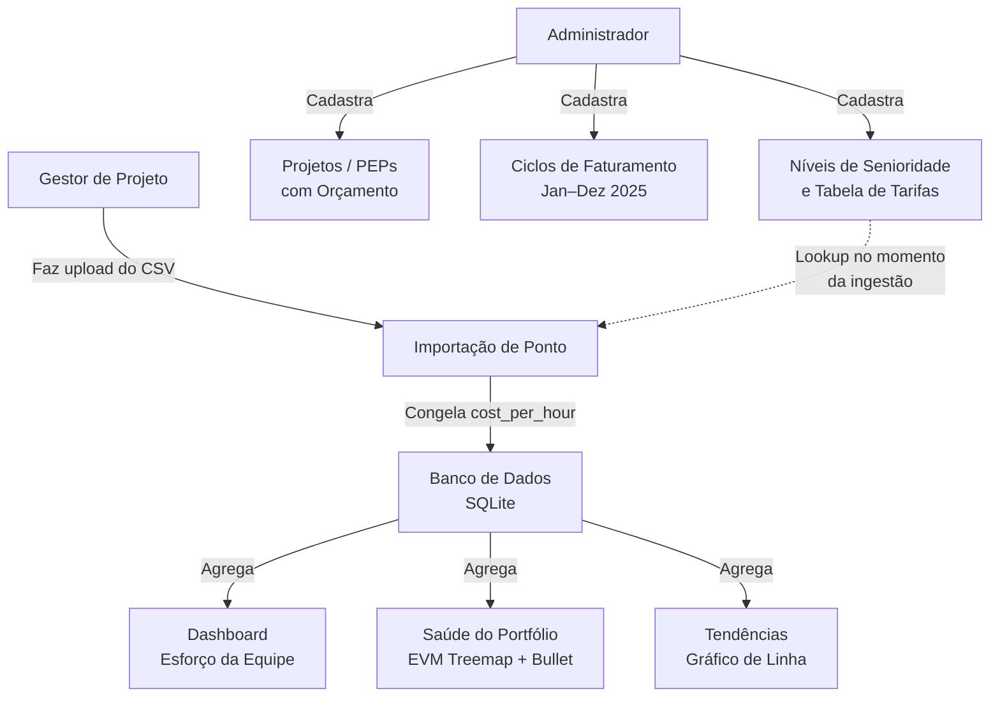

---

## Fluxo de Ingestão de Timesheet

A importação de ponto é a operação central do PMAS. Cada CSV/XLSX passa por **três camadas de validação** antes de qualquer dado ser gravado no banco, e o sistema nunca descarta dados silenciosamente sem aviso.

### Visão geral

```mermaid
flowchart TD
    A([Arquivo CSV / XLSX]) --> B[Carregar DataFrame\nvia pandas]
    B --> C{Colunas obrigatórias\npresentes?}
    C -->|Faltam colunas| ERR1([Erro 422\ndescreve quais colunas faltam])
    C -->|OK| D

    subgraph "Camada 1 — Filtro de Autorização"
        D[Coletar PEPs do arquivo] --> E{user_id\nfornecido?}
        E -->|Não — chamada\nde sistema/teste| F[Passa tudo sem filtro]
        E -->|Sim| G{Perfil?}
        G -->|admin| F
        G -->|Gestor do projeto\nmanager_id| F
        G -->|Acesso ACL\ndelegado por admin| F
        G -->|Sem permissão| H[Linhas descartadas\nsilenciosamente]
        H --> WARN1[Aviso adicionado\nà resposta]
    end

    F --> PASS1[Pass 1 — Resolver entidades]
    WARN1 --> PASS1

    subgraph "Pass 1 — Pré-processamento"
        PASS1 --> COL{Colaborador\nexiste?}
        COL -->|Não| COL2[Cria Collaborator\nno banco]
        COL -->|Sim| COL3[Reutiliza]
        COL2 & COL3 --> CYC{Ciclo cobre\na data?}
        CYC -->|Sim| CYC2[Reutiliza ciclo]
        CYC -->|Não| CYC3[Cria ciclo de\nQuarentena automático]
    end

    CYC2 & CYC3 --> L2

    subgraph "Camada 2 — RBAC"
        L2{Usuário é admin?} -->|Não| L2B{Algum ciclo\nno arquivo está fechado?}
        L2B -->|Sim| ERR2([Erro 403\nClosedCycleError])
        L2B -->|Não| L3
        L2 -->|Sim| L3
    end

    subgraph "Camada 3 — Projeto Bloqueado"
        L3{PEP com status\nencerrado / suspenso?} -->|Sim| ERR3([Erro 422\nLockedProjectError])
        L3 -->|Não| DEL
    end

    subgraph "DELETE Cirúrgico"
        DEL[Calcular escopo\npep_wbs × cycle_id] --> DEL_PEP[PEP nomeado →\napaga por pep_wbs + cycle_id]
        DEL --> DEL_NULL[PEP nulo →\napaga por collaborator + cycle\n+ pep_wbs IS NULL]
    end

    DEL_PEP & DEL_NULL --> INS

    subgraph "INSERT com EVM Freeze"
        INS[Para cada linha\ndo CSV / XLSX] --> RATE[Lookup RateCard\ncolaborador + data]
        RATE --> FREEZE[cost_per_hour congelado\nno registro]
        FREEZE --> DEDUP{Chave duplicada\nno mesmo lote?}
        DEDUP -->|Sim| SKIP[Linha ignorada\nskipped++]
        DEDUP -->|Não| SAVE[db.add TimesheetRecord\ninserted++]
    end

    SAVE & SKIP --> COMMIT[COMMIT]
    COMMIT --> ANOM

    subgraph "Detecção de Anomalias — pós-commit"
        ANOM[Analisar DataFrame] --> W1{Registro em\nfim de semana?}
        W1 -->|Sim| WA1[Aviso: colaboradores\ncom entrada no weekend]
        ANOM --> W2{Soma diária\n> 24h?}
        W2 -->|Sim| WA2[Aviso: colaborador + data]
        ANOM --> W3{PEP não cadastrado\nem Projetos?}
        W3 -->|Sim| WA3[Aviso: lista de\ncódigos PEP]
    end

    WA1 & WA2 & WA3 --> RET([Retorno: records_inserted\nrecords_skipped\nquarantine_cycles_created\nwarnings])
```

---

### Camada 1 — Filtro de Autorização

Antes de tocar no banco, o sistema verifica se o usuário tem permissão para cada código PEP presente no arquivo:

| Perfil | Acesso |
|---|---|
| `admin` | Todos os PEPs, sem restrição |
| Gestor de projeto | PEPs onde ele é o `manager_id` (automático) |
| Usuário com ACL delegada | PEPs onde um admin concedeu acesso explicitamente |
| Demais usuários | Linhas descartadas silenciosamente — o upload **não é rejeitado** |

> O upload nunca falha por falta de autorização em PEPs individuais. O sistema processa o que pode e informa o que descartou no campo `warnings` da resposta.

---

### Camada 2 — RBAC (Controle por Função)

Usuários que não são `admin` **não podem gravar** em ciclos fechados. Se qualquer data do arquivo pertencer a um ciclo marcado como fechado, a ingestão inteira é revertida com erro `403 ClosedCycleError`.

---

### Camada 3 — Projetos Bloqueados

Projetos com status `encerrado` ou `suspenso` recusam novos lançamentos. Qualquer PEP nessa situação presente no arquivo causa erro `422 LockedProjectError` e a operação é revertida integralmente.

---

### DELETE cirúrgico — isolamento entre gestores

O PMAS usa **(pep_wbs, cycle_id)** como unidade de substituição, não `(colaborador, ciclo)`. Isso garante:

1. **PM-A fazendo upload do PEP-A** nunca apaga linhas do PEP-B no mesmo ciclo.
2. **Colaboradores removidos do CSV** têm suas linhas antigas excluídas automaticamente (sem registros órfãos).
3. **Linhas sem PEP** (`pep_wbs IS NULL`) usam `(colaborador, ciclo, pep_wbs IS NULL)` para evitar que um upload anule entradas de outro usuário sem código de projeto.

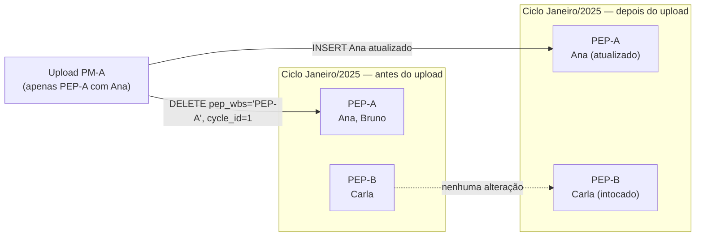

---

### Congelamento da tarifa — EVM Freeze

Na etapa de INSERT, para cada linha o sistema executa `_lookup_rate(colaborador, data_do_registro)`:

1. Busca o nível de senioridade associado ao colaborador
2. Busca a `RateCard` vigente naquela data (`valid_from ≤ data ≤ valid_to`)
3. Salva o valor em `cost_per_hour` — **imutável após a ingestão**

Alterações futuras na tabela de tarifas não afetam registros já importados.

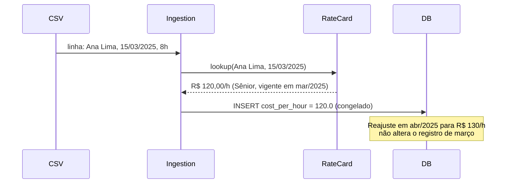

---

### Detecção de anomalias — pós-commit

Após o commit, o sistema analisa o DataFrame original e pode gerar avisos adicionais (sem reverter a ingestão):

| Anomalia | Condição | Exemplo de aviso |
|---|---|---|
| Registro em fim de semana | `weekday` sábado (5) ou domingo (6) | `"Registros em fim de semana detectados para: Bruno Costa."` |
| Horas > 24h por dia | Soma por colaborador + data > 24h | `"Horas > 24h/dia detectadas: Carla Dias em 2025-02-10."` |
| PEP não cadastrado | Código PEP no CSV sem registro em Projetos | `"Códigos PEP sem cadastro em Projetos: P-XX-999."` |

Esses avisos aparecem no campo `warnings` da resposta da API e são exibidos no frontend após o upload.

---

## Módulo 1 — Configuração Inicial e Baseline (Q1: Jan–Mar 2025)

**Objetivo:** Configurar a estrutura completa do sistema antes do primeiro upload de ponto.

### 1.1 Iniciando o servidor

```bash
pip install -r requirements.txt
python -m uvicorn backend.app.main:app --reload
```

Abra `http://127.0.0.1:8000` no navegador.

---

### 1.2 Cadastro de Níveis de Senioridade

Acesse a aba **Equipe → Senioridade**.

Cadastre os três níveis:

| Nome | Ação |
|---|---|
| Júnior | Clique em **+ Nível** → preencha → **Salvar** |
| Pleno | Repita |
| Sênior | Repita |

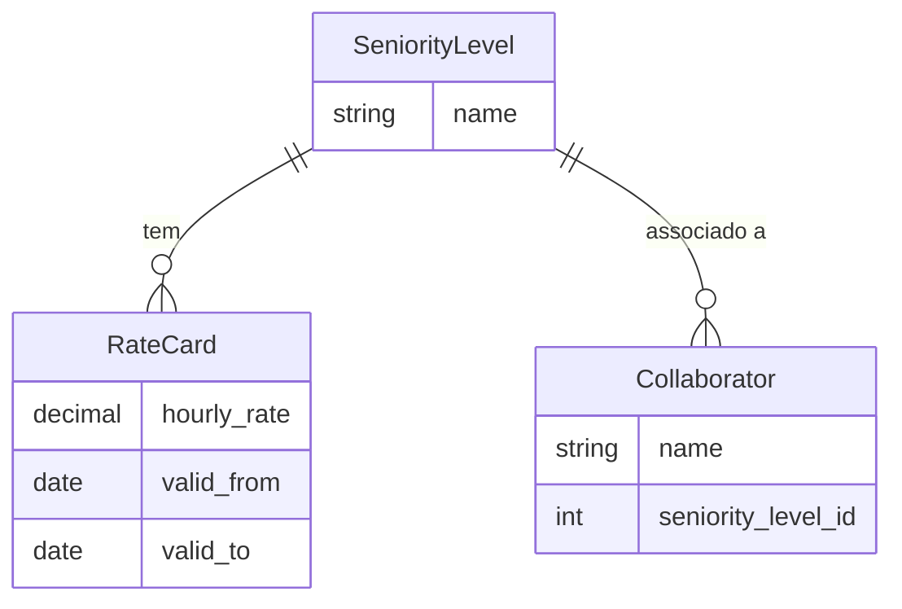

---

### 1.3 Cadastro da Tabela de Tarifas (RateCard)

Acesse **Equipe → Tabela de Tarifas**.

Cadastre uma tarifa para cada nível com vigência em 2025:

| Nível | Taxa (R$/h) | Vigência início | Vigência fim |
|---|---|---|---|
| Júnior | 50,00 | 01/01/2025 | 31/12/2025 |
| Pleno | 80,00 | 01/01/2025 | 31/12/2025 |
| Sênior | 120,00 | 01/01/2025 | 31/12/2025 |

> **Conceito EVM:** O PMAS aplica o padrão "EVM Freeze" — a tarifa é **congelada no momento da ingestão**. Reajustes futuros não afetam registros já importados, garantindo integridade histórica dos custos.

---

### 1.4 Associação de Colaboradores a Níveis

Ainda na aba **Equipe → Membros da Equipe**, associe cada colaborador ao seu nível após o primeiro upload (o sistema cria os colaboradores automaticamente durante a importação).

| Colaborador | Nível |
|---|---|
| Ana Lima | Sênior |
| Bruno Costa | Pleno |
| Carla Dias | Júnior |
| Diego Santos | Sênior |

---

### 1.5 Cadastro de Projetos

Acesse a aba **Projetos → + Novo Projeto**.

| Código PEP | Nome | Orçamento (h) | Orçamento (R$) |
|---|---|---|---|
| P-CRM-001 | Sistema de Gestão de Clientes | 2.800 | 300.000,00 |
| P-INF-002 | Modernização de Infraestrutura | 1.800 | 160.000,00 |
| P-RH-003 | Portal do Colaborador | 600 | 40.000,00 |

> O projeto **P-BI-004** será cadastrado no Módulo 2, pois é uma iniciativa nova que começa em Q2.

---

### 1.6 Cadastro de Ciclos de Faturamento

Acesse **Ciclos → + Novo Ciclo**. Cadastre os 12 meses do ano:

| Nome do Ciclo | Início | Fim |
|---|---|---|
| Janeiro 2025 | 01/01/2025 | 31/01/2025 |
| Fevereiro 2025 | 01/02/2025 | 28/02/2025 |
| Março 2025 | 01/03/2025 | 31/03/2025 |
| Abril 2025 | 01/04/2025 | 30/04/2025 |
| Maio 2025 | 01/05/2025 | 31/05/2025 |
| Junho 2025 | 01/06/2025 | 30/06/2025 |
| Julho 2025 | 01/07/2025 | 31/07/2025 |
| Agosto 2025 | 01/08/2025 | 31/08/2025 |
| Setembro 2025 | 01/09/2025 | 30/09/2025 |
| Outubro 2025 | 01/10/2025 | 31/10/2025 |
| Novembro 2025 | 01/11/2025 | 30/11/2025 |
| Dezembro 2025 | 01/12/2025 | 31/12/2025 |

> **Ciclos de Quarentena:** Se uma data no CSV não pertencer a nenhum ciclo cadastrado, o PMAS criará automaticamente um ciclo de quarentena — nenhum dado é descartado silenciosamente.

---

### 1.7 Primeiro Upload — Q1 2025

1. Acesse **Dashboard → Importar Planilha**
2. Selecione o arquivo `samples/treinamento/ponto_q1_2025.csv`
3. Clique em **Importar**

**Resultado esperado:** ~244 registros importados.

> **Exercício de investigação:** Após o upload, acesse o filtro de ciclo e selecione **Fevereiro 2025**. No gráfico de esforço, localize Carla Dias. Você consegue identificar a anomalia dos 26h? Discuta com o grupo o que pode ter causado esse lançamento.

---

### 1.8 Verificando o Dashboard de Esforço (Q1)

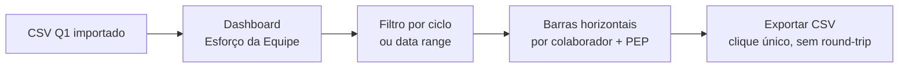

**Pontos de atenção no Q1:**
- Ana Lima e Diego Santos concentram horas em CRM e INF
- Bruno Costa divide entre CRM e o projeto RH
- Carla Dias lidera horas no INF e RH
- Horas extras de Diego Santos em fevereiro (sprint de entrega)

---

## Módulo 2 — Monitoramento Q2 e Novo Projeto (Abr–Jun 2025)

**Objetivo:** Acompanhar o portfólio no segundo trimestre, integrar projeto novo e usar o módulo de Saúde do Portfólio.

### 2.1 Cadastro do Novo Projeto BI

O projeto de Inteligência de Negócio foi aprovado em abril. Cadastre-o antes do upload de Q2.

Acesse **Projetos → + Novo Projeto**:

| Campo | Valor |
|---|---|
| Código PEP | P-BI-004 |
| Nome | Inteligência de Negócio |
| Orçamento (h) | 3.000 |
| Orçamento (R$) | 250.000,00 |

---

### 2.2 Upload do Q2

1. Selecione `samples/treinamento/ponto_q2_2025.csv`
2. Clique em **Importar**

**Resultado esperado:** ~229 registros importados.

> **Exercício:** Após o upload, filtre pelo mês de **Abril 2025** e verifique o lançamento de Bruno Costa em **domingo, 20/04**. Discuta: o sistema deve bloquear ou apenas alertar entradas de fim de semana?

---

### 2.3 Saúde do Portfólio — Sub-aba EVM

Acesse **Dashboard → Saúde do Portfólio**.

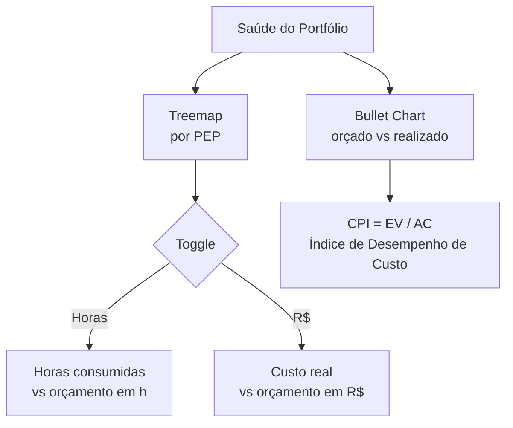

**O que você verá no final de Q2 (acumulado Jan–Jun):**

| Projeto | Horas consumidas (aprox.) | Orçamento (h) | % consumido |
|---|---|---|---|
| CRM | ~1.768 h | 2.800 h | ~63% |
| INF | ~1.274 h | 1.800 h | ~71% |
| RH | ~520 h | 600 h | ~87% |
| BI | ~624 h | 3.000 h | ~21% |

> **Sinal de alerta:** O INF já consumiu 71% do orçamento no meio do ano. O RH está em 87% — risco de estouro. Discuta ações corretivas com o grupo.

---

### 2.4 Conceito de EVM no PMAS

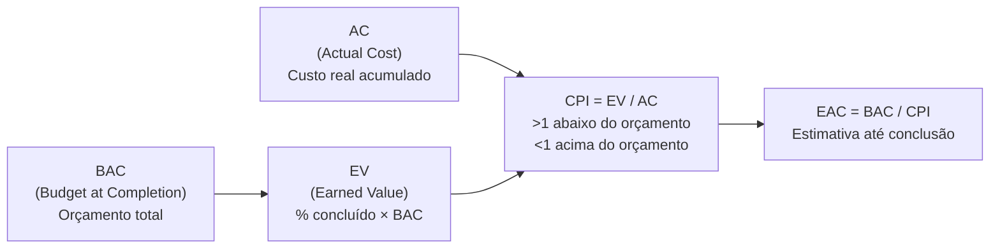

**No PMAS:**
- **BAC** → orçamento cadastrado no projeto (`budget_cost`)
- **AC** → custo real calculado com as tarifas congeladas (`actual_cost`)
- **CPI** → exibido no Bullet Chart e no gráfico de Tendências
- **EAC** → disponível na aba Forecast (por colaborador/PEP)

---

## Módulo 3 — Crise de Infraestrutura e EVM (Q3: Jul–Set 2025)

**Objetivo:** Interpretar sinais de crise no portfólio, analisar tendências e tomar decisões baseadas em EVM.

### 3.1 Upload do Q3

1. Selecione `samples/treinamento/ponto_q3_2025.csv`
2. Clique em **Importar**

**O que acontece em Q3:**
- Carla Dias e Diego Santos entram em modo de crise no INF (horas extras diárias)
- O projeto RH não recebe mais lançamentos (será suspenso no Módulo 4)
- O projeto BI cresce de forma saudável

---

### 3.2 Análise de Tendências

Acesse **Dashboard → Tendências**.

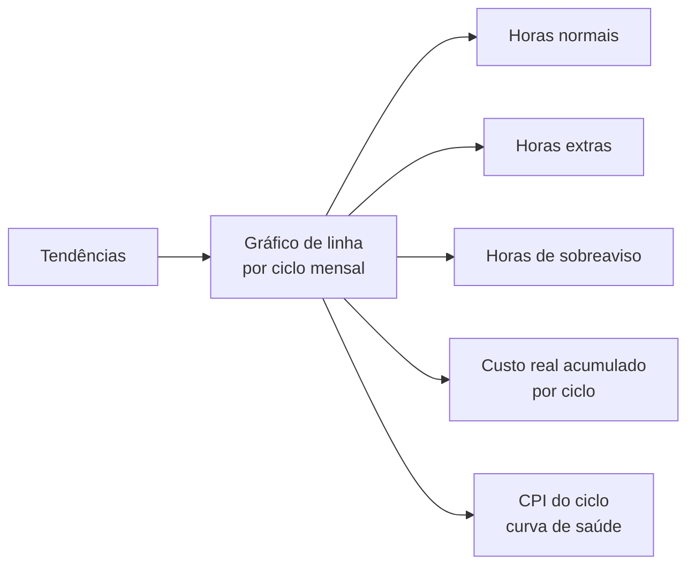

**Perguntas para discussão:**
1. Em qual mês o CPI do portfólio caiu abaixo de 1,0?
2. Qual projeto está puxando o CPI para baixo?
3. Quais são as opções: negociar escopo, aumentar orçamento ou acelerar entrega?

---

### 3.3 Saúde do Portfólio ao final de Q3

**Resultado esperado (acumulado Jan–Set):**

| Projeto | Consumido (h) | Orçamento (h) | % | Status |
|---|---|---|---|---|
| CRM | ~2.704 h | 2.800 h | ~97% | ⚠️ Atenção |
| INF | ~2.002 h | 1.800 h | ~111% | 🔴 Estourado |
| RH | ~520 h | 600 h | ~87% | ✅ Dentro |
| BI | ~1.144 h | 3.000 h | ~38% | ✅ Saudável |

> **Badge visual:** O PMAS exibe badges coloridos na tabela de projetos:
> - 🔴 **Estourado** (≥ 100% do orçamento)
> - 🟡 **Atenção** (≥ 90% do orçamento)

---

### 3.4 Uso do Filtro de Data Range

O filtro de data range na parte superior do Dashboard permite isolar qualquer período. Experimente:

1. **Período:** 01/07/2025 a 30/09/2025 (apenas Q3)
   → Veja o custo gerado *somente* neste trimestre
2. **Período:** 01/01/2025 a 30/09/2025 (acumulado YTD)
   → Visão consolidada do ano até setembro

---

### 3.5 Radar de Colaboradores (sub-aba no Dashboard)

A visualização radar mostra a distribuição relativa de horas por colaborador. No Q3, Carla Dias terá uma área visivelmente maior no eixo INF devido às horas extras da crise.

**Exercício:** Exporte o CSV da aba Esforço da Equipe para Q3 e compare o custo real de Carla (Júnior, R$ 50/h) versus se esse trabalho fosse feito por Diego (Sênior, R$ 120/h). Qual é a diferença de custo? Isso justifica a alocação?

---

## Módulo 4 — Encerramento, Relatórios e Lições Aprendidas (Q4: Out–Dez 2025)

**Objetivo:** Fechar o portfólio de 2025, exportar relatórios e consolidar aprendizados.

### 4.1 Gestão do Projeto Suspenso (RH)

Antes do upload de Q4, registre a suspensão do Portal do Colaborador:

1. Acesse **Projetos** → localize P-RH-003
2. Edite e adicione uma observação (ou use o orçamento como indicador final)
3. Confirme: o projeto consumiu ~520h de 600h orçadas — **dentro do orçamento**

> O PMAS não tem um campo "status" nativo, mas a ausência de novos lançamentos e o badge verde de saúde communicam isso visualmente.

---

### 4.2 Upload do Q4

1. Selecione `samples/treinamento/ponto_q4_2025.csv`
2. Clique em **Importar**

**O que acontece em Q4:**
- INF recebe apenas 4h/semana de supervisão (Carla e Diego)
- CRM recebe esforço final para entrega
- BI cresce rapidamente (Ana, Carla, Diego em tempo quase integral)
- RH não recebe mais lançamentos

---

### 4.3 Visão Consolidada do Ano 2025

Acesse **Dashboard → Tendências** com filtro: 01/01/2025 a 31/12/2025.

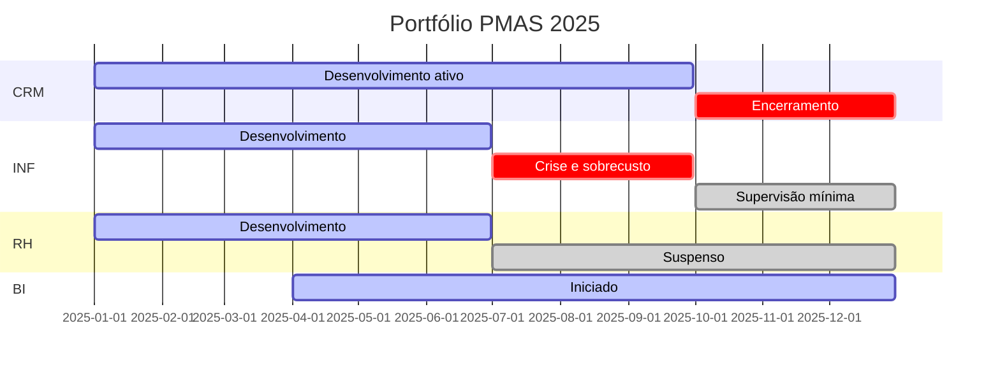

---

### 4.4 Resumo de Desempenho ao Final do Ano

| Projeto | Horas consumidas | Orçamento | Custo real (aprox.) | Orçamento R$ | CPI |
|---|---|---|---|---|---|
| CRM | ~3.088 h | 2.800 h | ~R$ 290.000 | R$ 300.000 | ~1,03 |
| INF | ~2.098 h | 1.800 h | ~R$ 178.000 | R$ 160.000 | **~0,90** |
| RH | ~520 h | 600 h | ~R$ 33.000 | R$ 40.000 | ~1,21 |
| BI | ~2.488 h | 3.000 h | ~R$ 175.000 | R$ 250.000 | ~1,43 |

> **Interpretação:**
> - CRM: entregue com custo dentro do orçamento (CPI ≈ 1,0) — **sucesso**
> - INF: estouro de custo, CPI < 1 — **lição aprendida**: necessidade de revisão de escopo em Q2
> - RH: projeto suspenso saudável (CPI > 1) — **decisão correta de suspensão**
> - BI: projeto em crescimento saudável, CPI excelente — **candidato a expansão em 2026**

---

### 4.5 Exportação de Relatórios

**CSV de Esforço:**
1. Acesse Dashboard → Esforço da Equipe
2. Remova todos os filtros (visualização anual)
3. Clique em **Exportar CSV**
4. O download é gerado localmente (sem round-trip ao servidor)

**Imagens dos Gráficos:**
Cada gráfico possui um ícone de câmera na toolbox (canto superior direito). Clique para salvar PNG com resolução dupla (pixelRatio: 2).

**Impressão:**
Use `Ctrl+P` (ou `Cmd+P` no Mac). Os ícones de toolbox são automaticamente ocultados durante a impressão e restaurados em seguida.

---

### 4.6 Análise de Tendência de Custo

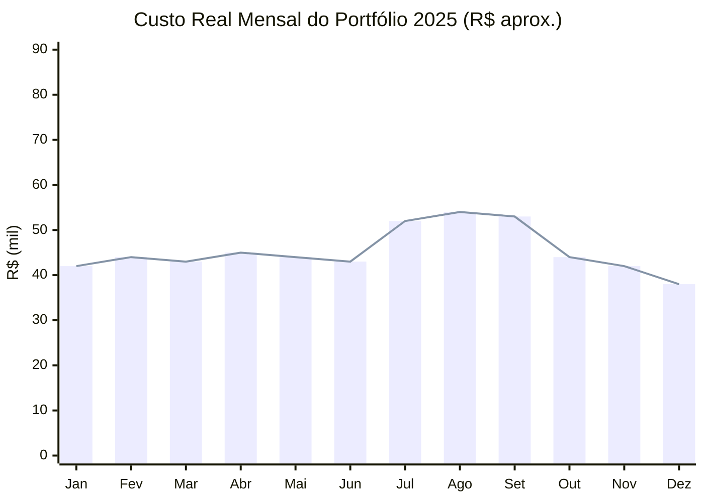

> O pico em Jul–Set reflete as horas extras do projeto INF durante a crise de infraestrutura.

---

## Referência Rápida — Atalhos e Dicas

### Filtros Cascateados

O PMAS usa filtros cascateados na tela de Dashboard:
1. Selecione um **ciclo** → a lista de PEPs se ajusta
2. Selecione um **PEP** → a lista de colaboradores se ajusta
3. Use **date_from / date_to** para cortar qualquer intervalo livre

### Tipos de Horas

| Campo CSV | Coluna | Efeito no custo |
|---|---|---|
| Horas normais | `Horas totais (decimal)` | `custo = h × rate` |
| Hora extra | `Hora extra = Sim` | `custo = h × rate × 2` |
| Hora sobreaviso | `Hora sobreaviso = Sim` | `custo = h × rate × 0,33` |

### Padrão EVM Freeze

A tarifa é congelada no campo `cost_per_hour` no momento da ingestão — reajustes futuros na tabela de tarifas não afetam registros já importados. Veja o diagrama completo e a explicação detalhada em [Fluxo de Ingestão de Timesheet → Congelamento da tarifa](#congelamento-da-tarifa--evm-freeze).

### Ciclos de Quarentena

Se você importar um CSV com datas fora dos ciclos cadastrados:
- O PMAS **não descarta** os registros
- Cria automaticamente um ciclo de quarentena
- Os registros aparecem no Dashboard mas são **excluídos** do gráfico de Tendências

---

## Checklist de Configuração Inicial (para produção)

- [ ] Cadastrar todos os níveis de senioridade
- [ ] Cadastrar tabela de tarifas com vigências corretas
- [ ] Cadastrar todos os projetos/PEPs com orçamentos aprovados
- [ ] Cadastrar ciclos de faturamento do ano
- [ ] Fazer upload do primeiro CSV de ponto
- [ ] Associar colaboradores a seus níveis de senioridade
- [ ] Verificar que o custo congelado bate com a planilha financeira

---

## FAQ do Treinamento

**P: Posso reimportar o mesmo CSV?**
R: Sim. O sistema é idempotente: para PEPs nomeados, substitui todos os registros do bloco `(pep_wbs, ciclo)`. Isso significa que um re-upload do CSV de PEP-A nunca altera registros de PEP-B no mesmo ciclo, e colaboradores removidos do CSV têm suas linhas antigas excluídas automaticamente.

**P: O que acontece com registros duplicados no mesmo CSV?**
R: Linhas 100% idênticas são desduplicadas automaticamente (apenas a primeira é inserida).

**P: Posso alterar o orçamento de um projeto depois?**
R: Sim, via **Projetos → Editar**. O CPI e os badges são recalculados dinamicamente.

**P: Como vejo o custo total de um colaborador no ano?**
R: No Dashboard → Esforço da Equipe, aplique o filtro de data range (01/01/2025 a 31/12/2025) e exporte o CSV.

**P: O PMAS suporta múltiplas moedas?**
R: A interface permite alternar entre BRL, USD e EUR na visualização de custos. Os dados são sempre armazenados em BRL — a conversão é apenas visual.

**P: Como imprimir um relatório sem os ícones de toolbox?**
R: Use Ctrl+P normalmente. O sistema oculta automaticamente os ícones durante a impressão.

---

*Guia criado para o workshop interno de PMAS — 2025. Versão 1.0.*
