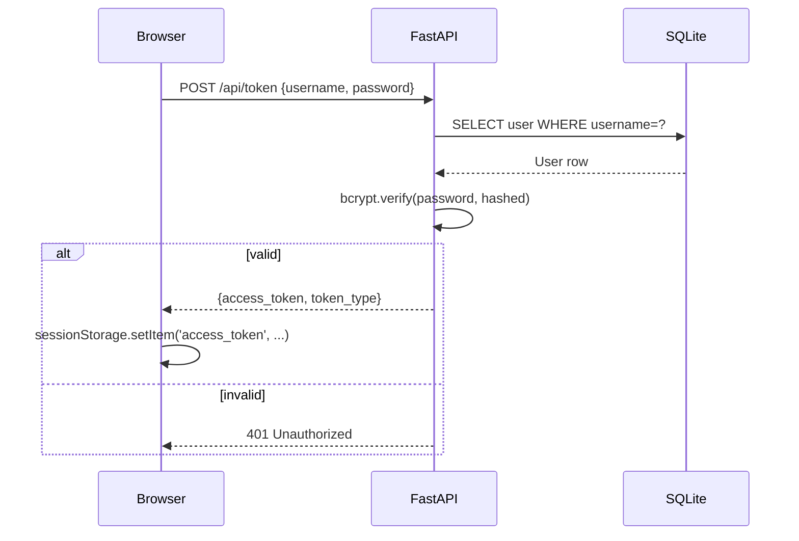
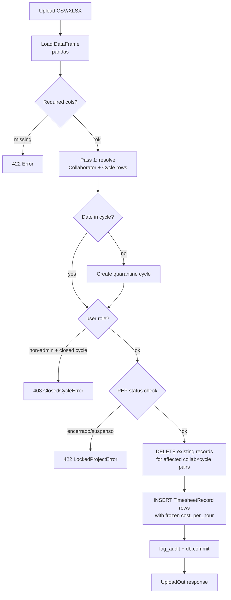
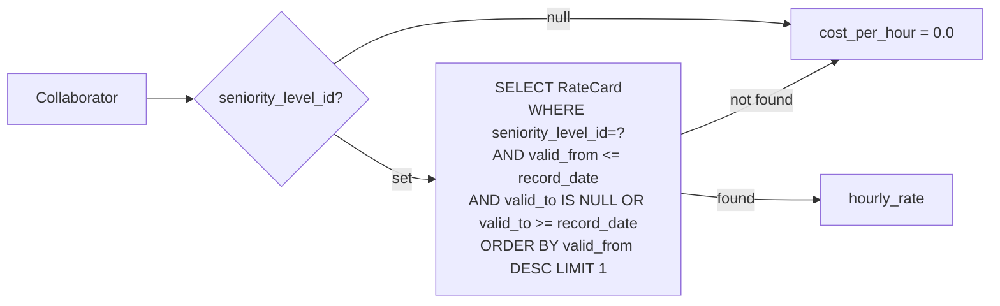
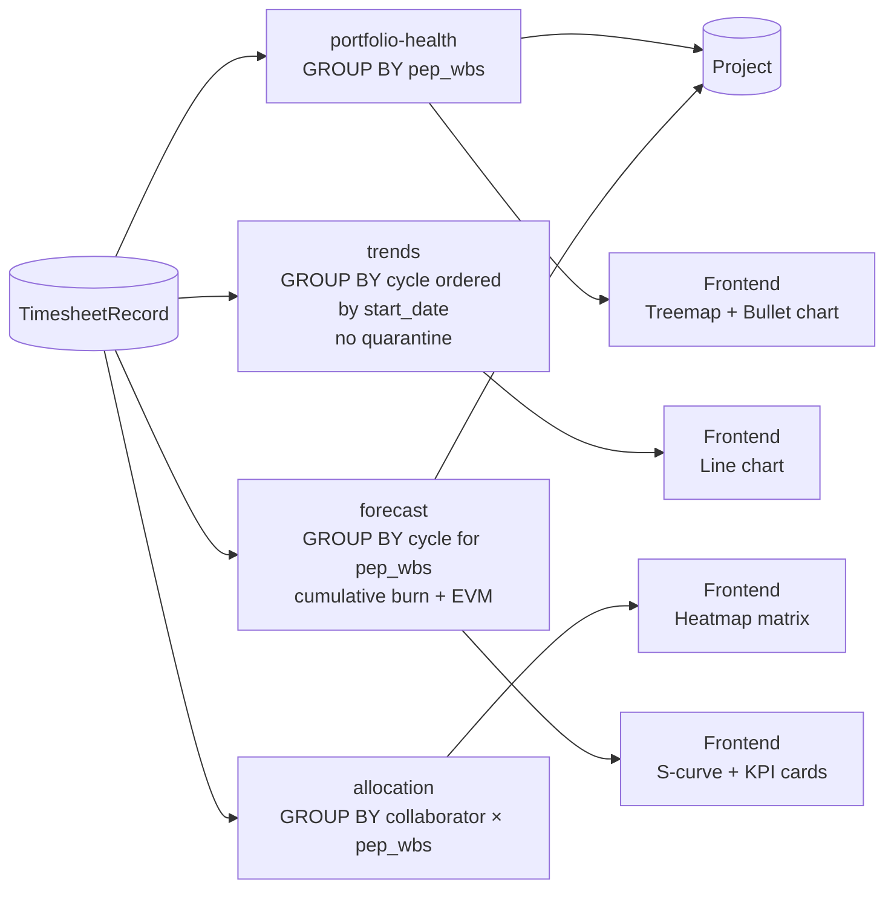
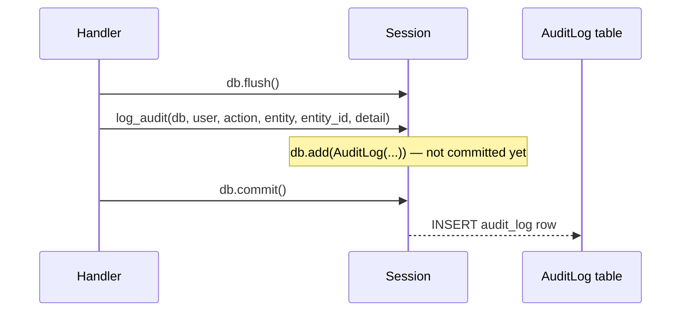
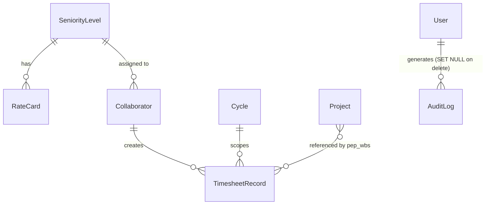

# PMAS — Technical Software Manual

---

## 1. System Overview

**PMAS** (Project Management Assistant System) is a timesheet ingestion, cost tracking, and EVM analytics platform for project managers.

### Architecture

```
┌─────────────────────────────────────────────┐
│  Browser (Vanilla JS + Apache ECharts 5)    │
│  Single-page, 5 tabs, sessionStorage JWT    │
└────────────────┬────────────────────────────┘
                 │ HTTP / REST (Bearer token)
┌────────────────▼────────────────────────────┐
│  FastAPI  (Python 3.11+)                    │
│  8 routers · Pydantic v2 · python-jose JWT  │
└────────────────┬────────────────────────────┘
                 │ SQLAlchemy ORM
┌────────────────▼────────────────────────────┐
│  SQLite (WAL mode, synchronous=NORMAL)      │
│  pmas.db — schema-migrated on startup       │
└─────────────────────────────────────────────┘
```

### Core Components

| Component | Location | Responsibility |
|---|---|---|
| Ingestion service | `services/ingestion.py` | Parse CSV/XLSX, resolve cycles, freeze `cost_per_hour` |
| Auth | `routers/auth.py` + `deps.py` | JWT HS256, 8h expiry, bcrypt |
| Dashboard | `routers/dashboard.py` | Hour aggregation, budget vs actual |
| Analytics | `routers/analytics.py` | Portfolio health, trends, allocation matrix, EVM forecast |
| RateCard | `routers/ratecard.py` | Seniority levels, rate cards, team, global config |
| Audit | `audit.py` + `routers/auditlog.py` | Append-only audit trail, all write endpoints |
| DB init | `database.py` → `init_db()` | `create_all` + `_migrate_columns()` + seed admin/config |

---

## 2. Business Rules

### Authentication & Authorization
- JWT HS256, 8-hour expiry; `PMAS_SECRET_KEY` env var (random ephemeral key if unset — logs warning)
- Two roles: `admin`, `user`. All API routes require auth; admin-only routes use `AdminUser` dependency
- `access_token` stored in `sessionStorage` (XSS mitigation)
- Default seed user: `admin / admin` (created only when `user` table is empty — change immediately)

### Cycles
- Non-quarantine cycles must not have overlapping date ranges
- `is_closed` cycles block non-admin timesheet uploads (raises `ClosedCycleError` → HTTP 403)
- Dates outside all registered cycles auto-create a quarantine cycle (month-scoped); quarantine cycles excluded from Trends and Forecast charts
- Cycles with records cannot be deleted

### Projects
- `pep_wbs` is a unique business key
- `status ∈ {ativo, suspenso, encerrado}`; ingestion into `suspenso`/`encerrado` projects is blocked (raises `LockedProjectError` → HTTP 422)
- `budget_hours` and `budget_cost` are optional; used for EVM metrics

### Rate Cards
- Each rate card is scoped to a `SeniorityLevel` + date range (`valid_from` / `valid_to`)
- `valid_to = NULL` means open-ended (current)
- Overlapping date ranges for the same seniority level are rejected (HTTP 409)
- `SeniorityLevel` with assigned collaborators cannot be deleted

### EVM / Cost Freeze Pattern
- `cost_per_hour` is resolved at ingestion time via `_lookup_rate()` and stored on `TimesheetRecord`
- Subsequent rate changes do **not** retroactively alter stored records
- `actual_cost = Σ cost_per_hour × (normal_h + extra_h × extra_multiplier + standby_h × standby_multiplier)`
- Global multipliers: `extra_hours_multiplier` (default 1.5), `standby_hours_multiplier` (default 1.0); singleton `GlobalConfig(id=1)`

### EVM Formulas
- `EV = (consumed_hours / budget_hours) × budget_cost`
- `CPI = EV / actual_cost`
- `EAC = budget_cost / CPI`
- `avg_hours_per_cycle` = mean of last 3 historical cycles
- `estimated_cycles_to_complete = remaining_hours / avg_hours_per_cycle`

### Ingestion Deduplication
- On upload: existing `TimesheetRecord` rows for all `(collaborator_id, cycle_id)` pairs present in the file are **deleted and replaced**
- Intra-batch dedup key: `(collaborator_id, cycle_id, record_date, pep_code, pep_desc, hour_type, start_time)`

### Audit Log
- Every write operation appends an `AuditLog` row via `log_audit()` before the caller's `db.commit()`
- `username` is denormalized at write time; `user_id` FK has `ON DELETE SET NULL`
- Readable only by admin via `GET /api/audit-log`

---

## 3. System Flows

### Authentication Flow



### Timesheet Ingestion Flow



### Rate Lookup at Ingestion



### Analytics Data Flow



### Audit Write Pattern



---

## 4. Data Models / Structures

### Entity Relationship



### Tables

**`seniority_level`**

| Column | Type | Constraints |
|---|---|---|
| id | INTEGER | PK |
| name | VARCHAR | UNIQUE NOT NULL |

**`rate_card`**

| Column | Type | Constraints |
|---|---|---|
| id | INTEGER | PK |
| seniority_level_id | INTEGER | FK → seniority_level, NOT NULL |
| hourly_rate | FLOAT | NOT NULL |
| valid_from | DATE | NOT NULL |
| valid_to | DATE | NULL = open-ended |

**`collaborator`**

| Column | Type | Constraints |
|---|---|---|
| id | INTEGER | PK |
| name | VARCHAR | UNIQUE NOT NULL INDEX |
| seniority_level_id | INTEGER | FK → seniority_level, NULL |

**`cycle`**

| Column | Type | Constraints |
|---|---|---|
| id | INTEGER | PK |
| name | VARCHAR | NOT NULL |
| start_date | DATE | NOT NULL |
| end_date | DATE | NOT NULL |
| is_quarantine | BOOLEAN | NOT NULL DEFAULT false |
| is_closed | BOOLEAN | NOT NULL DEFAULT false |

**`timesheet_record`**

| Column | Type | Constraints |
|---|---|---|
| id | INTEGER | PK |
| collaborator_id | INTEGER | FK NOT NULL |
| cycle_id | INTEGER | FK NOT NULL |
| record_date | DATE | NOT NULL |
| pep_wbs | VARCHAR | INDEX, NULL |
| pep_description | VARCHAR | INDEX, NULL |
| normal_hours | FLOAT | NOT NULL DEFAULT 0 |
| extra_hours | FLOAT | NOT NULL DEFAULT 0 |
| standby_hours | FLOAT | NOT NULL DEFAULT 0 |
| cost_per_hour | FLOAT | NOT NULL DEFAULT 0 — frozen at ingestion |

Composite index: `(cycle_id, collaborator_id)`

**`project`**

| Column | Type | Constraints |
|---|---|---|
| id | INTEGER | PK |
| pep_wbs | VARCHAR | UNIQUE NOT NULL INDEX |
| name | VARCHAR | NULL |
| client | VARCHAR | NULL |
| manager | VARCHAR | NULL |
| budget_hours | FLOAT | NULL |
| budget_cost | FLOAT | NULL |
| status | VARCHAR | NOT NULL DEFAULT 'ativo' ∈ {ativo,suspenso,encerrado} |

**`user`**

| Column | Type | Constraints |
|---|---|---|
| id | INTEGER | PK |
| username | VARCHAR | UNIQUE NOT NULL INDEX |
| hashed_password | VARCHAR | NOT NULL (bcrypt) |
| role | VARCHAR | NOT NULL DEFAULT 'user' ∈ {admin,user} |

**`global_config`** (singleton id=1)

| Column | Type | Default |
|---|---|---|
| extra_hours_multiplier | FLOAT | 1.5 |
| standby_hours_multiplier | FLOAT | 1.0 |

**`audit_log`**

| Column | Type | Constraints |
|---|---|---|
| id | INTEGER | PK |
| user_id | INTEGER | FK → user ON DELETE SET NULL, NULL |
| username | VARCHAR | denormalized, NULL |
| action | VARCHAR | NOT NULL |
| entity | VARCHAR | NOT NULL INDEX |
| entity_id | INTEGER | NULL |
| detail | VARCHAR | NULL, JSON string |
| timestamp | DATETIME | NOT NULL (UTC) |

---

## 5. Tech Stack & Setup

### Dependencies

| Package | Purpose |
|---|---|
| `fastapi` | HTTP framework |
| `uvicorn` | ASGI server |
| `sqlalchemy` | ORM + schema management |
| `pydantic` v2 | Request/response validation |
| `python-jose[cryptography]` | JWT encode/decode |
| `bcrypt` | Password hashing |
| `pandas` | CSV/XLSX parsing |
| `openpyxl` | XLSX support for pandas |

### Environment Variables

| Variable | Required | Description |
|---|---|---|
| `PMAS_SECRET_KEY` | Recommended | JWT signing key (hex string). If unset, random key generated per process — sessions invalidated on restart |

### Setup

```bash
pip install -r requirements.txt
python -m uvicorn backend.app.main:app --reload
# App: http://127.0.0.1:8000
# Swagger: http://127.0.0.1:8000/docs
```

- Database: `pmas.db` created at project root (dev) or adjacent to executable (frozen)
- `init_db()` runs on startup: `create_all` → `_migrate_columns()` → seed `admin/admin` user → seed `GlobalConfig`
- `_migrate_columns()` applies `ALTER TABLE` for `cost_per_hour`, `seniority_level_id`, `budget_cost`, `is_closed` — safe to run on existing databases

### Test

```bash
pip install pytest httpx
pytest tests/ -v        # 170 tests, in-memory SQLite StaticPool
```

---

## 6. Core Modules / API

### Endpoints Reference

#### Auth
| Method | Path | Auth | Description |
|---|---|---|---|
| POST | `/api/token` | None | Login; returns `{access_token}` (OAuth2 form) |

#### Upload
| Method | Path | Auth | Description |
|---|---|---|---|
| POST | `/api/upload-timesheet` | user | Ingest CSV/XLSX ≤20MB; returns `UploadOut` |

#### Cycles `/api/cycles`
| Method | Path | Auth | Body/Params |
|---|---|---|---|
| GET | `` | user | — → `list[CycleOut]` |
| POST | `` | user | `CycleIn` → `CycleOut 201` |
| PUT | `/{cycle_id}` | user | `CycleIn` → `CycleOut` |
| PATCH | `/{cycle_id}/toggle-status` | **admin** | — → `CycleOut` |
| POST | `/import` | user | CSV file → `ImportResultOut` |
| DELETE | `/{cycle_id}` | user | 204; 409 if records exist |

#### Projects `/api/projects`
| Method | Path | Auth | Body/Params |
|---|---|---|---|
| GET | `` | user | — → `list[ProjectOut]` |
| POST | `` | user | `ProjectIn` → `ProjectOut 201` |
| PUT | `/{project_id}` | user | `ProjectIn` → `ProjectOut` |
| POST | `/import` | user | CSV → `ImportResultOut` |
| DELETE | `/{project_id}` | user | 204 |

#### Dashboard `/api/dashboard`
| Method | Path | Query params |
|---|---|---|
| GET | `` | `pep_code[]`, `pep_description[]`, `collaborator_id[]`, `date_from`, `date_to` |
| GET | `/{cycle_id}` | same + cycle scoped |
| GET | `/pep-radar` | filters → top-12 PEPs by hours |
| GET | `/collaborator-timeline` | `collaborator_name` + filters → hours per cycle |

#### Reference `/api`
| Method | Path | Query params |
|---|---|---|
| GET | `/collaborators` | `cycle_id`, `pep_code`, `pep_description` |
| GET | `/peps` | `cycle_id`, `collaborator_id` |

#### Analytics `/api`
| Method | Path | Query params | Notes |
|---|---|---|---|
| GET | `/portfolio-health` | `cycle_id[]`, `pep_wbs[]`, `date_from`, `date_to` | Joined with `Project`; includes `actual_cost` |
| GET | `/trends` | `pep_wbs[]`, `date_from`, `date_to` | Chronological by cycle; quarantine excluded |
| GET | `/allocation` | `cycle_id[]`, `collaborator_id[]`, `pep_wbs[]`, `date_from`, `date_to` | Collaborator × PEP matrix |
| GET | `/forecast` | `pep_wbs` (required), `date_from`, `date_to` | EVM: CPI, EAC, burn history, projected completion |

#### RateCard `/api`
| Method | Path | Auth |
|---|---|---|
| GET/POST | `/seniority-levels` | user |
| PUT/DELETE | `/seniority-levels/{level_id}` | user |
| GET/POST | `/rate-cards` | user |
| PUT/DELETE | `/rate-cards/{card_id}` | user |
| GET | `/team` | user |
| PUT | `/team/bulk-seniority` | **admin** |
| PUT | `/team/{collab_id}/seniority` | user |
| GET/PUT | `/config` | GET: user, PUT: **admin** |

#### Users `/api/users`
| Method | Path | Auth |
|---|---|---|
| GET | `` | **admin** |
| POST | `` | **admin** |
| PATCH | `/{user_id}/password` | user (own) / admin (any) |
| DELETE | `/{user_id}` | **admin** |

#### Audit Log `/api`
| Method | Path | Auth | Query params |
|---|---|---|---|
| GET | `/audit-log` | **admin** | `entity`, `action`, `limit` (≤500, default 100), `offset` |

---

### Key Service Functions

| Function | Module | Signature summary |
|---|---|---|
| `ingest_file` | `services/ingestion.py` | `(bytes, filename, Session, user_role) → dict` — full ingestion pipeline |
| `_lookup_rate` | `services/ingestion.py` | `(Session, Collaborator, date) → float` — EVM rate freeze |
| `_resolve_cycle` | `services/ingestion.py` | `(Session, date) → (Cycle, created: bool)` — auto-quarantine |
| `_parse_date` | `services/ingestion.py` | handles `date`, Excel serial int, string with `dayfirst=True` |
| `log_audit` | `audit.py` | `(Session, User, action, entity, entity_id?, detail?) → None` |
| `init_db` | `database.py` | `create_all` + migrate + seed — called in lifespan |
| `_migrate_columns` | `database.py` | `PRAGMA table_info` + `ALTER TABLE` for post-initial columns |
| `get_current_user` | `deps.py` | JWT decode → `User`; used as `Depends` on all routers |
| `require_admin` | `deps.py` | Wraps `get_current_user`; 403 if `role != admin` |

### Expected CSV Columns

| Column | Required | Notes |
|---|---|---|
| `Colaborador` | Yes | Auto-creates `Collaborator` row if absent |
| `Data` | Yes | `dayfirst=True` string, or Excel serial int |
| `Horas totais (decimal)` | Yes | Float |
| `Hora extra` | No | `sim/yes/s/y/true/1` → `extra_hours` |
| `Hora sobreaviso` | No | same truth values → `standby_hours` |
| `Código PEP` | No | → `pep_wbs` |
| `PEP` | No | → `pep_description` |
| `Hora Inicial [H]` | No | Part of dedup key |
